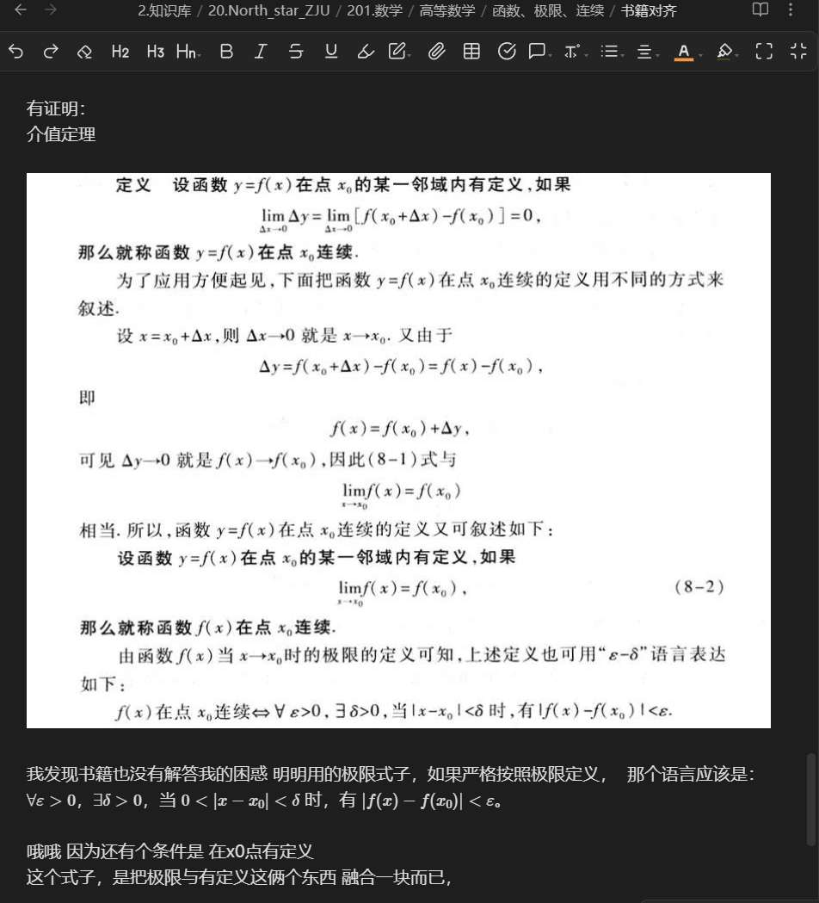
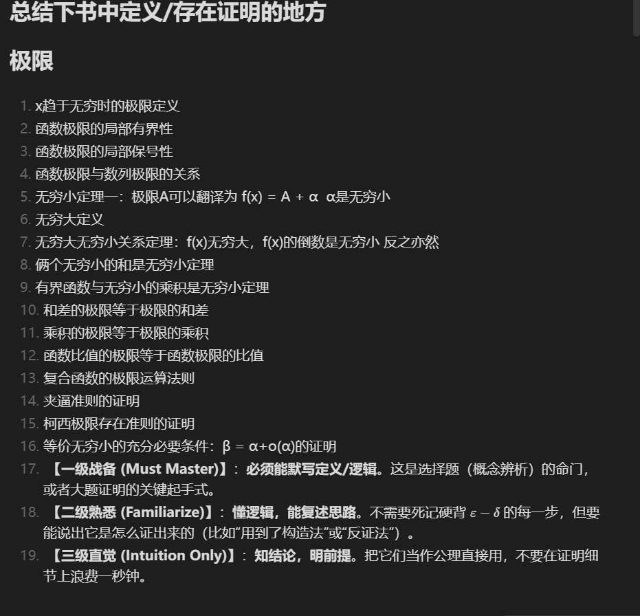
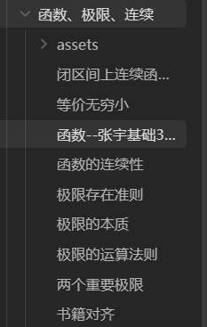
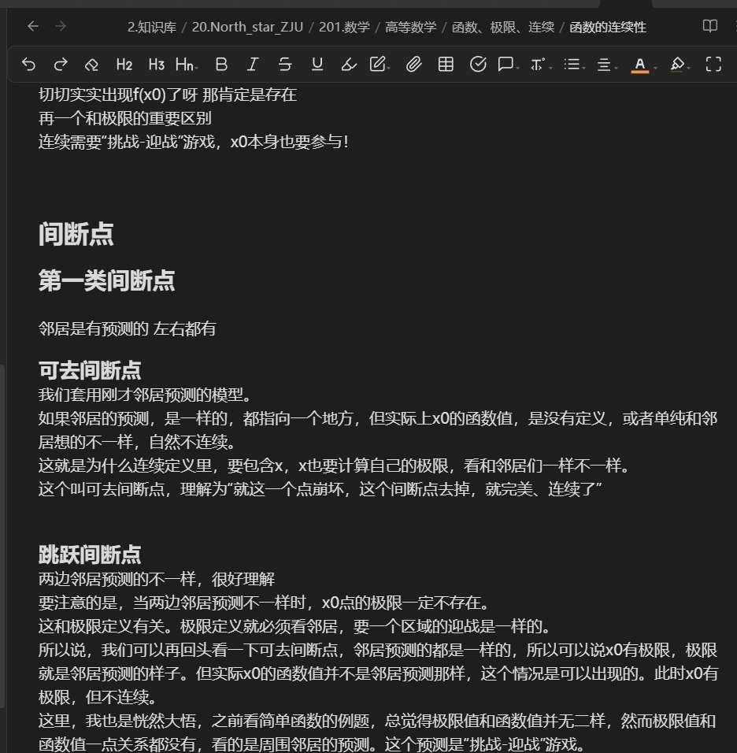
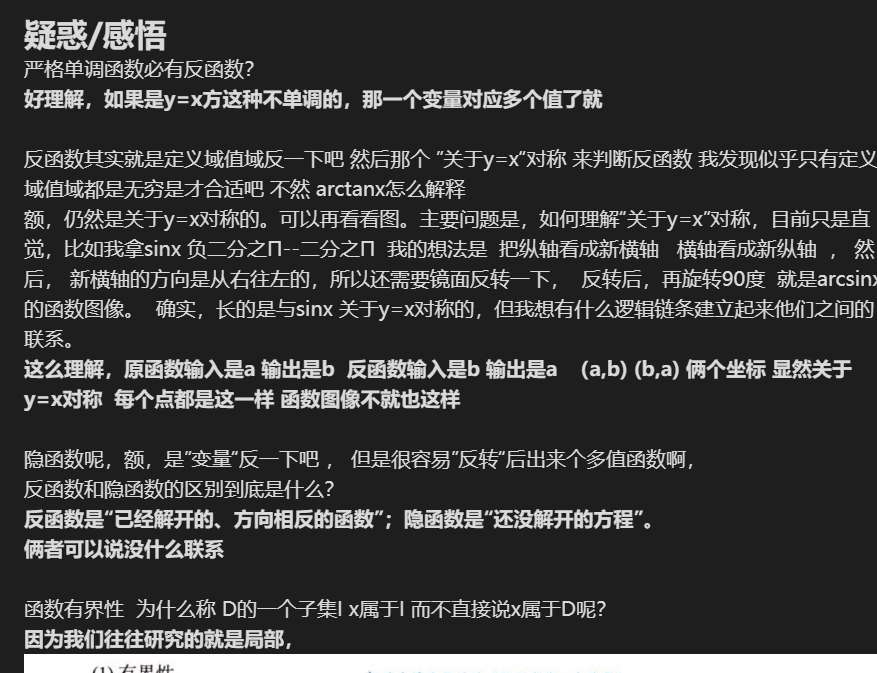
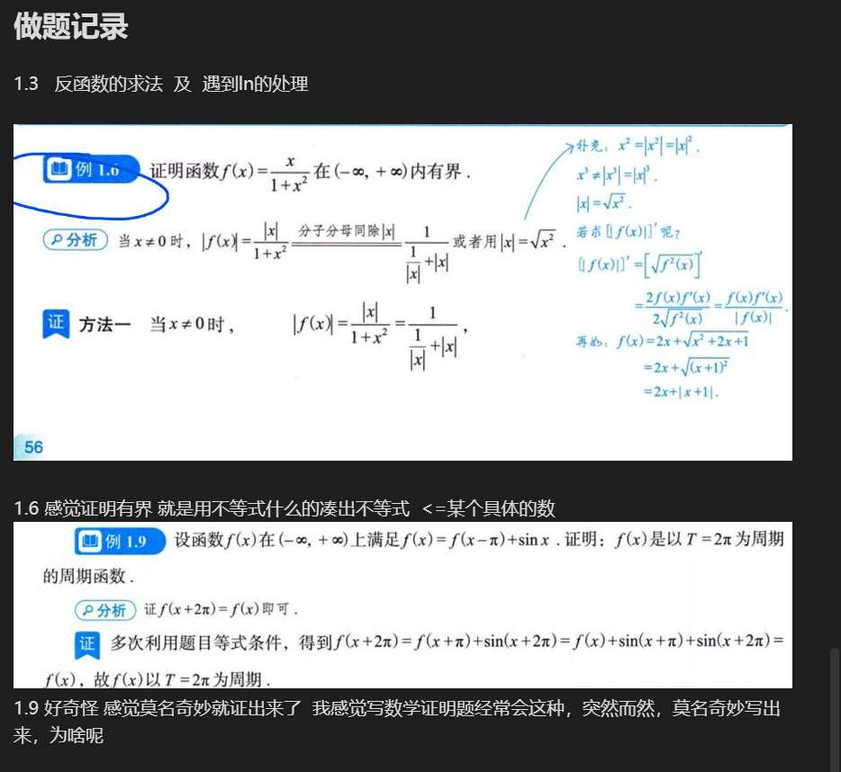
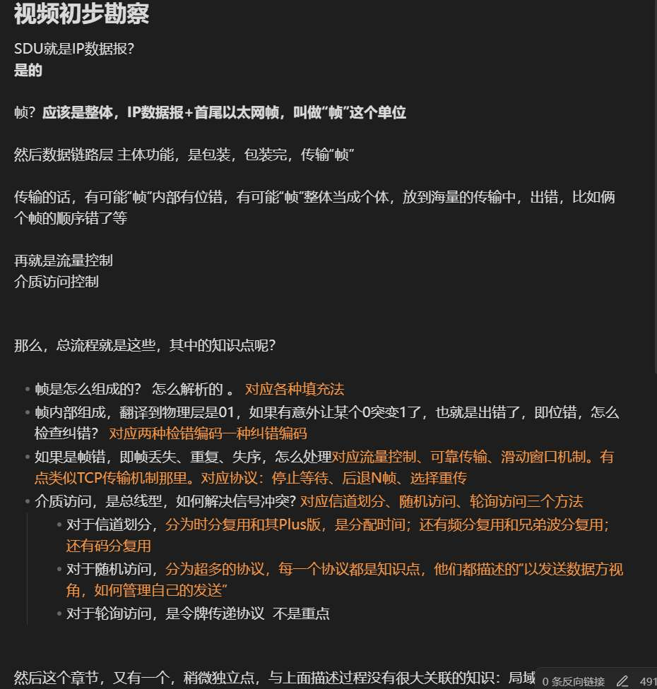
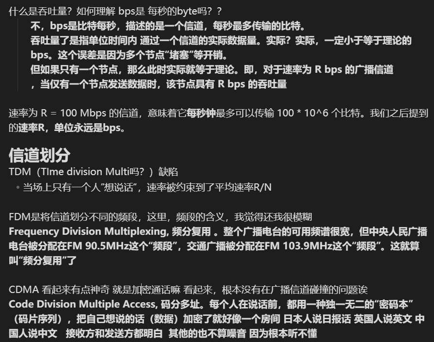
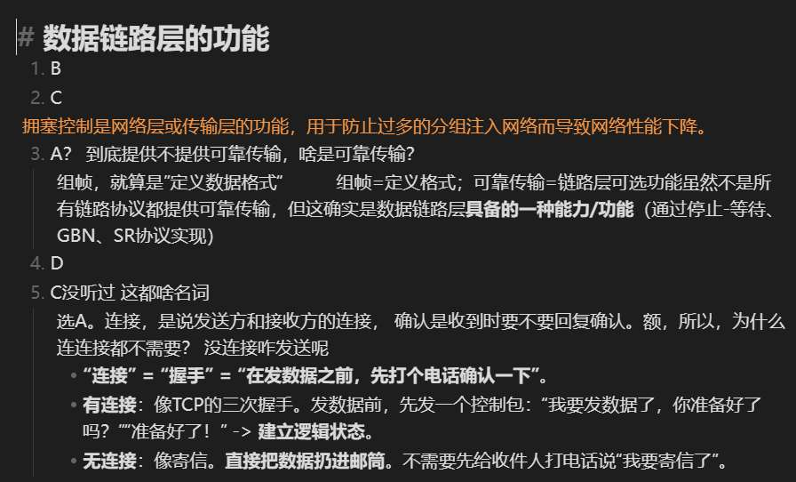

背景：
西电ai专业，27考生
个人认为数学英语相对薄弱， 计算机基础尚可。但得益于之前找工作时的学习过程，对于所有科目，都有学习的热情在，且自己有AI方面的基础和俩个小项目。
# 25年10月-26年3月

## 整体规划
周二、五数学日 
一、四AI日  
三、六计算机日

英语于每天早上，每天晚上，进行单词/长难句/阅读

数学日与计算机日，白天看书/视频+做题，晚上复盘

## 数学
主要推进高数和概率论，线代已经有所有章节的初步笔记
先看书，留下笔记，再做题。
### 对于看书：
高数：同济版+普林斯顿微积分读本  概率论：浙大版+概率导论
先做一个“书籍对齐”文件，
把碰到的疑惑，或者觉得值得总结的，等等，都扔进去

比如：

### 有困惑的地方做笔记，
比如：

自己觉得可以总结下本章也许要掌握的证明的地方，然后让AI去复核。（如图，AI给出了一级、二级、三级）

然后，自己去输出对知识点的理解，
如图

### 配合书籍对齐阶段解决的疑惑，写入笔记中
如《函数的连续性》笔记 ：

### 然后是做题
高数：26考研张宇基础30讲电子版   概率论：余炳森

首先是感悟部分：
把文字部分通读后，记录疑惑/感悟。 其中疑惑的解决可以再通过AI、视频等。用**加粗字**把解答写在下面。

对于例题

自己拿一个专门的本子，纸上写。然后看答案，与自己想的一模一样不用记录。如果不一样，或者不会，或者有什么感悟，就记录下来。

但是！都是例题，我在犹豫，现在要不要就开始写”张宇1000题“，感觉也是要的
## 计算机
到明年3月为止，只进行操作系统/计网的学习。
数据结构大二学的时候90+ 并且中途找工作一直刷题， 即使现在也偶尔一天抽40min刷算法题。
计组也是半年前学的90+

OS和计网，学习步骤：
### 先看视频
建立直觉，然后写出知识框架，做到清楚知识的”主线“是什么，夹杂在里面的细碎知识点是什么，如图：

### 书籍勘察
OS：汤小丹+恐龙书  计网：谢希仁
然后，和数学一样，进行”书籍勘察“，对细小知识点进行对齐
先扫王道书的描述，有可能看不懂或者觉得太生硬，但脑子把”考研范围“记住了。如果觉得本章王道书不好，就去教材。
如图，仍是疑惑和解释，用**加粗字体**：

然后也可以配合书籍对齐阶段解决的疑惑，写入笔记中  笔记就会很干净，纯粹的知识点，没有什么困惑记录之类的。
### 做题
最后做题，做王道选择题。开个文件写，然后没问题的不管，有问题的写注解。
如图：

## AI日
具体不说了，总之是学习AI+输出文章+有空推进项目。
但是，下午的时候，会抽至少1.5小时，进行线性代数的学习。
直接上手张宇线代基础30讲的例题/配套1000题 

## 具体内容
未来一个月势必事多，到期末了。各种考试和大作业来了。 
然后到了1月、2月又是寒假 效率又低。
现在11月30号。 可预见的，到26年3月初的这三个月，每天不会过的完全如我的计划 
目前就按设计的计划，推进到明年3月，能有多少进度多少进度。
不过，此阶段，深度足够。所以不按顺序学，而是优先把下面的部分推进了。（我觉得可以挑这些学，因为我对所有章节，都有大纲印象，能知道各个章节在整个学科的”定位“）

1. **数学**：
    - **高数**：**极限/连续**、**一元、二元微分**、**一元积分**（微积分基本定理）。
    - **概率**：怎么感觉可以全部搞完。
        
2. **OS (操作系统)**：
    
    - **进程管理**（PV操作、死锁、调度）。
    - **内存管理**（虚拟内存、分页分段、TLB）。
        
3. **计网 (Network)**：
    
    - **传输层**（TCP/UDP，尤其是TCP的状态机和拥塞控制）。
    - **网络层**（IP、子网划分、路由算法）。

# 26年3月初--26年6月初

然后到了明年3月初，正式心无旁骛地考研
如果25年10月-26年3月是 
遇到不懂的 -> 翻各种教材 -> 问AI -> 写深度笔记 -> 做题验证   比较有深度
此阶段就变为 遇到不懂的 -> 翻王道书/全书 -> 只要能把题做对，就不深究了 

此时，把AI的东西大幅减少，集中考研
但我要有规划了，比如本周/天某一科目得学多少多少 
唯一有问题的就是，题量够不够？题都怎么安排？
难道就是 王道书二刷 啃大题 高数1000题+660题  线代/概率论 感觉到时候再决策也可以     

# 26年6月初--9月末
强化阶段再说

# 工具 
- **现在**：
    - PDF（所有教材/王道/张宇30讲） + 电子笔记（Obsidian）。
    - 实体书（无，暂不需要）。
    - 本子（用于手算高数/线代   OS/计网大题）。

- **明年3月/6月后**：
    - **引入实体习题集**（1000题/880题） 
    - **引入实体王道书**（27新版） 
