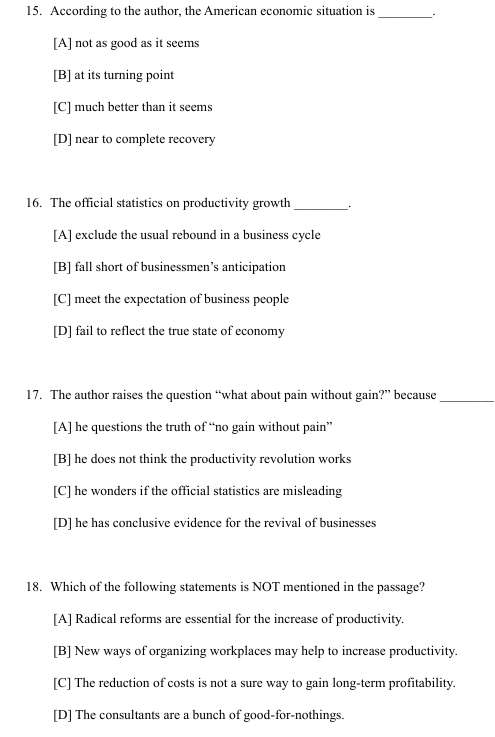

# TEXT1

giant dam
mercy of flood and drought 
bidding    bidding for
Perhaps it is humankind's long suffering at the mercy of flood and drought that makes the ideal of forcing  the waters to do our bidding so fascinating.  我觉得陌生的词为 do our bidding    suffer at the mercy of ...
assert themselves
be cemented by
deprive    fertile silt
reservoir of disease
myth   
short of sending in the troops        short of 
given the go-ahead to
wrong-headed

这篇文章做错就是文章词汇量的问题而已...
哦除了13题 没有定位原文 纯粹自己yy呢

## TEXT2

you hear tales of corporate revival.   corporate和corporation的区别？

What is harder to establish is whether the productivity revolution that businessmen assume they are presiding over is for real    关键是preside主持 presive over也是主持？  assume 假定 就是商人们自认为他们掌控一切？ 

if you lump manufacturing and services together  manufacturing和manufacture有什么区别  lump  lamp 还有一堆形近词  瘸的？还有

conclusive evidence

treasury secretary

 a “disjunction” between the mass of business anecdote that points to a leap in productivity and the picture reflected by the statistics.
  points to a leap?   in productivity and the picture ?
什么从数据中反映呢，是一系列说要飞跃到生产力顶尖地方的商业轶事？
答案是“大量有关生产力飞跃增长的商业传闻与
统计数据所反映的情况之间存在着(脱
节“

equipment and machinery

overall productivity of an economy

ineptly done

chopping out cost

manifesto 
scorns
dispute

inevitably
