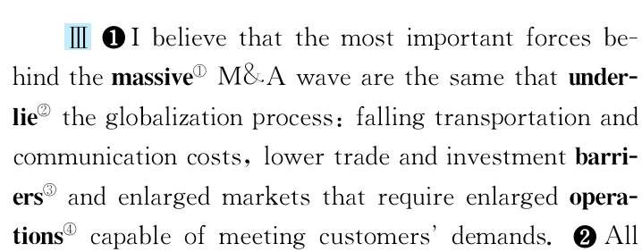
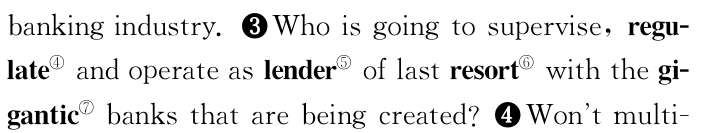
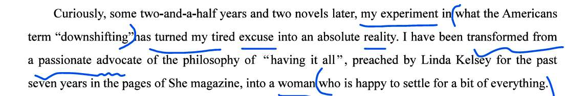
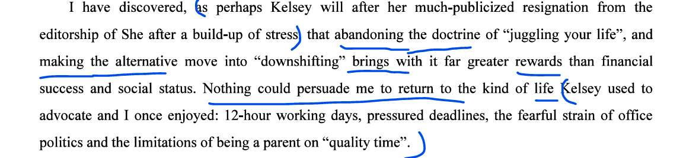
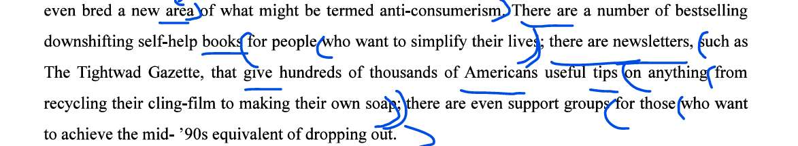

# TEXT1
professionals and amateurs

Nevertheless, the word "amateur"does carry a connotation that the person concerned is not fully integrated into the scientific community and, in particular, may not fully share  its values.
但是，“业余”这个词也确实有相关人员无法融进科研团体的内涵，尤其是不能完全共享自己价值的人
“然而，‘业余’这个词确实带有这样一种内涵：相关人员并没有完全融入科学界；更具体地说，他们可能并不完全认同**科学界的价值观**。”

The growth of specialisation in the nineteenth century, with its consequent requirement of a longer, more complex training, implied greater problems for amateur participation in science.
在 19 世纪，伴随着接下来（以及随之而来的）对更久、更复杂训练的需求，专业化的发展代表对于业余人员在科学的参与有更大的困难。

comparison
constitute  

A comparison of British geological publications over the last century and a half reveals not simply an increasing emphasis on the primacy of research, but also a changing definition of  what constitutes an acceptable research paper.
英国地址学出版社在过去近一个世纪对业余和专业的比较，不仅只揭示对研究隐私性的越发重视，更改变了对能被接受的研究文章的标准。

**对过去一个半世纪英国地质学出版物的比较表明：人们强调的不仅仅是研究的首要地位在增强，而且对“什么样的论文算是可接受的研究论文”的界定也在发生变化。**
primacy

Thus, in the nineteenth century,local geological studies represented worthwhile research in their own right; but, in the twentieth century, local studies have  increasingly become acceptable to professionals only if they incorporate,and reflect on, the wider geological picture
于是，在 19 世纪，当地地质学凭借自身实力代表着最有价值的研究，但 20 世界时，当地研究逐渐变为只认可那些合并、反思更广阔地址图景的专家。

**因此，在19世纪，本地地质研究本身就被视为有价值的研究；但到了20世纪，本地研究越来越只在一种情况下才会被专业人士接受——即它们必须纳入并审视更宏观的地质整体图景。**

The overall result has been to make entrance to professional geological journals harder for amateurs, a result that has been reinforced by the widespread introduction of refereeing, first by national journals in the nineteenth century and then by several local geological journals in the twentieth century
结果是，业余人员更难参与专业的地理期刊，并且这个结论被广泛采纳，首次于 19 世纪的国际期刊，紧接着是 20 世纪一些当地地理期刊。
1. **`geological` $\neq$ 地理的：** * 这是考研常考词。`geography` 是地理，而 `geology` 是**“地质学”**。
    
2. **`entrance to journals` $\neq$ 参与期刊：** * 这里的 `entrance` 指的不是走进大门，而是**“在期刊上发表文章的门槛 / 进入期刊的准入资格”**。
    
3. **`reinforced` $\neq$ 采纳：** * `reinforce` 的本意是“加固/强化”。这里指前面那种“难发表”的结果，被**“进一步加剧/强化”**了。
    
4. **`refereeing` (致命 Bug！)：**
    
    - 你完全漏掉了这个词。在体育里它是“裁判”，但在学术出版界，它叫**“审稿制度 / 同行评议（Peer Review）”**！这是学术类文章的核心词汇。
        
5. **`national` $\neq$ 国际：**
    
    - `national` 是**“全国性的 / 国家级的”**；`international` 才是国际的。
        

**【🛠️ 80+ 级精译】**

> “总体结果是，业余爱好者在专业地质学期刊上发表文章（或获得准入）变得更加困难了；而**审稿制度的广泛引入进一步加剧了这一结果**——这种制度在 19 世纪首先被**国家级期刊**采用，随后在 20 世纪又被几家地方性地质期刊采用。”

 A rather similar process of differentiation has led to professional geologists coming together nationally within one or two specific societies, whereas the amateurs have tended either to remain in local societies or to come together nationally in a different way.
 一个非常相似的差异过程，让专业的地质学家们依托一两个专业社群就国际性地聚拢交流，同时业余人员更倾向于留在当地社区或用不同方法聚在一起
1. **`differentiation` $\neq$ 差异：**
    
    - 在社会学和科学发展史中，它指的是**“分化”**（就像细胞分化一样，专业和业余开始分道扬镳）。
        
2. **`societies` $\neq$ 社区/社群：**
    
    - 在学术语境下，`society` 不翻译成“社会”或“社区”，而是指**“学会 / 协会”**（比如：美国物理学会 American Physical Society）。
        
3. **`nationally` $\neq$ 国际性地：**
    
    - 再次犯了和上句一样的错，这里是**“在全国范围内”**。
        
4. **对比精度的丢失：**
    
    - 句子的核心对比是专业人士“组建了全国性的大型学会”，而业余人士则“留在地方性学会”。
        

**【🛠️ 80+ 级精译】**

> “一个极为相似的**分化过程**，使得专业的地质学家们在**全国范围内**聚集到了一两个特定的**学会**中；然而（whereas），业余爱好者们则倾向于要么留在**地方性学会**里，要么以一种不同的方式在全国范围内聚集。”

# TEXT2
so-called 所谓的 
it is in the interest of business to universalize access
in the interest of ,为了
in the interest of sb to do 表示-符合某人的利益.

To take advantage of this tool, some impoverished countries will have to get over their outdated  anti-colonial prejudices with respect to foreign investment.
- impoverished countries 
- anti-colonial prejudices
-  with respect to

capital

"**The more** foreign capital you **have helping you** build your Third Wave infrastructure, which today is an electronic infrastructure, **the better off** you're going to be."

### 1. 致命报错：`electronic` $\neq$ 电力

- **你的翻译：** 电力基础设施
    
- **考研必考辨析：** * `electrical` / `electric` = **电力的**（强电，如电网、发电机）。
    
    - `electronic` = **电子的**（弱电，如计算机、网络、半导体）。
        
- **修正：** 这里的 `electronic infrastructure` 指的是**“电子/信息基础设施”**（即互联网建设）。在谈论“第三次浪潮”时，这绝对不能翻成修桥铺路拉电线。
    

### 2. 专有名词未封装：`Third Wave`

- **你的翻译：** 第三次基础建设
    
- **背景常识：** `Third Wave` 是著名未来学家阿尔文·托夫勒提出的**“第三次浪潮”**（即信息革命，前两次是农业革命和工业革命）。
    
- **修正：** “第三次浪潮”的基础设施。
    

### 3. 语法插件：`have sth doing sth`

- **你的解析：** 对 capital 的修饰。
    
- **高阶解析：** 你的理解在意思上行得通，但在语法底层，这是个使役动词结构 **`have + 宾语 + 宾补(v-ing)`**。意思是“**拥有/让**外资**来帮助你**...”。
    

---

### 🛠️ 重新编译：80+ 级精译

把这些 Bug 修复后，这句话其实非常顺畅：

> **“你拥有的（或引入的）用来帮你建设‘第三次浪潮’基础设施——在今天也就是电子（信息）基础设施——的外资越多，你的处境就会越有利。”**

# TEXT3
factual error
head-scratching puzzlement

Sad to say, this project has turned out to be mostly low-level findings about factual errors  and spelling and grammar mistakes, combined with lots of head-scratching puzzlement about what in the world those readers really want
这个项目最终的结果很令人伤心，他们发现的都是事实错误，拼写、语法错误这种最低级的错误，还伴随着读者们在这个世界想知道，而他们却描述的令人百思不得其解的信息
`what in the world` 不是“在这个世界想知道”，这是一个强调语气的固定搭配，意思是**“到底 / 究竟”**（相当于 `what on earth`）
“遗憾的是，这个项目最终得出的主要是一些关于事实错误、拼写和语法错误等低层次的发现，以及（记者们对）读者**到底**想要什么而产生的**令人挠头的困惑**。” _(潜台词：记者们查了半天，只查出了一堆错别字，根本不知道读者真正关心什么。)_

But the sources of distrust go way deeper.Most journalists learn to see the world through a set of standard templates (patterns)into which they plug each day's events. 
“但不信任的根源还要深远得多。大多数记者学会了通过一套**标准模板**（模式）来看待世界，并将每天发生的事件**生搬硬套（塞进）**这些模板中。”

- **对象：** `Journalists` (记者)
    
- **工具：** `Standard templates` (标准模板/套路)
    
- **动作：** `plug ... into ...` (把...硬塞进...) $\rightarrow$ 把 `events` (每日突发事件的数据) 传参塞进 `templates` (模板) 里。

In other words, there is a conventional story line in the newsroom culture that provides a backbone and a ready-made narrative structure for otherwise confusing news.
- **变量等价替换（重点！）：** `conventional story line` (套路化的故事情节) $=$ `standard templates` (上文的标准模板)。
- **它的功能：** 为 `confusing news` (原本杂乱无章/令人困惑的新闻事件) 提供 `backbone` (骨架) 和 `ready-made narrative structure` (现成的叙事结构)。

explosive situation
vastly annoy the customers
sponser symposiums

Replies show that compared with other Americans, journalists are more likely to live in **upscale neighborhoods**, have maids, own Mercedeses, and **trade stocks**, and they're less likely to go to church, do volunteer work, or **put down roots** in a community
报道显示，和其他美国人比起来，记者们似乎更偏向于居住在更高规模的社区，有女佣，自己的 Mercedeses，炒股，几乎不会去教堂，志愿工作，或扎根基层社区。

“问卷答复显示，与其他美国人相比，记者们更有可能住在**高档社区**、雇佣女佣、**拥有奔驰轿车**并**炒股**；而他们去教堂、做志愿工作或**在社区扎根**的可能性则较小。”

- **`Replies` 赋值错误：** 你翻成了“报道”。这里结合上文的调查问卷语境，它指的是**“（调查问卷的）回复/答复”**。
    
- **`upscale` 属性解析错误：** 你翻成了“更高规模”。`upscale` 在英文里特指**“高档的、富人阶层的”**，和物理规模无关。
    
- **`own Mercedeses` 语法结构未识别：** `own` 在这里是动词（拥有），`Mercedeses` 是奔驰轿车（Mercedes）的复数。应该翻成“**拥有奔驰车**”。
    
- **`less likely` 程度过载（Out of Bounds）：** 你翻成了“几乎不会”。`less likely` 只是**“不太可能 / 较少去”**，没到“几乎不（hardly/rarely）”那么绝对

Here is a **troubled business** that keeps hiring **employees** whose attitudes vastly annoy the **customers**. Then **it** sponsors lots of symposiums and a credibility project dedicated to wondering why customers are annoyed and fleeing in large numbers. But **it** never seems to **get around to** noticing the cultural and class biases that so many **former buyers** are complaining about.
这个糟糕的企业（新闻业）持续雇佣那些态度极大惹恼顾客的雇员（记者），接着它还支持许多会议来做可信度调查，致力于思考为什么那么多客户流失且被惹恼。但他从没有花点时间注意下，那些被许多先前买家抱怨的文化、阶级偏见。

> “这里有一个**陷入困境的行业（新闻业）**，它不断雇佣那些态度让**顾客（读者）**极其反感的**员工（记者）**。然后，它又出资主办大量的研讨会和一个可信度调查项目，致力于弄清楚为什么顾客会被惹恼并大量流失。但是，它似乎从来都**顾不上（抽不出时间）**去注意一下，那些被众多**流失的买家（前读者）**所抱怨的文化与阶级偏见。”

# TEXT4
wave of merges and acquisition
sweep from hyperactive ... to ...

multinational corporation
affiliate 
underlie

massive 
the same
underlie
enlarged operation
我相信在巨大的 MA 浪潮背后，那些最重要的推力本质都是一样的，构成了全球化过程的基础，注重交通、联系成本，更低的商贸、投资阻力，不断符合消费者需求的新兴市场
**【Bug 诊断】**

1. **`falling` 赋值错误：** * 你把它翻成了“注重”。可能是凭感觉脑补的？`falling` 就是字面意思**“不断下降的”**。交通和通信成本下降，才是全球化的推力。
    
2. **`barriers` 词汇精度：** * “阻力”意思是对的，但在经贸领域，最专业的翻译是**“壁垒”**（贸易与投资壁垒）。
    
3. **严重漏翻与逻辑断层：** `enlarged markets that require enlarged operations`
    
    - 你翻成了“新兴市场（emerging markets）”。原文是 `enlarged`（扩大的）。
        
    - 你**完全漏掉了** `require enlarged operations`（需要扩大的业务/运营规模）。
        
    - **真实逻辑：** 市场变大了 $\rightarrow$ 要求企业的业务规模也得跟着变大 $\rightarrow$ 才能满足顾客需求。这正是企业为什么要“并购（M&A）”的核心原因！
        

**【🛠️ 80+ 级精译】**

> “我认为，推动这场大规模并购浪潮的最重要力量，与推动全球化进程的力量是相同的：即**不断下降的**交通与通信成本、更低的贸易与投资**壁垒**，以及**因扩大而要求企业扩大业务规模以满足客户需求的**市场。”

scanty
resort

谁来作为一个拥有最终诉求的借贷者，监督，规范，运营一个正在被创造的超大银行？
**【Bug 诊断】** 这句话的语法你完全看懂了，但 `lender of last resort` 这个词组，给你抛出了一个巨大的 `Fatal Error`。

- **你的翻译：** 拥有最终诉求的借贷者。
    
- **金融黑话解密：** `Lender of last resort` 是一个极其专用的金融/经济学术语，中文叫**“最后贷款人”**。
    
    - **背景知识（408 考生的课外扩展）：** 当市场上发生金融危机，所有银行都没钱了、互相也不敢借钱时，只有**中央银行（比如美联储、中国人民银行）**会站出来印钱借给他们。这个角色就叫“最后贷款人”。
        
    - 作者的潜台词是：现在这些银行通过并购变得这么庞大（gigantic），一旦它们出事，连中央银行这个“最后贷款人”都救不起、管不住了，那该由谁来管呢？
        

**【🛠️ 80+ 级精译】**

> “面对这些正在组建的巨型银行，谁将出面进行监督、规范，并充当**‘最后贷款人’**的角色呢？”

# TEXT5
a lateral move

奇怪的是，在两年半以及两本小说完结后，美国人视我的经历为“慢节奏“，我那拙略的借口竟然变成了不争的事实。我之前热情用户 Linda 在过去 7 年于她小说所讲的，“拥有一切”的哲学，然而现在却转变成了乐意随遇而安任何小事的女人

> **原文：** Curiously, some two-and-a-half years and two novels later, **my experiment in what the Americans term “downshifting”** has turned my tired excuse into an absolute reality. I have been transformed from a passionate advocate of the philosophy of “having it all”, preached by Linda Kelsey for the past seven years in the pages of **She magazine**, into a woman who is happy to **settle for a bit of everything**.

**【代码 Code Review】**

1. **语法树解析错误：`my experiment in...`**
    
    - **你的翻译：** “美国人视我的经历为‘慢节奏’”
        
    - **Bug 诊断：** 这里的主语是 `my experiment`（我的实验），`in` 后面带的是一个介词宾语从句。应该是：**“我在被美国人称之为‘降挡（慢节奏）’这件事上所做的实验”**。
        
2. **大小写陷阱：`She magazine`**
    
    - **你的翻译：** “于她小说所讲的”
        
    - **Bug 诊断：** 注意首字母大写！这里的 `She` 不是代词，而是一本杂志的名字——《她》杂志（著名的女性时尚杂志）。这不是小说。
        
3. **布尔值取反（核心对比）：`have it all` vs `a bit of everything`**
    
    - **你的翻译：** “乐意随遇而安任何小事的女人”
        
    - **Bug 诊断：** 作者在这里玩了个文字游戏。以前的哲学是 `have it all`（拥有一切/老娘全都要），现在的哲学是 `settle for a bit of everything`（满足于每样都有一点/知足常乐）。“随遇而安任何小事”偏离了这种数量上的对比。
        
4. **词汇精度：`tired excuse`**
    
    - `tired` 修饰借口时，不是“拙劣的”，而是**“用烂了的 / 老掉牙的”**。
        

**【🛠️ 80+ 级精译】**

> “奇怪的是，在两年半的时间和两部小说写完之后，**我在被美国人称作‘降挡（放慢生活节奏）’上的实验**，竟将我那老掉牙的借口变成了绝对的现实。我曾经是‘拥有一切’哲学的狂热拥护者——Linda Kelsey 在过去七年里一直通过《她》杂志的版面宣扬这种哲学——但现在，我已转变成了一个**乐于每样都有一点就知足**的女人。”

doctrine juggle resignation
我发现，也许正如大家都很关注的， Kelsey 在长期压力下于编辑室的辞职，抛弃“把握你的人生”这种教条主义，而转变为慢节奏的生活，能带来比经济成功、社会低位更多更长久的回报，
没人再能把我劝说会过去 Kelsey 宣传，我曾经享受的生活--每天工作 12 小时，有压力的截至时间线，来自办公政策的可怕压力和身为人为父母的限制
> **原文：** I have discovered, **as perhaps Kelsey will** after her much-publicized resignation from the editorship of She after a build-up of stress, that abandoning the doctrine of **“juggling your life”**... Nothing could persuade me to return to the kind of life Kelsey used to advocate... pressured deadlines, the fearful strain of **office politics** and the limitations of being a parent on **“quality time”**.

**【代码 Code Review】**

1. **隐藏指针（省略结构）：`as perhaps Kelsey will`**
    
    - **你的翻译：** “也许正如大家都很关注的”
        
    - **Bug 诊断：** 这是一个极其经典的考研省略句。`will` 后面省略了主句的谓语动词。完整的代码是 `as perhaps Kelsey will (discover)`。意思是：**“正如 Kelsey 也许将会（发现的）那样”**。
        
2. **动作形象化：`juggling your life`**
    
    - **你的翻译：** “把握你的人生”
        
    - **Bug 诊断：** `juggle` 这个词非常有画面感，指马戏团里“同时抛接好几个球的杂耍”。在生活语境中，它指**“忙乱地兼顾/应付生活的方方面面”**（一边带娃一边疯狂加班）。翻译成“把握”太正面了，作者是在批判这种忙碌。
        
3. **职场黑话报错：`office politics`**
    
    - **你的翻译：** “办公政策”
        
    - **Bug 诊断：** 致命报错！`politics` 在职场里绝对不能翻成“政策”（那是 policy），而是**“办公室政治（即勾心斗角/人际倾轧）”**。
        
4. **文化概念：`quality time`**
    
    - **你的翻译：** “身为人为父母的限制” (顺便提醒：你打字时“社会低位”也出现了一个真实的错别字 Bug 哦哈哈)。
        
    - **Bug 诊断：** 这是一个西方育儿概念。工作狂父母平时没时间陪孩子，只能在周末抽出几小时所谓“高质量时间（quality time）”来陪伴。作者是在吐槽这种育儿方式的局限性。
        

**【🛠️ 80+ 级精译】**

> “我发现——**也许正如 Kelsey** 在承受了不断累积的压力、并在一场备受瞩目的辞去《她》杂志主编职务的风波之后，**将会（发现的）那样**——抛弃‘忙碌兼顾一切’的教条，转而选择‘降挡’的生活方式，所带来的回报远比经济上的成功和社会地位要大得多。没有什么能说服我再回到 Kelsey 过去所宣扬、而我也曾享受过的那种生活：每天工作 12 小时，压力重重的最后期限，**办公室政治**带来的可怕精神紧张，以及靠所谓‘高质量时间’来做父母的局限性。”

In America, the move away from juggling to a simpler, less materialistic lifestyle is a **well-established** trend. Downshifting — also known in America as "voluntary simplicity" — has, ironically, even **bred** a new area of **what might be termed** anti-consumerism

在美国，一种从忙碌的生活到更简单的生活，更少的物质主义生活风格的风气正在流行。慢生活也被美国认为，自愿简单。同时讽刺的是，他甚至被视作在“反消费主义“的范畴里。

1. **程度弱化：`well-established`**
    
    - 你翻译成“正在流行”。但 `well-established` 的意思是**“确立已久的 / 根深蒂固的”**，它比“正在流行”的程度要深得多。
        
2. **固定句型：`also known as`**
    
    - 不是“被认为”，而是非常经典的被动表达：**“也被称为...”**。
        
3. **核心动词被替换：`bred`**
    
    - 你翻译成了“被视作”。`breed`（过去式 bred）的本意是“繁殖/饲养”，在抽象语境中意思是**“孕育 / 滋生 / 催生”**。
        
4. **从句插件：`what might be termed`**
    
    - `term` 在这里作动词，意为“把... 称作”。这个从句的意思是**“可以被称为... 的（事物）”**。
        

**【🛠️ 80+ 级精译】**

> “在美国，从忙碌兼顾一切转向更简单、较少物质主义色彩的生活方式，已成为一种**确立已久的**趋势。讽刺的是，‘降挡’（在美国也被称为‘自愿简单化’）甚至**催生了**一个**可以被称为**‘反消费主义’的新领域。”

newsletters cling-film soap
现在有许多销量极好的，自我了解慢生活的书，供想简化自己生活的人阅读， 
也有许多新闻，如 TG ，他给十万多美国人有用的小帮助，从回收利用保鲜膜到自制肥皂；还有许多有帮助的社群，帮助那些想要实现... 不会翻译了

1. **图书分类专有名词：`self-help books`**
    
    - 不是“自我了解”，这是出版界的一个标准分类：**“自助书籍 / 励志书”**（比如教你如何理财、如何管理时间的书）。
        
2. **出版物类型重载：`newsletters`**
    
    - 绝不是 general 的“新闻（news）”，而是指特定群体订阅的**“简报 / 内部通讯 / 资讯快报”**。
        
3. **词汇精度调整：`tips` & `support groups`**
    
    - `tips` 翻译成“小帮助”略显生硬，一般译为**“窍门 / 建议 / 技巧”**。
        
    - `support groups` 是心理学/社会学的专有名词，中文叫**“互助小组 / 支持小组”**（比如戒酒互助组）。
        
4. **文化黑箱解码：`dropping out`**
    
    - 字面意思是“退学”。但在上世纪六七十年代的美国嬉皮士运动中，`drop out` 成了专门的俚语，意思是**“脱离社会传统竞争 / 退出主流社会的‘内卷’”**。
        
    - `the mid-'90s equivalent of dropping out` 连在一起的意思就是：**想要实现相当于 90 年代中期那会儿的“隐退 / 脱离主流世俗”的状态。**
        

**【🛠️ 80+ 级精译】**

> “现在有许多畅销的关于‘降挡’的**自助书籍**，供那些想简化生活的人阅读；还有像《守财奴简报》这样的**资讯快报**，为几十万美国人提供从回收保鲜膜到自制肥皂等方方面面的实用**窍门**；甚至还有专门的**互助小组**，为那些想要实现相当于 90 年代中期‘**脱离主流社会竞争**’状态的人提供帮助。”

is not so much ... .as.... 