# 1
47 我直接根据句子 come to a rigid conclusion 这个关键词得出答案的。选成B
我发现我是没理解出句意，应该是 他们注意我们很小的一部分就得出荒唐的结论，关键是前面，以局部部分得结论。我之前没读出来这个意思 。 还有一个 what you do foa a living 现在才读懂，说的是生活水平？工作？
错因：没读懂，对上下文的忽略 
A snob is anyone who... 这一句是对所有势利小人的**总定义**。而题目问的是 **today's snobs** (当今的势利小人)。紧接着的下一句就是答案：Nowadays, the snob cares about one thing only: what you do for a living.
48 
其实是读懂了，而且有趣的一点是，大部分单词我最开始都是模糊的概念，比如"condemn“好像是个负面的动作，评价，， acquisition好像是对物品的一个中性的动作，然后再读一次时突然领悟他们的谴责、获取。
那么读懂为啥选错，选c呢 哦，这个我也很奇怪，感觉C和D都对，选了C，现在看来C有点”浅“，背后深层次的含义就是D
错因： 额，太浅？不对！arouse ，引发人的同情，是错误的，作者说的是，我们应该同情，而不是事实是引发同情。好吧，那错因是没反应过来arouse？
acquisition  of material goods 获取物质上的东西
desperate urge“一种拼命想要成功和打动别人的冲动”
It is more than this  不仅仅是this这么简单
crave for 渴望 craving for 是对 hunger for 的同义替换

得分指导：
- 分清作者是在**描述一个现象**，还是在**提出自己的主张/建议**。
- 当两个选项看起来都有道理时，优先选择那个更贴近**文章核心论点**、更能解释**“Why”**的选项（D选项解释了我们追求物质的深层心理原因）。

49
说实话，这个纯没看懂，生词有点多，所以选了原文出现的句子 qualities lying hidden in disguise D

- brutally misguided and slavish：残忍地被误导和奴性的。
- deem worth respect：认为值得尊重。deem = consider / believe
- acclaimed：受到赞扬的，有名望的 (fame)。successful：成功的，有财富的 (fortune)。所以 acclaimed and successful 对应 A选项的 fame and fortune。
- timid regimented minds：胆怯的、规矩刻板的思想

- There is no room in their timid regimented minds to imagine that someone might be clever, kind or good—and yet somehow have been overlooked entirely by society, their qualities lying hidden beneath an unfamiliar veil...
- **这句话的核心意思：** 在势利小人狭隘的头脑里，根本**容不下**这样的想法：某些人可能很聪明、善良，但由于某种原因被社会忽视了，他们的品质被隐藏了起来。

# 2
one percentage point a year
gender wage gap
remain yawning    yawning 在这里的意思是“（差距、鸿沟）巨大的”。
stagnation can be put down
counterintuitively 
family leave policy
take advantage of 
drop out to do 
wage convergence
ever since
during the pandemic
watch as progresskeyboard_arrow_down progress
lack of parity
motherhood penalty
stall either way
erasure of bias
mandated
halt
- The gap remains yawning. (差距依然巨大) -> 用来描述各种“差距”，多高级！
    
- ...began to catch up—fast. -> 破折号强调的用法，可以让你的写作更有力。
    
- ...partly accounts for the slip in... (...部分解释了...的下滑) -> 用来分析原因，非常地道。
    
- in the final analysis (归根结底) -> 作文结尾总结观点时可以用。

51
我是定位1980s during that decade     然后说closed码 只不过以1小数点（？）每年的速度 所以选了A
感觉也是单纯不懂  第二段but显然很有用 但我不知道yawning是啥意思 否则可以反推.
哦，其实也不用反推，2017就会关闭，意思还是说挺快啊，还有 historically paid less   But 讲1980s 所以应该说 开始缩小差距 应该是正面的的shrink    哎，感觉既有语义不清也有没感受到语境
52
说实话 感觉BD都对，觉得都是让女性回来嘛，但又意识到薪资涨太慢。 哦，看起来B更细,而且表达了涨薪所以选了B，选对了   D原文没有提到“吸引关注”这件事，属于无中生有。
53简单
54 我抓住关键词 1980s trend 
55 凭借意思我选的C 我说childbirth and care阻挡parity，但查原文单词，把最后一段意思读懂后感觉，C强调不能掌控时间  而原文强调根源是生理差异，带来的必然生孩子带孩子  有孩子能掌控时间也不能解决问题？ 
 当题目问 in the final analysis (归根结底) 或 what is the root cause (根本原因) 时，一定要去寻找逻辑链条的**最底层**。在这里，政策 (breaks) 是表象，而生育和照顾孩子这个事实 (Giving birth and taking care) 才是更根本的原因。
# 3 text5
47 错了 我选b 很奇怪 我就是在原文中出现的b和c中纠结 为什么答案是A呢 

**“因果倒置”陷阱** 或 **“本末倒置”陷阱 (Reversed Causality / Mixing Up Cause and Effect)**

- **“因” (Cause / 本):** 领导者采取的**核心动作** (expose the workforce to what could be)。
    
- **“果” (Effect / 末):** 由此引发的**连锁结果** (rethink models, break free from paradigms)。
    

这道题的陷阱就在于，**题目问的是“因”，但错误的干扰项给出的却是“果”**。你把它选错了，就是犯了“本末倒置”的错误，把结果当成了原因。

#### **如何以后更当心？——“逻辑链敏感度”训练**

要防范这种陷阱，关键在于提升你对文章**“微观逻辑链”**的敏感度。以后在阅读中，特别是读到长难句时，可以进行以下刻意的“敏感度”训练：

**1. 识别“逻辑信号词”**

- **强因果信号：** because, since, as a result, therefore, consequently, lead to, result in, give rise to
    
- **隐含因果信号：**
    
    - **动词：** enable, allow, prompt, trigger, stimulate (这些词都暗示了“A使得B发生”)  
        .
        
    - **非谓语动词/从句：**
        
        - A, which will enable B... (A，这将使B...)
            
        - By doing A, we can achieve B. (通过做A，我们能实现B)
            
        - To achieve B, we must do A. (为了实现B，我们必须做A)
            
    
    **训练任务：** 下次做阅读时，有意识地用笔把这些“逻辑信号词”圈出来。这样做能强迫你的大脑注意到句子内部的逻辑流向。
    

**2. 养成“拆解长句”的习惯**

- 当你遇到一个包含多个动作或事件的长句时，不要满足于读懂大概意思。**主动在心里或草稿纸上画出简单的逻辑箭头。**
    
- **以47题为例：**
    
    - **原文：** ...leaders must expose..., which will enable them to rethink..., enable them to break free... and embrace...
        
    - **你的大脑内部草稿：** expose → rethink & break free & embrace
        
- **训练任务：** 每天选择一篇阅读中的1-2个长难句，进行这样的“画箭头”拆解练习。一开始会觉得慢，但坚持一周，你就会发现自己在读长句时，大脑会不自觉地进行逻辑分层，速度和准确度都会大幅提升。
    

**3. 复盘时进行“反向提问”**

- 这是最关键的一步。在复盘像47题这样的错题时，做完我们之前的常规分析后，增加一步“反向提令问”：
    
    - 看着错误选项B (Help them break free from their old paradigms)，问自己：“如果正确答案是B，那么题目应该怎么问？”
        
    - 通过我们刚才的分析，你就能得出结论：题目应该问 **“What is one of the consequences/results of exposing the workforce to new possibilities?”** (让员工看到新可能性的后果/结果之一是什么？)
        
- **训练任务：** 对每一道“因果倒置”的错题，都进行一次这样的“反向提问”练习。这个过程能让你彻底站到出题人的视角，洞悉他们设置选项的逻辑。

48 定位后根据seldom effective.... 选对
49 感觉abc原文都没出现 像拼凑的句子  D完全是文章的意思
50  根据文章原意 把模拟当作游戏对job不利 那就是c的意思  哦 有原句 immediately apply the learning
 

# 4
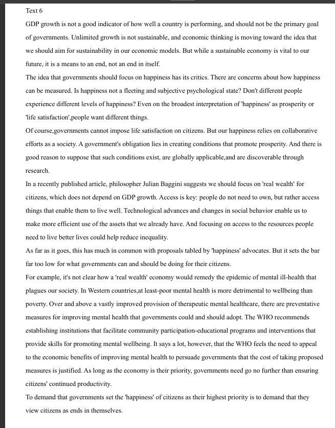、、
51 
52我想着 different levels of happiness  不是different happiness  主要是没看懂a fleeting and subjective psychological state

# 5

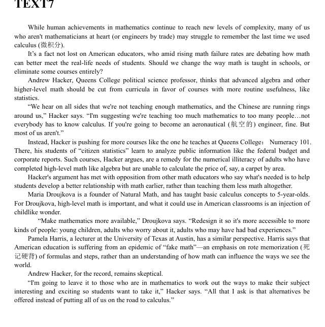

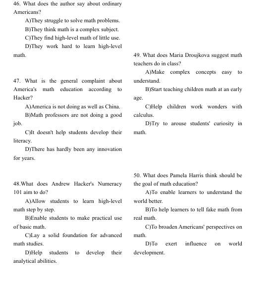

46 我纯粹没在原文找 凭借文章语境选的A 实际上struggle to remember the last time we used calculus能看出来答案
47 从we're not teaching enough mathematics, and the Chinese are running rings around us 看出   。  It doesn't help students develop their literacy.  原文没有
48 我想着从learn to analyze public information看出Help students to develop their analytical abilities.  而答案是Enable students to make practical use of basic math.  难道还是太宽泛？
49简单
50我又凭感觉 选了To exert influence on world development.   因为我想着 hacker的观点就是用在生活上  但是，我忽略了development这个词的错误性 跟世界发展无关  答案是To broaden Americans' perspectives on math    或许从alternative看出？
# 6
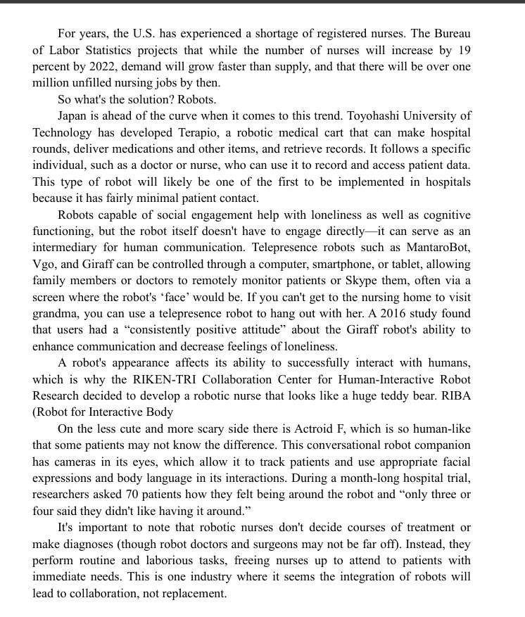
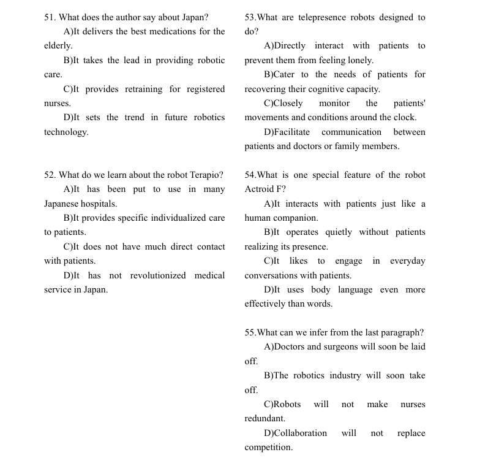

51 感觉我读太快了 扫到D的robotic technology就直接选了 然而太空 或者根本不对， 讲的是更具体的robotic care in medicine
52 我选的时候其实也很犹豫 原文的specific individual说的是机器人后面单独跟个医生/护士 我读懂了 但我就揣测了，它获取patient data  能不也能相当于individualized care吗？ 实际上原文没说。而原文说了minimal patient contact
53 我是有点迷了， 感觉A的话  不让人孤单只是附带作用 不是designed 的  而c的话 monitor确实是原文开始说的作用 但没有提around the clock啊   D我就没想
54 55都对了

# 7
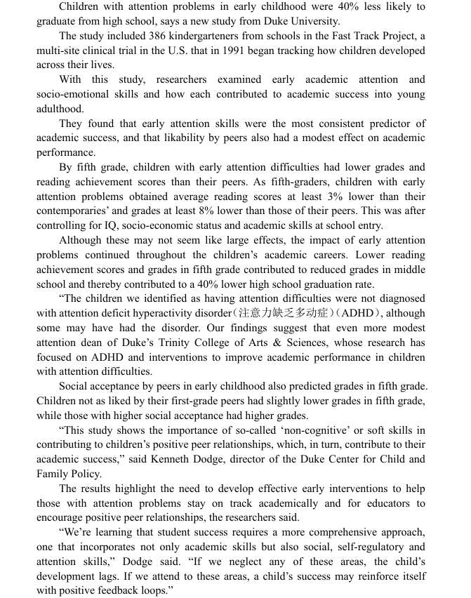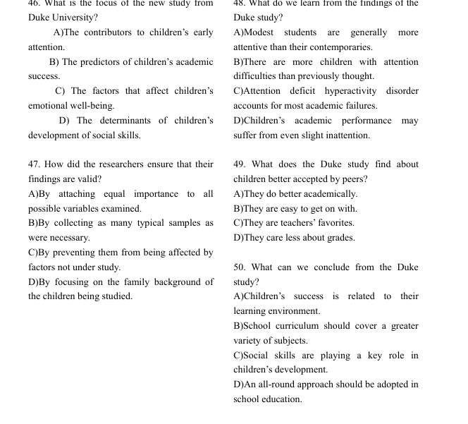

错俩个
一个47 我根本没在原文定位出 我只看到原文说了 是遵循IQ测试标准的吧 
- **案情重演 (Locate & Analyze):**
    
    1. **定位线索：** 你的直觉是对的，答案就在你看到的“IQ”那个地方！
        
    2. **核心证据句：** 第五段最后一句：This was after controlling for IQ, socio-economic status and academic skills at school entry.
        
    3. **破案关键词：controlling for**。
        
        - 你可能以为它的意思是“控制、管理”。
            
        - 但在科研/学术文章中，control for 是一个极高频的术语，意思是**“控制变量”**（即排除某些变量的干扰，以确保研究结果准确）。
            
    4. **选项比对：**
        
        - 原文说：排除了IQ、家庭背景等因素的干扰。
            
        - **C选项：** By preventing them from being affected by factors not under study. (通过防止它们受到非研究因素的影响)。
            
        - **完美匹配：** factors not under study = IQ, socio-economic status...。preventing from being affected = controlling for。
            
- **得分指导：**
    
    - **加入生词本：** **control for = 控制变量/排除干扰**。这是六级阅读（尤其是科普类）的必考词组。
一个48 也许我没读懂原文吧 确实中间有几段读的比较迷糊 单词都懂 但感觉有什么固定搭配或俗语我没读懂  我感觉C和D说的不一样吗？

# 8
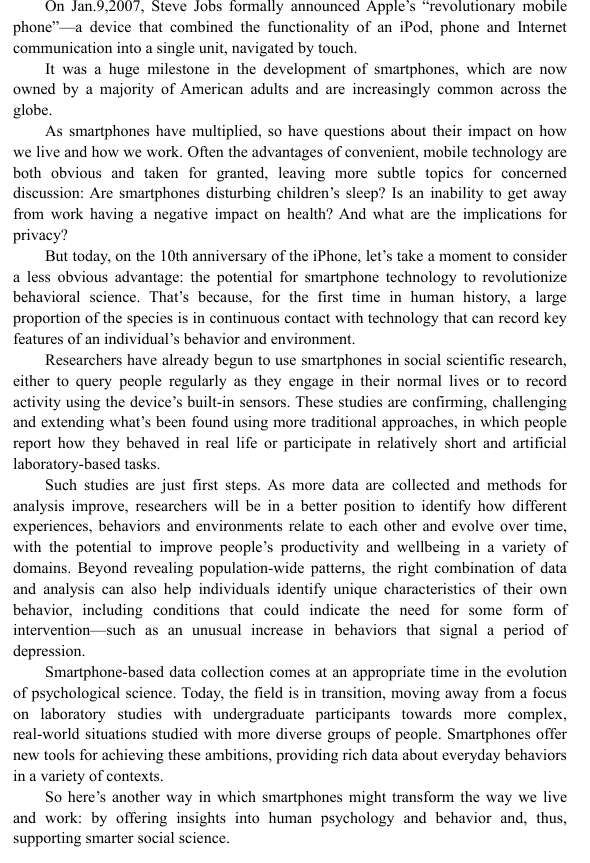
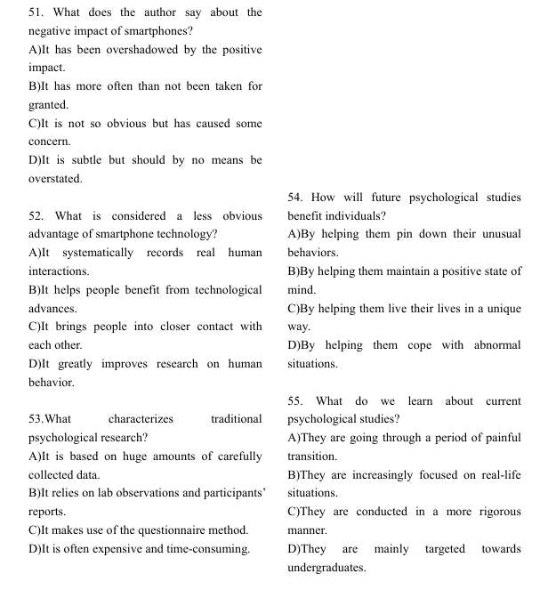
只错一个 第一题
我选了B  其实我没分析出选项意思，这是什么语法？ 我只看懂take for granted应该是理所当然  而原文是 哦，说他的便利性这个优点是被认为 理所当然 题目问的是缺点 。 那相对应的，就应该是C 不明显 人们注意不到了 
52 原文明确说了record b太宽泛文章也没直接说 c 没有 d 感觉，文章没明确说improve 选d的话像妄自揣测
53 不说了
54我还犹豫了一下C 后面发现unique只是说characteristic  文章始终强调发现behavior

# 9
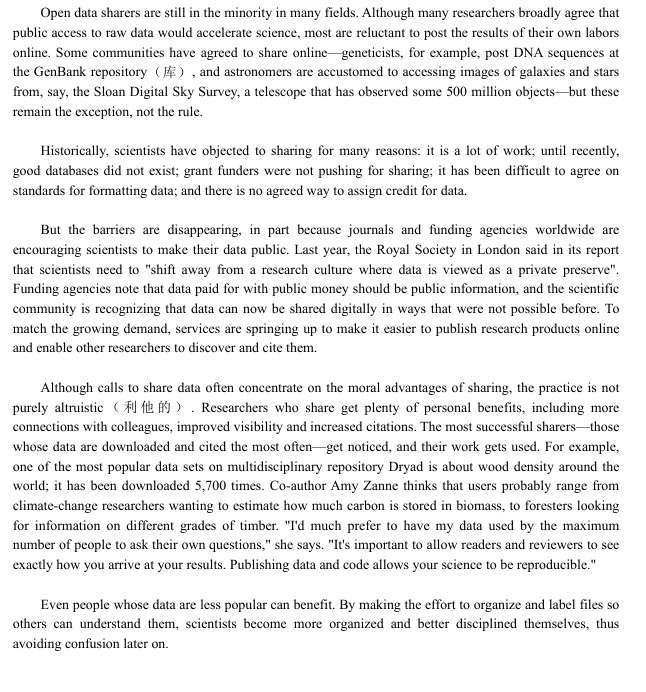
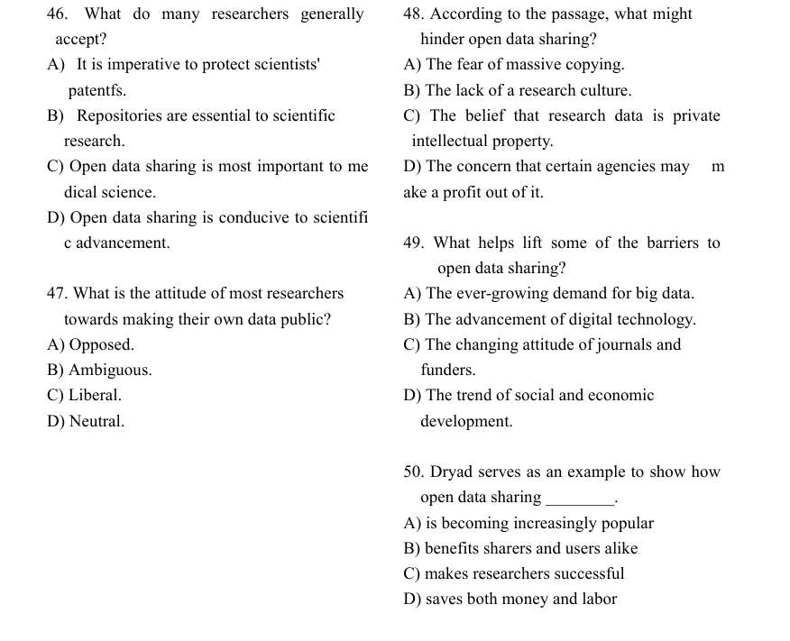

错了一个 49 
我根据 data can now be shared digitally in ways 选的B 
呃 我发现 原文确实也说 journals and funding agencies鼓励大家开源数据 ，而B属于是，C的具体做法？  嗯》。。 这好像也是一种经典错误
#### **49. What helps lift some of the barriers to open data sharing?**

- **你的答案：** B) The advancement of digital technology.
    
- **正确答案：** **C) The changing attitude of journals and funders.**
    
- **你的思路：** 看到原文说 data can now be shared digitally，所以选了 B。
    
- **案情重演 (Logic Detective):**
    
    1. **精准定位：** 题目问的是“什么帮助**消除障碍 (lift barriers)**？”我们定位到第三段的第一句（中心句）。
        
    2. **核心证据链：**
        
        - **原文：** But the barriers are disappearing, in part because journals and funding agencies worldwide are encouraging scientists to make their data public.
            
        - **翻译：** 但是障碍正在消失，部分**因为**世界各地的**期刊和资助机构**正在鼓励科学家公开数据。
            
    3. **陷阱分析：**
        
        - **你的干扰源（B选项）：** 文章后面确实提到了 data can now be shared digitally in ways that were not possible before。
            
        - **逻辑辨析：**
            
            - **C选项 (Journals and Funders):** 这是**Topic Sentence（主题句）**中明确指出的**“原因” (Because...)**。是期刊和资助机构的“态度转变”（从不推崇到鼓励），直接推动了障碍的消除。
                
            - **B选项 (Digital Technology):** 这是**支持性细节**。数字技术是**手段/工具 (How)**，它让共享成为可能，但真正**打破僵局、消除科学家心理障碍 (Why)** 的，是期刊和资助机构的政策压力和鼓励。
                
    4. **陷阱命名：** **【主次颠倒】** 或 **【细节干扰主旨】** 陷阱。
        
        - 选项B和C在文中都有体现，而且都是正向因素。
            
        - 但C是**主因（帅才）**，出现在段首，由 because 引导。
            
        - B是**辅因（将才）**，出现在段落中间，作为解释说明。
            
- **得分指导：**
    
    - **“首句原则”：** 西方人的写作逻辑通常是**“观点先行”**。段落的第一句往往包含最重要的信息（特别是当出现 But 转折时）。
        
    - **寻找“逻辑挂钩”：** 题目问 What helps... (其实是在问原因)，你就要去文中找 because, due to, as 等因果连词。本题中 because 后面紧跟的就是 journals and funding agencies，这是铁证。