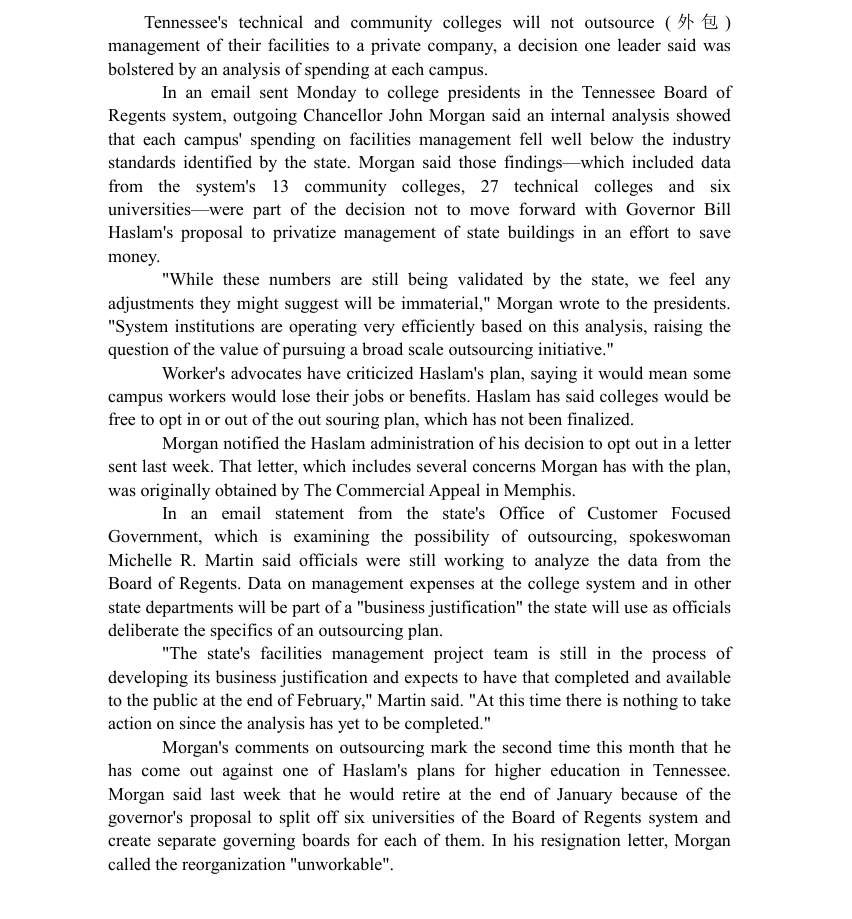
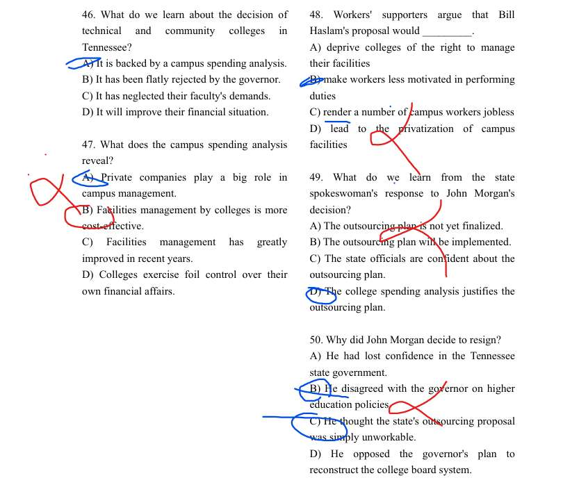

# 1

# 2

51 选错了，我选的B 其实是没看懂，或者说，自己脑补了。 原文说，放弃了migration。此时我就想着是，因为垃圾，在migration（我以为是栖息地） ，所以放弃了他。然而，实际上，本应该应去几千英里外，而垃圾场却吸引鸟儿留下。我觉得，我是feeding grounds  没读懂。咋回事呢，feeding 喂养 grounds 地方  组合在一起我却猜不出，怎么办呢/？
54 真的属于文章的句子看不懂了 

# 3

