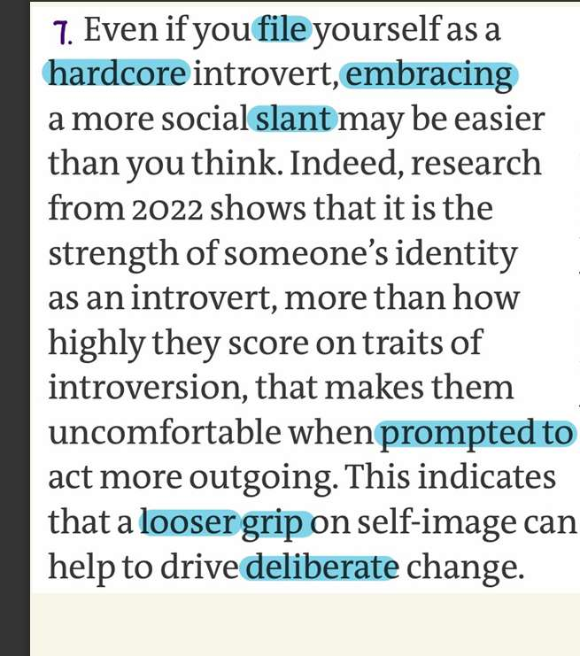

stable collection of traits
extrovert and introvert
Carl Jung  
malleable 
robust social life
Indeed
忽略

说服
"Indeed , research from....  that makes them ..."

This sentence is comparing **two causes** for why an introvert feels awkward acting like an extrovert.

1. **Cause A (Traits):** How introverted you actually are (e.g., your brain chemistry, your natural preference for silence).
    
2. **Cause B (Identity):** How strongly you **label** yourself (e.g., telling yourself, "I am a hardcore introvert, so I shouldn't be talking to people").
    

**The Meaning:**  
The research found that **Cause B is stronger than Cause A**.  
People feel uncomfortable acting outgoing not because they can't do it (traits), but because they believe it violates who they are (identity). They are "trapped" by the label they put on themselves.

deliberate change

in accordance
That is a valid critique of the genre (pop-science journalism), not necessarily a failure of your reading.
