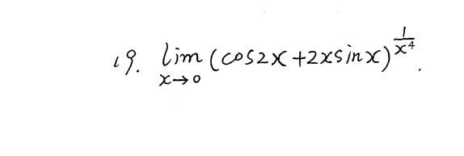
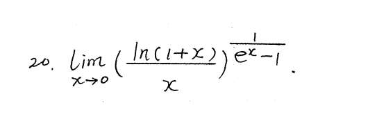

# 1
我的想法是 1+cos2x+2xsinx-1，然后化成指数，就是 co2x+2xsinx-1 比 x^4，然后一直洛必达..
我们的目标是算这个指数极限：$A = \lim_{x \to 0} \frac{\cos 2x + 2x \sin x - 1}{x^4}$

**答案的思路：想尽一切办法化成乘法，然后用等价无穷小替换！**

1. **消灭讨厌的 -1：**
    
    看到 $\cos 2x$ 和末尾的 $-1$，第一反应应该是什么？**二倍角公式！**
    
    $\cos 2x = 1 - 2\sin^2 x$。
    
    把它代进去，那个 $-1$ 完美抵消：
    
    $(1 - 2\sin^2 x) + 2x \sin x - 1 = \mathbf{2x \sin x - 2\sin^2 x}$
    
2. **提取公因式（制造乘积）：**
    
    上面这个式子，两项都有 $2\sin x$，赶紧提出来！
    
    $= \mathbf{2\sin x (x - \sin x)}$
    
    你看，原本复杂的加减法，瞬间变成了清爽的乘法结构！
    
3. **等价无穷小连招（秒杀）：**
    
    现在式子变成了：$\lim_{x \to 0} \frac{2\sin x (x - \sin x)}{x^4}$
    
    因为是乘法，我们可以分别对每一块“抓大头”：
    
    - 前面的 $2\sin x \sim 2x$。
        
    - 后面的 $(x - \sin x)$，这是考研极其常用的等价无穷小结论，由泰勒展开可得 $x - (x - \frac{1}{6}x^3) = \mathbf{\frac{1}{6}x^3}$。
        
    
    把这两个替换放回去：
    
    $= \lim_{x \to 0} \frac{2x \cdot \frac{1}{6}x^3}{x^4} = \frac{\frac{2}{6}x^4}{x^4} = \mathbf{\frac{1}{3}}$

 $A = \lim_{x \to 0} \left( \frac{\ln(1+x)}{x} - 1 \right) \cdot \frac{1}{e^x - 1}$

1. **通分并整理分母：**
    
    括号里通分一下，变成 $\frac{\ln(1+x) - x}{x}$。
    
    乘以后面的式子，分母拼在一起：
    
    $A = \lim_{x \to 0} \frac{\ln(1+x) - x}{x(e^x - 1)}$
    
2. **分母局部等价替换（又是这个神技）：**
    
    分母里的 $e^x - 1$ 是一个独立的乘法因子，直接等价替换成 $x$！
    
    分母瞬间变成：$x \cdot x = \mathbf{x^2}$。
    
    这说明什么？说明这道题的精度及格线是 **2 阶（$x^2$）**。
    
3. **分子泰勒展开对齐精度：**
    
    现在变成了求 $\lim_{x \to 0} \frac{\ln(1+x) - x}{x^2}$
    
    分子只有简单的加减法，而且分母是 $x^2$，这就大声呼唤我们把 $\ln(1+x)$ 泰勒展开到二次方！
    
    $\ln(1+x) = x - \frac{1}{2}x^2 + o(x^2)$
    
    代入分子：$(x - \frac{1}{2}x^2) - x = \mathbf{-\frac{1}{2}x^2}$。
    
4. **秒杀结果：**
    
    $\lim_{x \to 0} \frac{-\frac{1}{2}x^2}{x^2} = \mathbf{-\frac{1}{2}}$。
    

所以原极限就是 $e^{-\frac{1}{2}}$。

# 注
### 1. 为什么乘除法可以“不考虑”高阶无穷小？

其实不是“不考虑”，而是**在乘除法里，高阶无穷小绝对翻不起浪花，所以我们“默许”把它扔掉。**

**原理：误差在乘除法里，会被缩小。**

假设你要算 $A \cdot B$。

$A = x + o(x)$ （$x$ 是大头，$o(x)$ 是小尾巴）

$B = 2x + o(x)$

它们相乘：

$(x + o(x)) \cdot (2x + o(x)) = 2x^2 + \mathbf{x \cdot o(x) + 2x \cdot o(x) + o(x) \cdot o(x)}$

看后面那一堆粗体的误差项，根据我们之前学的吸收法则，它们全都是比 $x^2$ 更高阶的无穷小，最后统统被打包成一个 $o(x^2)$。

结果就是：$2x^2 + o(x^2)$。

你看，**大头乘大头（$x \cdot 2x = 2x^2$），直接决定了最终结果的大头。** 那些 $o(x)$ 完全没有干扰到这个 $2x^2$。

所以，在纯乘除法里，我们为了省事，直接闭着眼睛用首项（等价无穷小）替换，心安理得地把 $o()$ 忽略掉。

### 2. 为什么只有加减法“必须考虑”？

**原理：误差在加减法里，可能会“篡位”变成大头！**

这是你之前踩过的坑，我们再复习一下。

假设你要算 $A - B$。

$A = x + x^2 + o(x^2)$

$B = x - x^2 + o(x^2)$

它们相减：

$(x + x^2) - (x - x^2) = \mathbf{2x^2} + o(x^2)$

如果你“不考虑”高阶无穷小，只看第一阶的等价无穷小（认为 $A \sim x, B \sim x$）：

你一减：$x - x = 0$。

完蛋了！**原本的大头 $x$ 同归于尽了，原来被你当成“误差”忽略掉的 $x^2$（即 $2x^2$），现在被迫上位，成了决定生死的真正大头。** 如果你之前没管它，你的精度就彻底丢失了。
### 终极实战口诀（请刻在脑子里）：

1. **遇到纯乘除（包括独立的乘法因式）：** 大胆狂奔！直接用最简单的等价无穷小替换，绝不多写一笔。（比如前一题分母里的 $e^x - 1$ 直接换成 $x$）。
    
2. **遇到加减法（$A \pm B$）：** 立刻警惕！
    
    - 先用大脑试算一下它们的第一项（等价无穷小）会不会抵消？
        
    - **如果不抵消**（比如 $2x - \sin x \approx 2x - x = x$），大胆替换，因为大头还在！
        
    - **如果抵消了**（比如 $\tan x - \sin x \approx x - x = 0$），立刻放弃等价无穷小，乖乖召唤泰勒公式，往后多展几阶，直到减出来不为 0 为止！