## - **$\sin(x)$ 的展开式：**
    
    $$\sin(x) = x - \frac{1}{3!}x^3 + \frac{1}{5!}x^5 - \frac{1}{7!}x^7 + o(x^8)$$
## **$\arcsin(x)$ 的展开式：**
    
    $$\arcsin(x) = x + \frac{1}{6}x^3 + \frac{3}{40}x^5 + \frac{5}{112}x^7 + o(x^8)$$

## **$\tan(x)$ 的展开式：**
    
    $$\tan(x) = x + \frac{1}{3}x^3 + \frac{2}{15}x^5 + \frac{17}{315}x^7 + o(x^8)$$

## **$\arctan(x)$ 的展开式：**
    
    $$\arctan(x) = x - \frac{1}{3}x^3 + \frac{1}{5}x^5 - \frac{1}{7}x^7 + o(x^8)$$
    
- **$\ln(1+x)$ 的展开式：**
    
    $$\ln(1+x) = x - \frac{1}{2}x^2 + \frac{1}{3}x^3 - \frac{1}{4}x^4 + o(x^4)$$
    

- **$e^x$ 的展开式：**
    
    $$e^x = 1 + x + \frac{1}{2!}x^2 + \frac{1}{3!}x^3 + o(x^3)$$
    
    _(化简后即为：$1 + x + \frac{1}{2}x^2 + \frac{1}{6}x^3 + o(x^3)$)_
    

    
    _(化简后即为：$x - \frac{1}{6}x^3 + \frac{1}{120}x^5 - \frac{1}{5040}x^7 + o(x^8)$)_
    
- **$\cos(x)$ 的展开式：**
    
    $$\cos(x) = 1 - \frac{1}{2!}x^2 + \frac{1}{4!}x^4 - \frac{1}{6!}x^6 + o(x^7)$$
    
    _(化简后即为：$1 - \frac{1}{2}x^2 + \frac{1}{24}x^4 - \frac{1}{720}x^6 + o(x^7)$)_
    

    
- **$(1+x)^\alpha$ 的展开式（广义二项式定理）：**
    
    $$(1+x)^\alpha = 1 + \alpha x + \frac{\alpha(\alpha-1)}{2!}x^2 + \frac{\alpha(\alpha-1)(\alpha-2)}{3!}x^3 + o(x^3)$$
    
- **$\frac{1}{1-x}$ 的展开式：**
    
    $$\frac{1}{1-x} = 1 + x + x^2 + x^3 + o(x^3)$$
    
- **$\frac{1}{1+x}$ 的展开式：**
    
    $$\frac{1}{1+x} = 1 - x + x^2 - x^3 + o(x^3)$$
# 公式

# 1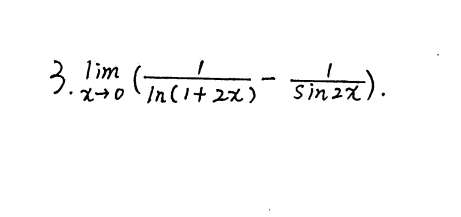

# 2
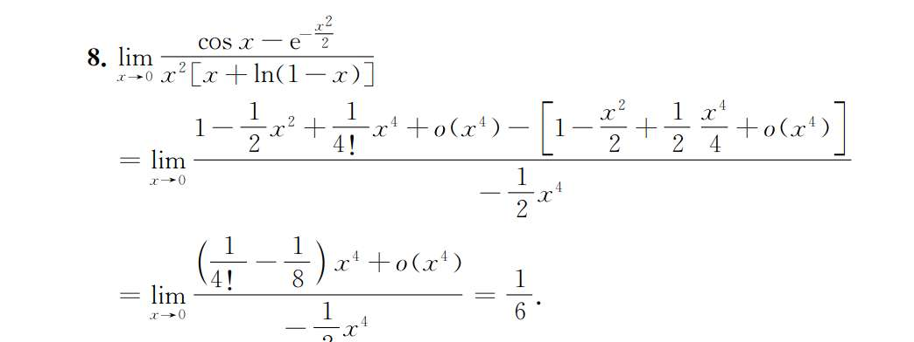
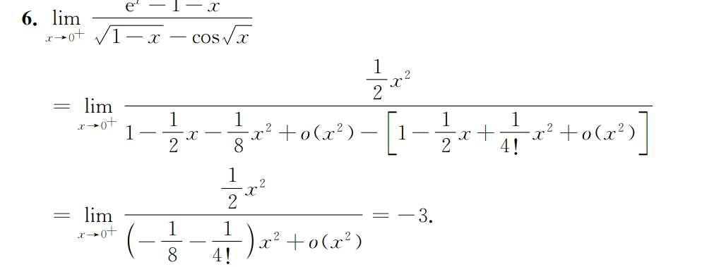

我犯了相同的错误，比如 8 题，指数展开到 x^4 了，cos 只展开到了 x^2，看似都是是最后分子只1. **相减后的灾难：**
    
    $$\cos x - e^{-\frac{x^2}{2}} = \left[1 - \frac{x^2}{2} + o(x^2)\right] - \left[1 - \frac{x^2}{2} + \frac{x^4}{8} + o(x^4)\right]$$
    
$1$ 和 $-\frac{x^2}{2}$ 确实抵消了。但是，你剩下了什么？

$$= -\frac{x^4}{8} + o(x^2) - o(x^4)$$

这里最致命的就是 $o(x^2)$。**$o(x^2)$ 是一个“黑洞”，它代表所有比 $x^2$ 高阶的无穷小**，比如 $x^3$, $x^4$, $x^5$ 都藏在里面。

因为 $o(x^2)$ 吃掉了所有高阶项，所以那个 $-\frac{x^4}{8}$ 变得毫无意义，它直接被 $o(x^2)$ 吞噬了。你的分子最后只剩下一个 $o(x^2)$。
    
2. **最终比值：** $\frac{o(x^2)}{-\frac{1}{2}x^4}$，这个极限是无法计算的（你丢失了 $x^4$ 前面的系数信息）。
    

**结论：** 就像木桶装水多少取决于最短的木板。你把一项展开到 $x^4$，另一项只展开到 $x^2$，相加减后，整体精度就降级到了 $o(x^2)$。**要算 $x^4$ 级别的极限，参与加减的所有项，必须老老实实都展开到 $x^4$。**有 x^4，但精度不同

# 3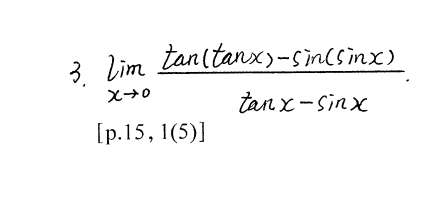
我直接上面展开为 tanx-sinx  
所以结果写为 1...
此时确实是上下同阶啊??
答案是先把分母化为 x^3，然后给分子一顿展开也化为 3 次方

$\tan x - \sin x = (x + \frac{1}{3}x^3) - (x - \frac{1}{6}x^3) = \mathbf{\frac{1}{2}x^3}$。分母是 $x^3$ 级别的！这意味着，**整道题是在 $x^3$ 这个微观精度上进行比较的。**
我们不能说，精度是“tanx-sinx”，必须细化到 x！

# 5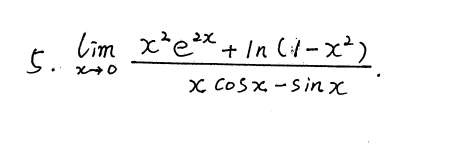
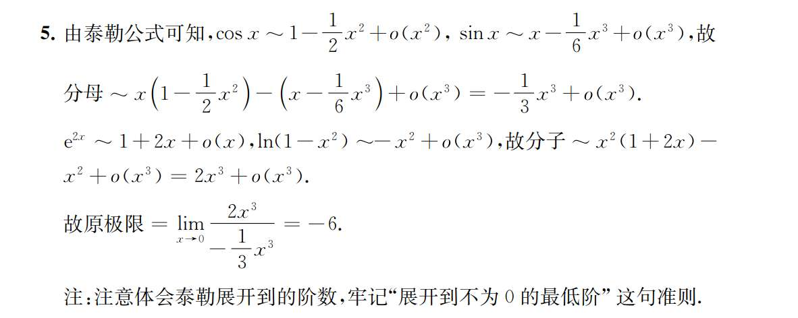

无穷小吸收过程
`o(x^2) + o(x^3) = o(x^2)`
o(x) * x^2 = o(x^3)
$x^2 \cdot e^{2x} = x^2 \cdot [1 + 2x + o(x)] = x^2 + 2x^3 + \mathbf{x^2 \cdot o(x)}$ 根据刚才的法则，$x^2 \cdot o(x)$ 变成了 $o(x^3)$，所以展开式就成了 $x^2 + 2x^3 + o(x^3)$。

# 6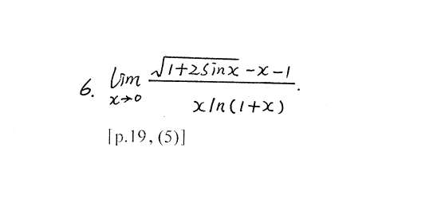
老老实实泰勒展开的话，分子是-6 分之 1x^3，分母是 x-二分之一 x^3 ，不知道怎么办
而答案
**1. 分母你算错了：**

分母是 $x \ln(1+x)$。

因为 $\ln(1+x) = x - \frac{1}{2}x^2 + o(x^2)$

所以 $x \ln(1+x) = x(x) = \mathbf{x^2}$（大头是 $x^2$）。

你说分母是 $x - \frac{1}{2}x^3$，这大概率是你把 $\ln(1+x)$ 的公式记混了或者乘 $x$ 的时候出错了。分母的精度到 $x^2$ 就可以了。

**2. 分子你展漏了（最容易错的地方）：**

分子是 $\sqrt{1+2\sin x} - x - 1$。

你想用 $(1+u)^{\frac{1}{2}} = 1 + \frac{1}{2}u + o(u)$。

令 $u = 2\sin x \approx 2x - \frac{1}{3}x^3$。

代进去你可能算出了：$1 + \frac{1}{2}(2x - \frac{1}{3}x^3) - x - 1 = 1 + x - \frac{1}{6}x^3 - x - 1 = -\frac{1}{6}x^3$。这就是你的结果，对吧？

**错在哪里？错在你忘记了根号展开的第二项！**

因为分母是 $x^2$ 级别的，所以分子**至少要精确到 $x^2$**。

带有平方根的泰勒展开式是：$(1+u)^{\frac{1}{2}} = 1 + \frac{1}{2}u \mathbf{- \frac{1}{8}u^2} + o(u^2)$。

如果你不写 $-\frac{1}{8}u^2$，你就丢失了 $x^2$ 级别的精度！

我们把这个 $-\frac{1}{8}u^2$ 补上，再算一次（只抓到 $x^2$ 就行）：

$u = 2\sin x \approx 2x$

$\sqrt{1+2\sin x} \approx 1 + \frac{1}{2}(2x) - \frac{1}{8}(2x)^2 = 1 + x - \frac{1}{2}x^2$

现在我们把分子拼起来：

分子 $= (1 + x - \frac{1}{2}x^2) - x - 1 = \mathbf{-\frac{1}{2}x^2}$。

看！根本没有 $x^3$ 什么事，分子的真正大头是 $-\frac{1}{2}x^2$。

分子是 $-\frac{1}{2}x^2$，分母是 $x^2$，一除，**答案 $-\frac{1}{2}$ 直接秒杀出来！**

---

### 图中答案的思路：分子有理化（避开复杂的泰勒展开）

为什么答案不用泰勒？因为像刚才那样，对 $\sqrt{1+2\sin x}$ 进行复合泰勒展开，很容易像你一样漏掉 $-\frac{1}{8}u^2$ 这一项。

为了避开这个易错点，答案采用了一招：**分子有理化（平方差公式）**。

看到 $\sqrt{A} - B$，直接上下同乘 $\sqrt{A} + B$。

1. **乘共轭因式：** 上下同乘 $\sqrt{1+2\sin x} + (x+1)$。
    
2. **处理那个烦人的尾巴：** 当 $x \to 0$ 时，这个共轭因式 $\sqrt{1+0} + (0+1) = 2$。它是个极限不为 0 的常数！在乘法里，**直接把它变成 $\frac{1}{2}$ 提出来！**（看图片里第三步前面的 $\frac{1}{2}$ 就是这么来的）。
    
3. **分子变清爽：** 平方差公式展开，分子变成了 $(1+2\sin x) - (x+1)^2 = 1 + 2\sin x - x^2 - 2x - 1 = \mathbf{2(\sin x - x) - x^2}$。
    
4. **分母变清爽：** 分母是 $x\ln(1+x)$，用等价无穷小直接变成 $x \cdot x = \mathbf{x^2}$。
    

式子瞬间变成了非常干净的：

$$\frac{1}{2} \lim_{x \to 0} \frac{2(\sin x - x) - x^2}{x^2}$$

拆开：

$$= \frac{1}{2} \left[ \lim \frac{2(\sin x - x)}{x^2} - \lim \frac{x^2}{x^2} \right]$$

因为 $\sin x - x \sim -\frac{1}{6}x^3$，它除以 $x^2$ 极限是 0。

所以括号里是 $0 - 1 = -1$。

最终结果 $\frac{1}{2} \times (-1) = -\frac{1}{2}$。
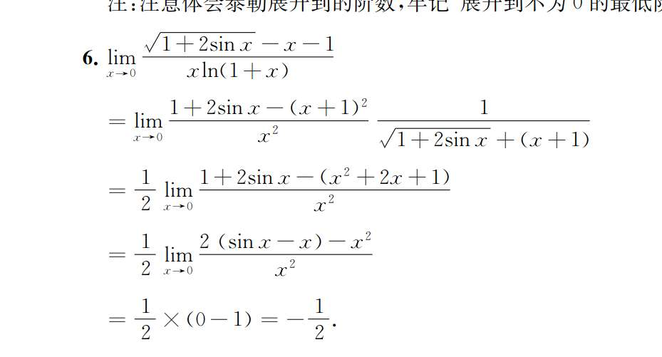

# 7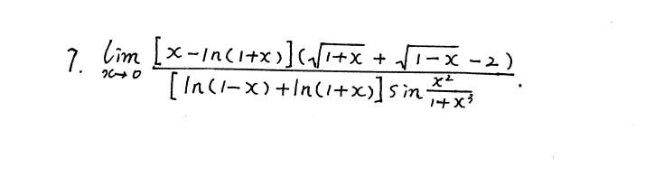
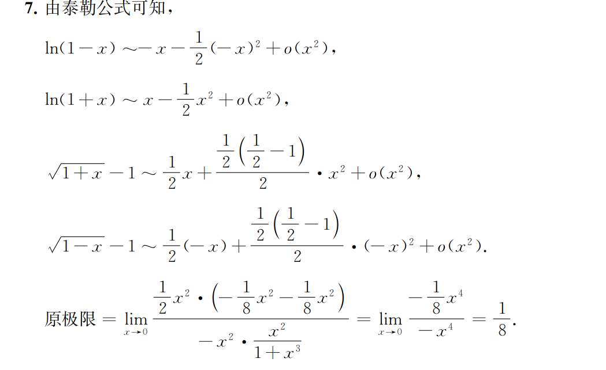
他们的 o (x) 又是怎么消除的

看图 7 最后一步，分子和分母分别算出了一大堆东西，最后变成了这样（简写）：

$$\lim_{x \to 0} \frac{A x^4 + o(x^4)}{B x^4 + o(x^4)}$$

书上直接写等于 $\frac{A}{B}$，并没有详细写 $o(x^4)$ 去哪了。其实它不是变魔术消失的，而是**通过除法变成了真正的 0**。

**严谨的消除过程是这样的：**

分子分母同时除以这个“大头” $x^4$：

$$= \lim_{x \to 0} \frac{A + \frac{o(x^4)}{x^4}}{B + \frac{o(x^4)}{x^4}}$$

根据高阶无穷小的定义：当 $x \to 0$ 时，$\frac{o(x^n)}{x^n}$ 的极限**必然等于 0**！

所以上面的式子就变成了：

$$= \frac{A + 0}{B + 0} = \frac{A}{B}$$

_(图 7 中的 $A = \frac{1}{8}, B = -1$)_

**实战做题诀窍：**

只要你保证分子和分母的“大头”（最低阶次）是一样的（比如都是 $x^4$），而且尾巴上的余项都是 $o(x^4)$，那你就可以**理直气壮地直接把 $o(x^4)$ 划掉不看**，直接用前面的系数相除，这就是答案。

打个比方：$o(x^n)$ 就像火箭的推进器，它帮我们推算出前面的系数（有效载荷）后，在求极限的最后一步，它就完成使命，直接脱落（变成 0）了。

# 8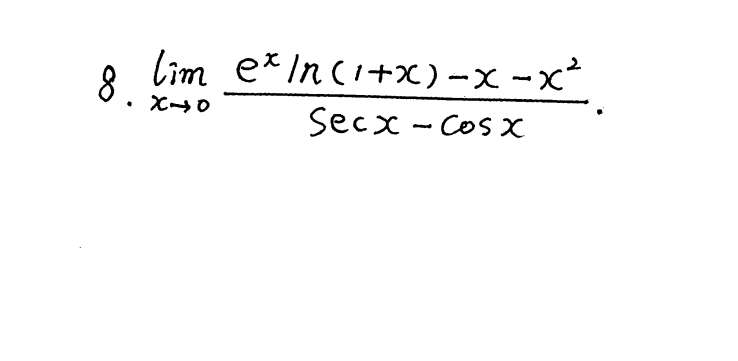

原式是：

$$\left[1 + x + \frac{1}{2}x^2 + o(x^2)\right] \cdot \left[x - \frac{1}{2}x^2 + o(x^2)\right]$$

我们一项一项去乘右边的括号，但**只挑有用的（次数 $\le 2$ 的）写出来**，超标的直接扔进垃圾桶：

- **用 $1$ 去乘：**
    
    - $1 \cdot x = \mathbf{x}$ （保留）
        
    - $1 \cdot (-\frac{1}{2}x^2) = \mathbf{-\frac{1}{2}x^2}$ （保留）
        
    - $1 \cdot o(x^2) = \mathbf{o(x^2)}$ （这是误差项，先放着）
        
- **用 $x$ 去乘：**
    
    - $x \cdot x = \mathbf{x^2}$ （保留）
        
    - $x \cdot (-\frac{1}{2}x^2) = -\frac{1}{2}x^3$ （超标了！属于比 $x^2$ 高阶的无穷小，扔进 $o(x^2)$）
        
    - $x \cdot o(x^2) = o(x^3)$ （也是高阶无穷小，扔进 $o(x^2)$）
        
- **用 $\frac{1}{2}x^2$ 去乘：**
    
    - $\frac{1}{2}x^2 \cdot x = \frac{1}{2}x^3$ （超标！扔进 $o(x^2)$）
        
    - 后面的乘出来次数更高，全扔进 $o(x^2)$。
        
- **用 $o(x^2)$ 去乘：**
    
    - $o(x^2) \cdot x = o(x^3)$ （扔！）
        
    - $o(x^2) \cdot (-\frac{1}{2}x^2) = o(x^4)$ （扔！）
        
    - $o(x^2) \cdot o(x^2) = o(x^4)$ （就是我们刚说的，也扔！）
        

**最后大盘点：**

把我们刚才“保留”下来的项加在一起：

$$x - \frac{1}{2}x^2 + x^2$$

把所有扔进垃圾桶的误差项加在一起：

$$o(x^2) + o(x^3) + o(x^4) + \dots$$

根据我们上一个问题讲的“低阶吸收高阶”法则，这一大串 $o()$ 加起来，最低阶是 $o(x^2)$，所以整体统称为 $\mathbf{o(x^2)}$。

把两部分合起来，就得到了图中的结果：

$$x + x^2 - \frac{1}{2}x^2 + o(x^2)$$

### 总结一下“泰勒乘法”的实战心法：

在草稿纸上算两个泰勒展开相乘时，**绝对不要傻乎乎地全乘出来**。

1. 先看分母或者整体需要保留到第几阶（这题分母是 $x^2$，所以保留到 2 阶）。
    
2. 然后在脑子里“配对”，只计算那些**指数相加 $\le 2$** 的常数项乘积。
    
3. 算完有效项，后面直接大笔一挥加上一个 $+ o(x^2)$，完事！

# 9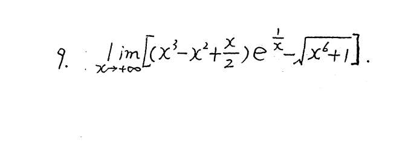‘’

别做到这步就泰勒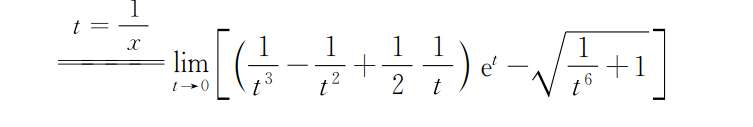

# 10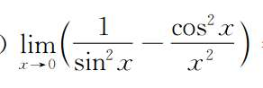

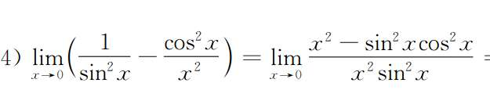
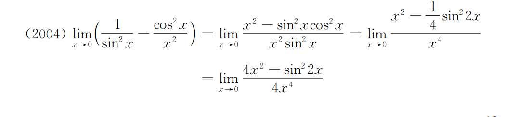；

# 11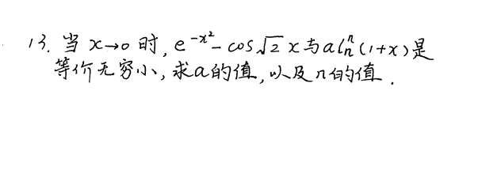

# 12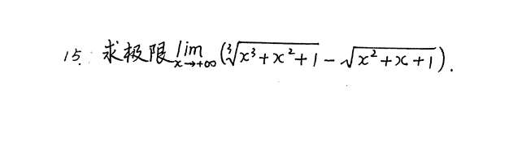