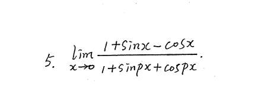
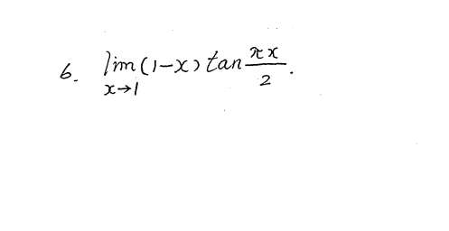
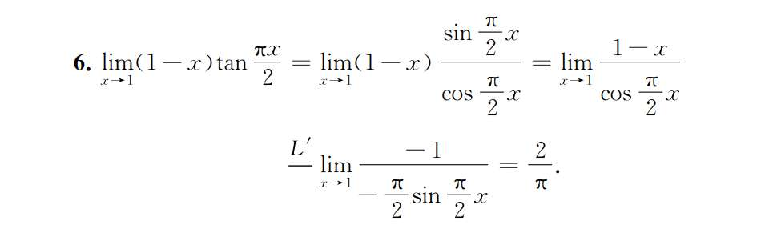

# 1

本题为什么不能洛，以及我在想假如洛了，
分子 1+cosx+sinx，分母也是 1+pcosx-psinpx，能否直接把 x 代入分子分母的 cosx，为什么

### 1. 为什么这道题不能用洛必达法则？

**因为这根本不是 $\frac{0}{0}$ 型！**

我们回想一下洛必达法则的**绝对前提**：只有当极限是 $\frac{0}{0}$ 或者 $\frac{\infty}{\infty}$ 这种“未定式”时，才能洛必达。

遇到任何极限题，**第一步永远是：把 $x \to 0$ 直接代入式子看看！**

我们来代入这道题：

- **分子：** $1 + \sin 0 - \cos 0 = 1 + 0 - 1 = \mathbf{0}$
    
- **分母：** $1 + \sin(p\cdot0) + \cos(p\cdot0) = 1 + 0 + 1 = \mathbf{2}$
    

看清楚了吗？这是个 $\mathbf{\frac{0}{2}}$ 型的极限！

分母根本不是 0！这是一个完全确定、毫无争议的数字。$\frac{0}{2}$ 的结果就是 **0**。这道题的答案直接就是 0，一步秒杀，根本不需要任何泰勒、洛必达或者等价无穷小。

**如果你强行“洛”了会怎样？**

这就是这个陷阱的恶毒之处。如果你不验证 $\frac{0}{0}$ 就直接求导，就像你假设的那样：

导数分子：$\cos x + \sin x$

导数分母：$p\cos px - p\sin px$

此时代入 $x=0$，你会得到 $\frac{1}{p}$。

**本来答案是 0，你强行洛必达，得出了一个完全错误的 $\frac{1}{p}$！** 这在考场上就是直接 0 分。

---

### 2. 假设它是 $\frac{0}{0}$ 型，洛完之后能直接把 x 代入 $\cos x$ 吗？

**结论：完全可以！只要代入后分母不为 0。**

抛开这道题原本的陷阱不谈，顺着你的假设：假如某个题洛必达之后，变成了 $\frac{\cos x + \sin x}{p\cos px - p\sin px}$。

此时你怎么求极限？**还是老规矩：第一步先代入试试！**

代入 $x=0$：

- 分子变成 $\cos 0 + \sin 0 = 1$
    
- 分母变成 $p\cos 0 - p\sin 0 = p$
    
    只要 $p \neq 0$，这就是一个确定的数字 $\frac{1}{p}$。
    

你当然可以直接代入！因为此时分子和分母都是**连续函数**。连续函数在某一点的极限，就等于它在那一点的函数值。

---

### 3. 灵魂拷问：到底什么时候能直接代入？什么时候不能？

你问“如 $\frac{1}{1+\cos x}$ 为何能代入”，其实背后的核心逻辑只有一条，我称之为**“极限的第一定律（代入法）”**：

> **拿到任何极限题，二话不说，先把趋于的那个数值（比如 $x=0$）闭着眼睛代进去算。**

代入之后，只会发生以下三种情况，这就是你的“行动指南”：

**情况一：算出了一个正常的数字**

- **特征：** 分母不是 0。比如你说的 $\frac{1}{1+\cos x}$，代入得 $\frac{1}{1+1} = \frac{1}{2}$；或者像这道题 $\frac{0}{2} = 0$。
    
- **结论：这个数字就是最终答案！直接写结果，大功告成。** 绝对不能再去搞什么洛必达、泰勒。
    

**情况二：算出了 $\frac{\text{非零常数}}{0}$**

- **特征：** 比如 $\frac{3}{0}$，$\frac{-1}{0}$。
    
- **结论：极限是无穷大（$\infty$）。** 这个时候你要看看是正无穷还是负无穷（考虑左右极限），但它绝不是未定式，也不能用洛必达。
    

**情况三：算出了 $\frac{0}{0}$ 或者 $\frac{\infty}{\infty}$**

- **特征：** 也就是所谓的**“未定式”**。因为 0 除以 0 是神仙也算不出来的。
    
- **结论：只有这个时候，你才不能直接代入！** 此时你才需要召唤你的武器库：洛必达法则、泰勒展开、等价无穷小替换、有理化等等，把这个式子变形，直到它脱离 $\frac{0}{0}$ 的状态，变成情况一或情况二。
    

**总结你的疑惑：**

你之所以产生“什么时候能代入”的纠结，是因为你平时做了太多复杂的 $\frac{0}{0}$ 题，导致你形成了一种**“条件反射”**——看到极限就想变形、就想洛必达、就想泰勒。

出题人太懂你们的心理了，所以他们偶尔会放一个 $\frac{0}{2}$ 或者 $\frac{1}{2}$ 的题在卷子里。那些不先代入检查、直接埋头苦算的同学，就会掉进“强行洛必达导致答案错误”的深渊。

# 2
有 tan 求导困难不妨先化为 sin 比 cos

