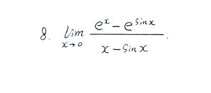
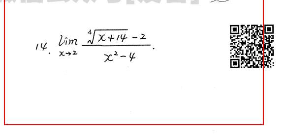
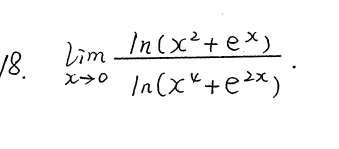
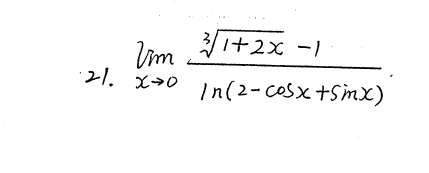
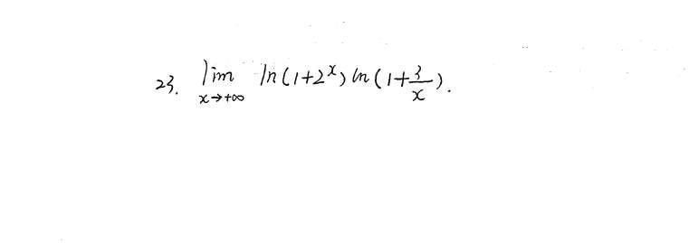
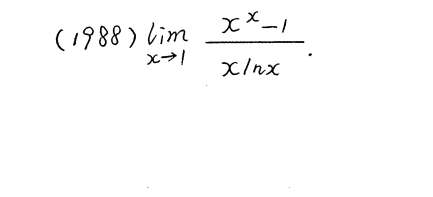
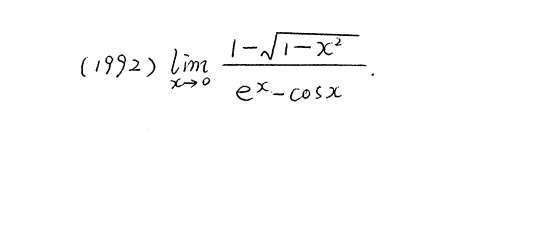
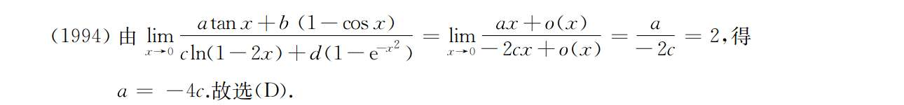
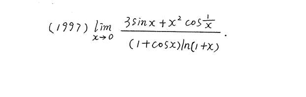
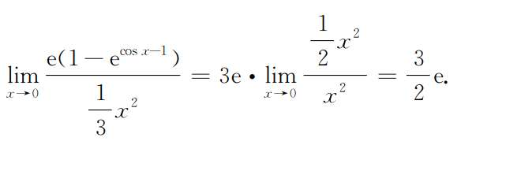

# 1
虽然最后化为了分子分母都为 x-sinx，但我并不敢写 1，因为分子还有个 o (x)

### 你的担忧 1：如果你是直接分别展开的（绝对不能写 1）

如果你是这么想的：

因为 $e^x = 1 + x + o(x)$，且 $e^{\sin x} = 1 + \sin x + o(x)$

分子一减，变成了：$(x - \sin x) + o(x)$

然后除以分母 $x - \sin x$。

**如果你是这么做的，你的“不敢写 1”是 1000% 正确的！**

为什么？因为分母 $x - \sin x \sim \frac{1}{6}x^3$。分母是个 $x^3$ 级别的“小不点”。

而你分子里的 $o(x)$ 是个“黑洞”，它里面藏着 $x^2, x^3 \dots$。

你用 $[ (x - \sin x) + o(x) ]$ 去除以 $\frac{1}{6}x^3$，那个 $o(x)$ 根本除不尽，会产生无穷大的不确定性。**精度彻底崩塌。**

_（如果真要硬碰硬分别展开，因为分母是 $x^3$ 级别，你必须把 $e^x$ 和 $e^{\sin x}$ 都老老实实展到 $x^3$ 才能减，这计算量非常恶心。）_

---

### 正确的“神仙操作”：提取公因式，降维打击

为了避开上面的精度灾难，这道题有一个极其巧妙的标准套路：**提公因式，把减法变成乘法！**

我们不在外围分别展开，而是强行把 $e^{\sin x}$ 提出来：

$$e^x - e^{\sin x} = e^{\sin x} (e^{x - \sin x} - 1)$$

看！这就把两个复杂的指数相减，变成了一个大家喜闻乐见的结构：$e^u - 1$。

令 $u = x - \sin x$。当 $x \to 0$ 时，$u \to 0$。

现在原极限变成了：

$$= \lim_{x \to 0} \frac{e^{\sin x} (e^{x - \sin x} - 1)}{x - \sin x}$$

在这个结构下，我们再来看看你的担忧。

### 你的担忧 2：替换后产生的 $o(x-\sin x)$ 去哪了？

根据泰勒公式，$e^u - 1 = u + o(u)$。

把 $u$ 换成 $x-\sin x$，那么：

$e^{x - \sin x} - 1 = (x - \sin x) + \mathbf{o(x - \sin x)}$

你是不是在担心这个粗体的尾巴？别怕，我们把它代回原式，并用上一个问题刚讲过的“同除法”：

$$= \lim_{x \to 0} e^{\sin x} \cdot \frac{(x - \sin x) + o(x - \sin x)}{x - \sin x}$$

把后面的分数拆开（也就是分子分母同除以大头 $x - \sin x$）：

$$= \lim_{x \to 0} e^{\sin x} \cdot \left[ \frac{x - \sin x}{x - \sin x} + \frac{o(x - \sin x)}{x - \sin x} \right]$$

$$= \lim_{x \to 0} e^{\sin x} \cdot \left[ 1 + \frac{o(x - \sin x)}{x - \sin x} \right]$$

**见证魔法的时刻到了：**

1. 最前面的 $e^{\sin x}$，当 $x \to 0$ 时，它是 $e^0 = \mathbf{1}$。
    
2. 根据 $o()$ 的定义，当“底座” $(x-\sin x) \to 0$ 时，$\frac{o(\text{底座})}{\text{底座}}$ 的极限必然等于 $\mathbf{0}$。所以那一团 $o()$ 的东西名正言顺地消失了！
    

最终结果：$1 \cdot (1 + 0) = \mathbf{1}$。

### 总结你的高光时刻

1. **如果你是用加减法直接替换的：** 你的直觉是对的，不能写 1，因为精度不够，做错了。
    
2. **如果你是提公因式后替换的：** 你可以大胆地写 1，因为那个 $o(x-\sin x)$ 会在除以它自己同阶的 $(x-\sin x)$ 时，完美地化为 0。
    

这道题是考研最爱出的题型之一：**看到 $e^A - e^B$，立刻反射性地提取 $e^B$（或 $e^A$），将其化为 $e^B(e^{A-B} - 1)$，然后用等价无穷小。**

# 2

注意，那玩意根号 4,，是 4 分之一！不是 4！

# 3
**1. 看分子：** $\ln(x^2 + e^x)$

当 $x \to 0$ 时，内部是 $0 + 1 = 1$。

强行凑个 1 出来：$\ln[1 + (x^2 + e^x - 1)]$。

此时我们的 $\triangle$ 就是 $(x^2 + e^x - 1)$。

根据泰勒展开， $e^x - 1 \sim x$。

所以 $\triangle = x^2 + (x + o(x)) = \mathbf{x + x^2 + o(x)}$。

在这个多项式里，谁是最低阶的“大头”？显然是 **$x$**！那个 $x^2$ 在 $x$ 面前根本不够看，直接被吸进 $o(x)$ 里。

所以，**分子 $\sim x$**。

**2. 看分母：** $\ln(x^4 + e^{2x})$

同理，强行凑 1：$\ln[1 + (x^4 + e^{2x} - 1)]$。

这里的 $\triangle$ 是 $(x^4 + e^{2x} - 1)$。

因为 $e^{2x} - 1 \sim 2x$。

所以 $\triangle = x^4 + (2x + o(x)) = \mathbf{2x + x^4 + o(x)}$。

大头是谁？是 **$2x$**！那个 $x^4$ 更是小得可怜。

所以，**分母 $\sim 2x$**。

**3. 出结果：**

$$\lim_{x \to 0} \frac{x}{2x} = \mathbf{\frac{1}{2}}$$ 求极限时，先试探性地展到第一阶（即等价无穷小），如果分子分母都没有被加减法抵消成 0，就**立刻停手**，直接出答案！千万不要盲目追求高精度。

# 4

分子就是 x, 分母也要 x。

# 5

这是一个典型的 $\infty \cdot 0$ 型未定式。后面那半截很好处理，难点在于前面那个 $\ln(1+2^x)$，里面有个趋于无穷大的 $2^x$，怎么把它剥离出来？

**破局核心武器：对数里的“抓大头”（提取公因式）**

1. **先捏软柿子（处理后半截）：**
    
    当 $x \to +\infty$ 时，$\frac{3}{x} \to 0$。
    
    直接使用等价无穷小 $\ln(1+u) \sim u$：
    
    $\ln(1+\frac{3}{x}) \sim \frac{3}{x}$。
    
2. **硬啃硬骨头（处理前半截）：**
    
    面对 $\ln(1+2^x)$，既然 $2^x$ 是无穷大，我们就把它强行提出来！
    
    $$\ln(1+2^x) = \ln\left[ 2^x \left( \frac{1}{2^x} + 1 \right) \right]$$
    
    利用对数的乘法拆分性质 $\ln(A \cdot B) = \ln A + \ln B$：
    
    $$= \ln(2^x) + \ln(1 + 2^{-x})$$
    
    $$= x \ln 2 + \ln(1 + 2^{-x})$$
    
3. **合体出击：**
    
    把变形后的前半截，和等价后的后半截乘起来，原极限就变成了：
    
    $$= \lim_{x \to +\infty} \left[ x \ln 2 + \ln(1 + 2^{-x}) \right] \cdot \frac{3}{x}$$
    
    用分配律乘进去，拆成两项：
    
    $$= \lim_{x \to +\infty} \left[ \frac{3x \ln 2}{x} + \frac{3\ln(1 + 2^{-x})}{x} \right]$$
    
    $$= \lim_{x \to +\infty} \left[ 3 \ln 2 + \frac{3\ln(1 + 2^{-x})}{x} \right]$$
    
4. **收尾：**
    
    - 第一项是常数 $3 \ln 2$。
        
    - 第二项的分子：当 $x \to +\infty$ 时，$2^{-x} \to 0$，所以 $\ln(1+0) = 0$。分母是 $\infty$。所以这整个第二项趋于 $\frac{0}{\infty} = 0$。
        
    
    最终结果就是：$\mathbf{3 \ln 2}$ （或者写成 $\ln 8$ 也行）。

# 6
遇到指数换
**指数对数恒等式 $A^B = e^{B \ln A}$
- **变身：** 将分子中的 $x^x$ 揪出来变形：
    
    $x^x = e^{\ln(x^x)} = e^{x \ln x}$
    
    所以，原极限变成了：
    
    $$\lim_{x \to 1} \frac{e^{x \ln x} - 1}{x \ln x}$$
    
- **见证奇迹的等价替换：**
    
    我们学过一个神级等价无穷小：当 $u \to 0$ 时，$e^u - 1 \sim u$。
    
    在这道题里，当 $x \to 1$ 时，指数部分 $x \ln x \to 1 \cdot 0 = 0$。
    
    既然整体趋于 0，我们就可以把 $x \ln x$ 当成那个 $u$！
    
    所以，分子 $e^{x \ln x} - 1 \sim x \ln x$。
    
- **秒杀：**
    
    把等价后的分子代回去，题目瞬间土崩瓦解：
    
    $$\lim_{x \to 1} \frac{x \ln x}{x \ln x} = \mathbf{1}$$**

# 7

**1. 看分子：** $a \tan x + b(1-\cos x)$

- $a \tan x \sim ax$ （这是一阶的，次数为 1）
    
- $b(1-\cos x) \sim b \cdot \frac{1}{2}x^2$ （这是二阶的，次数为 2）
    
    因为 $x \to 0$，**低次碾压高次**。那个 $\frac{b}{2}x^2$ 在 $ax$ 面前就是个弟弟，直接被吸进 $o(x)$ 里。
    
    所以分子的大头是：$\mathbf{ax}$。
    

**2. 看分母：** $c \ln(1-2x) + d(1-e^{-x^2})$

- $c \ln(1-2x) \sim c(-2x) = -2cx$ （一阶，次数为 1）
    
- $d(1-e^{-x^2}) \sim d(x^2)$ （二阶，次数为 2）
    
    同理，二阶的 $dx^2$ 也是个弟弟，直接被忽略。
    
    分母的大头是：$\mathbf{-2cx}$。
    

你看，这根本不需要什么高深的技巧，完全就是“比谁的次数低”。最后结果自然就是 $\frac{a}{-2c} = 2$。

---

### 图二（1992 年考研题）：亲自实操一下

这道题分子和分母的大头阶数其实是不一样的，我们来手撕它：

**1. 处理分子：** $1 - \sqrt{1-x^2}$

用到公式 $(1+u)^\alpha - 1 \sim \alpha u$。

这里是 $1 - (1-x^2)^{\frac{1}{2}} = 1 - \left(1 + \frac{1}{2}(-x^2) + o(x^2)\right) = \mathbf{\frac{1}{2}x^2 + o(x^2)}$。

分子的最低次数是 **2 阶**。

**2. 处理分母：** $e^x - \cos x$

老老实实泰勒展开找最低次项：

- $e^x = 1 + x + \frac{1}{2}x^2 + o(x^2)$
    
- $\cos x = 1 - \frac{1}{2}x^2 + o(x^2)$
    
    两者相减：$(1 + x + \dots) - (1 - \frac{1}{2}x^2 + \dots) = \mathbf{x + o(x)}$。
    
    （看！常数 1 抵消了，露出来的第一个不为 0 的项是 $x$。）
    
    分母的最低次数是 **1 阶**。
    

**3. 出结果：**

极限变成了：

$$\lim_{x \to 0} \frac{\frac{1}{2}x^2}{x}$$

约掉一个 $x$：

$$= \lim_{x \to 0} \frac{1}{2}x = \mathbf{0}$$

这道题的结果就是 0！

分子是二阶的，分母是一阶的。因为 $x \to 0$ 时，高阶无穷小（分子）比低阶无穷小（分母）趋于 0 的速度快得多，所以最终结果就是 0。

**总结一下：**

在 $x \to 0$ 的世界里，**“低次才是王道”**！以后看到泰勒展开出来的多项式，谁的头顶上数字最小，谁就是决定整道题生死的“大头”。

# 8

# 9