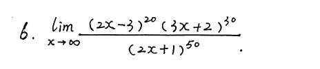
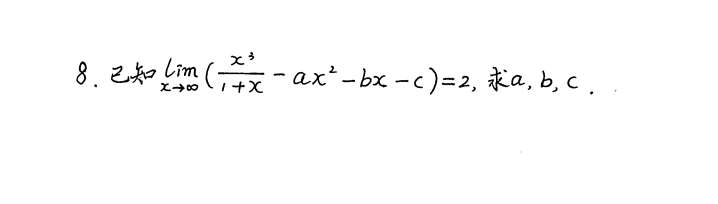
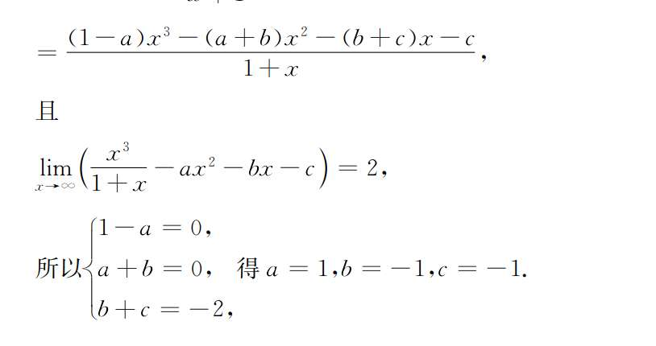
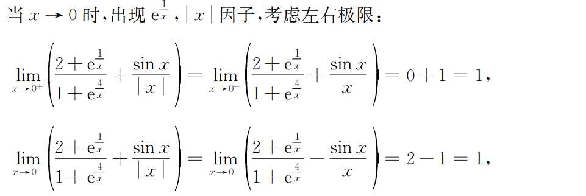

# 求极限基础

## 1
我是化为

此步后，右边是常数，左边呢，我没因式分解分母，分母有 x 方，分子是 x，我就直接说分母比分子阶数大，所以.... 哦，比阶数是趋于无穷时的事，现在是趋于 1，所以混用了吧。
- **当 $x \to \infty$ 时：** 我们才看多项式的最高次幂。比如 $\lim_{x \to \infty} \frac{x}{x^2+x-2}$，分母阶数高，极限确实为 0。
    
- **当 $x \to 1$ 时：** 这是一个具体的点。我们不能比阶数，而是要直接代入看看属于什么类型的极限。
    

图一中，直接代入 $x=1$ 会得到 $\frac{0}{0}$ 型极限。对于这种极限，核心思路是**寻找并约掉导致分子分母为零的“零因子”**（在这个题里，零因子就是 $(x-1)$）。
## 2

这里用到了一个非常重要的高阶代数因式分解公式：

$$x^k - 1 = (x-1)(x^{k-1} + x^{k-2} + \dots + x + 1)$$

_你可以把它当成平方差 $x^2-1=(x-1)(x+1)$ 和立方差 $x^3-1=(x-1)(x^2+x+1)$ 的通用推广版。_

根据这个公式，把分子和分母同时展开：

- 分子：$x^n-1 = (x-1)(x^{n-1} + x^{n-2} + \dots + 1)$
    
- 分母：$x^m-1 = (x-1)(x^{m-1} + x^{m-2} + \dots + 1)$

这道题用洛必达法则会变成“秒杀”题。因为是 $\frac{0}{0}$ 型，直接对分子分母分别求导： $\lim_{x \to 1} \frac{(x^n-1)'}{(x^m-1)'} = \lim_{x \to 1} \frac{n \cdot x^{n-1}}{m \cdot x^{m-1}}$ 代入 $x=1$，直接得到 $\frac{n \cdot 1}{m \cdot 1} = \frac{n}{m}$。

## 3
丢负号了。
x 是负的！去根号要注意

## 4

这个题也能直接抓大头吗 怎么理解？

## 5
做到通分那一步，想着无法化简了。
可是题目不需要化简！
极限等于 2！

e^x 分之一还是e^x 分之四都不影响吗