# 常见凑微分
lntanx，
xlnx

# 1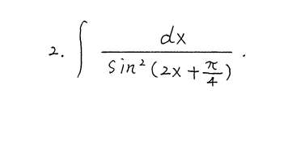

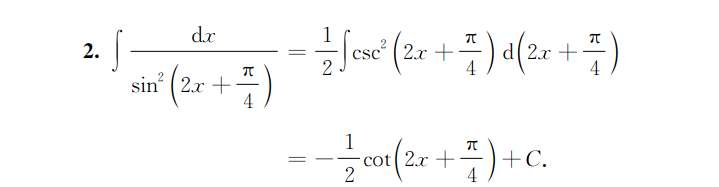

# 2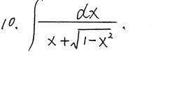
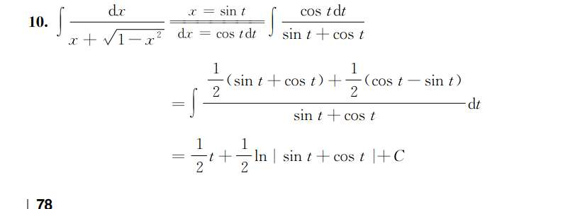

# 3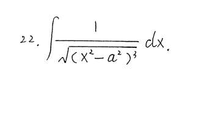
还有个计算细节，分母是 sec 三次方！我算成二分之五， 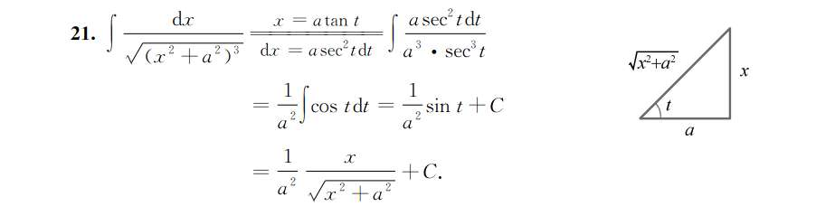

# 4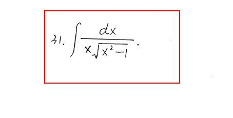
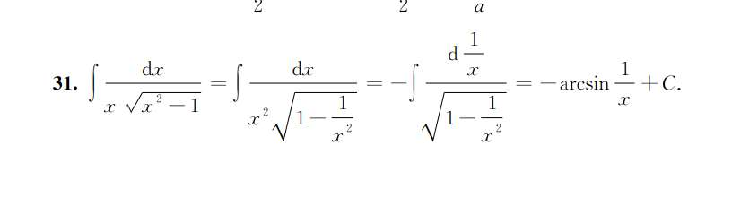

# 5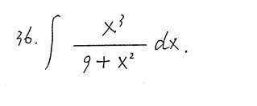

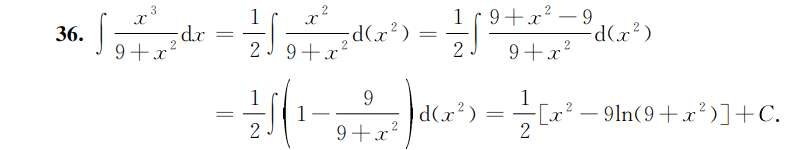

# 6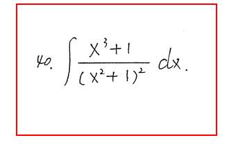

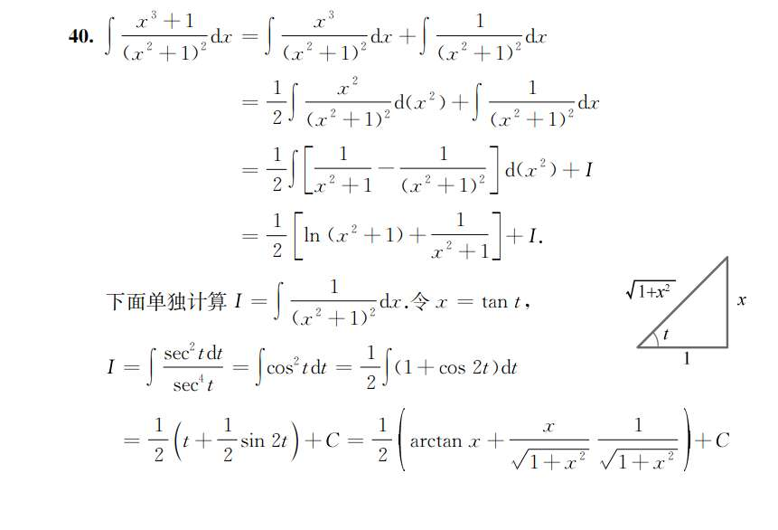
拆项，前半段和上题一样

# 7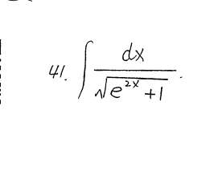

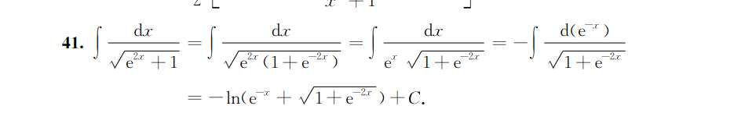

# 8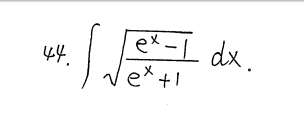
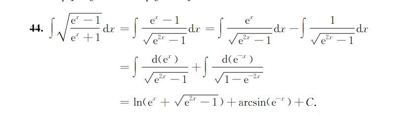

# 9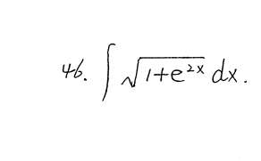、

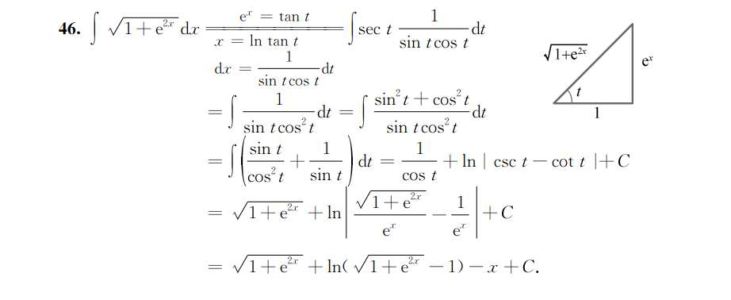

# 10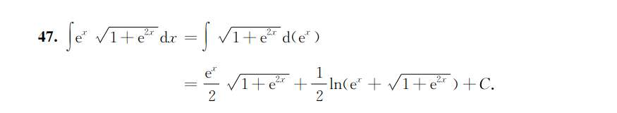
把 $e^x$ 看作一个整体（相当于令 $u = e^x$），然后使用三角代换 $u = \tan t$，这正是推导这道题标准答案的最正宗的方法。

你卡在 $\int \sec^3 t \, dt$ 是非常正常的，因为这是一个在微积分中非常经典的**“循环积分”**（需要用到分部积分法，并且会出现移项的操作）。这算是一块难啃的“硬骨头”。

我们一起来把这个积分算出来，看看它是怎么神奇地变回答案的。

### 第一步：攻克 $\int \sec^3 t \, dt$

计算这个积分需要使用**分部积分法** ($\int u \, dv = uv - \int v \, du$)。

我们将 $\sec^3 t$ 拆成 $\sec t \cdot \sec^2 t$。

令：

- $u = \sec t \implies du = \sec t \tan t \, dt$
    
- $dv = \sec^2 t \, dt \implies v = \tan t$
    

代入分部积分公式：

$$\int \sec^3 t \, dt = \sec t \tan t - \int \tan t \cdot (\sec t \tan t) \, dt$$

$$\int \sec^3 t \, dt = \sec t \tan t - \int \sec t \tan^2 t \, dt$$

接下来，利用三角恒等式 $\tan^2 t = \sec^2 t - 1$ 把后面的 $\tan^2 t$ 换掉：

$$\int \sec^3 t \, dt = \sec t \tan t - \int \sec t (\sec^2 t - 1) \, dt$$

$$\int \sec^3 t \, dt = \sec t \tan t - \int (\sec^3 t - \sec t) \, dt$$

$$\int \sec^3 t \, dt = \sec t \tan t - \int \sec^3 t \, dt + \int \sec t \, dt$$

**精彩的地方来了：** 你会发现等式右边又出现了我们要算的目标 $\int \sec^3 t \, dt$。我们把它移项到等式左边去：

$$2 \int \sec^3 t \, dt = \sec t \tan t + \int \sec t \, dt$$

现在只需要计算最基础的 $\int \sec t \, dt$（这是一个基本积分公式，结果是 $\ln|\sec t + \tan t|$）：

$$2 \int \sec^3 t \, dt = \sec t \tan t + \ln|\sec t + \tan t|$$

两边同除以 2，我们就得到了 $\sec^3 t$ 的积分结果：

$$\int \sec^3 t \, dt = \frac{1}{2} \sec t \tan t + \frac{1}{2} \ln|\sec t + \tan t| + C$$

---

### 第二步：将 $t$ 换回 $x$

你一开始的代换是：$\tan t = e^x$。

画一个直角三角形来辅助理解：

- 角 $t$ 的对边是 $e^x$
    
- 邻边是 $1$
    
- 斜边就是 $\sqrt{1 + (e^x)^2} = \sqrt{1 + e^{2x}}$
    

由此可以得出 $\sec t$ 的值（斜边 / 邻边）：

$$\sec t = \sqrt{1 + e^{2x}}$$

把 $\tan t = e^x$ 和 $\sec t = \sqrt{1 + e^{2x}}$ 代入我们刚才算出的结果中：

$$\frac{1}{2} \sec t \tan t + \frac{1}{2} \ln|\sec t + \tan t| + C$$

$$= \frac{1}{2} \sqrt{1 + e^{2x}} \cdot e^x + \frac{1}{2} \ln|\sqrt{1 + e^{2x}} + e^x| + C$$

因为指数函数 $e^x > 0$，且根号 $\sqrt{1 + e^{2x}} > 0$，所以绝对值符号可以直接去掉，写成小括号。

整理一下顺序，你的结果就是：

$$\frac{e^x}{2} \sqrt{1 + e^{2x}} + \frac{1}{2} \ln(e^x + \sqrt{1 + e^{2x}}) + C$$

这与参考答案**一字不差**！

# 11
### 关于 $\frac{1}{\ln \frac{2}{3}}$ 能不能写成 $\ln \frac{3}{2}$？

**答案是：不能。** 这是一个非常容易踩坑的代数直觉错误。

你可能混淆了**“对数的倒数”**和**“倒数的对数”**。我们来推导一下：

根据对数的性质，我们知道 $\ln(x^{-1}) = -\ln x$。

所以，$\ln \frac{2}{3} = \ln\left( (\frac{3}{2})^{-1} \right) = -\ln \frac{3}{2}$。

如果你把这个结果代入原式：

$$\frac{1}{\ln \frac{2}{3}} = \frac{1}{-\ln \frac{3}{2}} = -\frac{1}{\ln \frac{3}{2}}$$

**结论：** $\frac{1}{\ln \frac{2}{3}}$ 并不等于 $\ln \frac{3}{2}$，而是等于 **$-\frac{1}{\ln \frac{3}{2}}$**。
# 12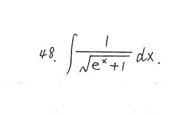
做不出来硬换

# 13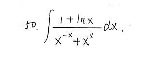
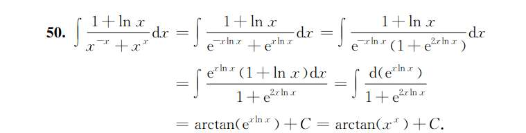

#### 总结一：看到 $x^x$（底数和指数都有变量），无脑转 $e$ 底！

微积分里，不管是求导还是积分，$x^x$ 这种形式是没法直接用公式的。

**铁律：只要出现 $u(x)^{v(x)}$，第一反应永远是把它写成 $e^{v(x) \ln u(x)}$。**

- 对应本题：$x^x$ 必须立刻变形为 $e^{x \ln x}$；同理，$x^{-x}$ 变形为 $e^{-x \ln x}$。这道题一旦完成了这一步，就已经解开了一半。
    

#### 总结二：死记硬背 $(x \ln x)' = 1 + \ln x$ 这个黄金导数对

考研数学非常喜欢考这个凑微分。

当你看到分子上出现 $1 + \ln x$ 时，你的雷达就应该响了：**它一定是从 $x \ln x$ 求导来的！**

- 对应本题：分子是 $1 + \ln x$，分母（经过变形后）指数上含有 $x \ln x$。这摆明了就是在告诉你，把 $x \ln x$（或者 $e^{x \ln x}$）看成一个整体去凑微分。
    

#### 总结三：处理 $A^{-u} + A^u$ 分母的经典手法：“上下同乘”

当分母出现 $e^{-x} + e^x$ 这种形式时，千万不要通分留一个长长的繁分数。

**标准动作：分子分母同时乘以 $e^x$。**

- 这样做的目的是消去负指数：$e^{-x} \cdot e^x = 1$，而 $e^x \cdot e^x = e^{2x} = (e^x)^2$。
    
- 得到的分母必然是 $1 + (\text{某式})^2$ 的结构，这就完美地铺垫了 **$\arctan$ 的积分公式** $\int \frac{1}{1+u^2} du = \arctan u$。
    
- 对应本题：分母是 $e^{-x \ln x} + e^{x \ln x}$，上下同乘 $e^{x \ln x}$ 后，分母瞬间变成了干净的 $1 + (e^{x \ln x})^2$。
    

**这道题的复盘脉络：**

这题是出题人“倒推”着构造出来的：

1. 出题人想考 $\int \frac{1}{1+u^2} du = \arctan u$。
    
2. 他把 $u$ 设定为 $e^{x \ln x}$，所以变成了 $\int \frac{d(e^{x \ln x})}{1 + (e^{x \ln x})^2}$。
    
3. 他把微分展开，分子就多出了一个导数 $(e^{x \ln x})' = e^{x \ln x} \cdot (1 + \ln x)$。
    
4. 他把分子和分母同时除以 $e^{x \ln x}$ 伪装起来，变成了最终卷子上的 $\frac{1 + \ln x}{x^{-x} + x^x}$。

# 14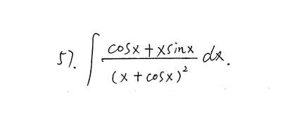

### 第一步：常规思路的碰壁（排雷）

看到分母有平方 $(x + \cos x)^2$，第一反应肯定是令 $u = x + \cos x$。

如果 $u = x + \cos x$，那么 $du = (1 - \sin x)dx$。

但你抬头一看分子，是 $\cos x + x \sin x$。两者长得毫无关系，直接换元宣告失败。

### 第二步：凝视分子，寻找“导数基因”（破局点）

既然整体换元不行，秘密一定藏在分子 $\cos x + x \sin x$ 上。

在微积分里，看到 **“函数相加/相减，且带有 $x$”**，你的 DNA 应该立刻动起来——这绝对是**乘法求导公式** $(uv)' = u'v + uv'$ 或 **除法求导公式** $(\frac{u}{v})' = \frac{u'v - uv'}{v^2}$ 展开后的结果！

我们在草稿纸上试一试：

- 试乘法 1：$(x \sin x)' = \sin x + x \cos x$ （不对，反了）
    
- 试乘法 2：$(x \cos x)' = \cos x - x \sin x$ （不对，差个符号）
    
- **试除法 1：** $\left(\frac{x}{\cos x}\right)' = \frac{1 \cdot \cos x - x \cdot (-\sin x)}{\cos^2 x} = \mathbf{\frac{\cos x + x \sin x}{\cos^2 x}}$
    

**破案了！！** 分子 $\cos x + x \sin x$ 距离成为一个完美的导数，**只差一个分母 $\cos^2 x$！**

### 第三步：强行“借”东风（凑微分）

现在我们的目标极其明确：**我需要一个 $\cos^2 x$ 作为分母，和原来的分子凑成一对。**

这个 $\cos^2 x$ 从哪里来？只能从原分母 $(x + \cos x)^2$ 里面“硬抠”出来。

怎么抠？强行提取 $\cos x$：

$x + \cos x = \cos x \left(\frac{x}{\cos x} + 1\right)$

因为外面有平方，所以：

$(x + \cos x)^2 = \left[\cos x \left(\frac{x}{\cos x} + 1\right)\right]^2 = \mathbf{\cos^2 x \left(\frac{x}{\cos x} + 1\right)^2}$

### 第四步：拼图完成

现在把抠出来的式子放回原积分：

$$\int \frac{\cos x + x \sin x}{\cos^2 x \left(\frac{x}{\cos x} + 1\right)^2} dx$$

把前面凑好的黄金组合打包：

$$\int \frac{1}{\left(\frac{x}{\cos x} + 1\right)^2} \cdot \left( \frac{\cos x + x \sin x}{\cos^2 x} \right) dx$$

因为 $\frac{x}{\cos x}$ 就是 $x \sec x$，所以后面的部分刚好就是 $d(x \sec x)$，或者说是 $d(x \sec x + 1)$。

于是积分变成了最简单的 $\int \frac{1}{u^2} du = -\frac{1}{u} + C$，这正是答案的最后一步。

### 帮你总结：你需要增加的“肌肉记忆”

这道题你只需要在错题本上记下两个**“捆绑销售”的导数对**。下次再看到它们，直接秒杀：

1. **看到 $\cos x + x \sin x$**
    
    👉 立刻想到它是 $\left(\frac{x}{\cos x}\right)'$ 的分子。
    
    👉 核心动作：强行给它配一个 $\cos^2 x$ 做分母。
    
2. **看到 $\sin x - x \cos x$** （这题的兄弟款）
    
    👉 立刻想到它是 $\left(\frac{x}{\sin x}\right)'$ 的分子（因为 $(\frac{x}{\sin x})' = \frac{\sin x - x \cos x}{\sin^2 x}$）。
    
    👉 核心动作：强行给它配一个 $\sin^2 x$ 做分母。
    

答案上那种直接写出“上下同除 $\cos^2 x$”的解法，是把思考过程隐藏起来后的“魔法”。我们做题时，是先看到了分子的需求，再去分母里强行提取的。这就是数学里的“以果推因”。

# 15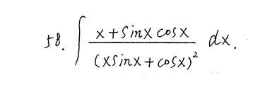

**观察题目：**

$$\int \frac{x + \sin x \cos x}{(x \sin x + \cos x)^2} \, dx$$

**第一步：无脑从分母括号里提 $\cos x$**

不管三七二十一，看到 $(x \sin x + \cos x)^2$，我们就把括号里面的 $\cos x$ 揪出来：

$$x \sin x + \cos x = \cos x \cdot \left(x \frac{\sin x}{\cos x} + 1\right) = \cos x \cdot (x \tan x + 1)$$

外边还有个平方，所以分母就变成了：

$$\mathbf{\cos^2 x \cdot (x \tan x + 1)^2}$$

**第二步：把式子重新组装，寻找导数**

现在，原积分变成了：

$$\int \frac{x + \sin x \cos x}{\cos^2 x \cdot (x \tan x + 1)^2} \, dx$$

我们把分母拆开，把 $\cos^2 x$ 拨给分子：

$$\int \frac{1}{(x \tan x + 1)^2} \cdot \mathbf{\left( \frac{x + \sin x \cos x}{\cos^2 x} \right)} \, dx$$

**第三步：见证奇迹的时刻（草稿纸验算）**

上一题我们记住了 $(\frac{x}{\cos x})'$。现在这题的分母括号里是 $x \tan x + 1$，我们来对它求个导看看：

$$(x \tan x + 1)' = (x)'\tan x + x(\tan x)' + 0$$

$$= \tan x + x \sec^2 x$$

$$= \frac{\sin x}{\cos x} + \frac{x}{\cos^2 x}$$

通分一下：

$$= \mathbf{\frac{\sin x \cos x + x}{\cos^2 x}}$$

我的天！这和我们刚才拨给分子的那一坨**一模一样**！

**第四步：收尾**

这说明后面那一整坨刚好就是 $d(x \tan x + 1)$。

$$\int \frac{1}{(x \tan x + 1)^2} \, d(x \tan x + 1)$$

套用 $\int \frac{1}{u^2}du = -\frac{1}{u} + C$，直接秒出答案：

$$-\frac{1}{x \tan x + 1} + C$$

_(注：如果你把答案化简回去，也可以写成 $-\frac{\cos x}{x \sin x + \cos x} + C$，两者等价)_

# 16
**观察题目：**

$$\int \frac{dx}{(a \sin x + b \cos x)^2}$$

这题分子什么都没有，看着更难凑对不对？错！这其实是最经典的“同除 $\cos^2 x$” 题型。我们继续用我们的绝招！

**第一步：继续从分母括号提 $\cos x$**

$$a \sin x + b \cos x = \cos x \cdot (a \tan x + b)$$

平方之后分母变成：

$$\cos^2 x \cdot (a \tan x + b)^2$$

**第二步：倒数变正割（Secant）**

把原积分写出来：

$$\int \frac{1}{\cos^2 x \cdot (a \tan x + b)^2} \, dx$$

看到 $\frac{1}{\cos^2 x}$ 是不是觉得很眼熟？把它翻到上面去，它就是 **$\sec^2 x$** 啊！

$$\int \frac{\sec^2 x}{(a \tan x + b)^2} \, dx$$

**第三步：完美凑微分**

众所周知，$(\tan x)' = \sec^2 x$。所以 $\sec^2 x \, dx$ 天生就是用来凑 $d(\tan x)$ 的！

$$\int \frac{1}{(a \tan x + b)^2} \, d(\tan x)$$

为了凑成完美的 $d(a \tan x + b)$，我们再给它补一个系数 $a$：

$$= \frac{1}{a} \int \frac{1}{(a \tan x + b)^2} \, d(a \tan x + b)$$

**第四步：收尾**

再次套用 $\int \frac{1}{u^2}du = -\frac{1}{u}$：

$$= -\frac{1}{a(a \tan x + b)} + C$$
**万能特征】**：只要不定积分的**分母**出现了 **“(带有 $\sin x$ 和 $\cos x$ 的一阶多项式)^2”** （比如 $(x+\cos x)^2$, $(x\sin x + \cos x)^2$, $(a\sin x + b\cos x)^2$）。

**【破题第一招】**：**不要犹豫，强行从括号里提取出一项 $\cos x$！**

**【底层逻辑】**：

1. 提取出来的 $\cos x$ 被平方后，会变成 $\frac{1}{\cos^2 x}$，它可以变成 $\sec^2 x$ 或者直接融入分子。
    
2. 留在括号里的 $\sin x$ 会变成 $\tan x$，而 $\tan x$ 求导必然会产生 $\frac{1}{\cos^2 x}$，这就形成了完美的“自产自销”闭环！

# 17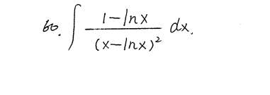
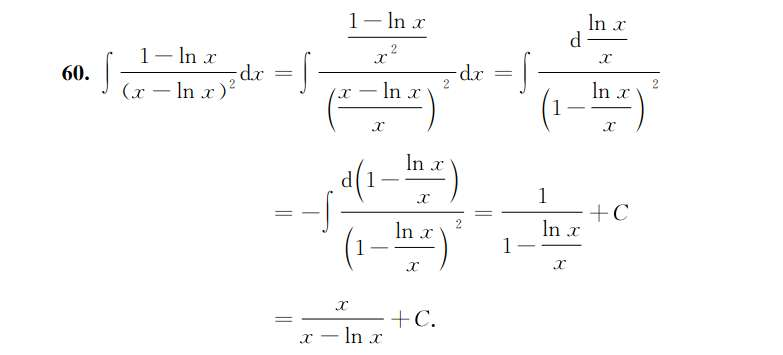

# 18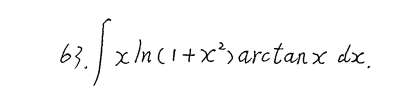

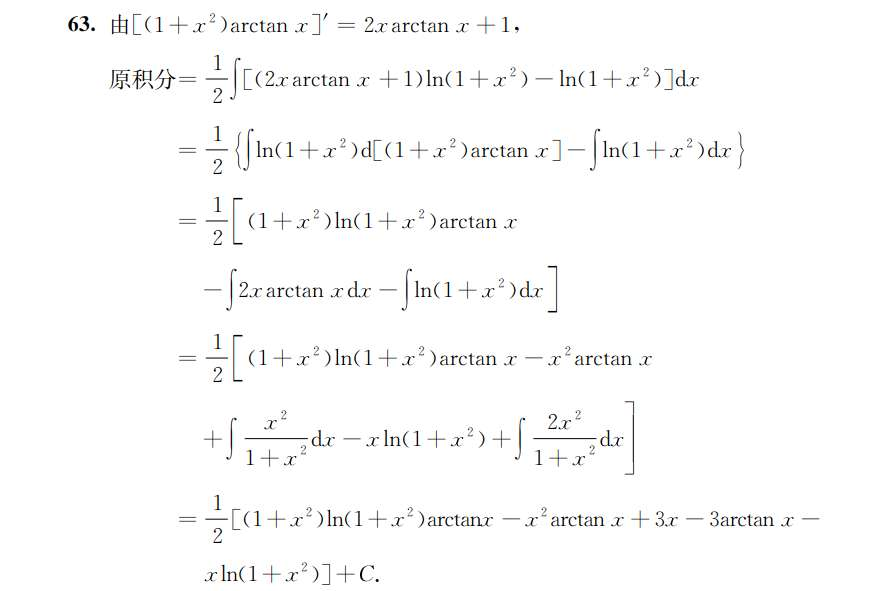

# 19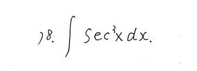‘经典循环积分’
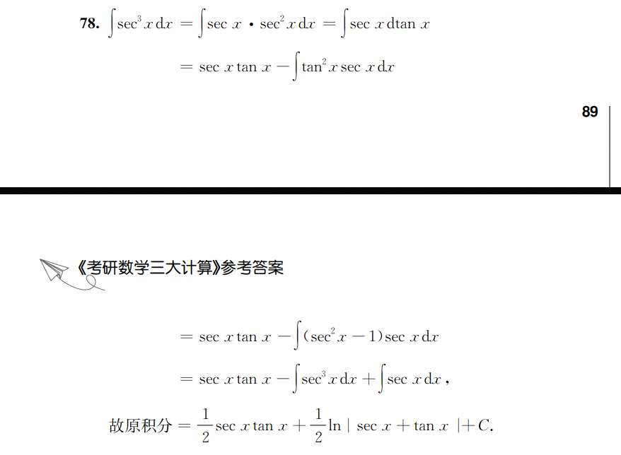

# 20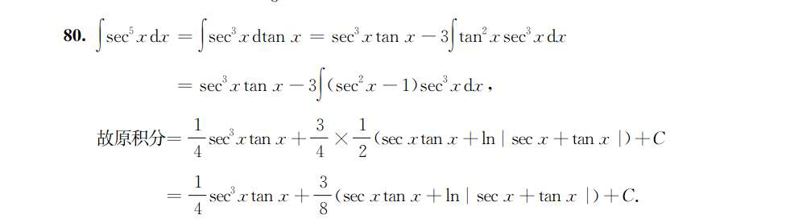

依旧，奇次方，循环移项

# 21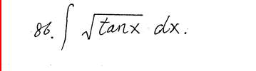
暴力换元
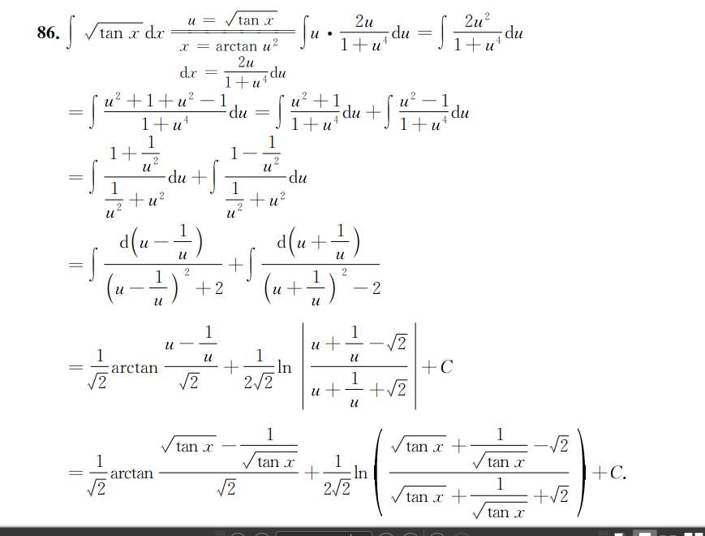

# 22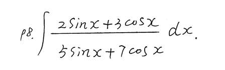
这道题属于一类非常经典的固定题型：

$$\int \frac{a\sin x + b\cos x}{c\sin x + d\cos x} dx$$

遇到分子分母都是“一次的正弦和余弦的线性组合”，**千万不要乘共轭，也不要用万能公式！**

标准且唯一的解法叫做：**把分子拆分成“分母的倍数”加上“分母导数的倍数”。**

**第一步：设定拆分结构（核心）**

设分子可以表示为：

**分子 = $A \times$ (分母) + $B \times$ (分母的导数)**

针对这道题，我们设：

$$2\sin x + 3\cos x = A \cdot (5\sin x + 7\cos x) + B \cdot (5\sin x + 7\cos x)'$$

求一下导，展开就是：

$$2\sin x + 3\cos x = A(5\sin x + 7\cos x) + B(5\cos x - 7\sin x)$$

**第二步：解待定系数 $A$ 和 $B$**

把等式右边按 $\sin x$ 和 $\cos x$ 合并同类项：

$$2\sin x + 3\cos x = (5A - 7B)\sin x + (7A + 5B)\cos x$$

对应系数相等，得到一个二元一次方程组：

1. $\sin x$ 的系数：$5A - 7B = 2$
    
2. $\cos x$ 的系数：$7A + 5B = 3$
    

解这个方程组（稍微有点计算量，但不难）：

- (1) $\times 5$ + (2) $\times 7$ $\implies 25A + 49A = 10 + 21 \implies 74A = 31 \implies \mathbf{A = \frac{31}{74}}$
    
- 把 $A$ 代入求 $B$ $\implies \mathbf{B = \frac{1}{74}}$
    

**第三步：见证奇迹的积分**

现在，把我们拆分好的分子代回原积分里，原积分会被完美切成两半：

$$\int \frac{A \cdot (\text{分母}) + B \cdot (\text{分母})'}{\text{分母}} dx$$

$$= \int \left( A + B \frac{(\text{分母})'}{\text{分母}} \right) dx$$

你看！

前面一半约分后变成了常数 $A$，积分就是 $Ax$。

后面一半刚好是 $\int \frac{1}{u} du$ 的形式，积分就是 $B \ln|\text{分母}|$。

直接写出最终答案：

$$= Ax + B \ln|5\sin x + 7\cos x| + C$$

代入我们算出的 $A$ 和 $B$：

$$= \frac{31}{74}x + \frac{1}{74}\ln|5\sin x + 7\cos x| + C$$

# 23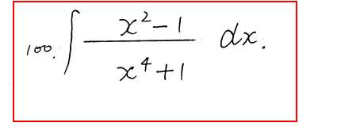

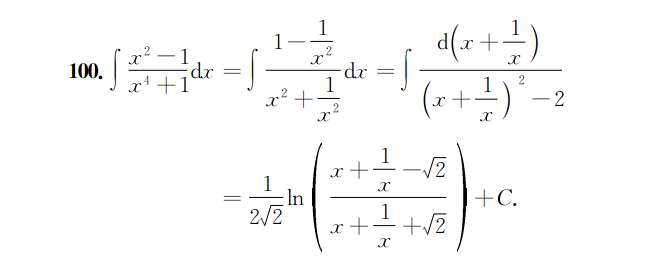】

# 24 
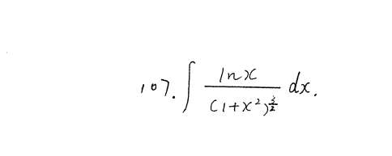

看到积分里有对数函数 $\ln x$ 和代数函数（带有 $x$ 的分式），什么都别想，**第一反应永远是：分部积分法（$\int u dv = uv - \int v du$）。**

根据“反对幂指三”的优先级排序，对数函数最难积分，所以我们把它当成 $u$ 去求导，剩下的部分当成 $dv$ 去积分。

**第一步：设定 $u$ 和 $dv$**

- 令 $u = \ln x$，那么 $du = \frac{1}{x} dx$
    
- 令 $dv = \frac{1}{(1+x^2)^{\frac{3}{2}}} dx$
    

**第二步：在草稿纸上单独算 $v$（这是本题的第一个难点）**

我们需要求 $\int \frac{1}{(1+x^2)^{\frac{3}{2}}} dx$。看到 $1+x^2$，标准动作是**三角代换**。

令 $x = \tan t$，则 $dx = \sec^2 t dt$。

分母 $(1+x^2)^{\frac{3}{2}} = (1+\tan^2 t)^{\frac{3}{2}} = (\sec^2 t)^{\frac{3}{2}} = \sec^3 t$。

代入计算：

$$v = \int \frac{\sec^2 t}{\sec^3 t} dt = \int \frac{1}{\sec t} dt = \int \cos t dt = \sin t$$

现在要把 $\sin t$ 换回 $x$：既然 $\tan t = x$（对边为 $x$，邻边为 1，斜边为 $\sqrt{1+x^2}$），那么 $\sin t = \frac{x}{\sqrt{1+x^2}}$。

所以，**$v = \frac{x}{\sqrt{1+x^2}}$**。

**第三步：套用分部积分公式**

现在我们有 $u, du, v$ 了，直接套入 $uv - \int v du$：

$$\int \frac{\ln x}{(1+x^2)^{\frac{3}{2}}} dx = \ln x \cdot \frac{x}{\sqrt{1+x^2}} - \int \frac{x}{\sqrt{1+x^2}} \cdot \frac{1}{x} dx$$

**见证奇迹的时刻：** 后面那个积分里的 $x$ 和 $\frac{1}{x}$ **完美约掉了！**

式子变成了：

$$= \frac{x \ln x}{\sqrt{1+x^2}} - \int \frac{1}{\sqrt{1+x^2}} dx$$

**第四步：收尾**

后面剩下的 $\int \frac{1}{\sqrt{1+x^2}} dx$ 是一个非常经典的基本积分公式（常被称为“长对数公式”）。它的结果是 $\ln(x + \sqrt{1+x^2})$。

最终答案呼之欲出：

$$= \frac{x \ln x}{\sqrt{1+x^2}} - \ln(x + \sqrt{1+x^2}) + C$$

**总结 107 的套路：** 这题是个纸老虎，看着吓人，其实就是让你按部就班地走个流程。看到 $\ln x$，坚定地用分部积分去把它求导消灭掉，在这个过程中，顺手用一次三角代换把 $dv$ 积出来，后面的一切都会水到渠成。

# 25
$$\int \frac{dx}{\sqrt{x(4-x)}}$$

你没看出来怎么换元，是因为这道题还处于“伪装状态”。

遇到根号里面是二次多项式（包含 $x^2$ 和 $x$ 项）时，**第一反应永远是：配方！** 把它变成平方和或平方差的形式，才能套用三角换元或基本公式。

**第一步：对根号内进行配方**

把 $x(4-x)$ 展开：

$$4x - x^2$$

提取负号，凑完全平方：

$$-(x^2 - 4x) = -(x^2 - 4x + 4 - 4) = -(x - 2)^2 + 4 = 4 - (x - 2)^2$$

**第二步：重新观察积分**

现在原积分变成了：

$$\int \frac{dx}{\sqrt{4 - (x - 2)^2}}$$

这个形式是不是就非常眼熟了？它完美符合了反正弦函数的基础积分公式：

$$\int \frac{du}{\sqrt{a^2 - u^2}} = \arcsin\frac{u}{a} + C$$

**第三步：直接出结果**

这里 $a = 2$，$u = x - 2$（因为 $d(x-2) = dx$，所以可以直接套）：

$$\int \frac{d(x-2)}{\sqrt{2^2 - (x - 2)^2}} = \mathbf{\arcsin\left(\frac{x - 2}{2}\right) + C}$$

_(注：如果你不想记这个公式，到了 $\int \frac{dx}{\sqrt{4 - (x - 2)^2}}$ 这一步，你也可以令 $x - 2 = 2\sin t$ 进行经典的三角换元，算出来结果是一样的，只是多写两步。)_

**帮你总结 1997 题的“肌肉记忆”：**

只要看到根号下是类似 $ax^2 + bx + c$ 的多项式，不管三七二十一，**先配出 $(x+m)^2$ 的形式**。配完方之后，到底是该用 $\arcsin$、用 $\ln$（长对数公式），还是用 $\tan t / \sin t / \sec t$ 代换，就会瞬间一目了然！