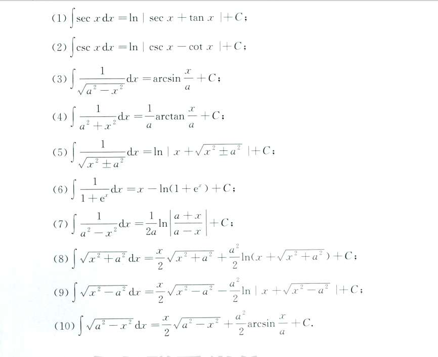
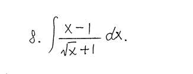
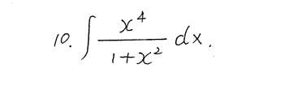
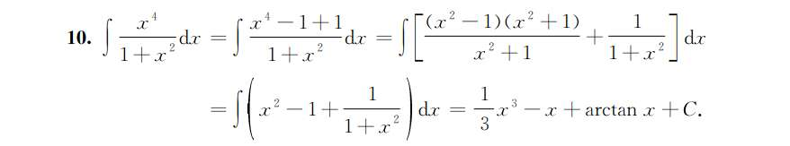
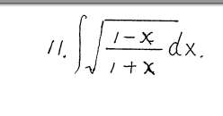
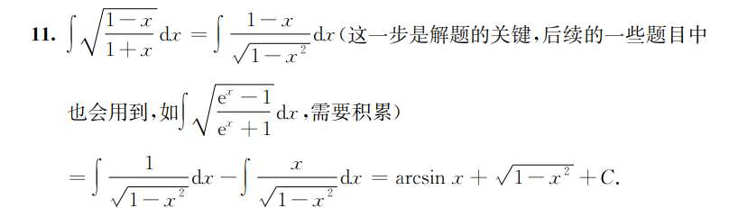
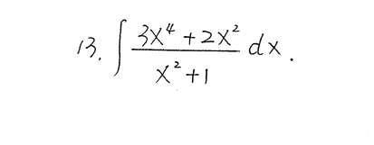
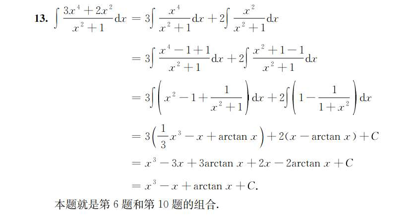

### 第一组：割线家族（公式 1, 2）

这两个公式长得非常像，是一对“兄弟”。

- (1) $\int \sec x \, dx = \ln |\sec x + \tan x| + C$
    
- (2) $\int \csc x \, dx = \ln |\csc x - \cot x| + C$
    

**记忆窍门：**

- **结构：** 都是 $\ln | \text{原函数} \pm \text{它的搭档} |$。$\sec$ 的搭档是 $\tan$，$\csc$ 的搭档是 $\cot$。
    
- **符号：** 正割 ($\sec$) 是“正”的，中间是 **$+$** 号；余割 ($\csc$) 带有“余”字（通常对应负面或微积分中的负号），中间是 **$-$** 号。
    

### 第二组：反三角函数家族（公式 3, 4）

这两个是基础倒数积分，必须和导数公式绑定记忆。

- (3) $\int \frac{1}{\sqrt{a^2 - x^2}} \, dx = \arcsin \frac{x}{a} + C$
    
- (4) $\int \frac{1}{a^2 + x^2} \, dx = \frac{1}{a} \arctan \frac{x}{a} + C$
    

**记忆窍门：**

- **如何区分有无根号：** $\arcsin$ 的导数有根号，所以 (3) 是 $\arcsin$；$\arctan$ 的导数没有根号，所以 (4) 是 $\arctan$。
    
- **为什么 (4) 前面有 $\frac{1}{a}$ 而 (3) 没有？** 你可以用“量纲分析”（单位）来骗过大脑：在 (4) 中，分母是二次方 ($a^2+x^2$)，积出来应该是一次方在分母，所以前面补一个 $\frac{1}{a}$；在 (3) 中，分母虽然里面是二次方，但是开了根号，相当于一次方，所以前面不需要再补 $\frac{1}{a}$。
    

### 第三组：对数家族与有理分式（公式 5, 7）

- (5) $\int \frac{1}{\sqrt{x^2 \pm a^2}} \, dx = \ln |x + \sqrt{x^2 \pm a^2}| + C$
    
- (7) $\int \frac{1}{a^2 - x^2} \, dx = \frac{1}{2a} \ln \left| \frac{a+x}{a-x} \right| + C$
    

**记忆窍门：**

- **公式 (5) 的超强口诀：** $\ln | x + \text{照抄原根式} |$。无论根号里面是加号还是减号，结果里面永远是 $x +$ 那个根号，原封不动抄下来即可。
    
- **公式 (7) 不需要背，用“裂项法”秒看出来：** $\frac{1}{a^2-x^2} = \frac{1}{(a-x)(a+x)}$。你知道它拆开后会产生 $\frac{1}{a-x}$ 和 $\frac{1}{a+x}$，它们积分出来就是 $\ln|a-x|$ 和 $\ln|a+x|$。因为求导后会产生内部的常数 $2a$，所以前面有个 $\frac{1}{2a}$。
    

### 第四组：终极 Boss——长根式家族（公式 8, 9, 10）

这三个是最难记的，但如果你仔细看，它们有一个**惊人的统一模板**！

- (8) $\int \sqrt{x^2 + a^2} \, dx$
    
- (9) $\int \sqrt{x^2 - a^2} \, dx$
    
- (10) $\int \sqrt{a^2 - x^2} \, dx$
    

**超级模板：** $\frac{x}{2} \cdot (\text{照抄原根式}) \quad \mathbf{\pm} \quad \frac{a^2}{2} \cdot (\text{把它放到分母时的积分结果})$

我们来验证一下这个模板：

1. **前半部分绝对一致：** 都是 $\frac{x}{2}$ 乘以它们自己。
    
2. **符号跟着 $a^2$ 走：**
    
    - (8) 中 $a^2$ 前面是正号，所以中间是 **$+$** $\frac{a^2}{2}$。
        
    - (9) 中 $a^2$ 前面是负号，所以中间是 **$-$** $\frac{a^2}{2}$。
        
    - (10) 中 $a^2$ 前面是正号（$x^2$ 是负的），所以中间是 **$+$** $\frac{a^2}{2}$。
        
3. **后半部分的神秘凑项：**
    
    - (8) 对应的分母形式是 $\frac{1}{\sqrt{x^2+a^2}}$，根据**公式 (5)**，积出来是 $\ln|x+\dots|$。
        
    - (9) 对应的分母形式是 $\frac{1}{\sqrt{x^2-a^2}}$，根据**公式 (5)**，积出来也是 $\ln|x+\dots|$。
        
    - (10) 对应的分母形式是 $\frac{1}{\sqrt{a^2-x^2}}$，根据**公式 (3)**，积出来是 $\arcsin \frac{x}{a}$！
        

你看，记住 (3) 和 (5)，再套用这个模板，最恶心的 (8)(9)(10) 就不攻自破了。

### 孤狼：代数小技巧（公式 6）

- (6) $\int \frac{1}{1+e^x} \, dx = x - \ln(1+e^x) + C$
    

**记忆窍门：** 别把它当积分公式背，把它当“加 1 减 1”的代数技巧背。

分子上的 $1 = (1+e^x) - e^x$。

所以原式 $= \int (1 - \frac{e^x}{1+e^x}) \, dx$。

前面的 $1$ 积分出 $x$，后面的分子正好是分母的导数，直接出 $\ln(1+e^x)$。

# 1
x-1 是可以因式分解的

# 2

通过+1-1，构造因式分解

# 3

去根号尽量去分子的，毕竟分母的可能构造 arcinx

# 4

还是不敏感啊，x^+1/x^4 是可积分的！

