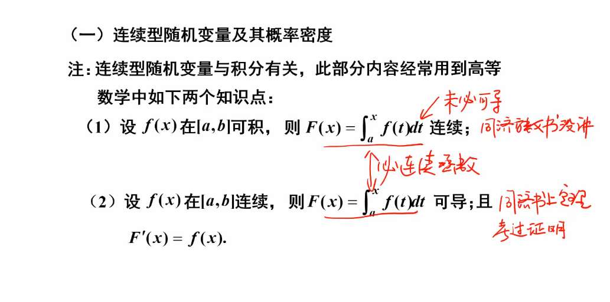

# 随机变量与分布函数

样本空间的样本点，不一定是数，大概只是个“事件“，””
我们用一个单值函数，把事件映射成数，
这个映射的结果，就叫“随机变量”

随机变量是数，它就有范围，
P{X<=x}，就叫随机变量的分布函数，
就是形容映射结果，在区间负无穷到 x 上的概率，

这个分布函数，一定右连续，
比如 F (1)，是说 P{X<=1}，
就因为这个等号，

1.  **单调不减**：
    若 $x_1 < x_2$，则 $F(x_1) \le F(x_2)$。
    （逻辑：范围变大了，概率不可能变小。）
2.  **有界性**：
    *   $F(-\infty) = \lim_{x \to -\infty} F(x) = 0$
    *   $F(+\infty) = \lim_{x \to +\infty} F(x) = 1$
3.  **右连续性**：
    $F(x^+) = F(x)$
4.  **计算区间的概率**：
    $P(a < X \le b) = F(b) - F(a)$ ⭐ **注意：左开右闭！**
- 故而求 $P (a < X < b)$ 化为 $P(a < X \le b) - P({x=b})$ ,但化简后也可以明白，是 F (b-0)-F (a)
---

离散型 vs 连续型的区别

*   **离散型**：$F(x)$ 是一截一截的**“阶梯状”**函数。每一个台阶的高度就是那个点的概率 $P(X=x_i)$。
*   **连续型**：$F(x)$ 是**“平滑”**的曲线。它没有跳跃，所以对于连续型随机变量，$F(x)$ 既是右连续，也是左连续。

# 常见离散型随机变量

## 1. 0-1 分布 (Bernoulli Distribution)
*   **场景**：只做一次实验，只有“成功”和“失败”两种结果。
*   **参数**：$p$ (成功的概率)。
*   **公式**：$P(X=k) = p^k (1-p)^{1-k}, \quad k \in \{0, 1\}$

---

## 2. 二项分布 (Binomial Distribution) —— $B(n, p)$
*   **场景**：做 $n$ 次独立的 0-1 实验，看“成功次数” $X$。
*   **公式**：$P(X=k) = C_n^k p^k (1-p)^{n-k}$
*   **直观理解**：
    *   $C_n^k$：从 $n$ 次里选 $k$ 次让它成功，有多少种组合。
    *   $p^k$：这 $k$ 次成功的概率。
    *   $(1-p)^{n-k}$：剩下 $n-k$ 次失败的概率。

---

## 3. 泊松分布 (Poisson Distribution) —— $P(\lambda)$

泊松分布的公式是：$P(X=k) = \frac{\lambda^k e^{-\lambda}}{k!}$

想象一个场景：你盯着一段公路，想数一数 1 小时内经过的车。
*   我们把 1 小时切成 $n$ 个非常小的时间片。
*   每个时间片里，车经过的概率是 $p$。
*   那么 1 小时经过 $k$ 辆车，就服从二项分布 $B(n, p)$。
*   如果我们把时间片切得**无限细**（$n \to \infty$），那么每个时间片车经过的概率就**无限小**（$p \to 0$）。

设定 $\lambda = np$（这是一个常数，代表平均发生次数）。那么 $p = \frac{\lambda}{n}$。

二项分布公式：
$$P(X=k) = \binom{n}{k} p^k (1-p)^{n-k}$$

**第一步：展开组合数和代入 $p = \frac{\lambda}{n}$**
$$P(X=k) = \frac{n(n-1)(n-2)\dots(n-k+1)}{k!} \cdot \left(\frac{\lambda}{n}\right)^k \cdot \left(1-\frac{\lambda}{n}\right)^{n-k}$$

求极限后是泊松分布公式

理解：

#### (1) $e^{-\lambda}$ ：底色（什么都不发生的概率）
当 $k=0$ 时，$P(X=0) = \frac{\lambda^0}{0!} e^{-\lambda} = e^{-\lambda}$。
*   这代表在一段时间内，一个车都没经过、一个错别字都没有的概率。
*   $\lambda$ 越大（平均发生率越高），$e^{-\lambda}$ 就越小（一件都不发生的概率越低），这非常符合直觉。

#### (2) $\lambda^k$ ：增长动力
*   如果你希望发生 $k$ 次，那么概率应该和“平均发生率 $\lambda$”的 $k$ 次方成正比。
*   比如平均一小时过 10 辆车，那么出现“一小时过 10 辆”的潜力肯定比“平均一小时过 1 辆”要大得多。

#### (3) $1/k!$ ：过热抑制（排列修正）
*   如果不除以 $k!$，随着 $k$ 的增加，$\lambda^k$ 会爆炸增长，概率之和就会超过 1。
*   $k!$ 在这里起到了平滑作用。它表示：虽然你想要发生多次，但**“连续发生很多次”的难度是指数级增加的**。
*   同时，在数学上，$k!$ 是为了和泰勒级数匹配，确保所有概率加起来等于 1。

所有可能情况的概率总和：
    $$\sum_{k=0}^{\infty} \frac{\lambda^k e^{-\lambda}}{k!} = e^{-\lambda} \underbrace{\sum_{k=0}^{\infty} \frac{\lambda^k}{k!}}_{e^\lambda \text{ 的泰勒展开}} = e^{-\lambda} \cdot e^\lambda = 1$$

泊松定理（二项分布的极限）指出：当 $n \to \infty, p \to 0$ 且 $np = \lambda$ 为常数时，二项分布趋近于泊松分布。

条件：**$n$ 较大，$p$ 较小，$np$ 适中**。为什么要强调这些？

### 1. 为什么 $n$ 要“较大”？
*   **数学逻辑**：泊松分布是二项分布在 $n \to \infty$ 时的极限。只有 $n$ 足够大，离散的“次数”才能表现出类似“连续流”中的发生频率。
*   **现实意义**：它代表了“大量的尝试机会”。比如一本书有几万个位置可能写错字。

### 2. 为什么 $p$ 要“较小”？
*   **本质原因**：泊松分布被称为**“稀有事件定律”**。
*   如果 $p$ 很大（比如 $p=0.5$），随着 $n$ 增大，结果会趋向于**正态分布**（钟形曲线），而不是泊松分布。
*   只有当 $p$ 极小时，发生 $k$ 次的情况才会迅速衰减，形成泊松分布那种独特的“长尾”形状。

### 3. 为什么 $np = \lambda$ 要“适中”？
*   **平衡点**：$\lambda$ 是期望值（平均发生次数）。
    *   如果 $\lambda$ **太小**（趋近 0）：意味着事件几乎不可能发生，研究它没有意义。
    *   如果 $\lambda$ **太大**（比如 $\lambda > 20$）：泊松分布的图像也会开始变得对称，此时用**正态分布**去近似会比泊松分布更准且更简单。
*   **计算优势**：在 $\lambda$ 适中（通常 $\lambda \le 10$）时，泊松公式 $\frac{\lambda^k e^{-\lambda}}{k!}$ 计算起来比带有巨大阶乘的组合数 $C_n^k$ 要快得多。

## 4. 几何分布 (Geometric Distribution) —— $G(p)$
*   **定义**：在伯努利试验中，试验直到**第一次成功为止**所需的试验次数 $X$。
*   **公式**：$P(X=k) = (1-p)^{k-1}p, \quad k = 1, 2, 3, \dots$
*   **直观理解**：前 $k-1$ 次都失败了，第 $k$ 次终于成功了。
*   **核心特性**：**无记忆性**（Memoryless Property）。即：如果你已经失败了 10 次，第 11 次成功的概率依然是 $p$，并不会因为之前的失败而获得“保底”。

## 5. 超几何分布 (Hypergeometric Distribution)
*   **定义**：从含有 $M$ 件次品、总数为 $N$ 件的箱子中，**不放回**地抽取 $n$ 件，其中抽到次品数 $X$ 的概率。
*   **公式**：$P(X=k) = \frac{C_M^k C_{N-M}^{n-k}}{C_N^n}$
*   **直观理解**：
    *   分母：从总数 $N$ 里随便取 $n$ 个的情况。
    *   分子：从 $M$ 个目标里取 $k$ 个，再从剩下的非目标里取够剩下的个数。
*   **与二项分布的区别**：
    *   **不放回抽样** $\rightarrow$ 超几何分布（每次抽取的概率在变）。
    *   **有放回抽样** $\rightarrow$ 二项分布（每次抽取的概率不变）。
    *   *注：当 $N$ 很大而 $n$ 很小时，超几何分布可以近似为二项分布。*

# 常见连续性随机变量

#### 1. 性质一：只要 $f(x)$ 可积，$F(x)$ 就一定连续
**直觉理解：**
想象 $f(x)$ 是水流的速度，$F(x)$ 是水桶里的总水量。即便水流速度突然变快或变慢（$f(x)$ 有跳跃间断点），水桶里的水也只能**一点一点地增加**，不可能瞬间凭空多出一大块。所以，总水量 $F(x)$ 的曲线一定是连贯的，不会瞬移（跳跃）。

**证明概要：**
要证 $F(x)$ 连续，只需证当 $\Delta x \to 0$ 时，增量 $\Delta F \to 0$。
$$\Delta F = F(x+\Delta x) - F(x) = \int_{x}^{x+\Delta x} f(t)dt$$
因为 $f(x)$ 在区间上可积，它一定是有界的（假设最大高度不超过 $M$）。
那么，这一小块面积 $|\Delta F| \le M \cdot |\Delta x|$。
当底边 $\Delta x \to 0$ 时，面积 $\Delta F$ 必然趋于 0。所以 $F(x)$ 连续。

---

#### 2. 性质二：若 $f(x)$ 连续，则 $F(x)$ 可导且 $F'(x) = f(x)$
**直觉理解：**
这是“变限积分求导”。$F(x)$ 的变化率（导数）就是那一瞬间增加的面积。增加的面积 = 底边 ($dx$) $\times$ 高度 ($f(x)$)。所以 $dF/dx = f(x)$。
只有当高度 $f(x)$ 连续时，这一瞬间的高度才是有定义的，导数才存在。

**证明概要：**
根据导数定义：
$$F'(x) = \lim_{\Delta x \to 0} \frac{F(x+\Delta x) - F(x)}{\Delta x} = \lim_{\Delta x \to 0} \frac{1}{\Delta x} \int_{x}^{x+\Delta x} f(t)dt$$
根据**积分中值定理**，在 $[x, x+\Delta x]$ 之间一定存在一点 $\xi$，使得这段面积等于 $f(\xi) \cdot \Delta x$。
原式 $= \lim_{\Delta x \to 0} \frac{f(\xi) \cdot \Delta x}{\Delta x} = \lim_{\Delta x \to 0} f(\xi)$
因为 $\xi$ 被夹在 $x$ 和 $x+\Delta x$ 之间，当 $\Delta x \to 0$ 时，$\xi \to x$。
又因为 **$f(x)$ 连续**，所以 $\lim f(\xi) = f(x)$。
证毕。

### 1. 核心定义
若随机变量 $X$ 的分布函数 $F(x)$ 可以表示为一个非负函数 $f(x)$ 的积分：
$$F(x) = P(X \le x) = \int_{-\infty}^{x} f(t)dt$$
则称 $X$ 为**连续型随机变量**，称 $f(x)$ 为 $X$ 的**概率密度函数 (PDF)**。

### 2. 概率密度函数 $f(x)$ 的性质 (判定准则)
1.  **非负性**：$f(x) \ge 0$ （概率密度不能是负的）。
2.  **规范性**：$\int_{-\infty}^{+\infty} f(x)dx = 1$ （总面积必须为 1）。
3.  **单点概率为 0**：对于任何确定的点 $a$，$P(X=a) = \int_{a}^{a} f(x)dx = 0$。
    *   *注：这意味着对于连续型，$P(X \le x) = P(X < x)$，边界点包含与否不影响概率。*

### 3. 分布函数 $F(x)$ 与密度函数 $f(x)$ 的关系
*   **积分为分布**：$F(x) = \int_{-\infty}^{x} f(t)dt$
*   **求导为密度**：在 $f(x)$ 的连续点处，$F'(x) = f(x)$。
*   **区间概率计算**：
    $$P(x_1 < X \le x_2) = F(x_2) - F(x_1) = \int_{x_1}^{x_2} f(x)dx$$

### 4. 关键结论 (易错点)
*   **连续性保证**：若 $X$ 是连续型，则其分布函数 $F(x)$ **一定在全直线连续**（即使 $f(x)$ 有断点）。
*   **数值含义**：
    *   $F(x)$ 是概率，取值 $[0, 1]$。
    *   $f(x)$ **不是概率**，它是概率的“密度”。$f(x)$ 的值可以大于 1（只要积分等于 1 即可）。
*   **几何意义**：$P(a < X < b)$ 就是 $f(x)$ 曲线在区间 $[a, b]$ 下方的**面积*

