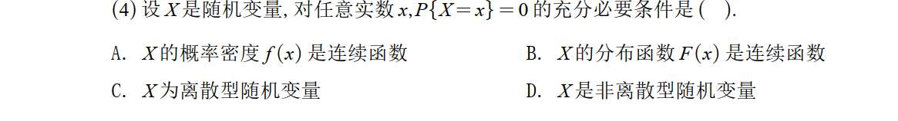

# 1 
这道题之所以**不选 A，是因为 A 选项只是充分条件，而不是必要条件。**

题目要求寻找的是“充分必要条件”**（即两者等价，能互相推导）。我们可以通过一个极其常见的**反例来击破 A 选项。

### 致命反例：均匀分布

假设随机变量 $X$ 服从区间 $[0, 1]$ 上的均匀分布。

1. **它满足题干条件吗？**
    
    满足。对于均匀分布来说，取到任何一个具体实数点（比如 $x = 0.5$）的概率都是 0。所以它完全符合题干说的：“对任意实数 $x, P\{X=x\}=0$”。
    
2. **它的概率密度函数 $f(x)$ 连续吗？**
    
    **不连续！**
    
    均匀分布的概率密度函数 $f(x)$ 长这样：
    
    - 在 $(0, 1)$ 区间内，$f(x) = 1$
        
    - 在区间外，$f(x) = 0$
        
        你会发现，**在 $x=0$ 和 $x=1$ 这两个点上，函数发生了断崖式的跳跃，它是断开的（不连续的）。**
        

**结论：** 我们找到了一个随机变量，它满足了题干条件 $P\{X=x\}=0$，但它的密度函数 $f(x)$ 却是不连续的。这说明**题干条件推不出 A**，因此 A 不是必要条件。

---

### 为什么 B 是对的？（完美的充要条件）

这要回到分布函数 $F(x)$ 与单点概率的关系。

在概率论中有一个基础公式：随机变量在某一点 $x$ 取得的概率，等于分布函数在该点的“跳跃高度”**。即：**$P\{X=x\} = F(x) - F(x^-)$ （其中 $F(x^-)$ 是函数在 $x$ 点的左极限）。

- **推导过程：**
    
    如果对任意实数 $x$，都有 $P\{X=x\} = 0$，那么就意味着 $F(x) - F(x^-) = 0$，即 $F(x) = F(x^-)$。
    
    也就是说，函数在该点的值等于左极限。再加上分布函数本身自带“右连续”的性质，就证明了 $F(x)$ 在这一点是连续的。
    
    既然对任意 $x$ 都成立，那么 **$F(x)$ 就是一个处处连续的函数**。
    

这两者是完美等价的：没有单点概率 $\iff$ 分布函数没有跳跃（连续）。所以选 B。

_(补充进阶知识：在更深的概率论中，甚至存在一类特殊的连续型随机变量（如奇异连续分布），它们满足所有点的概率为 0，但它们**根本就不存在**概率密度函数 $f(x)$。这就从根本上把 A 选项给否决了。)_