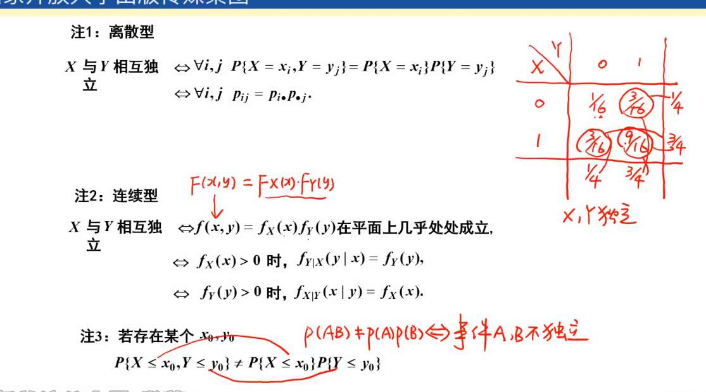
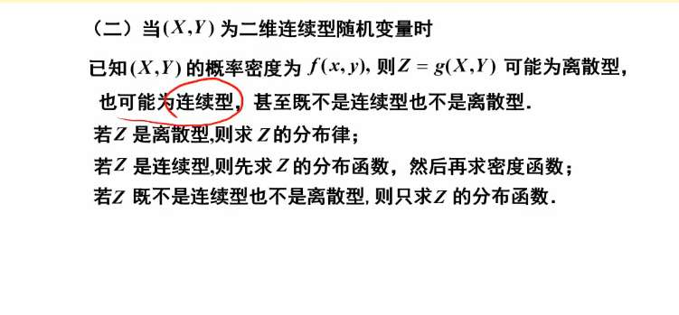
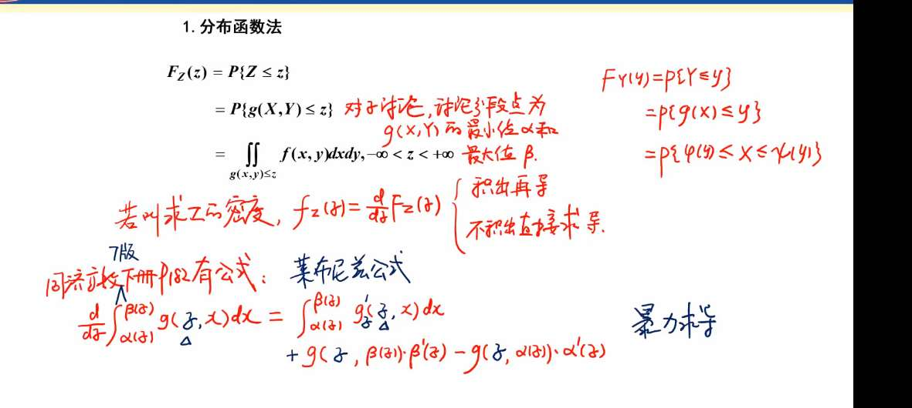

二维随机变量 $(X,Y)$ 中的 $X$ 和 $Y$ 不是毫无关联的两个实验，它们是基于同一个基本结果 $\omega$ 产生的两个不同属性。

- **样本空间与样本点 $\omega$：** 想象我们的随机试验是“在大街上随机抓取一个人”。这个人本身是一个具体的物理存在（样本点 $\omega$），他不是一个数字。
    
- **一维随机变量 $X(\omega)$：** 你决定只测量这个人的**身高**。这个人（$\omega$）被映射成了一个数字（比如 175）。在图中，这就对应左侧的那根一维数轴，结果落在这根线上。
    
- **二维随机变量 $(X, Y)$：** 你决定对**同一个人**，**同时**测量他的身高（$X$）和体重（$Y$）。现在，映射的结果不再是单一的数字，而是一个坐标对 $(175, 70)$。在图中，这就对应右侧那个红色的二维平面坐标系，映射结果落在这个平面上的一个点。

联合分布律很好理解 
# 二维随机变量联合分布函数

- **定义：**
    
    $$F(x, y) = P(X \le x, Y \le y)$$
    
- **四大核心性质：**
    
    1. **非负且有界：** $0 \le F(x,y) \le 1$
        
    2. **单调性：** 对 $x$ 或 $y$ 任何一个变量，都是单调不减的。也就是说，你的“左下矩形”越拉越大，框住的概率只增不减。
        
    3. **边界极限值（很重要）：**
        
        - 不可能事件（往左下角退到极限）：$F(-\infty, y) = F(x, -\infty) = F(-\infty, -\infty) = 0$
            
        - 必然事件（往右上角包揽整个平面）：$F(+\infty, +\infty) = 1$
            
        - **边缘分布**（退化回一维，相当于无穷大地放开一个维度）：
            
            - $F_X(x) = F(x, +\infty)$
                
            - $F_Y(y) = F(+\infty, y)$
                
    4. **有限矩形区域概率公式（容斥原理）：** 怎么算点落在任意矩形 $[x_1, x_2] \times [y_1, y_2]$ 内的概率？
        
        $$P(x_1 < X \le x_2, y_1 < Y \le y_2) = F(x_2, y_2) - F(x_1, y_2) - F(x_2, y_1) + F(x_1, y_1)$$
        

# 离散型二维随机变量

离散型最直观，通常用**表格**来表示。

- **联合分布律：**
    
    $$P(X = x_i, Y = y_j) = p_{ij} \quad (i,j = 1, 2, \dots)$$
    
- **性质：**
    
    1. $p_{ij} \ge 0$
        
    2. $\sum_{i} \sum_{j} p_{ij} = 1$ （所有格子的概率加起来是 1）
        
- **边缘分布律（把另一维“压扁”相加）：**
    
    - 关于 $X$ 的边缘分布（对 $Y$ 的所有可能求和，即**按列求和**）：$P(X = x_i) = \sum_{j} p_{ij} = p_{i\cdot}$
        
    - 关于 $Y$ 的边缘分布（对 $X$ 的所有可能求和，即**按行求和**）：$P(Y = y_j) = \sum_{i} p_{ij} = p_{\cdot j}$
        

熟悉的条件概率公式：

$$P(B|A) = \frac{P(AB)}{P(A)}$$

对应到右边的公式：

$$P(X=x_i | Y=y_j) = \frac{p_{ij}}{p_{\cdot j}}$$

- 分子 $p_{ij}$ 就是**联合分布**（既在技术部又是男生的概率）。
    
- 分母 $p_{\cdot j}$ 就是**边缘分布**（技术部总体的概率）。

一样的，条件概率就是缩小样本空间

# 连续型二维随机变量

连续型从“求和”变成了“积分”。想象一个二维平面上的沙丘，密度函数 $f(x,y)$ 就是沙丘在 $(x,y)$ 这一点的高度。

- **联合概率密度与分布函数的关系：**
    
    $$F(x,y) = \int_{-\infty}^{y} \int_{-\infty}^{x} f(u,v) \,du\,dv$$
    
    反过来，如果求导：
    
    $$f(x,y) = \frac{\partial^2 F(x,y)}{\partial x \partial y}$$
    
- **性质：**
    
    1. $f(x,y) \ge 0$
        
    2. $\int_{-\infty}^{+\infty} \int_{-\infty}^{+\infty} f(x,y) \,dx\,dy = 1$ （整个沙丘的总体积为 1）
        
    3. 落在任意区域 $D$ 的概率：
        
        $$P((X,Y) \in D) = \iint_D f(x,y) \,dx\,dy$$
        
        （即求底面为 $D$ 的曲顶柱体体积）
        
- **边缘概率密度（把另一维“积分掉”）：**
    
    你想求 $X$ 单独的密度，就要把 $y$ 所有的情况都叠加起来（积分积掉）。
    
    - $f_X(x) = \int_{-\infty}^{+\infty} f(x,y) \,dy$
        
    - $f_Y(y) = \int_{-\infty}^{+\infty} f(x,y) \,dx$
        

# 条件概率密度
**公式与性质：**

在 $Y=y$（且 $f_Y(y) > 0$）的条件下，$X$ 的条件概率密度公式完美印证了上面的直觉：

$$f_{X|Y}(x|y) = \frac{f(x,y)}{f_Y(y)}$$

_(是不是和离散型的 $P(B|A) = \frac{P(AB)}{P(A)}$ 简直一模一样？只是把概率换成了密度函数)_

**核心性质（记住一点：把它当成普通的一维密度函数看！）：**

一旦条件 $Y=y$ 给定了，$y$ 在这里就是一个**常数**（死数字）。此时 $f_{X|Y}(x|y)$ 就是一个纯粹关于 $x$ 的一维密度函数，享有普通一维密度的所有权利：

1. **非负性：** $f_{X|Y}(x|y) \ge 0$
    
2. **规范性（总面积为 1）：** $\int_{-\infty}^{+\infty} f_{X|Y}(x|y) \,dx = 1$ （注意是对 $x$ 积分！）
    
3. **算概率：** 在 $Y=y$ 的条件下，$X$ 落在区间 $[a, b]$ 的概率：
    
    $$P(a \le X \le b \mid Y=y) = \int_{a}^{b} f_{X|Y}(x|y) \,dx$$
# 独立性

 

怎么判断这俩变量是不是互相独立的？（比如“身高”和“掷骰子的点数”独立，但“身高”和“体重”不独立）。

- **通用定义：** 联合分布等于边缘分布的乘积。
    
    $$F(x,y) = F_X(x) \cdot F_Y(y)$$
    
- **离散型判定：** 联合概率 = 边缘概率之积（对所有 $i, j$ 成立）
    
    $$p_{ij} = p_{i\cdot} \cdot p_{\cdot j}$$
    
- **连续型判定：** 联合密度 = 边缘密度之积（几乎处处成立）
    
    $$f(x,y) = f_X(x) \cdot f_Y(y)$$
    、

具体来说，总概率密度，是可分离变量，函数变量范围是正矩形

# Z=g (X, Y) 的分布

这一页 PPT 讲的是概率论中非常重要且具有挑战性的知识点：**多维随机变量函数的分布**。

简单来说，它的核心任务是：**已知两个随机变量 $X, Y$ 的联合分布，求它们经过某种运算（函数 $g$）后产生的新变量 $Z$ 的分布。**

为了让你理解得更透彻，我们分三个维度来拆解这个知识点。

---

### 1. 为什么会有这三种类型？（映射的本质）

虽然输入的 $X$ 和 $Y$ 都是连续的，但输出的 $Z = g(X, Y)$ 的类型取决于这个函数 $g$ 如何“压缩”或“转换”空间。

*   **$Z$ 是连续型（最常见）：**
    *   **特征**：函数 $g$ 能够平滑地把 $xy$ 平面上的面积映射到 $z$ 轴上的区间。
    *   **例子**：$Z = X + Y$ 或 $Z = \sqrt{X^2 + Y^2}$。随着 $x, y$ 的微小变化，$z$ 也会微小变化。
*   **$Z$ 是离散型：**
    *   **特征**：函数 $g$ 是一个“阶梯”函数或“分类”函数，它把 $xy$ 平面上的整块区域都映射到了几个孤立的点上。
    *   **例子**：$Z = \text{sgn}(X + Y)$。无论 $X+Y$ 是 1 还是 100，$Z$ 都只等于 1。这种情况下，$Z$ 只有有限个取值，变成了离散型。
*   **$Z$ 既非连续也非离散（混合型）：**
    *   **特征**：函数在某些地方是常数（产生概率跳变点），在某些地方是连续变化的。
    *   **例子**：$Z = \max(0, X+Y)$。当 $X+Y \le 0$ 时，$Z$ 始终等于 0（在这个点上凝聚了巨大的概率）；当 $X+Y > 0$ 时，$Z$ 随之连续变化。

---

### 2. 核心计算方法：分布函数法（万能法）

不管是哪种类型，最稳妥的起手式永远是**分布函数法**。

**步骤：**
1.  **写出定义**：$F_Z(z) = P\{Z \le z\} = P\{g(X, Y) \le z\}$。
2.  **确定积分区域**：在 $xy$ 平面上画出满足不等式 $g(x, y) \le z$ 的区域，记为 $D_z$。
3.  **进行二重积分**：
    $$F_Z(z) = \iint_{D_z} f(x, y) \, dx \, dy$$
4.  **分类处理**：
    *   如果你发现 $F_Z(z)$ 是连续的且除有限个点外可导，求导得到 $f_Z(z)$。
    *   如果你发现 $F_Z(z)$ 在某些点有跳跃，说明那些点是离散概率点。

---

### 3. 考试中的经典模型（颗粒度细化）

在实际解题中，你通常会遇到以下三类特定的连续型 $Z$：

#### **A. 和的分布：$Z = X + Y$**
*   **公式（卷积公式）**：
    若 $X, Y$ 独立，则 $f_Z(z) = \int_{-\infty}^{+\infty} f_X(x) f_Y(z-x) \, dx$。
    *注：这就是把 $y$ 替换成了 $z-x$。*

#### **B. 最大值与最小值的分布：$M = \max(X, Y)$ 或 $N = \min(X, Y)$**
*   **逻辑**：
    *   $\max(X, Y) \le z \iff X \le z$ **且** $Y \le z$（利于算分布函数）。
    *   $\min(X, Y) > z \iff X > z$ **且** $Y > z$（利于算 $1 - F(z)$）。

#### **C. 商的分布：$Z = Y/X$**
*   **方法**：通常不记公式，直接用二重积分去积那个三角形或扇形区域。

---

### 💡 Obsidian 笔记建议

> [!IMPORTANT] **$Z = g(X, Y)$ 处理准则**
> 1. **优先判别定义域**：看 $g(x, y) \le z$ 围成的区域是什么形状（直线边界、圆边界等）。
> 2. **类型判别**：
>    - 如果 $Z$ 是连续变化的 $\rightarrow$ 求导得密度。
>    - 如果 $Z$ 有固定取值 $\rightarrow$ 分别算这些取值的概率。
> 3. **计算技巧**：
>    - 如果 $X, Y$ **独立**，联合密度记得写成 $f_X(x)f_Y(y)$。
>    - 如果 $X, Y$ 服从 **均匀分布**，积分就简化成了：$\frac{\text{符合条件的面积}}{\text{总面积}}$。

**一句话总结这一页的精髓：**
不管 $g$ 是什么复杂的函数，你只要把 $z$ 看作一个“高度限制”，在 $xy$ 底面上寻找低于这个高度的“面积”即可。

## 分布函数法

这个红框里的公式是微积分中非常霸气的 **莱布尼茨积分准则 (Leibniz Integral Rule)** 的全形态版本。

它之所以被称为“暴力求导”，是因为它允许你**跳过复杂的积分运算，直接求出结果的导数**。在概率论求密度函数 $f_Z(z) = F_Z'(z)$ 时，这简直是神技。

### 1. 公式拆解：它到底在干什么？

公式原型：
$$\frac{d}{dz} \int_{\alpha(z)}^{\beta(z)} g(z, x) dx = \underbrace{\int_{\alpha(z)}^{\beta(z)} \frac{\partial}{\partial z} g(z, x) dx}_{\text{第一项：内部变化}} + \underbrace{g(z, \beta(z)) \cdot \beta'(z)}_{\text{第二项：上限贡献}} - \underbrace{g(z, \alpha(z)) \cdot \alpha'(z)}_{\text{第三项：下限贡献}}$$

**直观理解：**
想象你在算一块面积，这块面积的变化由两个因素决定：
1.  **高度在变**：函数 $g(z, x)$ 本身随着 $z$ 的变化在长高或变矮（对应第一项）。
2.  **地盘在变**：积分的左右边界 $\alpha(z)$ 和 $\beta(z)$ 随着 $z$ 的变化在扩张或收缩（对应第二、三项）。

---

### 2. 三项细节颗粒度拆解

*   **第一项（钻进内部求导）**：
    如果函数 $g$ 里面含有 $z$，那么当 $z$ 变大时，整条曲线都在动。我们要先把曲线每一处的“变动速度”积起来。
    *   *注意*：如果 $g(x)$ 里面不含 $z$（比如只是 $f(x)$），这一项就是 **0**。

*   **第二项（上限的扩张）**：
    当上限 $\beta(z)$ 往右移动时，面积增加了。增加的速度 = **此刻的高度** $g(z, \beta(z))$ $\times$ **上限移动的速度** $\beta'(z)$。

*   **第三项（下限的扩张）**：
    当下限 $\alpha(z)$ 往右移动时，左边的面积被“吃掉”了，所以是**减法**。减少的速度 = **此刻的高度** $g(z, \alpha(z))$ $\times$ **下限移动的速度** $\alpha'(z)$。

---

### 3. 带入图中具体的例子理解

图中手写部分在解 $Z = X + Y$ 的密度函数，其中 $X, Y$ 是单位正方形上的均匀分布。

我们要对 $F_Z(z) = \int_0^z \int_0^{z-x} 1 \, dy \, dx$ 求导。
令内层积分 $g(z, x) = \int_0^{z-x} 1 \, dy = z - x$。
现在求 $\frac{d}{dz} \int_{0}^{z} (z-x) dx$：

1.  **套公式第一项**：对内部的 $(z-x)$ 关于 $z$ 求导，得到 $1$。再积回去：$\int_0^z 1 dx = z$。
2.  **套公式第二项**：把上限 $z$ 塞进 $(z-x)$，得到 $(z-z) = 0$。再乘上限导数 $z' = 1$。结果是 $0$。
3.  **套公式第三项**：下限是 $0$，导数是 $0$。结果是 $0$。

**最终结果：$z$。** 
你看，如果不套公式，你要先积出 $z^2/2$，再求导得到 $z$。套了公式，可以直接看出结果。

---

### 4. 为什么概率论里要用这个？

在求 $Z = X + Y$ 的分布时，由于 $z$ 的取值不同（比如 $0 < z < 1$ 和 $1 \le z < 2$），**积分的边界线一直在变**。

*   **如果你暴力积分**：你需要分段写出 $F_Z(z)$ 的解析式，每一段都要做二重积分，最后再求导。非常容易算错。
*   **如果你用莱布尼茨公式**：
    你可以直接对 $F_Z(z)$ 的积分形式求导。尤其当里面的密度函数 $f(x, y)$ 非常复杂（比如带 $e$ 指数）积不出来时，这个公式能让你直接拿到密度函数的解析式。

---

### 💡 Obsidian 笔记：莱布尼茨求导咒语

> [!TIP] **积分求导三步走**
> 1. **钻进去**：把导数符号丢进积分号里，对里面的变量求导。
> 2. **塞上限**：把上限代入函数，顺手乘个上限导。
> 3. **剔下限**：把下限代入函数，顺手乘个下限导，前面加个减号。
> 
> **特殊情况：**
> 如果 $F(z) = \int_{a}^{z} f(x) dx$（即内部没 $z$，下限是常数），公式退化为最基本的微积分第一定理：$F'(z) = f(z)$。

**总结：** 
这个公式是处理**“变动边界下的变动函数积分”**的终极武器。图中红字“注：若不积出呢？”就是这个意思——**不积分，直接拿导数结果**。