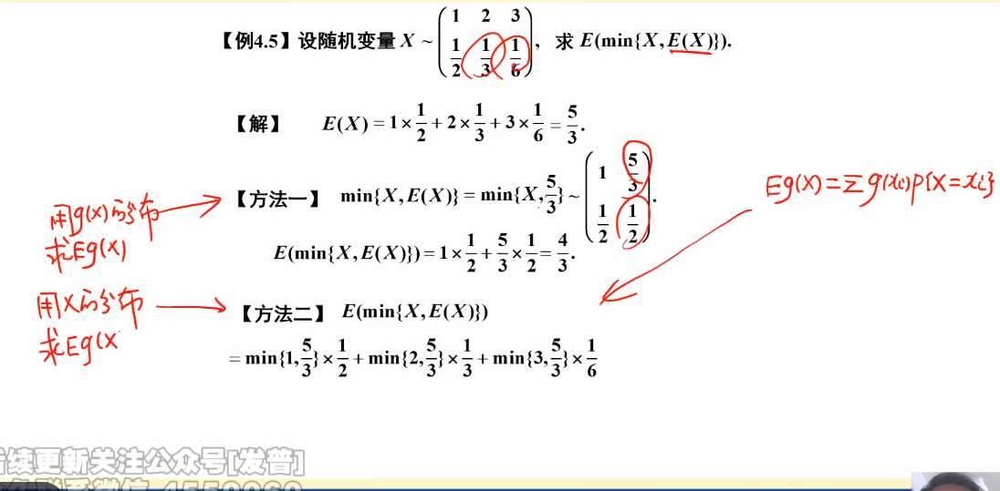
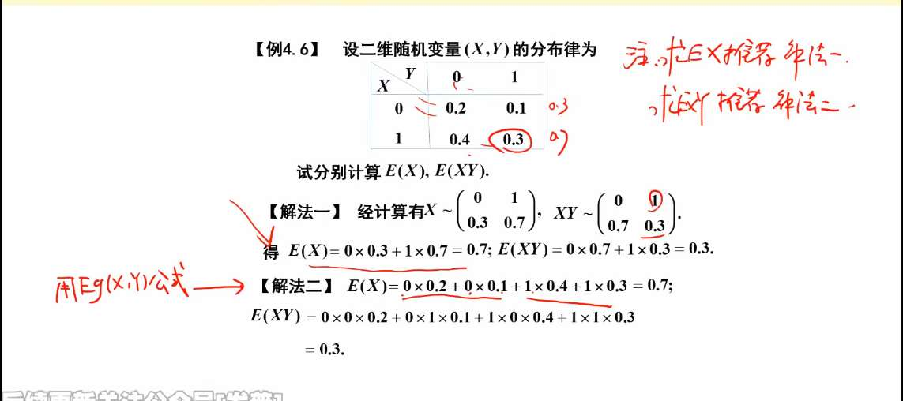
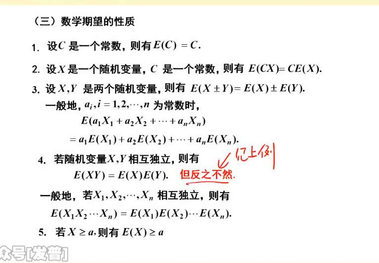

# 期望
离散型，
加权平均
$$E(X) = \sum_{i} x_i p_i$$

## 离散分布

### 1. 0-1 分布 (伯努利分布)

**背景**：只做一次实验，要么成功（记为 1，概率为 $p$），要么失败（记为 0，概率为 $1-p$，常记作 $q$）。

**期望结果**：$E(X) = p$

**【推导过程】（直接代入法）**

这是最简单的，直接套用定义：

$$E(X) = 0 \cdot P(X=0) + 1 \cdot P(X=1)$$

$$E(X) = 0 \cdot (1-p) + 1 \cdot p = p$$

---

### 2. 二项分布 $X \sim B(n, p)$

**背景**：把 0-1 实验独立重复做 $n$ 次，成功的总次数 $X$。

**期望结果**：$E(X) = np$

_(直觉思考：抛 100 次硬币，每次正面概率 0.5，平均当然会有 100 × 0.5 = 50 次正面)_

**【推导过程】（组合数拆解法）**

概率分布律为 $P(X=k) = C_n^k p^k q^{n-k}$，其中 $q = 1-p$。

$$E(X) = \sum_{k=0}^{n} k \cdot P(X=k) = \sum_{k=0}^{n} k \cdot C_n^k p^k q^{n-k}$$

注意，当 $k=0$ 时第一项是 0，所以求和下限可以从 $k=1$ 开始。接下来是核心技巧——**吸收等式**（把前面那个烦人的 $k$ 融进组合数里）：

因为 $k \cdot C_n^k = k \cdot \frac{n!}{k!(n-k)!} = \frac{n!}{(k-1)!(n-k)!} = n \cdot \frac{(n-1)!}{(k-1)!((n-1)-(k-1))!} = n C_{n-1}^{k-1}$。

代入回去：

$$E(X) = \sum_{k=1}^{n} n C_{n-1}^{k-1} p^k q^{n-k}$$

我们把常数 $np$ 提出来，并且让后面的指数也向 $k-1$ 靠拢：

$$E(X) = np \sum_{k=1}^{n} C_{n-1}^{k-1} p^{k-1} q^{(n-1)-(k-1)}$$

令 $j = k-1$，上式就变成了：

$$E(X) = np \sum_{j=0}^{n-1} C_{n-1}^j p^j q^{(n-1)-j}$$

根据二项式定理，后面那一长串求和其实就是 $(p+q)^{n-1}$。因为 $p+q=1$，所以：

$$E(X) = np \cdot 1^{n-1} = np$$

---

### 3. 泊松分布 $X \sim P(\lambda)$

**背景**：在一段固定时间内，某稀有事件发生的次数。

**期望结果**：$E(X) = \lambda$

_(直觉思考：$\lambda$ 本来就是该时间段内发生的平均率)_

**【推导过程】（泰勒展开逆向构造法）**

概率分布律为 $P(X=k) = \frac{\lambda^k e^{-\lambda}}{k!}$ ($k=0,1,2,\dots$)。

$$E(X) = \sum_{k=0}^{\infty} k \cdot \frac{\lambda^k e^{-\lambda}}{k!}$$

同样，$k=0$ 时值为 0，从 $k=1$ 开始算。我们把 $k$ 和分母的 $k!$ 约分：

$$\frac{k}{k!} = \frac{1}{(k-1)!}$$

所以式子变成：

$$E(X) = \sum_{k=1}^{\infty} \frac{\lambda^k e^{-\lambda}}{(k-1)!}$$

为了凑出泰勒级数，我们提取出一个 $\lambda e^{-\lambda}$：

$$E(X) = \lambda e^{-\lambda} \sum_{k=1}^{\infty} \frac{\lambda^{k-1}}{(k-1)!}$$

令 $j = k-1$，求和项变为：

$$\sum_{j=0}^{\infty} \frac{\lambda^j}{j!}$$

而在微积分里我们学过，$e^x$ 的麦克劳林展开式正是 $\sum \frac{x^n}{n!}$，所以上面这串等于 $e^\lambda$。

$$E(X) = \lambda e^{-\lambda} \cdot e^\lambda = \lambda$$

---

### 4. 几何分布 $X \sim G(p)$

**背景**：不断做独立的 0-1 实验，直到**第一次成功**为止，所需要的总实验次数 $X$。

**期望结果**：$E(X) = \frac{1}{p}$

_(直觉思考：如果中奖率是 1%，也就是 1/100，平均来说你需要抽 100 次才能中奖)_

**【推导过程】（幂级数求导法）**

前 $k-1$ 次都失败（概率 $q$），第 $k$ 次成功（概率 $p$），所以 $P(X=k) = q^{k-1}p$ ($k=1,2,\dots$)。

$$E(X) = \sum_{k=1}^{\infty} k \cdot q^{k-1} p = p \sum_{k=1}^{\infty} k q^{k-1}$$

怎么求 $\sum_{k=1}^{\infty} k q^{k-1}$ 呢？这里用到了一个绝妙的微积分技巧——把求和与求导交换顺序。

我们知道无穷等比数列求和：

$$\sum_{k=0}^{\infty} q^k = \frac{1}{1-q} \quad (|q|<1)$$

对等式两边关于 $q$ 求导（右边用商的求导法则或链式法则）：

左边求导：$\sum_{k=1}^{\infty} k q^{k-1}$

右边求导：$\frac{d}{dq}(1-q)^{-1} = -1(1-q)^{-2} \cdot (-1) = \frac{1}{(1-q)^2}$

由于 $1-q = p$，所以右边就等于 $\frac{1}{p^2}$。

把这个结论代回期望的式子里：

$$E(X) = p \cdot \frac{1}{p^2} = \frac{1}{p}$$

## 连续
连续型随机变量期望的通用定义式是：

$$E(X) = \int_{-\infty}^{+\infty} x \cdot f(x) dx$$

物理意义依然没变：把所有的 $x$ 用它的密度 $f(x)$ 作为“权重”加权平均。

以下是三大经典连续分布的推导，它们分别代表了三种微积分中最核心的解题技巧。

---

### 1. 均匀分布 $X \sim U(a, b)$

**背景**：在区间 $[a, b]$ 内，取到每一个点的概率密度都是一样的（常数）。

**期望结果**：$E(X) = \frac{a+b}{2}$

_(直觉思考：一根密度均匀的木棒，重心当然在正中间。)_

**【推导过程】（基础多项式积分法）**

概率密度为 $f(x) = \frac{1}{b-a}$ (当 $a \le x \le b$ 时，其他区间为 0)。

$$E(X) = \int_{a}^{b} x \cdot \frac{1}{b-a} dx$$

把常数提出来，对 $x$ 积分：

$$E(X) = \frac{1}{b-a} \left[ \frac{1}{2}x^2 \right]_{a}^{b}$$

代入上下限，并利用平方差公式 $b^2 - a^2 = (b-a)(b+a)$：

$$E(X) = \frac{1}{b-a} \cdot \frac{b^2 - a^2}{2} = \frac{1}{b-a} \cdot \frac{(b-a)(b+a)}{2} = \frac{a+b}{2}$$

---

### 2. 指数分布 $X \sim E(\lambda)$

**背景**：等待某个随机事件发生所需的时间（比如灯泡寿命、公交车到站）。

**期望结果**：$E(X) = \frac{1}{\lambda}$

_(直觉思考：如果每小时平均来 2 辆车（$\lambda=2$），那你平均需要等 $1/2$ 小时。)_

**【推导过程】（分部积分法，或者我们前面学过的伽马函数法）**

概率密度为 $f(x) = \lambda e^{-\lambda x}$ ($x > 0$)。

$$E(X) = \int_{0}^{+\infty} x \cdot \lambda e^{-\lambda x} dx$$

**思路 A：老老实实分部积分 $\int u dv = uv - \int v du$**

令 $u = x$，那么 $dv = \lambda e^{-\lambda x} dx$。

推导出 $du = dx$，$v = -e^{-\lambda x}$。

$$E(X) = \left[ -x e^{-\lambda x} \right]_{0}^{+\infty} - \int_{0}^{+\infty} -e^{-\lambda x} dx$$

第一部分代入 $+\infty$ 时，由于指数衰减速度远大于多项式增长（洛必达法则），结果为 0；代入 0 时显然也为 0。所以第一部分消失。

$$E(X) = 0 + \int_{0}^{+\infty} e^{-\lambda x} dx = \left[ -\frac{1}{\lambda} e^{-\lambda x} \right]_{0}^{+\infty} = 0 - \left(-\frac{1}{\lambda}\right) = \frac{1}{\lambda}$$

**思路 B：秒杀技巧（复习咱们上一条聊过的伽马函数特殊积分）**

我们知道 $\int_0^{+\infty} x^n e^{-ax} dx = \frac{n!}{a^{n+1}}$。

把 $\lambda$ 提出来：$E(X) = \lambda \int_{0}^{+\infty} x^1 e^{-\lambda x} dx$。

直接套公式（$n=1, a=\lambda$）：

$$E(X) = \lambda \cdot \frac{1!}{\lambda^2} = \frac{1}{\lambda}$$

---

### 3. 正态分布 $X \sim N(\mu, \sigma^2)$

**背景**：大自然中最常见的“钟形曲线”，中间高两头低。

**期望结果**：$E(X) = \mu$

_(直觉思考：曲线关于 $\mu$ 对称，重心肯定在对称轴 $\mu$ 上。)_

**【推导过程】（换元法 + 奇偶性对称法）**

概率密度为 $f(x) = \frac{1}{\sqrt{2\pi}\sigma} e^{-\frac{(x-\mu)^2}{2\sigma^2}}$。

$$E(X) = \int_{-\infty}^{+\infty} x \frac{1}{\sqrt{2\pi}\sigma} e^{-\frac{(x-\mu)^2}{2\sigma^2}} dx$$

直接积这块“生肉”太难咬了，我们必须**标准化换元**。

令 $z = \frac{x-\mu}{\sigma}$，那么 $x = \sigma z + \mu$，$dx = \sigma dz$。代入原式：

$$E(X) = \int_{-\infty}^{+\infty} (\sigma z + \mu) \frac{1}{\sqrt{2\pi}\sigma} e^{-\frac{z^2}{2}} (\sigma dz)$$

化简并拆分成两个积分：

$$E(X) = \sigma \int_{-\infty}^{+\infty} z \frac{1}{\sqrt{2\pi}} e^{-\frac{z^2}{2}} dz + \mu \int_{-\infty}^{+\infty} \frac{1}{\sqrt{2\pi}} e^{-\frac{z^2}{2}} dz$$

见证奇迹的时刻到了：

1. **看前一个积分**：被积函数中 $z$ 是奇函数，$e^{-z^2/2}$ 是偶函数，奇偶相乘等于**奇函数**。在 $(-\infty, +\infty)$ 这种对称区间上，奇函数的积分绝对是 **0**！
    
2. **看后一个积分**：$\int_{-\infty}^{+\infty} \frac{1}{\sqrt{2\pi}} e^{-z^2/2} dz$ 刚好就是标准正态分布 $N(0,1)$ 的概率密度在整个实数轴上的积分，概率总和必定等于 **1**！
    

所以：

$$E(X) = \sigma \cdot 0 + \mu \cdot 1 = \mu$$
## 定理
回忆一下你整理的思维导图里有一个分支叫“求 $Z = g(X, Y)$ 的分布”。你当时也知道，要求一个复合函数（比如 $Y = X^2$ 或 $Z = XY$）的概率密度，过程极其痛苦（需要画图、求积分域、甚至用到雅可比行列式或卷积公式）。

那如果题目**只问你 $Y$ 或 $Z$ 的期望（平均值）**，没让你求分布呢？

- **笨办法（按定义）：** 先费九牛二虎之力求出 $Y$ 的概率密度 $f_Y(y)$，然后算 $\int y \cdot f_Y(y) dy$。（正如你图 1 下面红字写的：“一般不用，因为密度挺难求”）。
    
- **开挂办法（用这两个定理）：** 绕过求分布这一步，直接用 $X$ 原本的概率密度来算！
    

---

### 图 1：连续型单变量的“开挂”

- **原始公式：** $E(X) = \int_{-\infty}^{+\infty} x \cdot f(x) dx$
    
- **定理公式：** $E[g(X)] = \int_{-\infty}^{+\infty} \mathbf{g(x)} \cdot f(x) dx$
    

**它在讲什么？**

你要算 $g(X)$ 的期望，你只需要把原来积分里的 $x$ 替换成 $g(x)$，但是后面的**概率密度 $f(x)$ 保持原样，原封不动！** > **直觉举例：** 假设 $X$ 是你掷骰子的点数（虽然这是离散的，但道理一样），你每掷出 $x$ 点，奖金是 $x^2$ 元。算平均奖金时，你不需要去算“得 1 元、4 元、9 元的概率分别是多少”，你只需要算：$(1^2 \times 概率) + (2^2 \times 概率) + \dots$。概率还是原来掷骰子的概率。

---

### 图 2：离散型多变量的“开挂”

- **定理公式：** $E[g(X, Y)] = \sum\sum \mathbf{g(x_i, y_j)} \cdot p_{ij}$
    

**它在讲什么？**

当你有两个变量 $X$ 和 $Y$（比如图里右边那个九宫格表格），让你求 $Z = XY$ 的期望。

你不需要去把所有等于同一个值的 $XY$ 合并起来算新概率。你只需要**简单粗暴地遍历表格里的每一个格子**：

1. 提取这个格子的 $x$ 值和 $y$ 值，代入函数算出 $g(x,y)$（比如图里算 $E(XY)$ 就是算 $x \cdot y$）。
    
2. 把算出来的值，乘以这个格子里的概率 $p_{ij}$。
    
3. 把所有格子的结果加起来。
    

你看图 2 右边手写的例子 $E(XY)$，就是完美践行了这个定理：

- 左上角格子：$(0 \times 0) \times \frac{1}{8}$
    
- 中上格子：$(0 \times 1) \times \frac{1}{8}$
    
- ...
    
- 右下角格子：$(1 \times 1) \times \frac{5}{8}$
    
    最后全部加起来等于 $\frac{5}{8}$。**根本不需要去求 $Z=XY$ 的分布律表！**

如图，
两种方法

## 性质
 