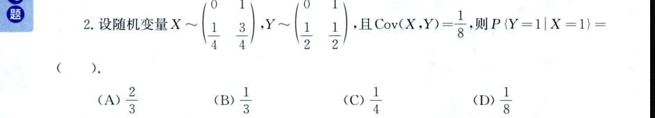
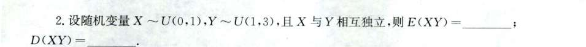
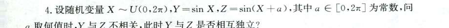

### 为什么不能直接相乘得 $\frac{3}{8}$？

你之所以想直接用 $P(X=1) \times P(Y=1)$，潜意识里是**假设了 $X$ 和 $Y$ 是相互独立的**。

如果它们独立，确实有 $P(X=1, Y=1) = P(X=1)P(Y=1)$，那么 $E(XY)$ 也会等于 $E(X)E(Y) = \frac{3}{8}$。

**但是，题目给了一个关键条件：$\text{Cov}(X,Y) = \frac{1}{8}$。**

我们刚刚梳理过：既然协方差不等于 0，说明 $X$ 和 $Y$ **不相关（进而也不独立）**。它们之间是有相互影响的，所以绝不能直接把边缘概率相乘来求联合概率或 $E(XY)$。

---

### 标准求解步骤

这道题的逻辑链条非常清晰，我们一步步来推：

#### 1. 先求 $E(X)$ 和 $E(Y)$

根据题目给出的边缘分布律，计算期望：

- $E(X) = 0 \times \frac{1}{4} + 1 \times \frac{3}{4} = \frac{3}{4}$
    
- $E(Y) = 0 \times \frac{1}{2} + 1 \times \frac{1}{2} = \frac{1}{2}$
    
- 所以，**$E(X)E(Y) = \frac{3}{4} \times \frac{1}{2} = \frac{3}{8}$**。（这就是你算出来的那个数字）
    

#### 2. 利用协方差公式反推真实的 $E(XY)$

还记得那个核心公式吗？ $\text{Cov}(X,Y) = E(XY) - E(X)E(Y)$

把已知条件代入：

$$\frac{1}{8} = E(XY) - \frac{3}{8}$$

$$E(XY) = \frac{1}{8} + \frac{3}{8} = \frac{4}{8} = \frac{1}{2}$$

看，真实的 $E(XY)$ 是 $\frac{1}{2}$，不是 $\frac{3}{8}$。

#### 3. 关键转化：$E(XY)$ 和联合概率的关系

因为 $X$ 和 $Y$ 都是只取 0 和 1 的离散型随机变量（这种变量有个专门的名字叫“伯努利变量”或“0-1 分布”），它们相乘 $XY$ 的结果只有当 $X=1$ 且 $Y=1$ 时才为 1，其余情况全为 0。

根据期望的定义展开：

$$E(XY) = \sum \sum xy P(X=x, Y=y)$$

$$E(XY) = (1 \times 1) \cdot P(X=1, Y=1) + 0 + 0 + 0$$

**即：$E(XY) = P(X=1, Y=1)$**

所以，我们得到了最关键的联合概率：$P(X=1, Y=1) = \frac{1}{2}$。

#### 4. 计算最终的条件概率

题目要求的是 $P(Y=1 | X=1)$，根据条件概率公式：

$$P(Y=1 | X=1) = \frac{P(X=1, Y=1)}{P(X=1)}$$

把我们求出的值代入：

$$P(Y=1 | X=1) = \frac{\frac{1}{2}}{\frac{3}{4}} = \frac{1}{2} \times \frac{4}{3} = \frac{2}{3}$$

# 2
根据已知条件 $X \sim U(0, 1)$：

- $E(X) = \frac{0 + 1}{2} = \frac{1}{2}$
    
- $D(X) = \frac{(1 - 0)^2}{12} = \frac{1}{12}$
    
- $E(X^2) = \frac{1}{12} + \left(\frac{1}{2}\right)^2 = \frac{1}{12} + \frac{1}{4} = \frac{1}{3}$
    

根据已知条件 $Y \sim U(1, 3)$：

- $E(Y) = \frac{1 + 3}{2} = 2$
    
- $D(Y) = \frac{(3 - 1)^2}{12} = \frac{4}{12} = \frac{1}{3}$
    
- $E(Y^2) = \frac{1}{3} + 2^2 = \frac{1}{3} + 4 = \frac{13}{3}$
    

### 第三步：求解 $E(XY)$

因为题目明确指出 $X$ 与 $Y$ **相互独立**，根据独立性的性质，乘积的期望等于期望的乘积：

$$E(XY) = E(X) \cdot E(Y)$$

代入数值：

$$E(XY) = \frac{1}{2} \cdot 2 = 1$$

### 第四步：求解 $D(XY)$

求两个变量乘积的方差，最稳妥的方法是使用方差的定义式展开：

$$D(XY) = E[(XY)^2] - [E(XY)]^2 = E(X^2Y^2) - [E(XY)]^2$$

同样利用独立性的关键推论：如果 $X$ 和 $Y$ 独立，那么它们的函数 $X^2$ 和 $Y^2$ 也是独立的。因此：

$$E(X^2Y^2) = E(X^2) \cdot E(Y^2)$$

代入我们在第二步算出的数值：

$$E(X^2Y^2) = \frac{1}{3} \cdot \frac{13}{3} = \frac{13}{9}$$

最后，代回总方差的公式：

$$D(XY) = \frac{13}{9} - 1^2 = \frac{13}{9} - \frac{9}{9} = \frac{4}{9}$$

# 3
我们要算 $Y$ 的平均表现 $E(Y)$，**根本不需要管 $Y$ 自己到底服从什么分布**。我们只需要去问幕后黑手 $X$：

> “把你的每一个可能取值 $x$，代入提线木偶的公式 $\sin(x)$ 里，然后乘以你 $X$ 出现这个值的概率密度 $f_X(x)$，把它们全加起来（积分）就行了！”

**数学公式表达就是：**

如果 $Y = g(X)$，那么：

$$E(Y) = \int_{-\infty}^{+\infty} g(x) f_X(x) dx$$

你看，整个积分式子里全是 $x$，完全避开了求 $Y$ 的分布！

---

### 二、怎么求期望？（步步为营）

这道题里，幕后黑手 $X \sim U(0, 2\pi)$，所以它的概率密度是：

- 当 $0 < x < 2\pi$ 时，**$f_X(x) = \frac{1}{2\pi}$**
    
- 其他地方等于 0。
    

我们用上面的心法，分别求我们需要的东西：

**1. 求 $E(Y)$ 和 $E(Z)$**

$$E(Y) = \int_0^{2\pi} \sin x \cdot \frac{1}{2\pi} dx = \frac{1}{2\pi} [-\cos x]_0^{2\pi} = 0$$

（直觉：正弦曲线在一个周期内的面积正负抵消，平均值显然是 0）

同理，$Z$ 虽然平移了 $a$，但积分区间是一个完整周期 $2\pi$，所以：

$$E(Z) = \int_0^{2\pi} \sin(x+a) \cdot \frac{1}{2\pi} dx = 0$$