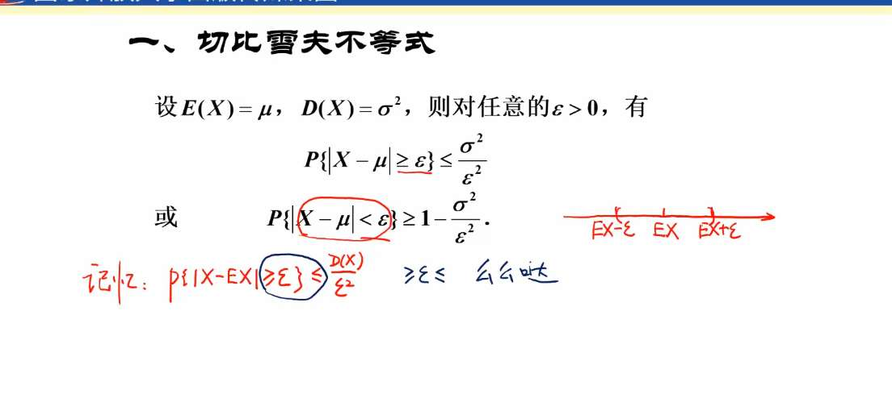
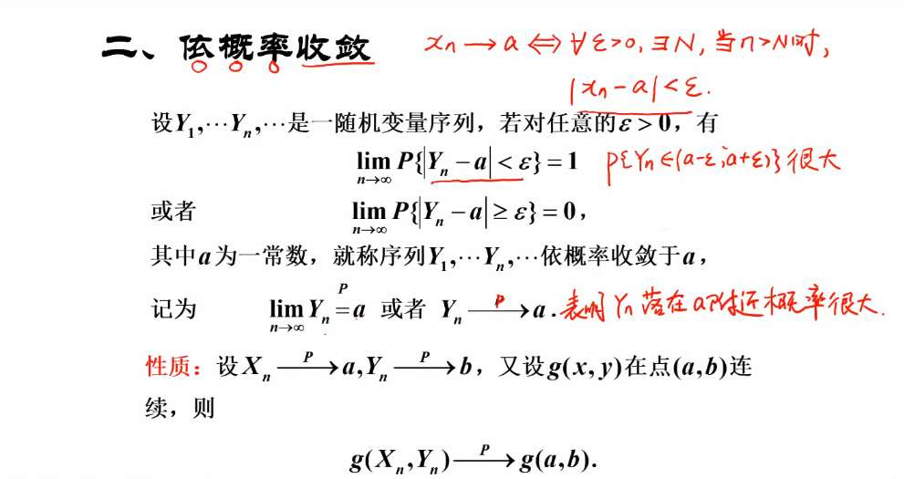
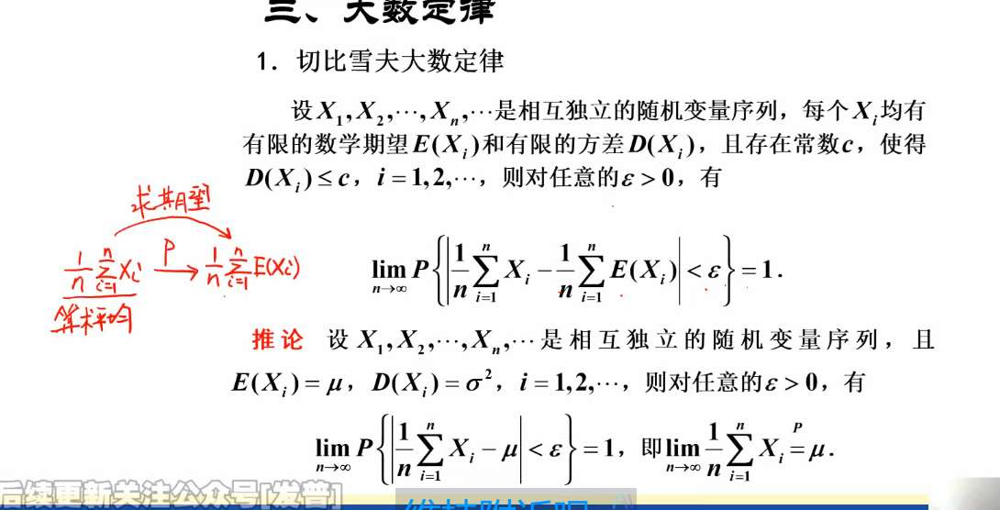
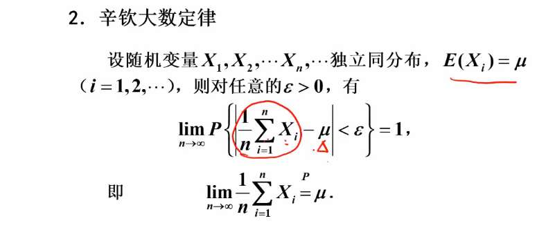
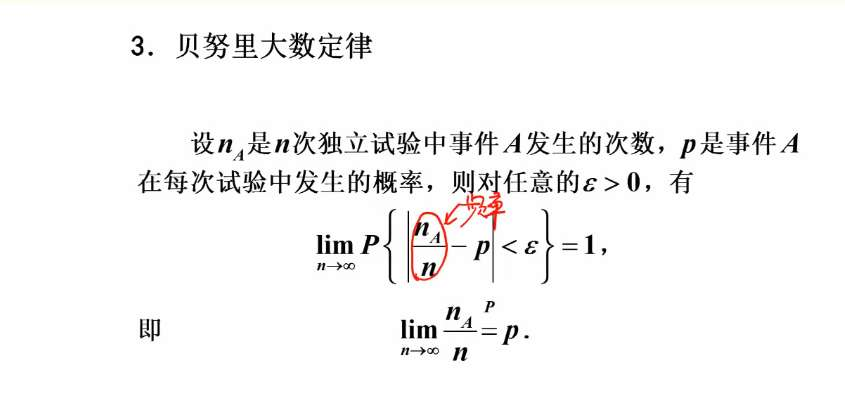

#### 1. 第一个公式（限制离谱程度）

$$P\{|X - \mu| \ge k\sigma\} \le \frac{1}{k^2}$$

- **字面意思**：随机变量 $X$ 偏离均值 $\mu$ 超过 $k$ 个标准差的概率，绝对不会超过 $\frac{1}{k^2}$。
    
- **现实意义**：**极端变态总是少数。** 假设你算出了 $k=3$，那么不管数据长什么鬼样子，偏离平均水平 3 个标准差以上的极端个体，最多最多只有 $\frac{1}{3^2} = 11.1\%$。它死死封住了极端事件发生概率的天花板。
    

#### 2. 第二个公式（框定普通人的范围）

$$P\{|X - \mu| < k\sigma\} \ge 1 - \frac{1}{k^2}$$

- **字面意思**：随机变量 $X$ 乖乖待在均值 $\mu$ 附近 $k$ 个标准差范围内的概率，至少有 $1 - \frac{1}{k^2}$。
    
- **现实意义**：**绝大多数人都是普通人。** 假设 $k=2$，代入公式算出下限是 $1 - \frac{1}{4} = 75\%$

公式（最精简的版本）：

$$\lim_{n \to \infty} P\left\{ \left| \frac{1}{n}\sum_{i=1}^n X_i - \mu \right| < \varepsilon \right\} = 1$$

- $\frac{1}{n}\sum X_i$：这是**现实中**算出来的**算术平均值**（比如随机抽 1000 个人的平均身高）。
    
- $\mu$：这是**理论上**的**数学期望**（比如全国人类身高的真正平均值）。
    
- $\varepsilon$：极其微小的误差范围（比如 0.001 厘米）。
    

**大白话翻译：**

不管每个个体（$X_i$）本身有多么随机、多么离谱，只要你抽取的样本数量 $n$ 足够大（$n \to \infty$），**现实中算出来的平均值，必定会无限逼近理论上的期望值。** 它们俩相差不到一丝一毫的概率，是 **100%（即极限为 1）**。

- **切比雪夫大数定律：**
    
    - **条件：** 相互独立 + **方差有界**（$D(X_i) \le c$）。它**不要求**同分布。
        
    - **潜台词：** “不管你们这群人是不是同一个模子刻出来的（异分布），只要你们中间没有那种波动极其离谱、方差上天的极端分子，你们的平均值就靠谱。”
        
- **辛钦大数定律（Khinchin）：**
    
    - **条件：** 独立**同分布** (i.i.d.) + 期望存在（$E(X) = \mu$）。它**根本不需要方差存在！**
        
    - **潜台词：** “只要你们都是同一个模子刻出来的（同分布），哪怕你们的波动极其变态（比如某些长尾分布，方差是无穷大），只要你们的平均期望还算得出来，大数定律就依然成立！”

红笔标注的 $P$ 箭头（依概率收敛），说的就是这件事：**当数据足够多时，偶然就变成了必然。**

