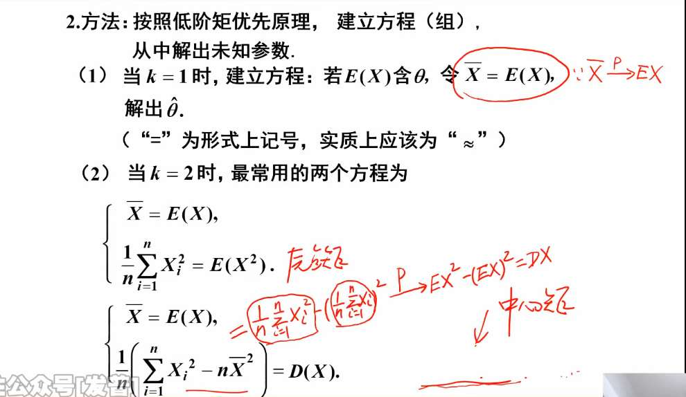
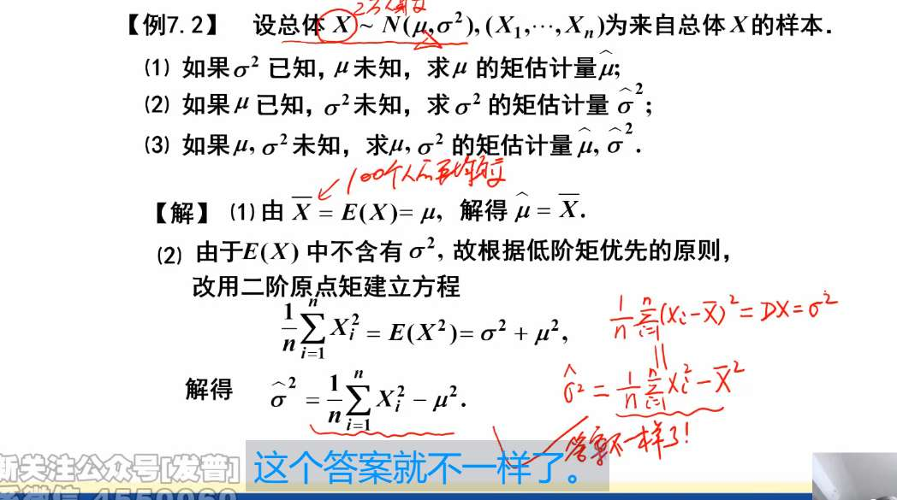
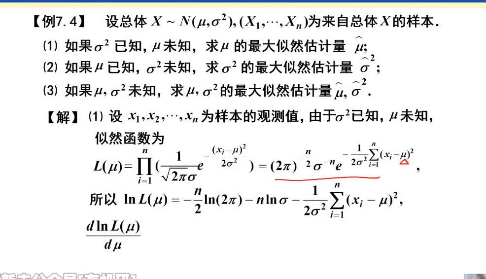
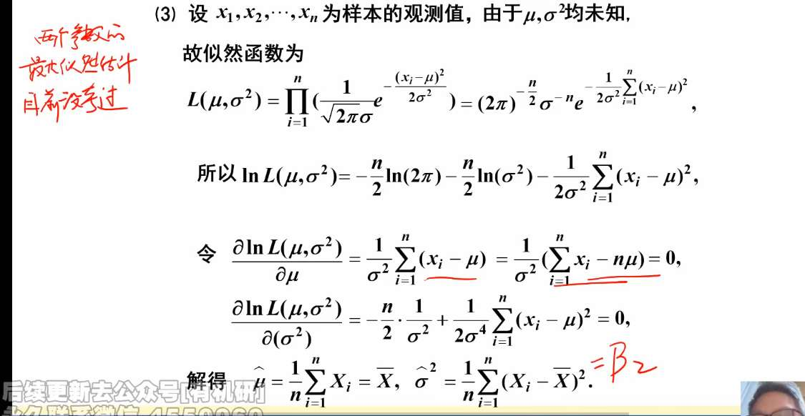

# 矩估计
为了寻找**未知参数**，我们发明了一个**估计量**（公式），然后代入我们抽到的实际数据，算出了一个**估计值**（具体数字），用这个具体数字去代替那个未知参数的过程，就叫**点估计**。

| **专业名词**          | **大白话解释**             | **性质**               | **符号特征**                   |
| ----------------- | --------------------- | -------------------- | -------------------------- |
| **未知参数 $\theta$** | 上帝知道的真实数字。            | 一个固定的、未知的常数。         | $\theta$                   |
| **点估计**           | 猜数字的整个游戏过程。           | 一个动作/一门学问。           | 无                          |
| **估计量**           | 你打算用来猜数字的**公式/策略**。   | 一个**随机变量**（会随着运气波动）。 | 带帽子的大写：$\hat{\theta}(X_i)$ |
| **估计值**           | 你代入实际数据后算出来的**最终结果**。 | 一个**具体的死数字**。        | 带帽子的小写：$\hat{\theta}(x_i)$ |

### 为什么要用 $X^k$ 的期望？

**一句话核心：为了凑够方程的数量去解方程组！**

你可以把“矩估计”完全等同于初中数学里的**“解多元方程组”**。

#### 场景 1：只有一个未知参数（只需一阶矩）

假设我们要估计全市程序员的工资分布，已知它服从**指数分布 $E(\lambda)$**。这里只有 $1$ 个未知参数 $\lambda$。

- **初中代数思维：** 求解 1 个未知数，需要 1 个方程。
    
- **统计学操作：** 我们只需要一阶矩（期望）。
    
    理论期望：$E(X) = \frac{1}{\lambda}$
    
    现实样本：我们去街上拉 100 个人算出平均工资 $\bar{X}$。
    
    **令理论 = 现实：** $\frac{1}{\lambda} = \bar{X}$，瞬间解出估计值 $\hat{\lambda} = \frac{1}{\bar{X}}$。搞定！
    

#### 场景 2：有两个未知参数（必须请出二阶矩 $X^2$）

现在难度升级。假设我们知道某个零件的长度服从**均匀分布 $U(a, b)$**。这里有 $2$ 个未知参数 $a$ 和 $b$（最小值和最大值）。

- **初中代数思维：** 求解 2 个未知数，必须要有 2 个独立的方程组！
    
- **统计学操作：** 如果你只用一阶矩 $E(X) = \frac{a+b}{2} = \bar{X}$。这就好比我告诉你 $a+b=10$，你能解出 $a$ 和 $b$ 分别是多少吗？可能是 4 和 6，也可能是 1 和 9。**条件不够！**
    
- **救星出场（二阶矩）：** 这时候我们就必须把 $X^2$ 的期望请出来了！
    
    我们构建第二个方程：理论二阶矩 $E(X^2) = \text{现实中算出的 } \frac{1}{n}\sum X_i^2$。
    
    配合第一个方程，我们就得到了一个包含 $a$ 和 $b$ 的二元一次方程组，这下就能完美解出具体的 $a$ 和 $b$ 了。
    

#### 结论：

- 有 **1 个**未知参数，就用到一阶矩 $E(X)$。
    
- 有 **2 个**未知参数，就接着用二阶矩 $E(X^2)$。
    
- 有 **k 个**未知参数，就一直用到 k 阶矩 $E(X^k)$。
    
    **这就是高阶矩在参数估计中存在的唯一世俗意义：给我们提供足够多的、独立的数学方程。**

除了凑方程，从几何图像上看，不同阶的矩其实是在描绘数据分布的不同“特征”（就跟捏泥人一样）：

1. **一阶矩 $E(X)$（期望）：** 决定了分布的**“位置”**（泥人的重心在哪）。
    
2. **二阶中心矩 $D(X)$（方差）：** 决定了分布的**“胖瘦”**（泥人是高瘦还是矮胖）。
    
3. **三阶矩（偏度）：** 决定了分布的**“左右倾斜”**（泥人有没有歪脖子）。
    
4. **四阶矩（峰度）：** 决定了分布**“尾巴的厚度”**（泥人的脚大不大）。

### 1. 为什么第一阶矩失效了？（黑色印刷体前半段）

通常矩估计第一步都是令 $E(X) = \bar{X}$。

但这道题说：**$\mu$ 是已知的**（假设就是常数 100）。

如果你写出理论期望 $E(X) = \mu$。你看这个式子，里面根本没有我们需要求的未知数 $\sigma^2$！这就好比你为了解出 $y$，列了一个方程 $100 = 100$，纯属废话。

所以书上说：根据低阶优先原则，一阶没用，只能**被迫升级去用二阶原点矩**建立方程。

### 2. 标准解法：黑色印刷体的推导

我们用二阶原点矩建立等式：

- **理论二阶矩：** $E(X^2)$。根据方差公式 $D(X) = E(X^2) - [E(X)]^2$，我们可以把它反向写成：$E(X^2) = \sigma^2 + \mu^2$。
    
- **现实样本矩：** 把所有样本平方后求平均，即 $\frac{1}{n}\sum_{i=1}^n X_i^2$。
    

让理论等于现实：

$$\sigma^2 + \mu^2 = \frac{1}{n}\sum_{i=1}^n X_i^2$$

把 $\sigma^2$ 留在一边，移项解出来：

$$\hat{\sigma}^2 = \frac{1}{n}\sum_{i=1}^n X_i^2 - \mu^2$$

**注意：因为 $\mu$ 是一个已知的死数字（比如 100），所以它理直气壮地保留在了最终答案里。**

---

### 3. 陷阱解法：红色手写体的推导（为什么不一样？）

红笔的思路是：既然求方差，那我不理原点矩了，我直接用**二阶中心矩**来列方程。

- **理论二阶中心矩：** $D(X) = \sigma^2$
    
- **现实二阶中心矩：** $\frac{1}{n}\sum_{i=1}^n (X_i - \bar{X})^2$ （展开后就是 $\frac{1}{n}\sum X_i^2 - \bar{X}^2$）
    

让理论等于现实，解出：

$$\hat{\sigma}^2 = \frac{1}{n}\sum_{i=1}^n X_i^2 - \bar{X}^2$$

### 4. 灵魂拷问：哪一个是对的？

**黑色印刷体是对的，红色手写体是“暴殄天物”的！**

为什么？

因为**方差的本质是衡量数据偏离“中心点”的程度**。

- **黑字做法：** 上帝已经告诉你真正的中心点是 $\mu$（比如 100）了，所以我计算偏差时，是拿着每一个数据去减 100，算出来的波动极其精确。
    
- **红字做法：** 你无视了上帝给你的真实数据 100，非要自己去算一个样本平均值 $\bar{X}$（比如算出来是 98），然后拿着每一个数据去减 98 算波动。
    

**结论：** 既然 $\mu$ 已知，$\bar{X}$ 就是个毫无价值的次品。用精确的 $\mu$ 去估计 $\sigma^2$（黑字），永远比用带有误差的 $\bar{X}$ 去估计（红字）要准得多！这就叫**“充分利用已知信息”**。

# 最大似然估计

### 第一步：写出似然函数 $L$（连乘）

因为 $n$ 个样本是独立抽取的，所以要把它们各自的概率密度函数乘起来。

正态分布的密度函数是：$f(x) = \frac{1}{\sqrt{2\pi}\sigma} e^{-\frac{(x-\mu)^2}{2\sigma^2}}$

把 $n$ 个这样的式子相乘：

$$L(\mu, \sigma^2) = \prod_{i=1}^n \left( \frac{1}{\sqrt{2\pi}\sigma} e^{-\frac{(x_i-\mu)^2}{2\sigma^2}} \right)$$

这里用到了初中底数相乘的法则：

1. 常数项 $\frac{1}{\sqrt{2\pi}}$ 乘了 $n$ 次，变成了 $(2\pi)^{-\frac{n}{2}}$。
    
2. $\frac{1}{\sigma}$ 乘了 $n$ 次，变成了 $\sigma^{-n}$。
    
3. **关键点：** 指数函数相乘，等于**指数相加**（$e^A \cdot e^B = e^{A+B}$）。所以那一长串的指数被求和符号 $\sum$ 汇总在了一起。
    

这就是图片里第一行公式的由来。

---

### 第二步：取对数化简（连乘变连加）

直接对上面那一长串连乘求导会死人的。所以我们祭出对数函数 $\ln$。因为 $\ln$ 具有把乘法变加法、把指数拉下来的神奇能力，而且不改变极值点的位置。

对 $L$ 两边取 $\ln$：

$$\ln L(\mu, \sigma^2) = \ln\left[ (2\pi)^{-\frac{n}{2}} \cdot \sigma^{-n} \cdot e^{-\frac{1}{2\sigma^2}\sum(x_i-\mu)^2} \right]$$

利用对数拆分法则 $\ln(ABC) = \ln A + \ln B + \ln C$：

1. 第一项：$\ln((2\pi)^{-\frac{n}{2}}) = -\frac{n}{2}\ln(2\pi)$
    
2. 第二项：$\ln(\sigma^{-n}) = -n \ln \sigma$。为了后面求导方便，我们把它写成 **$-\frac{n}{2}\ln(\sigma^2)$**（把 2 提上去变成根号，再拿下来，等价的）。
    
3. 第三项：$\ln$ 和 $e$ 刚好抵消，直接把头顶上的指数放下来：$-\frac{1}{2\sigma^2}\sum(x_i-\mu)^2$
    

这就得到了图片里的**第二行公式（对数似然函数）**。

---

### 第三步：分别求偏导，并令其等于 0

我们要求这个函数的最高点，就是求偏导数为 0 的点。因为有两个未知参数 $\mu$ 和 $\sigma^2$，所以要分别对它们求偏导。

**1. 对 $\mu$ 求偏导：**

前两项 $-\frac{n}{2}\ln(2\pi)$ 和 $-\frac{n}{2}\ln(\sigma^2)$ 里面根本没有 $\mu$，常数求导直接为 0！

只看第三项对 $\mu$ 求导：

$$\frac{\partial}{\partial \mu} \left[ -\frac{1}{2\sigma^2}\sum(x_i-\mu)^2 \right]$$

提取常数 $-\frac{1}{2\sigma^2}$，对 $(x_i-\mu)^2$ 运用复合函数求导（先拿下来 2，再对内部求导多出一个负号）：

$$= -\frac{1}{2\sigma^2} \sum \left[ 2(x_i-\mu) \cdot (-1) \right] = \frac{1}{\sigma^2} \sum (x_i-\mu)$$

令其等于 0，得到图片**第三行公式**。

**2. 对 $\sigma^2$ 求偏导（高能预警：把 $\sigma^2$ 整体看作一个变量 $t$）：**

第一项没 $\sigma^2$，求导为 0。

第二项 $-\frac{n}{2}\ln(\sigma^2)$ 对 $\sigma^2$ 求导，就是 $-\frac{n}{2} \cdot \frac{1}{\sigma^2}$。

第三项 $-\frac{1}{2\sigma^2}\sum(x_i-\mu)^2$。把后面的 $\sum$ 看作常数 $C$，这就相当于求 $-C \cdot \frac{1}{2t}$ 的导数，结果是 $+C \cdot \frac{1}{2t^2}$。

所以导数为：

$$-\frac{n}{2\sigma^2} + \frac{1}{2(\sigma^2)^2}\sum(x_i-\mu)^2$$

令其等于 0，得到图片**第四行公式**。

---

### 第四步：解方程组得出最终结果

这一步就是解初中代数题了。

**从 $\mu$ 的方程解出 $\hat{\mu}$：**

$$\frac{1}{\sigma^2} \sum_{i=1}^n (x_i-\mu) = 0$$

因为 $\frac{1}{\sigma^2}$ 不可能为 0，所以必然是里面的和为 0：

$$\sum_{i=1}^n x_i - \sum_{i=1}^n \mu = 0$$

$$\sum_{i=1}^n x_i - n\mu = 0 \implies \mu = \frac{1}{n}\sum_{i=1}^n x_i = \bar{x}$$

**所以，$\mu$ 的最大似然估计就是样本均值 $\bar{X}$。**

**从 $\sigma^2$ 的方程解出 $\hat{\sigma}^2$：**

$$-\frac{n}{2\sigma^2} + \frac{1}{2\sigma^4}\sum(x_i-\mu)^2 = 0$$

两边同时乘以 $2\sigma^4$ （消去分母）：

$$-n\sigma^2 + \sum(x_i-\mu)^2 = 0$$

$$n\sigma^2 = \sum(x_i-\mu)^2 \implies \sigma^2 = \frac{1}{n}\sum(x_i-\mu)^2$$

最后，把刚才求出来的 $\hat{\mu} = \bar{X}$ 代进去替换掉 $\mu$：

**所以，$\sigma^2$ 的最大似然估计就是 $\frac{1}{n}\sum(X_i-\bar{X})^2$。**

你看图片右下角老师用红笔补了一个 **$= B_2$**，因为这正好就是我们之前学过的**样本二阶中心矩**（注意分母是 $n$，不是 $n-1$）。

# 估计量标准