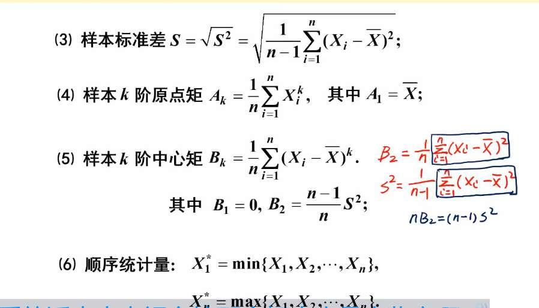
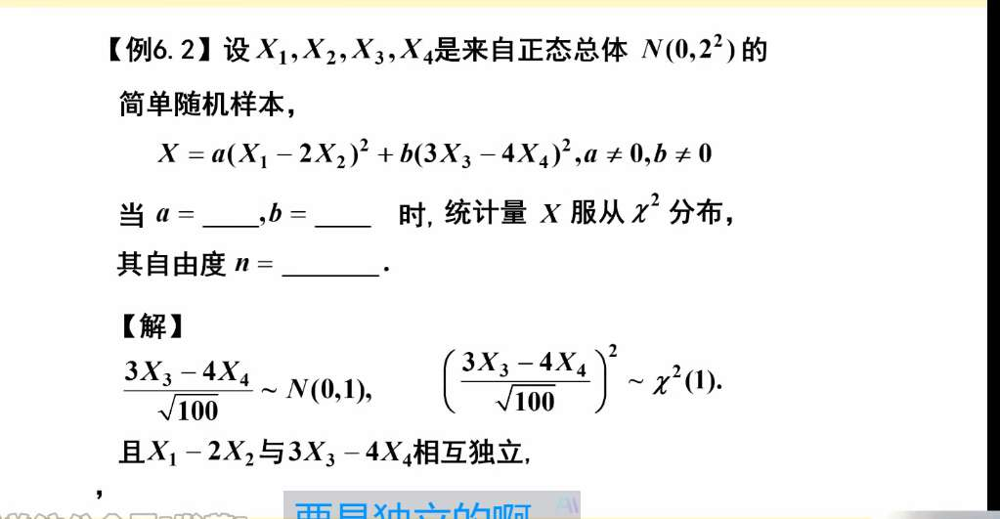

概念：
总体
简单随机样本：独立同分布
样本的函数，并且不含未知参数，叫统计量

常见统计量
样本均值，样本方差（为什么是 n-1 为分母）
在统计学里，用样本去推测总体时，我们有一个极高的道德标准，叫做**“无偏估计” (Unbiasedness)**。

意思是：虽然我每次抽样算出来的结果有高有低，但只要我抽的次数足够多，算出来的平均值（期望）**必须**等于那个真实的总体参数。即 $E(\text{估计量}) = \text{真实值}$。

如果我们用除以 $n$ 的公式去算样本方差，它算出来的期望会**系统性地偏小**。为了强行把它拉回到真实值，数学家发现只要把分母改成 $n-1$，刚好就能完美抵消掉这个误差。所以，**样本方差 $S^2$ 的定义天生自带 $n-1$，就是为了满足 $E(S^2) = \sigma^2$ 这个无偏性。**

**为什么除以 $n$ 会“低估”方差？（直觉解释）**

方差的本质是衡量数据**“偏离中心的平均距离”**。

- **上帝视角（总体方差）：** 我们计算每个点偏离**真实总体均值 $\mu$** 的距离的平方。
    
- **凡人视角（样本方差）：** 我们不知道真实的 $\mu$ 是多少，我们只能先用手里这 $n$ 个数据算出一个**样本均值 $\bar{X}$**，然后计算大家偏离 $\bar{X}$ 的距离。
    

**致命的逻辑漏洞就在这里：**

这 $n$ 个数据，是天然**向它们自己的平均值 $\bar{X}$ 靠拢的**！它们围绕 $\bar{X}$ 的紧密程度，绝对比围绕真实 $\mu$ 的紧密程度要高。

这就好比你随机抓了 5 个身高 1 米 8 的高个子，他们的真实总体均值可能是 1 米 7（围绕 1 米 7 算出的误差很大），但如果你以他们这 5 个人的平均值 1 米 8 作为中心去算误差，算出来的距离之和肯定特别小。

因为我们“擅自”用 $\bar{X}$ 偷换了 $\mu$，导致算出来的平方和变小了。除以 $n$ 的话，结果就被低估了。为了把低估的数值“放大”一点点，我们就把分母缩小一点，变成 $n-1$。

**什么是自由度 (Degrees of Freedom)？**

为什么偏偏是减去 1？

假设你有 3 个变量 $X_1, X_2, X_3$，如果我只告诉你它们是独立的，那它们有 3 个自由度（随便取什么值都行）。

但是，在算样本方差时，我们提前算出了一个样本均值 $\bar{X}$。

一旦 $\bar{X}$ 确定了，这 3 个变量就不自由了！因为 $(X_1-\bar{X}) + (X_2-\bar{X}) + (X_3-\bar{X})$ 必须等于 0。

这意味着，只要你随便定下前两个人的值，第三个人的值就被“死死卡住”了，根本没得选。

**你用掉了一个信息去算均值，你就损失了 1 个自由度。** 所以真正提供“独立波动信息”的数据只有 $n-1$ 个，这就是为什么分母是 $n-1$。

已知总体期望和方差，
可求样本均值的期望还是 u，方差，n 分之总体方差
还有样本 S^2 的期望，是总体方差（怎么理解）
还有样本标准差，k 阶原点矩，k 阶中心矩

#### 1. 样本标准差 $S$

- **怎么记：** 它就是样本方差 $S^2$ 开根号。公式里里面依然带着那个 $n-1$。
    
- **防坑预警：** 虽然 $E(S^2) = \sigma^2$（无偏的），但是 **$E(S) \neq \sigma$**！因为期望符号 $E$ 遇到非线性的根号是不能直接钻进去的。不过在绝大多数应用题里，我们不去纠结这个偏差，直接拿 $S$ 当 $\sigma$ 的替身来用（比如构造 T 检验）。
    

#### 2. k 阶原点矩与 k 阶中心矩的记忆心法

我们在前面的对话中讲过总体的“矩”：原点就是指直接拿数据算，中心就是指减去均值后再算。

在数理统计这一章，只要看到前面加了**“样本”**两个字，你只需要记住一句话：

**把总体的求期望 $E(\dots)$，无脑替换成现实世界的“求算术平均 $\frac{1}{n}\sum(\dots)$”！**

- **样本 k 阶原点矩 ($A_k$)：**
    
    - 总体是 $E(X^k)$。
        
    - 样本就是把所有数据的 $k$ 次方加起来，除以人数 $n$。
        
    - **公式：** $A_k = \frac{1}{n}\sum_{i=1}^n X_i^k$
        
    - _(特例：一阶原点矩 $A_1$ 就是样本均值 $\bar{X}$)_
        
- **样本 k 阶中心矩 ($B_k$)：**
    
    - 总体是 $E(X - E(X))^k$。
        
    - 样本就是把每个人减去样本均值 $\bar{X}$，乘 $k$ 次方加起来，除以人数 $n$。
        
    - **公式：** $B_k = \frac{1}{n}\sum_{i=1}^n (X_i - \bar{X})^k$
        
    - _(特例：二阶中心矩 $B_2 = \frac{1}{n}\sum(X_i - \bar{X})^2$)_
        

**⚠️ 最后的极品易错点：**

你仔细看看上面的样本二阶中心矩 $B_2$，它的分母是 **$n$** ！

很多同学在这里死得不明不白：

- **样本方差 $S^2$** 的分母是 **$n-1$**。
    
- **样本二阶中心矩 $B_2$** 的分母是 **$n$**。
    
    它们长得极度相似，只差一个分母。做题的时候一定要看清题目要求的是“方差”还是“矩”。矩的定义只管平均，根本不管无偏估计那一套，所以永远除以 $n$

# 三大分布

统计量，

## 1. $\chi^2$ (卡方) 分布：衡量“误差总和”的仪器

- **基因配方：** 拿 $n$ 个相互独立的标准正态分布积木 $Z_1, Z_2, \dots, Z_n$，把它们**全部分别平方，然后加起来**。

    $$\chi^2 = Z_1^2 + Z_2^2 + \dots + Z_n^2$$
    
    （这里的 $n$ 就叫“自由度”）
    
- **直觉印象：** 因为全是平方相加，所以卡方分布的值**永远是正的**（大于 0）。它的图像都在 y 轴右边，而且拖着一条长长的右尾巴。
    
- **用它干嘛？** 在现实中，我们经常算方差（方差的本质就是偏差的平方和）。所以卡方分布主要用来做**关于“方差”的检验**。
    

自由度1 的卡方，期望是 1，方差是 2

### 一、破译这道题的“模具配方”

这道题的终极目标是拼出一个 **$\chi^2$（卡方）分布**。

我们回忆一下卡方分布的基因配方：

**几个相互独立的、标准正态分布 $N(0,1)$ 的平方和。** 有几个加在一起，自由度就是几。

$$Z_1^2 + Z_2^2 + \dots \sim \chi^2(n)$$

所以，这道题的解题思路极其明确：**把括号里的东西，强行改造成 $N(0,1)$，然后平方相加。**

---

### 二、 硬核拆解：流水线改造过程

题目给了原材料：$X_1, X_2, X_3, X_4$ 是来自 $N(0, 2^2)$ 的简单随机样本。

**注意一个极其容易踩坑的细节：** 这里的方差是 $2^2 = 4$！也就是说，原材料的方差 $D(X_i) = 4$。

我们分两步来改造题目给的两个“零件”：

#### 零件 1：改造 $(X_1 - 2X_2)$

1. **算期望：** $E(X_1 - 2X_2) = 0 - 0 = 0$。
    
2. **算方差（重点！）：** 根据我们之前学的方差“外挂”（提取系数要平方，且独立变量方差相加）：
    
    $$D(X_1 - 2X_2) = 1^2 D(X_1) + (-2)^2 D(X_2) = 1 \times 4 + 4 \times 4 = 20$$
    
3. **标准化（造模具）：** 现在我们知道 $X_1 - 2X_2 \sim N(0, 20)$。
    
    怎么把它变成 $N(0,1)$？**除以它的标准差 $\sqrt{20}$！**
    
    $$\frac{X_1 - 2X_2}{\sqrt{20}} \sim N(0, 1)$$
    
4. **穿上卡方的马甲：** 把它平方，就得到了一个自由度为 1 的卡方分布：
    
    $$\frac{(X_1 - 2X_2)^2}{20} \sim \chi^2(1)$$
    

#### 零件 2：改造 $(3X_3 - 4X_4)$ （图片里解析写的就是这一步）

1. **算期望：** $E(3X_3 - 4X_4) = 0$。
    
2. **算方差：**
    
    $$D(3X_3 - 4X_4) = 3^2 D(X_3) + (-4)^2 D(X_4) = 9 \times 4 + 16 \times 4 = 100$$
    
3. **标准化：** 除以标准差 $\sqrt{100}$（也就是 10）。
    
    $$\frac{3X_3 - 4X_4}{\sqrt{100}} \sim N(0, 1)$$
    
4. **穿上卡方的马甲：** 把它平方，得到另一个自由度为 1 的卡方分布：
    
    $$\frac{(3X_3 - 4X_4)^2}{100} \sim \chi^2(1)$$
    

---

### 三、 最终组装与答案核对

现在我们手里有两个完美的 $\chi^2(1)$ 零件了：

零件一：$\frac{1}{20}(X_1 - 2X_2)^2$

零件二：$\frac{1}{100}(3X_3 - 4X_4)^2$

为了凑成一个更大的 $\chi^2$ 分布，我们需要把它们加起来。

**这里有一个关键的审查（也是图片底下划线的文字）：它们必须相互独立！**

因为零件一全是用 $X_1, X_2$ 造的，零件二全是用 $X_3, X_4$ 造的。题目说是“简单随机样本”（意味着各自独立互不干涉），所以这两个零件是绝对独立的。

把它们完美相加：

$$X = \frac{1}{20}(X_1 - 2X_2)^2 + \frac{1}{100}(3X_3 - 4X_4)^2 \sim \chi^2(1+1)$$

对比题目给出的公式结构：

$$X = a(X_1 - 2X_2)^2 + b(3X_3 - 4X_4)^2$$

答案一目了然：

- 想要拼图成功，系数必须是：**$a = \frac{1}{20}$， $b = \frac{1}{100}$**。
    
- 加了两个独立的标准正态平方，自由度就是：**$n = 2$**。

## 2. $t$ 分布 (学生分布)：小样本的“凡人版”正态分布

- **基因配方：** 分子放一个标准的积木 $Z$，分母放一个除以了自由度的卡方变量开根号。
    
    $$t = \frac{Z}{\sqrt{\chi^2 / n}}$$
    
- **直觉印象：** 这个分布背后的故事很有意思，是当年在爱尔兰健力士（Guinness）啤酒厂工作的酿酒师“学生（Student）”发明的。
    
    在理想世界里，算平均值用正态分布就行。但在现实中，我们往往**只有很少的样本（小样本），而且不知道总体的方差**。这时候用正态分布就会因为过度自信而犯错。
    
    $t$ 分布长得和标准正态分布一模一样（都是关于 y 轴对称的钟形），但它因为不确定性更大，所以**“矮胖”一点，尾巴更厚（肥尾效应）**。 **考研必考直觉：** 当自由度 $n$ 越来越大（样本越来越多），凡人也会接近神明，$t$ 分布会**无限逼近标准正态分布**。
    
- **用它干嘛？** 未知总体方差时，用来做**关于“均值”的检验**。
    

## 3. $F$ 分布：方差比拼的“裁判员”

- **基因配方：** 拿两个独立的卡方分布，分别除以它们自己的自由度，然后**相除（作比值）**。
    
    $$F = \frac{\chi^2_1 / n_1}{\chi^2_2 / n_2}$$
    
- **直觉印象：** 因为是两个正数相除，所以 $F$ 分布也是**只取正值**，图像也在 y 轴右边，呈不对称的右偏态。
    
- **用它干嘛？** 既然是两个卡方（代表方差）相除，它当然是用来**比较两个总体的波动大小（方差齐性检验 / 方差分析）**。