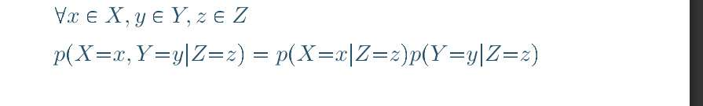

$P(X_1, X_2, X_3) = P(X_1)P(X_2|X_1)P(X_3|X_1,X_2)$

就可以被**简化**为：
$P(X_1, X_2, X_3) = P(X_1)P(X_2|X_1)P(X_3|X_1)$

> **"$P(X_1, X_2, X_3) = P(X_1)P(X_2|X_1)P(X_3|X_1,X_2)$ 就可以被简化为： $P(X_1, X_2, X_3) = P(X_1)P(X_2|X_1)P(X_3|X_1)$ 和图里讲的化简，不同。可以详细讲下吗？"**

**条件独立的定义 (P11)**：
> 如果 `X` 和 `Y` 在给定 `Z` 的情况下是条件独立的，那么：
> $p(X, Y | Z) = p(X|Z) p(Y|Z)$

现在，我们用**概率的链式法则**来分解这个条件联合概率：
$p(X, Y | Z) = p(X | Y, Z) p(Y|Z)$

对比上面两个公式，我们可以得出条件独立的**等价定义**：
$p(X | Y, Z) = p(X|Z)$

**这个等价定义正是我们简化链式法则的关键！** 它说：“在已经知道了Z的信息后，Y的额外信息对于预测X来说是无用的。”

现在我们回到我举的例子：
*   **原始链式法则**: $P(X_1, X_2, X_3) = P(X_1)P(X_2|X_1)P(X_3|X_1,X_2)$
*   **我做出的假设是**: $X_3$ 在给定 $X_1$ 时，与 $X_2$ **条件独立**。
*   **套用等价定义**: 这个假设意味着 $P(X_3|X_1, X_2) = P(X_3|X_1)$。
*   **进行代换**: 我们把原始链式法则中的 $P(X_3|X_1,X_2)$ 替换掉，就得到了简化后的版本：$P(X_1, X_2, X_3) = P(X_1)P(X_2|X_1)P(X_3|X_1)$。

所以，我的例子和PPT的定义是完全一致的。PPT给出的 $p(X,Y|Z)=p(X|Z)p(Y|Z)$ 是**定义式**，而我展示的是这个定义在简化**联合概率分布的链式法则**中的具体**应用**。

1. **P22** 的例子中，如果我们观测到3次抛硬币，结果都是正面（D={1,1,1}），最大似然估计得到的硬币正面朝上的概率 uml 是多少？这个结果对于“预测下一次抛硬币的结果”来说，合理吗？它体现了什么问题？
    
2. **P25-P27** 引入的贝叶斯方法，其核心思想是什么？它是如何结合我们的“**先验信念 (Prior)**”和“**观测数据 (Likelihood)**”来得到一个更稳健的“**更新后的信念 (Posterior)**”的？

Binomial