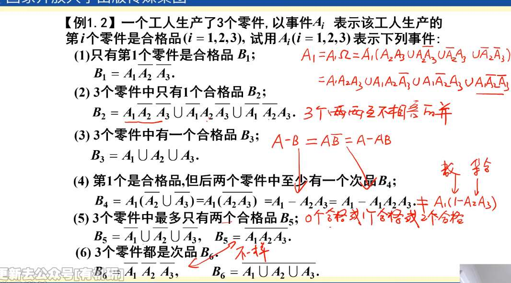
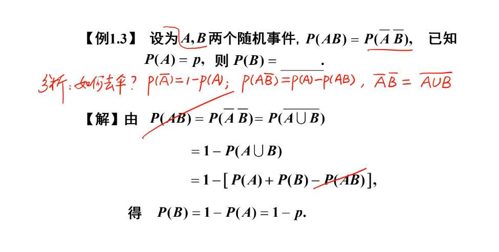
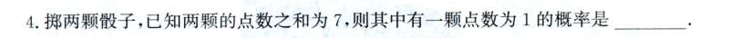
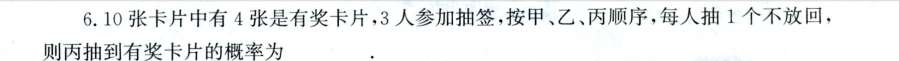

事件描述

- 全都不：$\bar{A}\bar{B}\bar{C}$  (或者根据摩根律写成 $\overline{A \cup B \cup C}$)  ；不全都：$\overline{ABC}$ (或者根据摩根律写成 $\bar{A} \cup \bar{B} \cup \bar{C}$)
- 只有 $A$ 发生：$A\bar{B}\bar{C}$ (必须保证 $B, C$ 被排除)；
  恰好有一个发生：公式：$(A\bar{B}\bar{C}) \cup (\bar{A}B\bar{C}) \cup (\bar{A}\bar{B}C)$
  至少有一个发生 $A \cup B \cup C$，（常用 $1 - P(\text{一个都不发生}) = 1 - P(\bar{A}\bar{B}\bar{C})$）
  至少有两个发生 $AB \cup BC \cup AC$ (注意：这里不需要在 $AB$ 后面加 $\bar{C}$，因为 $ABC$ 本身已经包含在 $AB$ 里面了)
- 至多有一个发生：$\bar{A}\bar{B}\bar{C} \cup (A\bar{B}\bar{C} \cup \bar{A}B\bar{C} \cup \bar{A}\bar{B}C)$
  至多有两个发生： $\overline{ABC}$ 
- $A$ 发生但 $B$ 不发生：$A - B$ 或 $A\bar{B}$
  $A$ 发生，但 $B, C$ 中至少有一个不发生：$A \cap (\bar{B} \cup \bar{C})$ 或者 $A \cap (\overline{BC})$

反复去 bar

我的想法是，一颗点数 1，一颗为 6 的概率，
那就是八分之一乘八分之一，加上顺序因素，乘 2.
但题目说的"已知"，所以是条件概率。
点数和为 7 的有 6 种可能，所以答案是六分之 2。
那什么情况是我想的？
> “掷两颗骰子，求**点数之和为 7 且其中有一颗点数为 1** 的概率。”

- **区别点：** 这个描述里没有“已知”，样本空间依然是全部的 **36 种** 可能。

**最聪明的理解法：排列对称性**
想象 10 张票像排队一样排成一列。**甲抽走第一张，乙抽走第二张，丙抽走第三张。**
*   这和“10 张票放在桌上，丙直接走过去拿走第三张”有区别吗？**没有。**
*   在丙伸手拿票之前，他并不知道前两个人抽走了什么。
*   对于这 10 张票来说，那 4 张奖券掉在第 1、第 2 还是第 3 个位置的**概率是完全一样。**

**结论：** 无论第几个抽，无论抽多少次不放回，只要前面的人抽奖的结果**没有公布**（即：没有“已知”条件干扰），每个人的中奖概率都相等。
*   甲中奖概率 = $4/10$
*   乙中奖概率 = $4/10$
*   丙中奖概率 = $4/10$

**3. 如果非要写公式（利用排列）：**
样本空间：从 10 张里按顺序选 3 张的排列数 $P_{10}^3 = 10 \times 9 \times 8$。
丙中奖的情况：
*   先固定丙的位置是那 4 张奖券中的 1 张（$C_4^1$）。
*   剩下的 9 张票里随便选 2 张给甲乙排位（$P_9^2$）。
*   分子 = $4 \times (9 \times 8)$。
*   $P = \frac{4 \times 9 \times 8}{10 \times 9 \times 8} = \frac{4}{10}$。