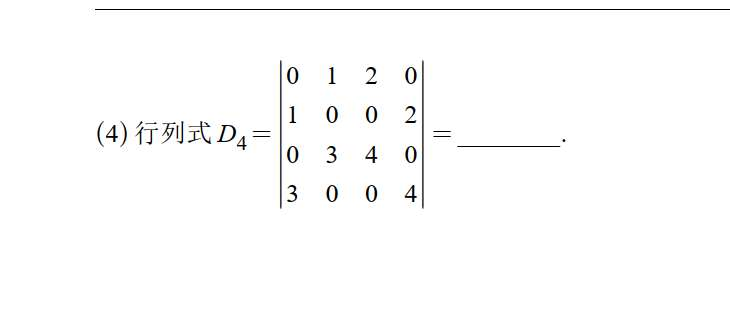
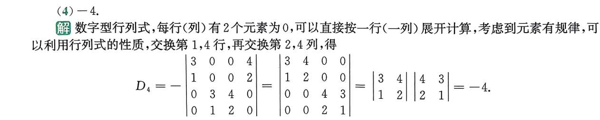
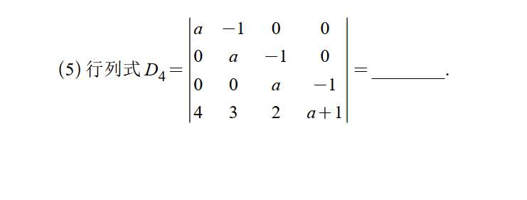
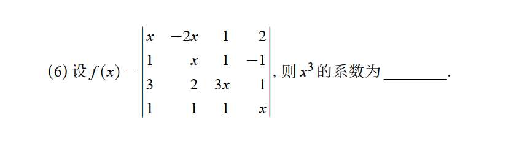
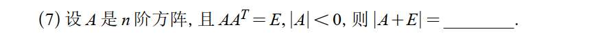
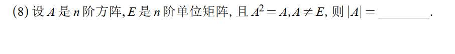
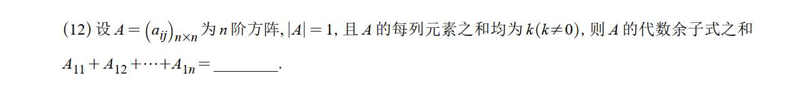

# 习题
## 1 化简为方块矩阵，其一方块为 0

## 2 提系数不熟

## 3

## 4

# 1000 题

题目说 $a, b, c$ 是方程 $x^3 - 2x + 4 = 0$ 的三个根。

这里用到了高中数学的**韦达定理（根与系数的关系）**。

对于一个一元三次方程 $Ax^3 + Bx^2 + Cx + D = 0$，它的三个根相加有一个固定公式：

$$\text{根的和} = -\frac{B}{A}$$

（即：负的二次项系数，除以三次项系数）。

我们来看题目的方程：$x^3 - 2x + 4 = 0$。

**注意陷阱！这里没有 $x^2$ 这一项！** 也就是说，方程其实长这样：

$$\mathbf{1}x^3 + \mathbf{0}x^2 - 2x + 4 = 0$$

套用韦达定理：

$$a + b + c = -\frac{0}{1} = \mathbf{0}$$
如果你把这个 4x4 的行列式硬生生展开，它一定会变成一个关于 $x$ 的多项式，大概长这样：

$$f(x) = ax^4 + bx^3 + cx^2 + dx + e$$

题目问的是“展开式中的常数项”，也就是上面这个式子里的 **$e$**。

现在，我们做一个非常简单的动作：**让 $x = 0$**。

把 $x=0$ 代入上面的多项式：

$$f(0) = a(0)^4 + b(0)^3 + c(0)^2 + d(0) + e = e$$

你看，所有带 $x$ 的项瞬间全灰飞烟灭了，**留下来的数值 $f(0)$，就是我们要找的常数项！**

**接下来，把这个思想用到行列式上：**

既然展开后再代入 $x=0$ 可以得到常数项，那我为什么不**在展开之前，直接把矩阵里的 $x$ 全都变成 0** 呢？反正结果是一样的。

当你把题目矩阵里的 $x$ 全部换成 $0$ 后，矩阵变成了：

$$\begin{vmatrix} 0 & 1 & 0 & 1 \\ 0 & 1 & 0 & 1 \\ 1 & 0 & 1 & 0 \\ 1 & 0 & 1 & 0 \end{vmatrix}$$

仔细看这个新矩阵的**第 1 行和第 2 行，它们变得一模一样了**（第 3 行和第 4 行也一样）。

根据行列式的基本性质：**如果行列式中有两行（列）完全相同，那么行列式的值必定为 0**。

## 3 逆序数法

## 4

$$f(x) = C_1 + C_2 \cdot x$$

**这就是一个最最基础的一次函数（直线方程 $y = kx + b$）！**

现在我们来回答关于“零点”（也就是方程 $f(x)=0$ 有几个解，图形和 x 轴有几个交点）的问题：

1. **如果 $C_2 \neq 0$**：这就是一条斜着的直线。斜着的直线肯定会穿过 x 轴一次，所以有 **1个零点**。
    
2. **如果 $C_2 = 0$**：那 $f(x) = C_1$。由于题目说 $f(x)$ “不恒为零”（说明 $C_1 \neq 0$），这就代表它是一条平行于 x 轴但不在 x 轴上的水平线（比如 $y=5$）。它永远不会和 x 轴相交，所以有 **0个零点**。

## 6 递推

# 880 基础

# 1

# 2

# 3

观察这个行列式，它的第一列只有两个非零元素（$a$ 和 $4$），所以最简便的方法是**按第一列展开**。

$$D_4 = \begin{vmatrix} a & -1 & 0 & 0 \\ 0 & a & -1 & 0 \\ 0 & 0 & a & -1 \\ 4 & 3 & 2 & a+1 \end{vmatrix}$$

根据展开定理，按第一列展开可以得到两个 $3 \times 3$ 的行列式（注意正负号是 $(-1)^{\text{行号}+\text{列号}}$）：

$$D_4 = a \cdot (-1)^{1+1} \begin{vmatrix} a & -1 & 0 \\ 0 & a & -1 \\ 3 & 2 & a+1 \end{vmatrix} + 4 \cdot (-1)^{4+1} \begin{vmatrix} -1 & 0 & 0 \\ a & -1 & 0 \\ 0 & a & -1 \end{vmatrix}$$

化简符号：

$$D_4 = a \begin{vmatrix} a & -1 & 0 \\ 0 & a & -1 \\ 3 & 2 & a+1 \end{vmatrix} - 4 \begin{vmatrix} -1 & 0 & 0 \\ a & -1 & 0 \\ 0 & a & -1 \end{vmatrix}$$

现在我们分别计算这两个三阶行列式：

**1. 计算前面的三阶行列式：**

按它的第一行展开最方便：

$$\begin{vmatrix} a & -1 & 0 \\ 0 & a & -1 \\ 3 & 2 & a+1 \end{vmatrix} = a \begin{vmatrix} a & -1 \\ 2 & a+1 \end{vmatrix} - (-1) \begin{vmatrix} 0 & -1 \\ 3 & a+1 \end{vmatrix}$$

$$= a [a(a+1) - (-2)] + 1 \cdot [0 - (-3)]$$

$$= a(a^2 + a + 2) + 3$$

$$= a^3 + a^2 + 2a + 3$$

**2. 计算后面的三阶行列式：**

观察发现，这是一个**下三角行列式**，它的值直接等于主对角线元素的乘积：

$$\begin{vmatrix} -1 & 0 & 0 \\ a & -1 & 0 \\ 0 & a & -1 \end{vmatrix} = (-1) \times (-1) \times (-1) = -1$$

**3. 将两部分代回原式：**

$$D_4 = a(a^3 + a^2 + 2a + 3) - 4(-1)$$

$$D_4 = a^4 + a^3 + 2a^2 + 3a + 4$$

**答案：** $a^4 + a^3 + 2a^2 + 3a + 4$
# 4

根据行列式的定义，行列式展开后的每一项，都是**从不同行、不同列中各取一个元素相乘**得到的。

我们要找 $x^3$ 的系数，就是要找哪些项乘起来恰好包含 $3$ 个 $x$。

首先，我们把矩阵中所有带有 $x$ 的元素找出来：

- $a_{11} = x$
    
- $a_{12} = -2x$
    
- $a_{22} = x$
    
- $a_{33} = 3x$
    
- $a_{44} = x$
    

我们要从这 5 个元素中挑出 **3 个**，再从剩下的常数中挑出 **1 个**，并且这 4 个元素必须分布在**不同的行和不同的列**。

**推理过程：**

1. **能不能选主对角线？** 如果我们选了主对角线上的 $a_{11}, a_{22}, a_{33}$，那么第 1、2、3 行和列都被占用了。第 4 个元素只能选第 4 行第 4 列的 $a_{44} = x$。这样乘起来是 $x^4$，而不是 $x^3$。所以，**任何从主对角线上挑 3 个元素的组合，都会被迫凑成 $x^4$ 项。**
    
2. **必须利用非对角线上的 $x$：** 为了打破上面的“死局”，我们必须选中唯一不在主对角线上的 $x$ 元素，即第一行的 **$a_{12} = -2x$**。
    
3. **确定剩余的元素：**
    
    - 既然选中了 $a_{12}$，那么第 1 行和第 2 列就被占用了。
        
    - 我们还需要再找 2 个 $x$。剩下的 $x$ 元素有 $a_{22}, a_{33}, a_{44}$。
        
    - 因为第 2 列已经被占用，所以不能选 $a_{22}$。
        
    - 我们**只能被迫选择** $a_{33} = 3x$ 和 $a_{44} = x$。
        
    - 现在我们选了 $a_{12}, a_{33}, a_{44}$。占用了第 1, 3, 4 行，和第 2, 3, 4 列。
        
    - 最后一个元素必须在**第 2 行、第 1 列**，也就是 $a_{21} = 1$。
        

**计算该项的值：**

我们找到的唯一能拼出 $x^3$ 的组合是：$a_{12}, a_{21}, a_{33}, a_{44}$。

根据行列式的定义，这一项的值为：

$$\text{符号} \times a_{12} \cdot a_{21} \cdot a_{33} \cdot a_{44}$$

- **计算符号：** 元素的列标排列是 $(2, 1, 3, 4)$。在这个排列中，只有 $2$ 在 $1$ 前面，产生 $1$ 个逆序。逆序数为奇数，所以符号是负号 $(-1)$。
    
- **计算乘积：**
    
    $$(-1) \times (-2x) \times (1) \times (3x) \times (x) = 6x^3$$
    

因为没有其他任何组合能拼出 $x^3$ 了，所以这就是最终包含 $x^3$ 的所有部分。

# 5

### 经典的“配凑转置”技巧

这道题可以说是考试中的常客，它难在第一步的切入点。看到 $AA^T = E$，你不仅要想到它是正交矩阵，还要想到怎么用它来**替换**和**提取公因式**。

**第一步：先求出 $|A|$ 的具体值**

已知 $AA^T = E$，两边取行列式：

$$|AA^T| = |E|$$

根据行列式的乘法性质 $|AB| = |A||B|$，以及 $|A^T| = |A|$：

$$|A||A^T| = 1$$

$$|A|^2 = 1$$

所以 $|A| = 1$ 或 $|A| = -1$。

结合题目给的条件 $|A| < 0$，我们可以锁定：

**$|A| = -1$**

**第二步：核心技巧——利用 $E = AA^T$ 变形 $|A+E|$**

我们要计算 $|A+E|$，直接算是算不出来的。技巧在于把里面的 $E$ 替换掉：

$$|A+E| = |A + AA^T|$$

现在，提取公因式 $A$（注意矩阵乘法的分配律）：

$$|A+E| = |A(E + A^T)|$$

把行列式拆开：

$$|A+E| = |A| \cdot |E + A^T|$$

**第三步：利用转置性质消灭 $A^T$**

我们刚才已经求出 $|A| = -1$，代入进去：

$$|A+E| = (-1) \cdot |E + A^T| = -|E + A^T|$$

接下来是最神奇的一步。我们知道，一个矩阵的行列式等于它转置的行列式，即 $|M| = |M^T|$。把 $E+A^T$ 看作一个整体：

$$|E + A^T| = |(E + A^T)^T| = |E^T + (A^T)^T| = |E + A| = |A + E|$$

**第四步：得出最终结论**

把上一步的结果代回到我们的等式中：

$$|A+E| = -|A+E|$$

把右边的项移到左边：

$$2|A+E| = 0$$

得出结论：

$$|A+E| = 0$$

**答案：0**
# 6

**你的思路：**

已知 $A^2 = A$，两边同时取行列式得到 $|A^2| = |A|$，也就是 $|A|^2 = |A|$。

解这个方程，得出 $|A| = 0$ 或 $|A| = 1$。

**这一步堪称完美，完全正确！**

**接下来如何排除选项？**

题干里还有一个你没用上的条件：$A \neq E$。这就是用来排除那个错误答案的“照妖镜”。

我们来做个假设（反证法）：

1. **假设** $|A| = 1$。
    
2. 如果一个矩阵的行列式不为 0（在这里是 1），说明这个矩阵是**可逆矩阵**，即它的逆矩阵 $A^{-1}$ 是存在的。
    
3. 现在回到已知条件 $A^2 = A$。因为 $A^{-1}$ 存在，我们在等式两边同时**左乘** $A^{-1}$：
    
    $$A^{-1}A^2 = A^{-1}A$$
    
    $$(A^{-1}A)A = E$$
    
    $$EA = E$$
    
    $$A = E$$
    
4. 我们推导出了 $A = E$！但这与题干给定的条件 **$A \neq E$** 产生了矛盾。
    

既然假设 $|A| = 1$ 会导致矛盾，那么这个假设就不成立。

因此，只剩下唯一的可能性：

**答案：0**

# 7

行列式按第一行展开的公式是：

$$|A| = a_{11}A_{11} + a_{12}A_{12} + \dots + a_{1n}A_{1n}$$

题目要求的是 $A_{11} + A_{12} + \dots + A_{1n}$。仔细对比这两个式子，你会发现：如果 $A$ 的第一行元素全是 1，即 $a_{11} = a_{12} = \dots = a_{1n} = 1$，那么行列式的值就正好等于代数余子式之和！

**解题步骤：**

**第一步：利用已知条件构造全 $k$ 行**

已知“$A$ 的每列元素之和均为 $k$”。

在计算行列式 $|A|$ 时，我们将第 2 行、第 3 行……一直到第 $n$ 行，**全部加到第 1 行上**。

根据行列式的性质，把某一行（或几行）的倍数加到另一行，**行列式的值不变**。

此时，新的第 1 行的每个元素，就变成了原来每一列元素的总和。

所以新的行列式变成了：

$$|A| = \begin{vmatrix} k & k & \dots & k \\ a_{21} & a_{22} & \dots & a_{2n} \\ \vdots & \vdots & & \vdots \\ a_{n1} & a_{n2} & \dots & a_{nn} \end{vmatrix}$$

**第二步：提取公因式 $k$**

我们将新行列式第一行的公因式 $k$ 提出来：

$$|A| = k \begin{vmatrix} 1 & 1 & \dots & 1 \\ a_{21} & a_{22} & \dots & a_{2n} \\ \vdots & \vdots & & \vdots \\ a_{n1} & a_{n2} & \dots & a_{nn} \end{vmatrix}$$

**第三步：按第一行展开**

现在，我们把这个带系数 $k$ 的行列式**按第一行展开**。

注意：虽然第一行变成了全 1，但它对应的代数余子式 $A_{11}, A_{12}, \dots, A_{1n}$ **并没有改变**（因为代数余子式是划掉第一行和当前列剩下的部分，而第 2 到 $n$ 行我们根本没动过）。

展开后得到：

$$|A| = k \cdot (1 \cdot A_{11} + 1 \cdot A_{12} + \dots + 1 \cdot A_{1n})$$

$$|A| = k(A_{11} + A_{12} + \dots + A_{1n})$$

**第四步：代入已知结果求值**

题目已知 $|A| = 1$，代入上式：

$$1 = k(A_{11} + A_{12} + \dots + A_{1n})$$

因为题目说了 $k \neq 0$，两边同除以 $k$：

$$A_{11} + A_{12} + \dots + A_{1n} = \frac{1}{k}$$

因此，正确答案是 **$\frac{1}{k}$**。