# 习题
## 1 化简为方块矩阵，其一方块为 0

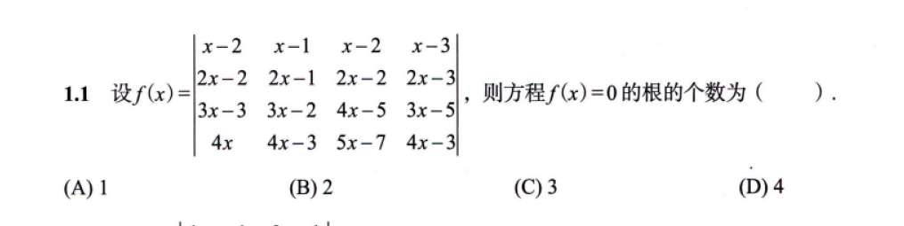

## 2 提系数不熟
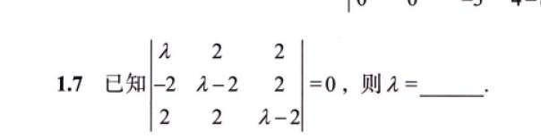

## 3
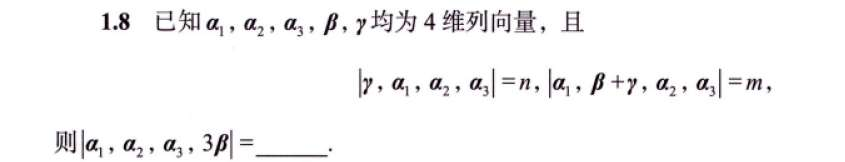

## 4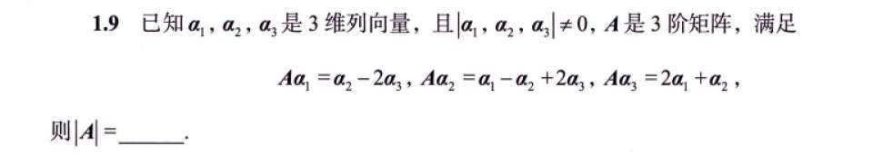

# 1000 题

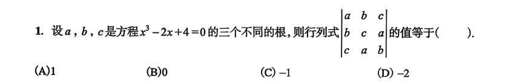

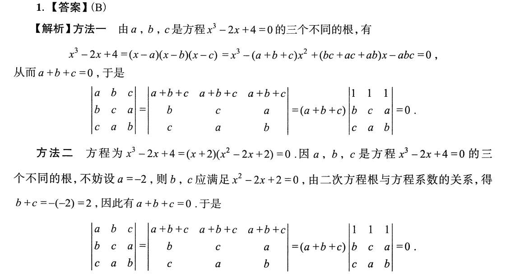
题目说 $a, b, c$ 是方程 $x^3 - 2x + 4 = 0$ 的三个根。

这里用到了高中数学的**韦达定理（根与系数的关系）**。

对于一个一元三次方程 $Ax^3 + Bx^2 + Cx + D = 0$，它的三个根相加有一个固定公式：

$$\text{根的和} = -\frac{B}{A}$$

（即：负的二次项系数，除以三次项系数）。

我们来看题目的方程：$x^3 - 2x + 4 = 0$。

**注意陷阱！这里没有 $x^2$ 这一项！** 也就是说，方程其实长这样：

$$\mathbf{1}x^3 + \mathbf{0}x^2 - 2x + 4 = 0$$

套用韦达定理：

$$a + b + c = -\frac{0}{1} = \mathbf{0}$$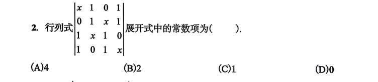
如果你把这个 4x4 的行列式硬生生展开，它一定会变成一个关于 $x$ 的多项式，大概长这样：

$$f(x) = ax^4 + bx^3 + cx^2 + dx + e$$

题目问的是“展开式中的常数项”，也就是上面这个式子里的 **$e$**。

现在，我们做一个非常简单的动作：**让 $x = 0$**。

把 $x=0$ 代入上面的多项式：

$$f(0) = a(0)^4 + b(0)^3 + c(0)^2 + d(0) + e = e$$

你看，所有带 $x$ 的项瞬间全灰飞烟灭了，**留下来的数值 $f(0)$，就是我们要找的常数项！**

**接下来，把这个思想用到行列式上：**

既然展开后再代入 $x=0$ 可以得到常数项，那我为什么不**在展开之前，直接把矩阵里的 $x$ 全都变成 0** 呢？反正结果是一样的。

当你把题目矩阵里的 $x$ 全部换成 $0$ 后，矩阵变成了：

$$\begin{vmatrix} 0 & 1 & 0 & 1 \\ 0 & 1 & 0 & 1 \\ 1 & 0 & 1 & 0 \\ 1 & 0 & 1 & 0 \end{vmatrix}$$

仔细看这个新矩阵的**第 1 行和第 2 行，它们变得一模一样了**（第 3 行和第 4 行也一样）。

根据行列式的基本性质：**如果行列式中有两行（列）完全相同，那么行列式的值必定为 0**。
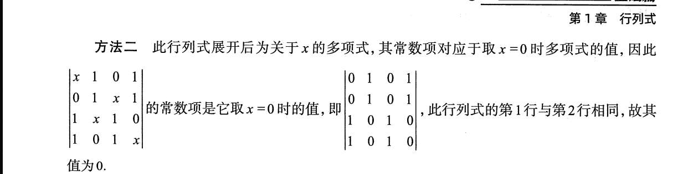

## 3 逆序数法

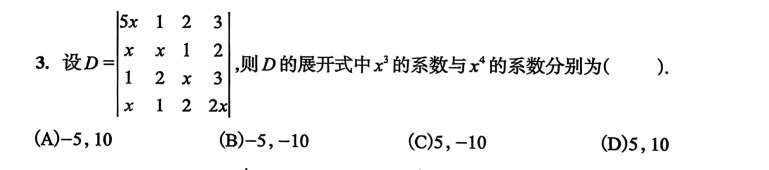
## 4
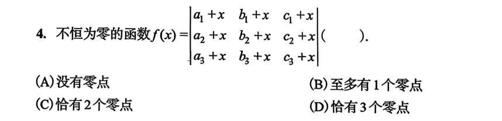

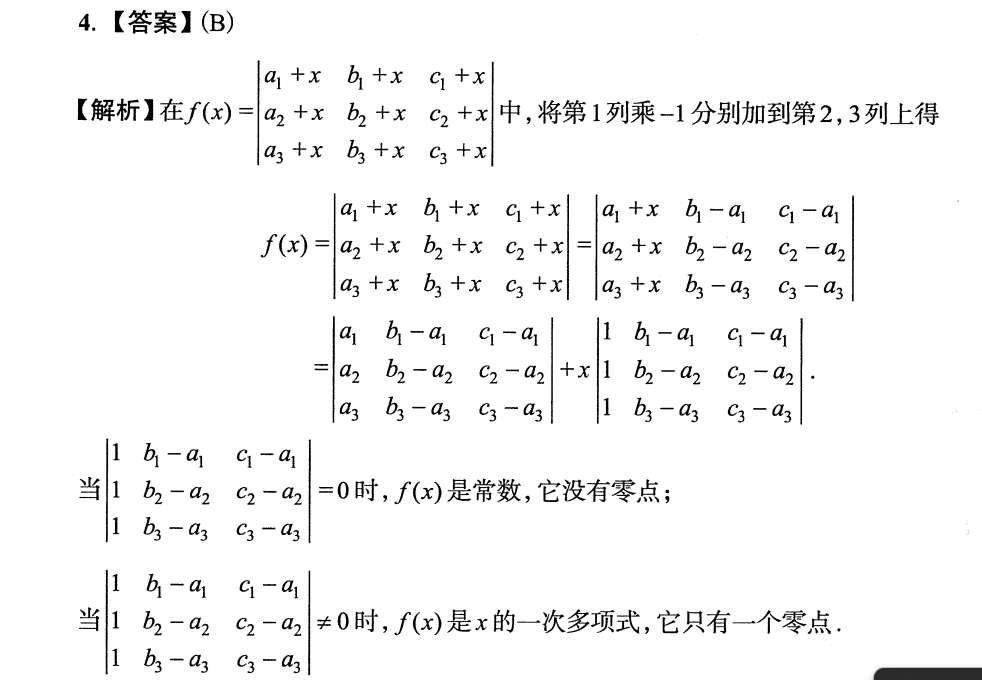

$$f(x) = C_1 + C_2 \cdot x$$

**这就是一个最最基础的一次函数（直线方程 $y = kx + b$）！**

现在我们来回答关于“零点”（也就是方程 $f(x)=0$ 有几个解，图形和 x 轴有几个交点）的问题：

1. **如果 $C_2 \neq 0$**：这就是一条斜着的直线。斜着的直线肯定会穿过 x 轴一次，所以有 **1个零点**。
    
2. **如果 $C_2 = 0$**：那 $f(x) = C_1$。由于题目说 $f(x)$ “不恒为零”（说明 $C_1 \neq 0$），这就代表它是一条平行于 x 轴但不在 x 轴上的水平线（比如 $y=5$）。它永远不会和 x 轴相交，所以有 **0个零点**。

## 6 递推
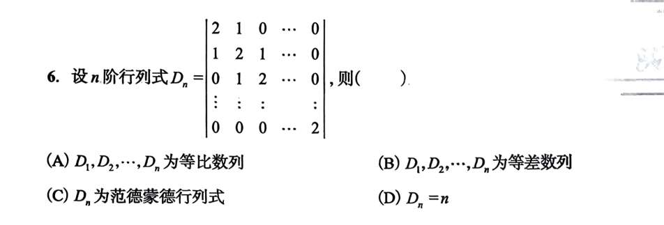

# 880 基础

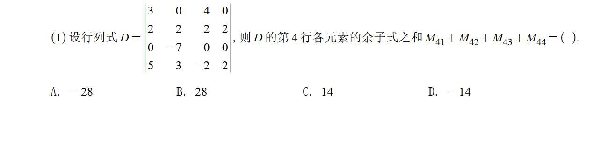

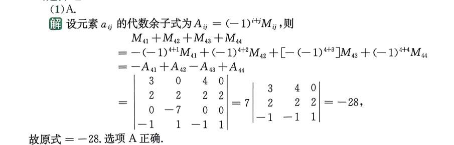

