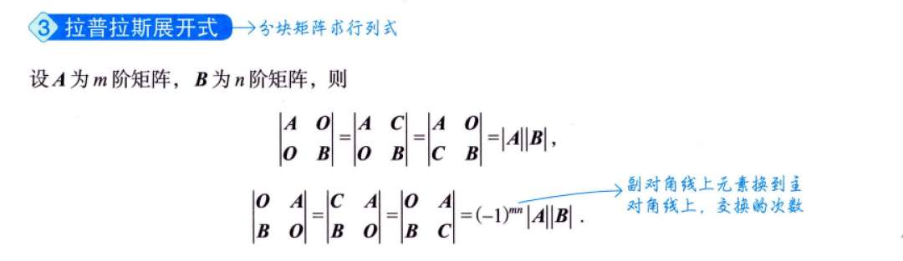
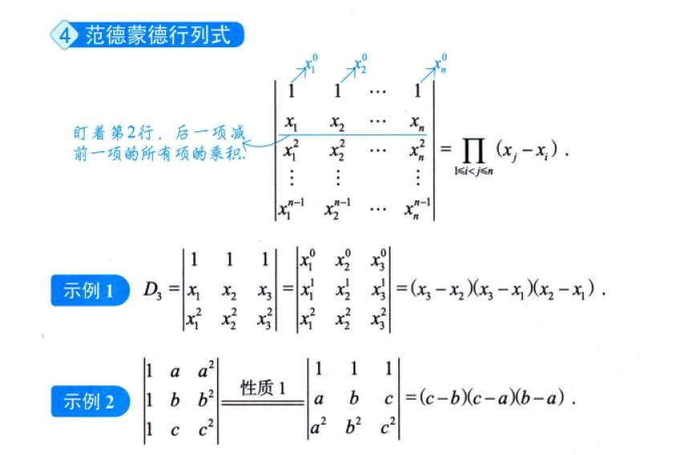
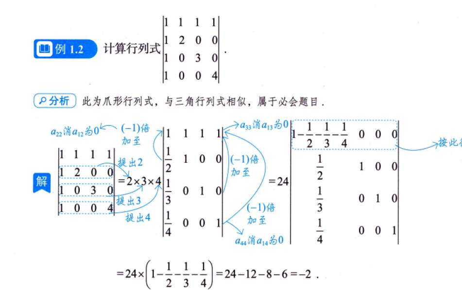
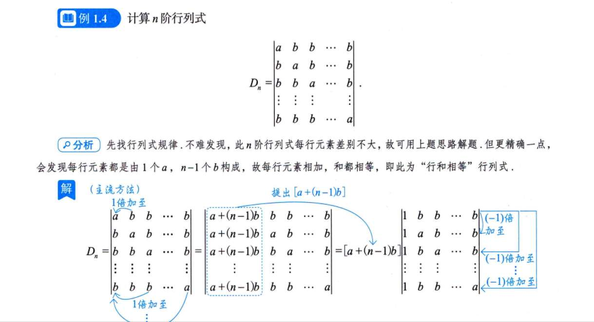
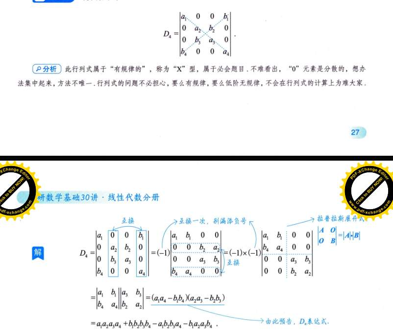
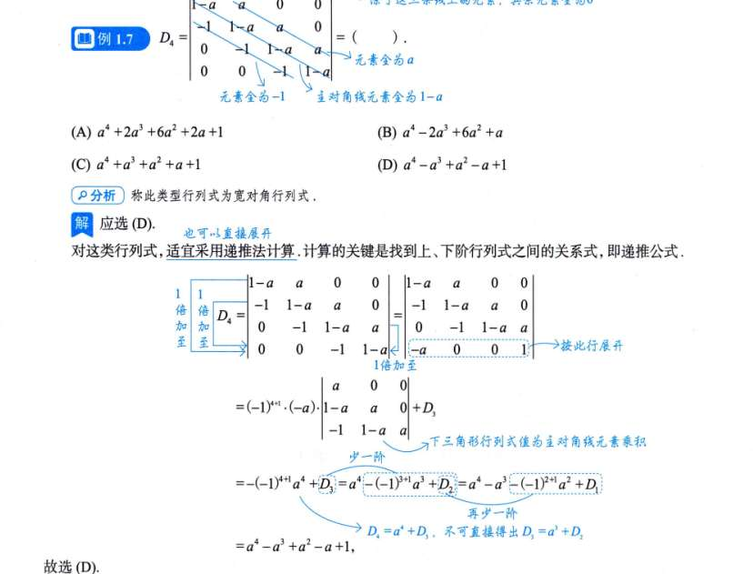
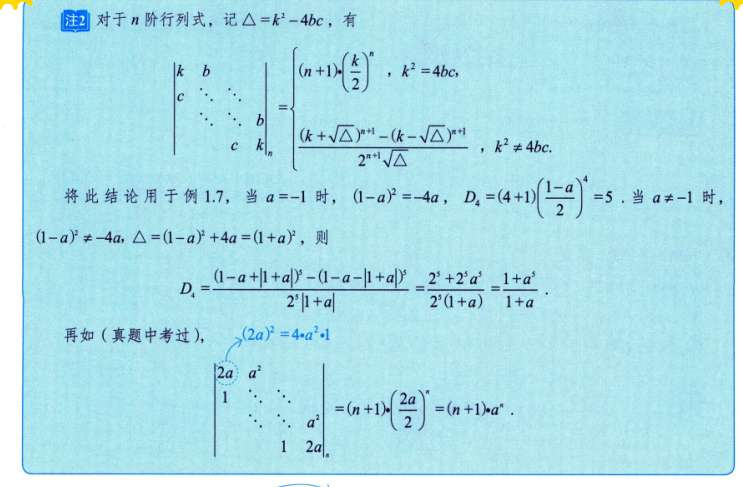
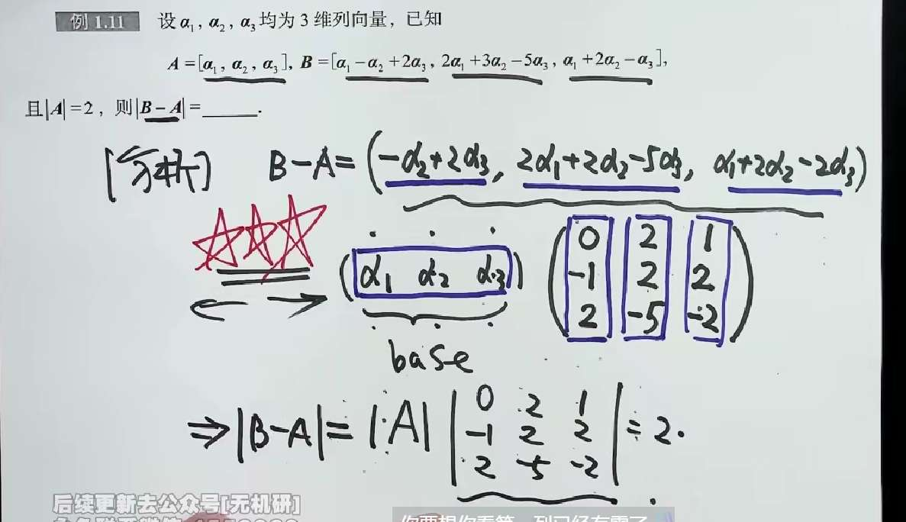

# 行列式性质

|AB|=|A||B|=|BA|

-  $|A|=|A^T|$ ，以此表示，行列等价。如何理解？
  从几何上看，把列向量 $(a, c)$ 变成 $(a, b)$，等同于把 $x$ 和 $y$ 坐标对调了
  沿着对角线 $y=x$ 做了一次镜面反射
- 行列式某行（列）元素全为 0，则行列式为 0。行的解释就是降维！
- 某行/列和公因子 k，可以提取公因子 k 到行列式外面。就比如长宽高，一个元素放大 n 倍，体积就能放大 n 倍
- 行列式可拆分为 n 个行列式和。仍然是盯着一行看。
  
- 行列式中两行（列）互换，行列式变号。因为方向变了。
- 两行（列）相等或成比例，行列式为 0
- 把某行（列）的 k 倍加到另一行，行列式不变。如何理解？平移方向是完全平行于底边 $\vec{v}_1$ 的，所以这个平行四边形的**垂直高度根本没有发生任何改变**！底边没变，高也没变，面积自然就不变

# 逆序数

# 余子式和代数余子式

展开：

# 重要的行列式

# 行列式的计算
## 爪型

## 行和相等

## 分块矩阵

$\begin{vmatrix} B & O \\ O & A \end{vmatrix} = |B||A|$。

$\begin{vmatrix} B & O \\ O & A \end{vmatrix} = (-1)^{mn}|B||A|$
### 把一般分块矩阵，强行变成“上/下三角分块矩阵”

既然我们只知道上/下三角分块矩阵的行列式怎么算（主对角线相乘），那我们唯一的出路就是：**利用“分块矩阵的初等行/列变换”，把左下角的 $C$ 或者左上角的 $B$ 强行变成 $O$（零矩阵）！**

这和我们之前消灭普通数字的逻辑一模一样，只不过现在我们的“武器”变成了矩阵。

#### 情况一：假设左上角的 $A$ 是可逆的（即 $A^{-1}$ 存在）

我们要把左下角的 $C$ 狙击掉。

- **思考：** 第 1 行是 $[A \quad B]$，第 2 行是 $[C \quad D]$。我要给第 1 行乘上一个什么东西，再加到第 2 行上，才能把 $C$ 变成 $O$ 呢？
    
- **动作：** 把第 1 行左乘 **$-CA^{-1}$**，然后加到第 2 行上！
    
    _(为什么是 $-CA^{-1}$？因为 $-CA^{-1} \times A = -C$，加上原来的 $C$，刚好等于 $O$！)_
    

我们来看看整个分块矩阵经过这个动作后变成了什么样：

- 第 1 行保持不变：$[A \quad B]$
    
- 第 2 行变成了：$[C - CA^{-1}A \quad D - CA^{-1}B] = [\mathbf{O} \quad \mathbf{D - CA^{-1}B}]$
    

你看！矩阵被我们强行化成了**上三角分块矩阵**：

$$\begin{bmatrix} A & B \\ C & D \end{bmatrix} \xrightarrow{\text{分块行变换}} \begin{bmatrix} A & B \\ \mathbf{O} & \mathbf{D - CA^{-1}B} \end{bmatrix}$$

因为“把一行乘上一个系数加到另一行，行列式的值不变”，所以这两个矩阵的行列式是相等的。

而右边已经是上三角分块矩阵了，它的行列式直接等于主对角线两块行列式的乘积！

**【终极公式 1】当 $A$ 可逆时：**

$$\begin{vmatrix} A & B \\ C & D \end{vmatrix} = |A| \cdot |D - CA^{-1}B|$$

---

#### 情况二：假设右下角的 $D$ 是可逆的（即 $D^{-1}$ 存在）

同样的狙击套路，这次我们换个目标，利用 $D$ 把右上角的 $B$ 给干掉。

经过类似的“分块列变换”（把第 2 列乘以 $-BD^{-1}$ 加到第 1 列），我们可以把原矩阵变成**下三角分块矩阵**：

$$\begin{bmatrix} \mathbf{A - BD^{-1}C} & \mathbf{O} \\ C & D \end{bmatrix}$$

**【终极公式 2】当 $D$ 可逆时：**

$$\begin{vmatrix} A & B \\ C & D \end{vmatrix} = |D| \cdot |A - BD^{-1}C|$$

---

### 总结与考试“开挂”小技巧

在真正的考试中，如果你遇到 $\begin{bmatrix} A & B \\ C & D \end{bmatrix}$ 求行列式：

1. **绝对不要**直接写 $|A||D| - |B||C|$！
    
2. 观察题目，通常题目会按暗示你 $A$ 或者 $D$ 是 $E$（单位阵）或者某个明显可逆的矩阵。
    
3. 如果 $A = E$，那公式 1 就变得无比简单：**$|M| = |E| \cdot |D - CE^{-1}B| = |D - CB|$**。这在做题时极度好用！
    

**唯一的特例（可以勉强用十字相乘的情况）：**

如果题目极其大发慈悲，告诉你这四个子块中有两个是**“可交换”**的（比如题目明确写了 $AC = CA$ 或者 $CD = DC$），并且它们是同阶方阵，这个时候你才能勉强写出类似十字相乘的结果，例如若 $AC=CA$，则原行列式等于 $|AD - CB|$。但这种题比较少见。
## X 型

## 宽对角线型（引入递推法）

二级结论

## 抽象行列式

## 代数余子式还原