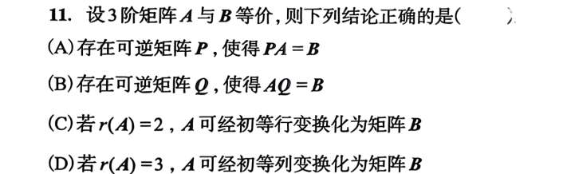
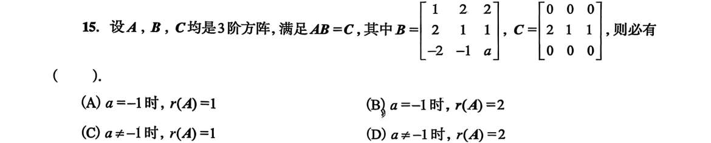
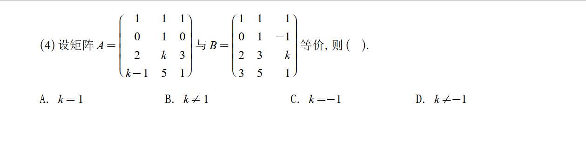
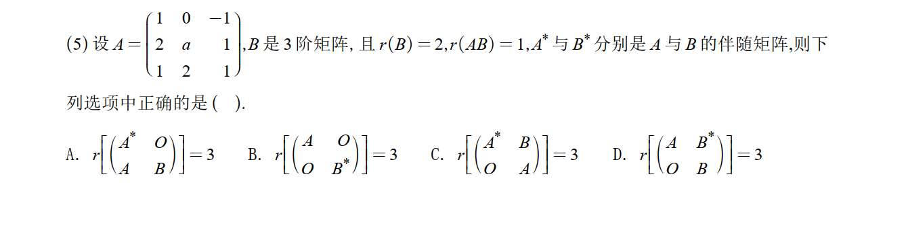
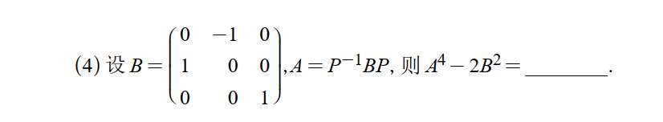
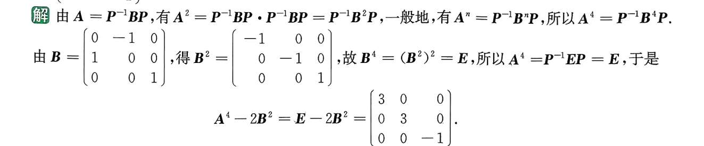
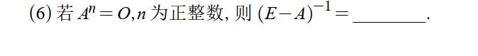
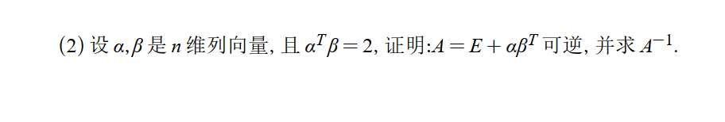
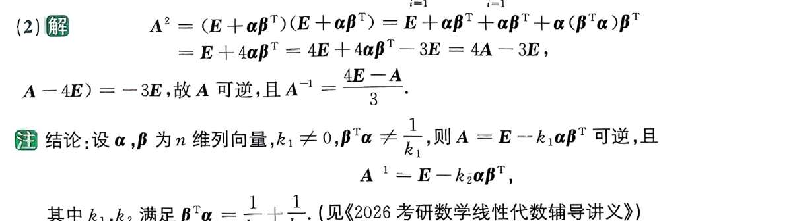

# 习题
## 3

## 5 化简
  

## 6

矩阵 $A = \begin{bmatrix} 1 & 2 & -1 \\ -2 & -4 & 2 \\ 3 & 6 & -3 \end{bmatrix}$

你从上往下扫一眼这三行：

- 第 1 行是：$[1, 2, -1]$
    
- 第 2 行是：$[-2, -4, 2]$
    
- 第 3 行是：$[3, 6, -3]$
    

发现了吗？第 2 行就是第 1 行乘以 **-2**；第 3 行就是第 1 行乘以 **3**。

整个矩阵，其实翻来覆去就只有**“一种基因”**。

**提取法：** 我们直接把最顺眼的那一行（通常是第一行，或者数字最简单的那一行）抽出来，作为我们的**“行模版”**，这就是你要找的 **$\beta^T$**。

所以：$\beta^T = [1, 2, -1]$

- 矩阵的第 1 行怎么来？ $\rightarrow$ 模版乘以 **1**。
    
- 矩阵的第 2 行怎么来？ $\rightarrow$ 模版乘以 **-2**。
    
- 矩阵的第 3 行怎么来？ $\rightarrow$ 模版乘以 **3**。
    

把这三个倍数竖起来装进一个列向量里，就得到了 $\alpha$：

$$\alpha = \begin{bmatrix} 1 \\ -2 \\ 3 \end{bmatrix}$$

拼在一起，大功告成：

$$A = \begin{bmatrix} 1 \\ -2 \\ 3 \end{bmatrix} [1, 2, -1]$$

## 9

写个 A-E 因子，剩下的强行凑

## 10 代数化简

## 12

**求秩是全场唯一一个你可以合法混用行和列的场景！**
    

（_复习一下我们的“红线”：只有在求逆矩阵、解方程组时，才绝对禁止碰列变换。_）

## 13 矩阵方程化简

你仔细观察一下题目给的矩阵 $A$：

- 主对角线上全是 **1**
    
- 主对角线紧挨着的下面一条斜线上全是 **2**
    
- 再往下的一条斜线上全是 **3**
    
- 最左下角是 **4**
    

这种“顺着斜线看，数字全都一样”的矩阵，在数学上有一个专属名字叫 **下三角托普利茨矩阵 (Toeplitz Matrix)**。

它有一个极其强大的隐藏属性：**它的逆矩阵，一定也是一个长着相同花纹的“下三角托普利茨矩阵”！**

也就是说，逆矩阵同样满足“顺着斜线数字全一样”的规律。

这意味着什么？意味着你**根本不需要求完整的 16 个数字**！你只需要把逆矩阵的**第一列**求出来，剩下的列只需要不断往右下方“平移复制”就可以了！

---

### 第二步：狙击第一列（极速口算）

既然只要第一列，那事情就简单了。

假设逆矩阵的第一列未知数是 $\begin{bmatrix} x_1 \\ x_2 \\ x_3 \\ x_4 \end{bmatrix}$。

根据矩阵乘法 $A \times A^{-1} = E$，矩阵 $A$ 乘以逆矩阵的第一列，必定等于单位阵 $E$ 的第一列 $\begin{bmatrix} 1 \\ 0 \\ 0 \\ 0 \end{bmatrix}$。

我们直接用 $A$ 的每一行，去和这四个未知数做“配方”（乘积求和）：

1. **看 $A$ 的第 1 行** $(1, 0, 0, 0)$：
    
    $1 \cdot x_1 = 1 \implies \mathbf{x_1 = 1}$
    
2. **看 $A$ 的第 2 行** $(2, 1, 0, 0)$：
    
    $2x_1 + 1x_2 = 0$
    
    把 $x_1=1$ 代入：$2 + x_2 = 0 \implies \mathbf{x_2 = -2}$
    
3. **看 $A$ 的第 3 行** $(3, 2, 1, 0)$：
    
    $3x_1 + 2x_2 + 1x_3 = 0$
    
    把前面算的代入：$3(1) + 2(-2) + x_3 = 0 \implies 3 - 4 + x_3 = 0 \implies \mathbf{x_3 = 1}$
    
4. **看 $A$ 的第 4 行** $(4, 3, 2, 1)$：
    
    $4x_1 + 3x_2 + 2x_3 + 1x_4 = 0$
    
    代入：$4(1) + 3(-2) + 2(1) + x_4 = 0 \implies 4 - 6 + 2 + x_4 = 0 \implies \mathbf{x_4 = 0}$
    

太爽了！全是最简单的加减法！我们瞬间拿到了逆矩阵的第一列：

$$\begin{bmatrix} \mathbf{1} \\ \mathbf{-2} \\ \mathbf{1} \\ \mathbf{0} \end{bmatrix}$$

---

### 第三步：见证奇迹的“复制粘贴”

根据我们刚才说的规律，现在拿着第一列，开始向右下方平移：

- 第 1 列是：$1, -2, 1, 0$
    
- 第 2 列往下移一格：$0, 1, -2, 1$
    
- 第 3 列再往下移一格：$0, 0, 1, -2$
    
- 第 4 列再往下移一格：$0, 0, 0, 1$
    

把它们拼起来，就是最终答案：

$$A^{-1} = \begin{bmatrix} 1 & 0 & 0 & 0 \\ -2 & 1 & 0 & 0 \\ 1 & -2 & 1 & 0 \\ 0 & 1 & -2 & 1 \end{bmatrix}$$

和图片上的标准答案严丝合缝！整个过程如果熟练的话，草稿纸上只写那四个简单方程，30 秒内就能出结果。

**总结一下：**

遇到下三角（或上三角），且沿着对角线数字都一样的矩阵，**绝对不要去用常规方法硬算全图**。直接利用 $AX=E$ 求出第一列（或第一行），然后愉快地平移复制就行了。

# 1000 题

2, 就自己写写平方，算算
3，就拿配方思想捣鼓

配方思想来看，这是移位矩阵！$$A = E + B + B^2 + B^3$$

觉得眼熟吗？回忆一下初中学过的多项式因式分解（等比数列求和）：

$$1 - x^4 = (1 - x)(1 + x + x^2 + x^3)$$

既然多项式可以这么玩，**矩阵完全可以照猫画虎**（因为 $E$ 和 $B$ 乘法是可交换的）！

我们把上面的公式翻译成矩阵语言：

$$E - B^4 = (E - B)(E + B + B^2 + B^3)$$

现在，见证奇迹的时刻到了：

1. 括号里那一长串 $(E + B + B^2 + B^3)$，不就是题目里的 **$A$** 吗！
    
2. 左边的 $B^4$，我们刚才扒过了，它是 **$O$**（零矩阵），所以 $E - B^4 = E - O = \mathbf{E}$。
    

把这两个结论代入公式：

$$E = (E - B) \cdot A$$
## 11

**只要是满秩矩阵，单靠初等列变换（右乘 $Q$），绝对能变成跟它等价的矩阵。** 同理，如果让 $P = BA^{-1}$，就说明单靠初等行变换也能做到！

所以，**对于满秩方阵来说：等价 = 行等价 = 列等价。**

对于这种不满秩的等价矩阵，你**必须同时使用**行变换和列变换，也就是必须“左右开弓”用 $PAQ = B$，才能把 $A$ 变成 $B$。
## 15

**可逆矩阵的“透明玻璃”特权：一个矩阵乘以一个可逆矩阵，它的秩绝对不会改变！** （用符号写就是：如果 $B$ 可逆，那么 $r(AB) = r(A)$，且 $r(BC) = r(C)$）。
**当 $a = -1$ 时（为什么不选 A 或 B ？）
** 为了严谨，我们看看为什么另外两个错。如果 $a = -1$，那么 $|B| = 0$，$B$ 降秩了（此时你可以算出 $r(B)=2$）。回到瓶颈理论：$r(AB) = r(C) = 1$。我们只知道流水线最后出来的产品是 1 维的，而 $B$ 机器的上限是 2 维。这说明 $A$ 机器的维度**至少是 1**。在数学上，此时 $A$ 的秩可能是 1，也可能是 2。因为题目问的是“**必有**”（必须一定 100%成立），既然 $r(A)$ 摇摆不定，那 (A) 和 (B) 这种咬死 $r(A)=1$ 或 $r(A)=2$ 的选项自然就错了。

# 880

## 1

矩阵 $A$ 和 $B$ 都是 $4 \times 3$ 的形状。它们最多只能拼出 $3 \times 3$ 的方阵，所以它们的秩**最大也就是 3**。如果你能在里面找到哪怕**一个**算出来不为 0 的 $3 \times 3$ 行列式，那就直接“封顶”了，说明它的秩必定是 3！

## 2

**线索 1：从 $r(B) = 2$ 推出 $r(B^*)$**

考研/期末必背定理（伴随矩阵的秩）：

- 如果 $n$ 阶矩阵 $r(M) = n$（满秩），则 $r(M^*) = n$
    
- **如果 $r(M) = n-1$，则 $r(M^*) = 1$**
    
- 如果 $r(M) \le n-2$，则 $r(M^*) = 0$
    

已知 $B$ 是 3 阶矩阵，且 $r(B) = 2 = 3-1$。

直接套用定理，得出：**$r(B^*) = 1$**。

**线索 2：从 $r(AB) = 1$ 推出 $r(A)$**

我们需要用到**西尔维斯特（Sylvester）不等式**：$r(A) + r(B) - n \le r(AB)$

把已知条件代入：

$r(A) + 2 - 3 \le 1 \implies r(A) - 1 \le 1 \implies r(A) \le 2$。

说明 $A$ 不是满秩的（它的秩不到 3），这意味着 $A$ 的行列式必定为 0：$|A| = 0$。

我们来算一下 $|A|$：

$$|A| = \begin{vmatrix} 1 & 0 & -1 \\ 2 & a & 1 \\ 1 & 2 & 1 \end{vmatrix} = 1(a - 2) - 0 - 1(4 - a) = 2a - 6$$

令 $2a - 6 = 0$，解得 $a = 3$。

把 $a = 3$ 代回原矩阵 $A$，你可以轻易验证它的前两行不成比例，所以 $r(A) = 2$。

同理，套用刚才伴随矩阵的定理，因为 $r(A) = 3-1 = 2$，所以得出：**$r(A^*) = 1$**。

**线索 3：分块矩阵的秩**

现在我们来看选项。题目要求找哪一个矩阵的秩等于 3。

这里有一个分块矩阵的黄金法则：**对于分块对角矩阵，整体的秩等于对角线上各个小矩阵的秩之和。**

即：$r \begin{pmatrix} X & O \\ O & Y \end{pmatrix} = r(X) + r(Y)$

我们直接扫视四个选项，看哪个是这种完美的“对角线”结构：

**B 选项：** $r \begin{pmatrix} A & O \\ O & B^* \end{pmatrix}$

直接套用法则：$r = r(A) + r(B^*)$。

把我们刚才辛辛苦苦求出来的数值代进去：$2 + 1 = 3$。

完美契合！都不用算其他选项了。

## 3

感觉奇怪... 就看什么能算，算一算，就把奇怪的 P 搞掉了

## 4
**零矩阵与恒等式变形**（或者叫矩阵的几何级数）。

如果你硬去求逆是无从下手的，因为根本没有给出 $A$ 的具体元素。理解这道题，最好的切入点是**类比初高中学过的多项式因式分解**。

我们分三步来破解它：

### 第一步：从“数字”类比到“矩阵”

还记得初中学的平方差、立方差公式，以及更一般的多项式因式分解吗？

我们有一个极其常用的公式：

$$1 - x^n = (1 - x)(1 + x + x^2 + \dots + x^{n-1})$$

现在，我们把这个标量（数字）世界的公式，**平行“翻译”到矩阵世界**里：

- 把数字 $1$ 换成单位矩阵 $E$
    
- 把数字 $x$ 换成矩阵 $A$
    

因为 $E$ 和任何矩阵相乘都是可交换的（即 $EA = AE$），所以上面那个多项式展开在矩阵里是完全成立的。我们得到了一个极其重要的**矩阵恒等式**：

$$E - A^n = (E - A)(E + A + A^2 + \dots + A^{n-1})$$

_(这个公式在线代里极其好用，强烈建议记住)_

### 第二步：代入题目的“大杀器”条件

题目给了一个非常强的条件：**$A^n = O$**（也就是零矩阵）。在数学里，这种乘到某次幂就变成零的矩阵叫做“幂零矩阵”。

我们把 $A^n = O$ 代入刚才推导出的矩阵恒等式左边：

$$E - O = (E - A)(E + A + A^2 + \dots + A^{n-1})$$

显然，$E - O$ 就等于 $E$。所以式子变成了：

$$E = (E - A)(E + A + A^2 + \dots + A^{n-1})$$

### 第三步：回归逆矩阵的定义

逆矩阵的定义是什么？

如果两个同阶方阵 $X$ 和 $Y$ 满足 **$XY = E$**，那么我们就说 $X$ 是可逆的，并且 **$X^{-1} = Y$**。

现在你再看看我们刚刚得到的等式：

$$\underbrace{(E - A)}_{\text{矩阵 } X} \underbrace{(E + A + A^2 + \dots + A^{n-1})}_{\text{矩阵 } Y} = E$$

根据逆矩阵的定义，这就直接证明了 $(E-A)$ 是可逆的，并且它的逆矩阵就是后面那一长串！

所以，最终答案就是：

$$E + A + A^2 + \dots + A^{n-1}$$

---

### 💡 高维视角的补充（泰勒展开）

如果你学过微积分里的泰勒展开（或者等比数列求和），还有另一种更直觉的理解方式：

在实数中，当 $|x| < 1$ 时，有：

$$\frac{1}{1-x} = (1-x)^{-1} = 1 + x + x^2 + x^3 + \dots$$

在矩阵中，$(E-A)^{-1}$ 也可以做类似的展开：

$$(E-A)^{-1} = E + A + A^2 + A^3 + \dots$$

由于题目规定了 $A^n = O$，这意味着从 $A^n$ 开始，后面所有的无穷项 $A^{n+1}, A^{n+2}$ 全都变成了零。

所以，这个原本无限长的“尾巴”被截断了，只剩下前面的有限项：

$$E + A + A^2 + \dots + A^{n-1}$$

**总结：**

以后在线代里，只要看到已知 **$A^k = O$**，让你求涉及 **$(E \pm A)^{-1}$** 的问题，直接在脑子里默写多项式展开公式，一秒钟就能得出答案！

# 5

