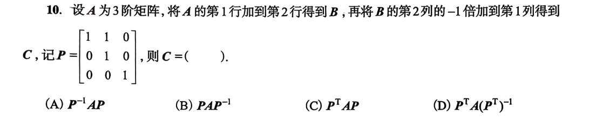

#### 1. 互换型（位置互换）

- **动作：** 把第 $i$ 行和第 $j$ 行互换位置。
    
- **长相：** 把单位阵 $E$ 的第 $i, j$ 两行互换。
    
- **后悔药：** 你把两行换了，怎么恢复？**再换一次**就回来了！
    
- **结论：** 互换矩阵的逆，**等于它自己本身**。（即 $P^{-1} = P$）
    

#### 2. 倍乘型（按比例缩放）

- **动作：** 把某一行整体放大 $k$ 倍（$k \neq 0$）。
    
- **长相：** 把单位阵 $E$ 对角线上的某个 1，变成 $k$。
    
- **后悔药：** 你把它放大了 $k$ 倍，怎么恢复？给它**乘上 $\frac{1}{k}$** 就缩回来了！
    
- **结论：** 倍乘矩阵的逆，就是把对角线上的那个 $k$，变成 **$\frac{1}{k}$**。
    

#### 3. 错切型（把某一行的 $k$ 倍加到另一行）👉 **考试最爱考！**

- **动作：** 把第 $j$ 行的 $k$ 倍，加到第 $i$ 行上去。
    
- **长相：** 单位阵 $E$ 的主对角线全为 1，而在第 $i$ 行第 $j$ 列的那个 0，变成了 $k$。
    
- **后悔药：** 你加了 $k$ 倍过去，怎么恢复？你再**减去 $k$ 倍**（也就是加上 $-k$ 倍）就平账了！
    
- **结论：** 错切矩阵的逆，极其简单粗暴——**对角线不变，只把那个 $k$ 变成 $-k$**（只改变符号，位置绝对不换）！

**只要是满秩矩阵，单靠初等列变换（右乘 $Q$），绝对能变成跟它等价的矩阵。** 同理，如果让 $P = BA^{-1}$，就说明单靠初等行变换也能做到！

所以，**对于满秩方阵来说：等价 = 行等价 = 列等价。**

对于这种不满秩的等价矩阵，你**必须同时使用**行变换和列变换，也就是必须“左右开弓”用 $PAQ = B$，才能把 $A$ 变成 $B$。