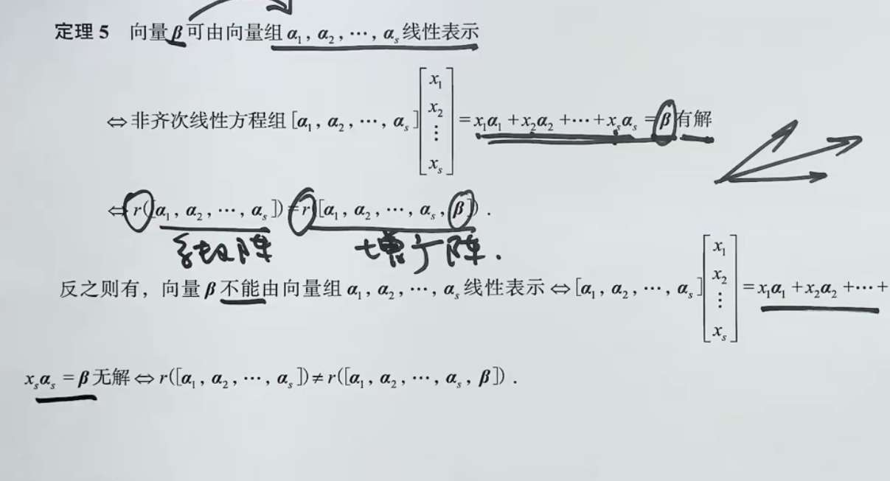
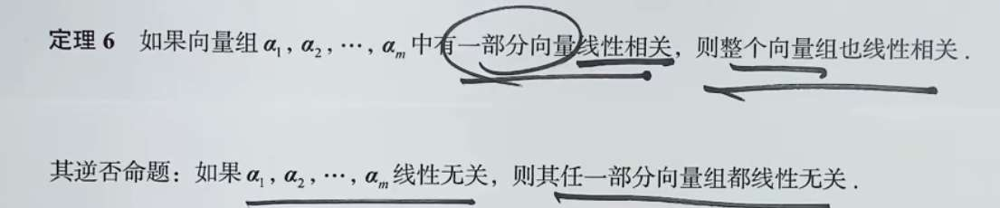
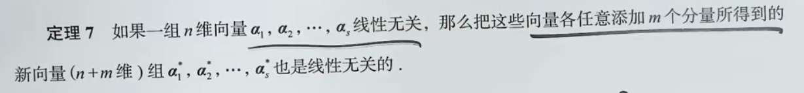
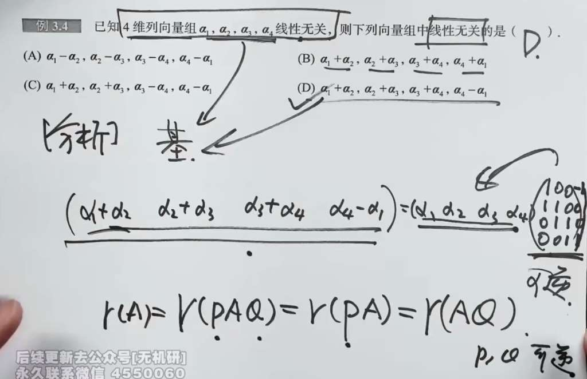
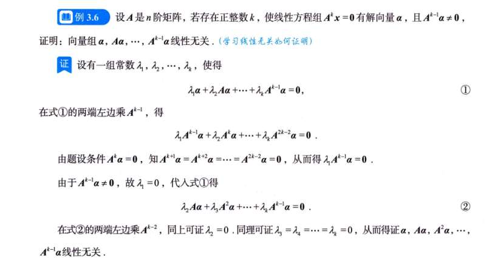
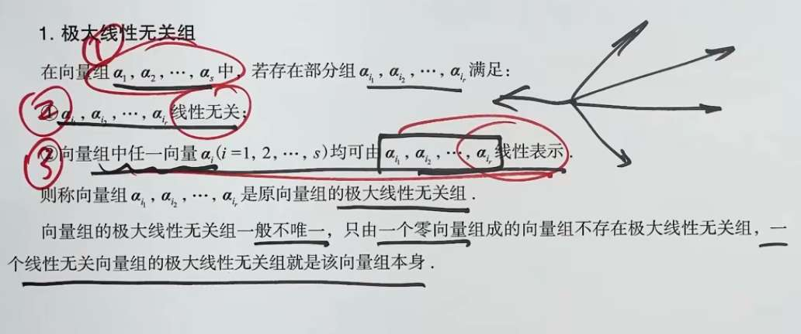
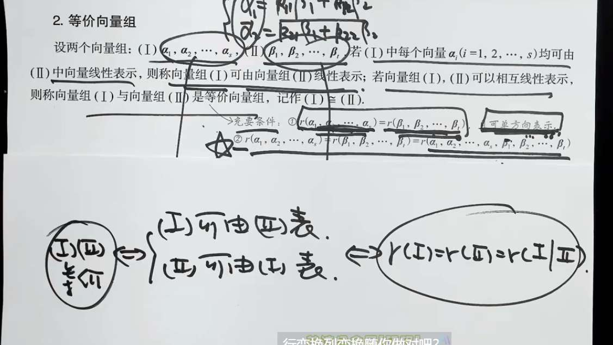
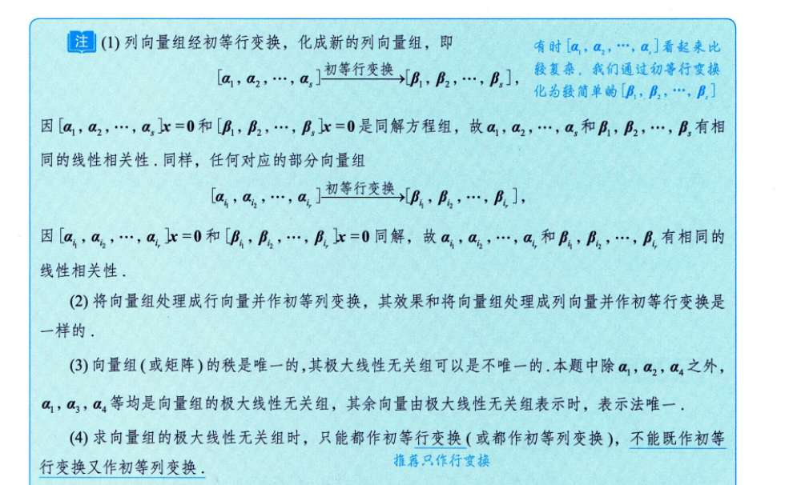

# 正交矩阵

$A^TA=E$
说明，相同列点积为 1，不同列点积为 0（垂直）
所以此矩阵是一堆模为 1 的垂直向量

# 线性相关无关概念

如果向量的个数大于向量的维数，向量一定线性相关

证明线性无关：
可是否为逆矩阵；

你看黑板中间那个长长的等式，老师把选项 (D) 的四个新向量并排写在一起，然后等于旧向量 $(\alpha_1, \alpha_2, \alpha_3, \alpha_4)$ 乘以一个 $4 \times 4$ 的数字矩阵。

这就是我们最熟悉的“右乘列配方”！

假设旧向量组是原食材矩阵 $A$，新向量组是新菜品矩阵 $B$，那个 $4 \times 4$ 的数字矩阵就是配方表 $K$。

$$B = AK$$

我们来看看 (D) 选项的配方表 $K$ 是怎么写出来的（也就是黑板右边那个圈起来的矩阵）：

- 第 1 个新向量是 $\alpha_1 + \alpha_2$，所以配方（第 1 列）是：$(1, 1, 0, 0)^T$
    
- 第 2 个新向量是 $\alpha_2 + \alpha_3$，所以配方（第 2 列）是：$(0, 1, 1, 0)^T$
    
- 第 3 个新向量是 $\alpha_3 + \alpha_4$，所以配方（第 3 列）是：$(0, 0, 1, 1)^T$
    
- 第 4 个新向量是 $\alpha_4 - \alpha_1$，所以配方（第 4 列）是：$(-1, 0, 0, 1)^T$
    

把这四列拼起来，就得到了老师右边写的那个配方矩阵 $K = \begin{pmatrix} 1 & 0 & 0 & -1 \\ 1 & 1 & 0 & 0 \\ 0 & 1 & 1 & 0 \\ 0 & 0 & 1 & 1 \end{pmatrix}$。

### 第二步：召唤“特权玻璃”（看最下面的公式）

老师在最下面写了：$r(A) = r(PAQ) = r(PA) = r(AQ)$，并且批注了“$P, Q$ 可逆”。

这就是我们上一道题聊过的：**只要乘的是可逆矩阵（满秩矩阵），有效信息量（秩）就绝对不会变！**

回到我们的等式 $B = AK$。

题目已知旧向量组 $\alpha_1, \alpha_2, \alpha_3, \alpha_4$ 是**线性无关**的，这就意味着这 4 个向量全都是纯干货，没有一句废话，所以旧矩阵 $A$ 的秩 **$r(A) = 4$**。

现在题目问：哪个新向量组也是**线性无关**的？

也就是说，我们要找哪个选项加工出来的新矩阵 $B$，它的秩依然是 4 （即 **$r(B) = 4$**）。

怎么才能保证 $r(B)$ 依然等于 4 呢？

根据底下的特权公式：**只有当那个“配方表”矩阵 $K$ 是可逆矩阵时，$r(AK)$ 才会死死地等于 $r(A)$！**

### 第三步：大结局，给 $K$ 做体检

所以，这道题的终极面目露出来了：**它根本不是在考向量，而是在考你这四个选项对应的“配方矩阵 $K$”，谁的行列式 $|K| \neq 0$（谁可逆）！**

我们直接来算老师圈出来的选项 (D) 的配方矩阵行列式（按第一行展开）：

$$|K| = \begin{vmatrix} 1 & 0 & 0 & -1 \\ 1 & 1 & 0 & 0 \\ 0 & 1 & 1 & 0 \\ 0 & 0 & 1 & 1 \end{vmatrix}$$

$$= 1 \cdot \begin{vmatrix} 1 & 0 & 0 \\ 1 & 1 & 0 \\ 0 & 1 & 1 \end{vmatrix} - (-1) \cdot \begin{vmatrix} 1 & 1 & 0 \\ 0 & 1 & 1 \\ 0 & 0 & 1 \end{vmatrix}$$

前一个三阶行列式是下三角，主对角线相乘 $= 1$；

后一个三阶行列式是上三角，主对角线相乘 $= 1$；

$$|K| = 1 \cdot 1 + 1 \cdot 1 = \mathbf{2}$$

因为 **$|K| = 2 \neq 0$**，说明 (D) 的配方表是个完美的“可逆矩阵”（老师在旁边批注的“可逆”就是指这个）。

既然它可逆，它就不会破坏原有的信息量，所以新造出来的向量组必定也是线性无关的。答案就是 D！

---

### 💡 考场秒杀开挂技巧（不用列矩阵也能做！）

老师讲的矩阵法是这道题的“底层灵魂”，非常严谨。但在考场上，对于 A、B、C 这三个错项，我们完全可以用**“找废话”**的肉眼观察法瞬间把它们排雷：

所谓“线性相关（有废话）”，就是这几个新向量加加减减能等于 0。

- **看 (A)：** $\alpha_1 - \alpha_2, \alpha_2 - \alpha_3, \alpha_3 - \alpha_4, \alpha_4 - \alpha_1$
    
    你把这四个向量直接加起来试试？中间全抵消了，等于 0！能互相抵消就说明有冗余，直接淘汰！
    
- **看 (B)：** $\alpha_1 + \alpha_2, \alpha_2 + \alpha_3, \alpha_3 + \alpha_4, \alpha_4 + \alpha_1$
    
    玩个交替加减：第 1 个 - 第 2 个 + 第 3 个 - 第 4 个
    
    $(\alpha_1 + \alpha_2) - (\alpha_2 + \alpha_3) + (\alpha_3 + \alpha_4) - (\alpha_4 + \alpha_1) = \mathbf{0}$。淘汰！
    
- **看 (C)：** $\alpha_1 + \alpha_2, \alpha_2 + \alpha_3, \alpha_3 - \alpha_4, \alpha_4 - \alpha_1$
    
    同理，第 1 个 - 第 2 个 + 第 3 个 + 第 4 个 = $\mathbf{0}$。淘汰！

## 法 2：定义线性无关。写等式，

### 第一步：看懂题目给的“终极武器”

题目给了两个极其关键的条件：

1. **$A^k \alpha = 0$**：这就像是给向量 $\alpha$ 喂一种毒药（矩阵 $A$）。只要连续喂 $k$ 次，它就必定毒发身亡（变成零向量）。并且，既然喂 $k$ 次死了，那喂 $k+1$ 次、$k+2$ 次……肯定也都是死（即 $A^{k+1}\alpha = 0$, $A^{k+2}\alpha = 0$ 等等）。
    
2. **$A^{k-1} \alpha \neq 0$**：这说明喂 $k-1$ 次的时候，$\alpha$ 还剩最后一口气，没有死。这是它**最后的倔强**。
    

你要证明的向量组是：$\alpha, A\alpha, A^2\alpha, \dots, A^{k-1}\alpha$。

也就是 $\alpha$ 被喂了 0 次、1 次、2 次……直到 $k-1$ 次的全部生存状态。

### 第二步：设局（定义线性无关）

怎么证明一堆向量线性无关？

天下只有一种套路：**假设它们组合起来等于 0，然后逼迫它们前面的系数必须全都是 0。**

（因为线性无关的意思就是“谁也拼凑不出谁，大家都是废话绝缘体”，所以唯一能组合出 0 的方式，就是大家什么都不出，系数全为 0）。

这就是老师黑板上写的第 ① 步，设系数：

$$\lambda_0 \alpha + \lambda_1 A\alpha + \dots + \lambda_{k-1} A^{k-1}\alpha = 0$$

现在我们的终极目标是：**证明 $\lambda_0 = 0, \lambda_1 = 0, \dots, \lambda_{k-1} = 0$。**

---

### 第三步：精确打击，逐个击破（最精彩的魔法）

看着上面那一长串等式，系数太多了，怎么把它们一个一个揪出来？

**核心战术：利用“毒药 $A$”，把其他人全毒死，只留一个活口！**

**第一轮猎杀：揪出 $\lambda_0$**

我们要杀掉后面所有带 $\lambda_1, \lambda_2 \dots$ 的项，只留 $\lambda_0$。

怎么办？在等式两边**同时左乘 $A^{k-1}$**（也就是给所有人统一再灌下 $k-1$ 滴毒药）。

我们来看看每个人的下场：

- **第 0 项（$\lambda_0 \alpha$）：** 原本没中毒，灌了 $k-1$ 滴后变成 $\lambda_0 A^{k-1}\alpha$。因为没到 $k$ 滴，它**活下来了**！
    
- **第 1 项（$\lambda_1 A\alpha$）：** 原本有 1 滴，再灌 $k-1$ 滴，正好凑齐 $k$ 滴！变成 $\lambda_1 A^k\alpha = \mathbf{0}$。**当场死亡**！
    
- **后面的所有项：** 毒药总量都超过了 $k$ 滴，比如 $\lambda_2 A^{k+1}\alpha = 0$。**全军覆没**！
    

一轮大清洗过后，原本长长的等式，瞬间只剩下了最前面的那一个“幸存者”：

$$\lambda_0 A^{k-1}\alpha = 0$$

此时，题目给的第二个条件闪亮登场：已知 $A^{k-1}\alpha \neq 0$（这个向量不是零向量）。

一个数字 $\lambda_0$ 乘上一个非零向量，结果竟然等于 0？

那唯一的解释只能是：**系数 $\lambda_0$ 本身等于 0！**

**第二轮猎杀：揪出 $\lambda_1$**

这就是老师黑板最下面写的第 ② 步。

既然已经查明 $\lambda_0 = 0$，那原等式的第一项就消失了，队伍缩短了：

$$\lambda_1 A\alpha + \lambda_2 A^2\alpha + \dots + \lambda_{k-1} A^{k-1}\alpha = 0$$

接下来怎么杀？故技重施！这次我们**同时左乘 $A^{k-2}$**。

- $\lambda_1 A\alpha$ 乘上 $A^{k-2}$ 变成 $\lambda_1 A^{k-1}\alpha$。**活下来了**。
    
- 后面的 $\lambda_2 A^2\alpha$ 及之后的所有项，乘上 $A^{k-2}$ 后，指数全都 $\ge k$，**全军覆没**。
    
    结果剩下：$\lambda_1 A^{k-1}\alpha = 0 \implies \lambda_1 = 0$。
    

**多米诺骨牌彻底倒塌：**

以此类推，下一次左乘 $A^{k-3}$ 杀出 $\lambda_2=0$ ……直到最后一次，你发现所有的系数 $\lambda_0 = \lambda_1 = \dots = \lambda_{k-1} = 0$ 全部成立！

**得出结论：**

既然满足组合为 0 的唯一条件是所有系数全为 0，根据定义，这组向量必定是**线性无关**的！证毕！

---

**总结你的思维模型：**

以后在考场上，只要看到题目里有 $A^k\alpha = 0$ 且 $A^{k-1}\alpha \neq 0$ 这种**“阶梯式归零”**的条件，让你证线性无关。

你的肌肉记忆应该是：

1. 设组合等式 $=0$。
    
2. 疯狂左乘 $A$ 的最高次幂（缺几补几），把后面的项全抹成 0。
    
3. 像剥洋葱一样，从头到尾把系数一个一个剥成 0。

# 向量组
极大线性无关组

- **等价矩阵：** 要求极低！只要**“维度数量相同”**就行（即秩相等）。
    
- **等价向量组：** 要求极高！不仅要求“维度数量相同”，还必须**“掌控着完全相同的地盘”**（即张成的空间必须一模一样）。
    

#### 1. 等价矩阵（同级别的“骨架”）

如果矩阵 $A$ 和矩阵 $B$ 是同型矩阵（比如都是 $3 \times 3$），只要满足 **$r(A) = r(B)$**，它们就是等价矩阵。

- **物理意义：** 它们是同一种级别的“降维打击”工具。比如大家都能把 3D 空间拍扁成 2D 纸面（秩都为 2）。至于你拍成的是 $xy$ 平面，还是 $yz$ 平面？它不在乎。只要大家能力级别（秩）一样，大家就是等价的。
    

#### 2. 等价向量组（同源的“建筑材料”）

如果向量组 I 和向量组 II 等价，它的定义是：**组 I 里的每一个向量，都能用组 II 拼凑（线性表示）出来；反过来，组 II 里的每一个向量，也能用组 I 拼凑出来。**

- **代数条件：** $r(I) = r(II) = r(I, II)$ （也就是把两个向量组拼成一个大矩阵，秩依然不增加）。

## 关于性质

_“求向量组的秩、极大线性无关组，并把其余向量用极大线性无关组线性表出”_。

1. **列阵：** 把所有向量死死地**竖着**拼成一个大矩阵。
    
2. **化简：** **只准用初等行变换**，一直化到最简行阶梯形。
    
3. **收网：** 台阶转角处的那些列（含有首非零元的列），它们对应的**原向量**就是极大无关组；非转角列的数字，就是它们怎么被大哥们配出来的系数（回到法则一）。