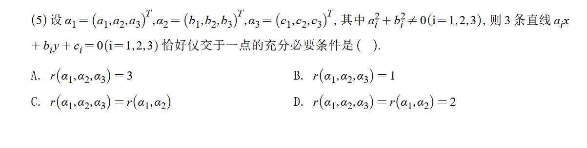
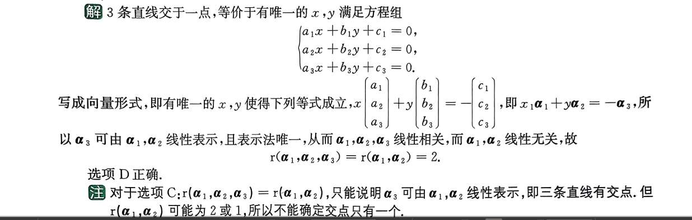
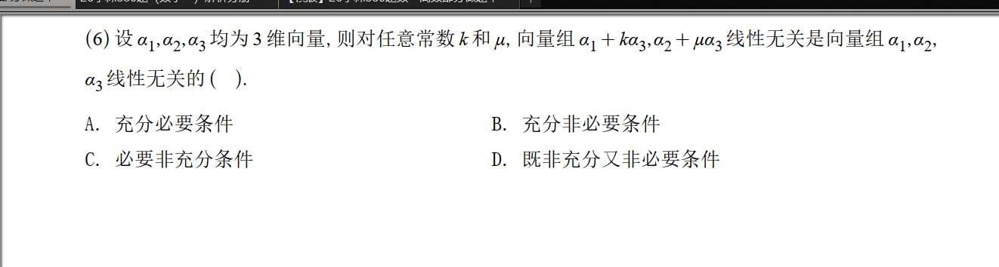
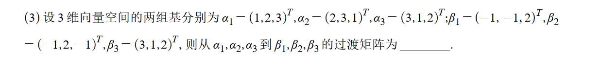

# 1

完全理解你的感受！线性代数最容易让人思路打结的地方，就是同一个问题可以在“方程组”、“向量的线性组合（列视角）”和“空间几何（行视角）”之间来回横跳。当你脑子里同时涌现这些方法时，就很容易乱。

其实，你的直觉非常敏锐，你提到的**两种思路完全都是对的**，只是缺乏最后一步将它们与“矩阵的秩（Rank）”联系起来的理论桥梁。我们来把你脑海中这两团乱麻彻底理顺。

### 思路一：最清晰的“非齐次线性方程组”视角（考试最稳妥）

既然是求交点，最直接的想法就是解方程组。把 3 条直线的方程写出来：

$$a_1x + b_1y = -c_1$$

$$a_2x + b_2y = -c_2$$

$$a_3x + b_3y = -c_3$$

将这个方程组写成矩阵和向量的形式。注意题目中给的 $\alpha_1, \alpha_2, \alpha_3$ 都是列向量，正好对应这里的系数列：

$$(\alpha_1, \alpha_2) \begin{pmatrix} x \\ y \end{pmatrix} = -\alpha_3$$

这就是你提到的“把方程组化为矩阵”的列视角。

题目要求“3 条直线**恰好仅交于一点**”，翻译成代数语言就是：**这个非齐次线性方程组有且仅有唯一解**。

根据线性方程组的解的判定定理（Rouché-Capelli 定理），方程组有唯一解的充要条件是：

**系数矩阵的秩 = 增广矩阵的秩 = 未知数的个数**

- **未知数个数**：2 个（$x$ 和 $y$）。
    
- **系数矩阵的秩**：$r(\alpha_1, \alpha_2)$。
    
- **增广矩阵的秩**：$r(\alpha_1, \alpha_2, -\alpha_3)$。矩阵的某一行或某一列乘上一个非零常数（这里是 -1），不改变矩阵的秩，所以它等于 $r(\alpha_1, \alpha_2, \alpha_3)$。
    

综合起来，充要条件就是：

$$r(\alpha_1, \alpha_2, \alpha_3) = r(\alpha_1, \alpha_2) = 2$$

这就直接锁定了答案 **D**。

---

### 思路二：你提到的 $(x, y, 1)^T$ 视角（非常高级的齐次方程组视角）

你说“直接列线 1+线 2+线 3=0，然后提取出 $x, y, 1$ 这个向量”，这是一个非常具有几何直觉的绝佳思路（在射影几何中经常用到）。你的想法可以转化为如下的齐次线性方程组：

$$\begin{pmatrix} a_1 & b_1 & c_1 \\ a_2 & b_2 & c_2 \\ a_3 & b_3 & c_3 \end{pmatrix} \begin{pmatrix} x \\ y \\ 1 \end{pmatrix} = \begin{pmatrix} 0 \\ 0 \\ 0 \end{pmatrix}$$

这也就可以写成：

$$(\alpha_1, \alpha_2, \alpha_3) \begin{pmatrix} x \\ y \\ 1 \end{pmatrix} = \mathbf{0}$$

设矩阵 $M = (\alpha_1, \alpha_2, \alpha_3)$。这说明向量 $(x, y, 1)^T$ 是齐次方程组 $MX = \mathbf{0}$ 的一个**非零解**。

既然方程组有非零解，说明系数矩阵的列向量必定线性相关，所以 $r(M) < 3$。

那么秩到底是 1 还是 2 呢？

- 题目要求“恰好仅交于一点”，这意味着满足上述方程的 $(x, y)$ 是唯一的。
    
- 既然 $(x, y)$ 唯一，说明方程组 $MX = \mathbf{0}$ 的基础解系中只能有 1 个线性无关的向量（解空间的维度为 1）。
    
- 根据**秩-零化度定理（Rank-Nullity Theorem）**：矩阵的秩 + 解空间的维度 = 矩阵的列数。
    
    即：$r(M) + 1 = 3$，所以推导出 **$r(\alpha_1, \alpha_2, \alpha_3) = 2$**。
    

那为什么还要补充 $r(\alpha_1, \alpha_2) = 2$ 呢？

因为如果 $r(\alpha_1, \alpha_2) < 2$（比如等于 1），就意味着前两列（也就是法向量）成比例。几何上这就代表 3 条直线是相互平行的（或者重合的），根本不可能“交于唯一一点”。所以必须保证代表 $x$ 和 $y$ 系数的前两列线性无关。

所以在这个视角下，结论依然是：

$$r(\alpha_1, \alpha_2, \alpha_3) = r(\alpha_1, \alpha_2) = 2$$

### 总结

你的思路根本没有乱，只是你同时走上了两条正确的路。

- **第一条路（非齐次视角）** 走到底，利用“唯一解的判定条件”直接得出答案。
    
- **第二条路（齐次视角）** 走到底，利用“解空间维度为 1”得出结论。
    

面对这种选择题，**思路一**是最稳、最不用绕弯子的。正确答案是 **D**。下次遇到类似问题，牢牢抓住“未知数个数”和“秩”的关系，直接套定理，就能瞬间破局！

# 2

化成矩阵是非常好的思路！这说明你已经掌握了把向量组的线性组合转化为矩阵乘法的核心技巧。卡在这通常是因为把命题转化为矩阵的秩之后，不知道怎么用秩的性质去推导。

我们顺着你的思路，把这层窗户纸捅破。

首先，按你的思路写出矩阵乘法形式：

$$(\alpha_1 + k\alpha_3, \alpha_2 + \mu\alpha_3) = (\alpha_1, \alpha_2, \alpha_3) \begin{pmatrix} 1 & 0 \\ 0 & 1 \\ k & \mu \end{pmatrix}$$

为了方便讨论，我们设：

- $A = (\alpha_1, \alpha_2, \alpha_3)$，这是一个 $3 \times 3$ 的矩阵。
    
- $C = \begin{pmatrix} 1 & 0 \\ 0 & 1 \\ k & \mu \end{pmatrix}$，这是一个 $3 \times 2$ 的矩阵。注意，它的前两行是二阶单位阵，所以无论 $k$ 和 $\mu$ 取什么值，**矩阵 $C$ 的列向量始终线性无关，即 $r(C) = 2$**。
    

现在，我们把题目中的两个条件翻译成“矩阵的秩”的语言：

- **条件 P（前面的条件）：** 向量组 $\alpha_1 + k\alpha_3, \alpha_2 + \mu\alpha_3$ 线性无关 $\iff r(AC) = 2$。
    
- **条件 Q（后面的条件）：** 向量组 $\alpha_1, \alpha_2, \alpha_3$ 线性无关 $\iff r(A) = 3$。
    

题目问的是：条件 P 是条件 Q 的什么条件？我们需要分别验证“充分性（$P \Rightarrow Q$）”和“必要性（$Q \Rightarrow P$）”。

### 1. 验证必要性（$Q \Rightarrow P$）

**逻辑：** 假设 $r(A) = 3$，能否推出必定有 $r(AC) = 2$？

- 如果 $r(A) = 3$，说明矩阵 $A$ 是满秩的（可逆的）。
    
- 根据矩阵秩的性质，用一个可逆矩阵去乘另一个矩阵，不会改变它的秩。
    
- 所以 $r(AC) = r(C) = 2$。
    
- 这说明，只要 $\alpha_1, \alpha_2, \alpha_3$ 线性无关，无论 $k, \mu$ 怎么取，组合后的两个向量必定线性无关。**必要性成立。**
    

### 2. 验证充分性（$P \Rightarrow Q$）

**逻辑：** 假设对任意的 $k, \mu$ 都有 $r(AC) = 2$，能否反推断定 $r(A)$ 必定等于 $3$？

- 根据矩阵乘积的秩的不等式：$r(AC) \le \min(r(A), r(C))$。
    
- 我们已知 $r(AC) = 2$，所以 $2 \le r(A)$。
    
- 因为 $A$ 是 $3 \times 3$ 矩阵，所以 $r(A)$ 可能等于 $2$，也可能等于 $3$。它**不一定**非得是 $3$。
    

**举个极端的反例：**

假设 $\alpha_3 = \mathbf{0}$（零向量），且 $\alpha_1, \alpha_2$ 线性无关。此时 $r(A) = 2$。

那么 $\alpha_1 + k\alpha_3$ 其实就是 $\alpha_1$，$\alpha_2 + \mu\alpha_3$ 其实就是 $\alpha_2$。

无论 $k, \mu$ 取什么常数，这两个组合后的向量就是 $\alpha_1, \alpha_2$，它们当然是线性无关的（满足条件 P）。

但是，因为 $\alpha_3$ 是零向量，包含零向量的向量组 $\alpha_1, \alpha_2, \alpha_3$ 必然是线性相关的（不满足条件 Q）。

这说明由条件 P 推不出条件 Q，**充分性不成立。**

### 总结

由后面的条件可以推出前面的条件，但前面的条件推不出后面的条件。因此，这是一个**必要非充分条件**。

正确答案选 **C**。

下次遇到这种题，化完矩阵后，直接套用 **$r(AB) \le \min(r(A), r(B))$** 或者 **举一个包含零向量的极端反例**，思路就能立刻豁然开朗了。

# 3

### 巧妙解法：直接观察向量之间的关系

我们把题目中的向量列出来比对一下：

$\alpha_1 = (1, 2, 3)^T$

$\alpha_2 = (2, 3, 1)^T$

$\alpha_3 = (3, 1, 2)^T$

$\beta_1 = (-1, -1, 2)^T$

$\beta_2 = (-1, 2, -1)^T$

$\beta_3 = (3, 1, 2)^T$

仔细观察 $\beta$ 组和 $\alpha$ 组的坐标，你会发现它们之间有着非常简单的加减关系：

1. 你看 $\beta_1$：$1-2=-1, 2-3=-1, 3-1=2$，恰好等于 $\alpha_1 - \alpha_2$！
    
    即：**$\beta_1 = 1\alpha_1 - 1\alpha_2 + 0\alpha_3$**
    
2. 你看 $\beta_2$：$2-3=-1, 3-1=2, 1-2=-1$，恰好等于 $\alpha_2 - \alpha_3$！
    
    即：**$\beta_2 = 0\alpha_1 + 1\alpha_2 - 1\alpha_3$**
    
3. 你看 $\beta_3$：它和 $\alpha_3$ 一模一样！
    
    即：**$\beta_3 = 0\alpha_1 + 0\alpha_2 + 1\alpha_3$**
    

过渡矩阵的本质，就是把新的基向量（$\beta$）用旧的基向量（$\alpha$）线性表示出来的**系数矩阵（按列排列）**。

既然我们已经一眼看出了线性组合的系数，直接把这些系数作为列向量写下来，就是要求的过渡矩阵：

$$P = \begin{pmatrix} 1 & 0 & 0 \\ -1 & 1 & 0 \\ 0 & -1 & 1 \end{pmatrix}$$

就这样，完全不需要求逆矩阵，10 秒钟就能得出答案！

---

### 补充：如果考试时没看出来规律怎么办？

如果你在考场上一时紧张，没看出这种巧妙的线性关系，也**绝对不要去求逆矩阵**再相乘。

求 $P = A^{-1}B$ 最稳妥、最不容易出错的“硬算”方法是构造分块矩阵并使用**初等行变换**：

把 $A$ 和 $B$ 拼成一个增广矩阵 $(A | B)$：

$$\begin{pmatrix} 1 & 2 & 3 & | & -1 & -1 & 3 \\ 2 & 3 & 1 & | & -1 & 2 & 1 \\ 3 & 1 & 2 & | & 2 & -1 & 2 \end{pmatrix}$$

然后只做**初等行变换**，想办法把左边的 $A$ 化为单位矩阵 $E$。当左边变成 $E$ 时，右边自然就变成了 $A^{-1}B$，也就是过渡矩阵 $P$：

$$(A | B) \xrightarrow{\text{初等行变换}} (E | A^{-1}B) = (E | P)$$

这种方法只涉及加减乘除，比“求行列式 $\to$ 求伴随矩阵 $\to$ 矩阵相乘”的流程要快得多，也更不容易踩坑。