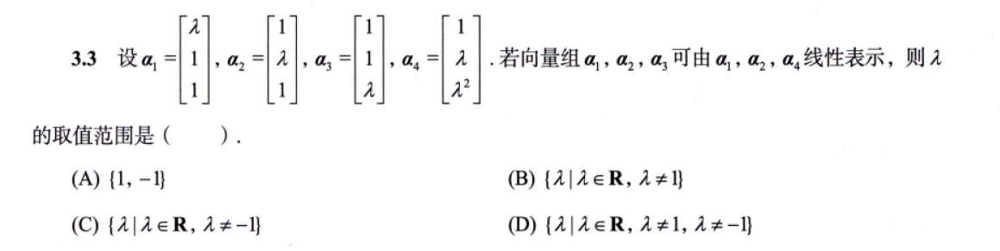
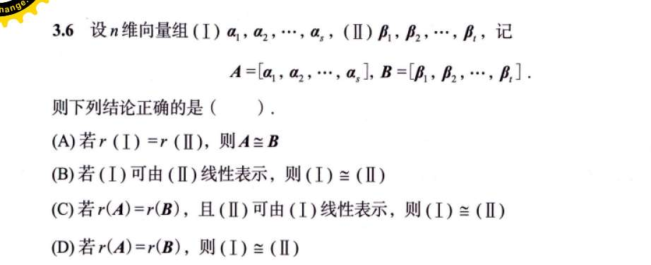
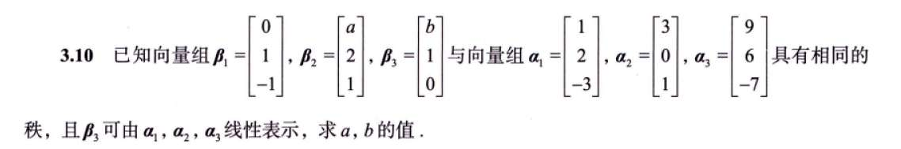
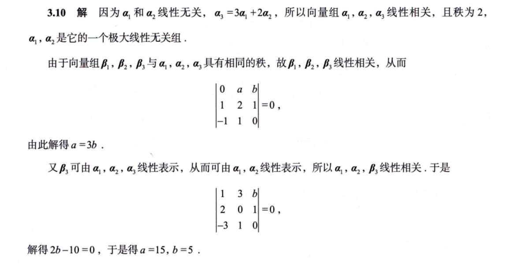

# 习题
## 3 转换条件

题目说：向量组 $\alpha_1, \alpha_2, \alpha_3$ 可由 $\alpha_1, \alpha_2, \alpha_4$ 线性表示。

你看，这两组人马里，都有 $\alpha_1$ 和 $\alpha_2$！

- $\alpha_1$ 当然能被 $\alpha_1$ 表示（$1 \cdot \alpha_1$）。
    
- $\alpha_2$ 当然能被 $\alpha_2$ 表示（$1 \cdot \alpha_2$）。
    
    所以，这句话前面全都是废话，它真正核心的意思只有一句：
    
    **$\alpha_3$ 必须能被 $\alpha_1, \alpha_2, \alpha_4$ 线性表示！**
    

这就好办了。我们的目标变成了：寻找 $\lambda$，使得 $\alpha_3$ 能够拼凑进 $\alpha_1, \alpha_2, \alpha_4$ 的队伍里。

---

既然大家都是 3 维向量（有 3 个数字），这里有一个极其暴力的判断逻辑：

如果我们把用来做原材料的三个向量 $\alpha_1, \alpha_2, \alpha_4$ 拼成一个 $3 \times 3$ 的矩阵 $B$。

- 如果这三个向量**线性无关**（即 $|B| \neq 0$），这就意味着它们撑起了一个完整的 3D 宇宙！既然它们撑起了整个宇宙，那宇宙里的**任何**一个向量（当然也包括 $\alpha_3$）都绝对能被它们表示出来！
    

我们立刻来算一下这三个原材料组成的行列式：

$$|B| = \begin{vmatrix} \lambda & 1 & 1 \\ 1 & \lambda & \lambda \\ 1 & 1 & \lambda^2 \end{vmatrix}$$

这个行列式怎么算最快？把第 2 列减去第 3 列，制造两个 0：

$$|B| = \begin{vmatrix} \lambda & 0 & 1 \\ 1 & 0 & \lambda \\ 1 & 1-\lambda^2 & \lambda^2 \end{vmatrix}$$

按第 2 列展开：

$$|B| = -(1-\lambda^2) \begin{vmatrix} \lambda & 1 \\ 1 & \lambda \end{vmatrix} = (\lambda^2-1)(\lambda^2-1) = \mathbf{(\lambda^2-1)^2}$$

**阶段性结论：**

只要 $(\lambda^2-1)^2 \neq 0$，即 **$\lambda \neq 1$ 且 $\lambda \neq -1$** 时，这三个原材料就能撑起整个空间，$\alpha_3$ 就一定能被表示。

看到这里，很多同学就会激动地去选 (D)。**千万别急！这正是出题人挖的深坑！**

如果 $|B| = 0$（也就是 $\lambda = 1$ 或 $-1$），只是说明它们撑不起整个 3D 空间，被压扁成了 2D 平面或者 1D 直线。**但是，万一 $\alpha_3$ 刚好也掉在这个被压扁的平面上呢？** 那它依然可以被表示！所以，我们必须把这两个“嫌疑犯”带回现场验证。

- $\alpha_1 = [1, 1, 1]^T$
    
- $\alpha_2 = [1, 1, 1]^T$
    
- $\alpha_3 = [1, 1, 1]^T$
    
- $\alpha_4 = [1, 1, 1]^T$
    
    大家全是一模一样的克隆人！
    
    请问，$\alpha_3$ 能被 $\alpha_1, \alpha_2, \alpha_4$ 表示吗？废话，直接 $\alpha_3 = 1 \cdot \alpha_1$ 就完事了。
    
    所以，**$\lambda = 1$ 是合法的！**（这直接把选项 A、B、D 全部干掉了，答案呼之欲出）。
    

当 $\lambda = -1$ 时**

为了严谨，我们代入看看为什么它不行。

- $\alpha_1 = [-1, 1, 1]^T$
    
- $\alpha_2 = [1, -1, 1]^T$
    
- $\alpha_4 = [1, -1, 1]^T$ （注意，$\alpha_4$ 和 $\alpha_2$ 长得一模一样，是冗余的废话）
    
    我们要用 $\alpha_1$ 和 $\alpha_2$ 去拼凑出 $\alpha_3 = [1, 1, -1]^T$。
    
    设方程：$x\alpha_1 + y\alpha_2 = \alpha_3$
    
    代入前两个坐标：
    
    $$\begin{cases} -x + y = 1 \\ x - y = 1 \end{cases}$$
    
    把这两个式子一加，得到 **$0 = 2$**！
    
    这在数学上叫绝对矛盾，说明根本拼凑不出来！
    
    所以，**$\lambda = -1$ 彻底死亡！**
    

-

- 当 $\lambda \neq \pm 1$ 时，满秩通杀，可以表示。
    
- 当 $\lambda = 1$ 时，大家长一样，可以表示。
    
- 当 $\lambda = -1$ 时，发生矛盾，无法表示。
    

综合起来，$\lambda$ 除了 $-1$ 之外，取其他任何实数都可以。

**答案完美锁定：(C)**！

**总结你的套路：**

以后遇到“含有参数 $\lambda$ 的向量表示问题”，不要去硬解方程组！

1. 找出负责提供材料的向量，算它们的行列式。
    
2. 令行列式不等于 0，得到一个大范围。
    
3. 把让行列式等于 0 的那两个 $\lambda$ 值，直接当成具体数字塞回原题去验证。
    
    这样既不会漏掉答案，也不会陷入复杂的代数计算中！

## 4

矩阵 $A$ 是由 $s$ 个向量拼成的，它是一个 $n \times s$ 的矩阵；矩阵 $B$ 是由 $t$ 个向量拼成的，它是一个 $n \times t$ 的矩阵。题目**根本没有说 $s = t$**！也就是说，这两个矩阵连长得都不一样（列数不同），根本不是“同型矩阵”

- 向量组 I 只有 $x$ 轴：$\begin{bmatrix} 1 \\ 0 \end{bmatrix}$，秩是 1。
    
- 向量组 II 只有 $y$ 轴：$\begin{bmatrix} 0 \\ 1 \end{bmatrix}$，秩是 1。
    
    大家的秩都是 1，但它们活在完全不同的世界里，根本无法互相表示。所以，**秩相等，绝对推不出向量组等价！**

1. (II) 能由 (I) 表示：这意味着 (II) 是用 (I) 的材料造出来的，所以 (II) 的地盘绝对跑不出 (I) 的手掌心，它最多只能和 (I) 一样大，或者比 (I) 小。
    
2. $r(A) = r(B)$：这句话翻译过来就是，(I) 的地盘维度，和 (II) 的地盘维度**完全一样大**。
    

你想想，**(II) 既在 (I) 的圈子里，同时面积又跟 (I) 一模一样大**，那唯一的可能就是什么？**它们俩的圈子完全重合了！**

既然地盘完全重合，那大家手里的材料当然就能**互相表示**

## 5

把线性相关全部转为了行列式等于 0

