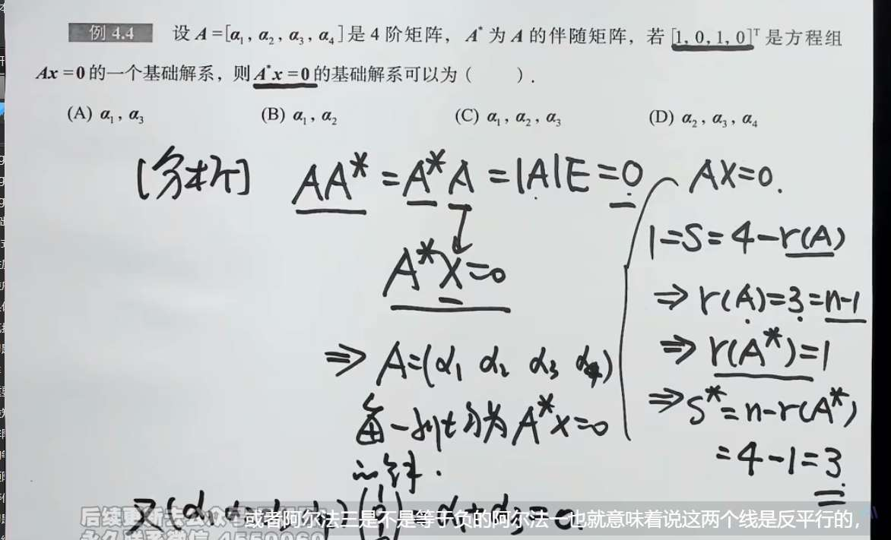
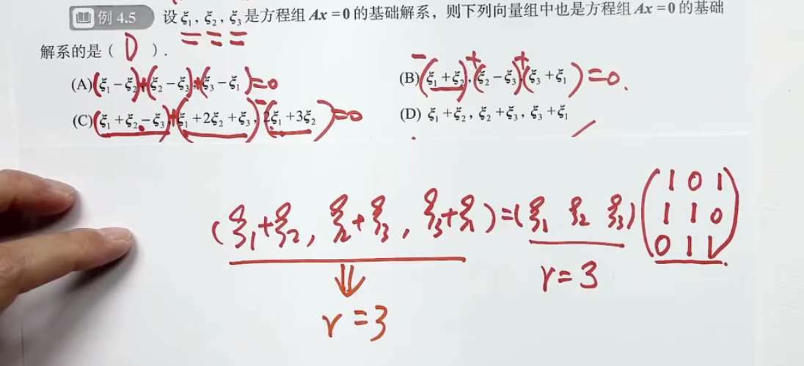
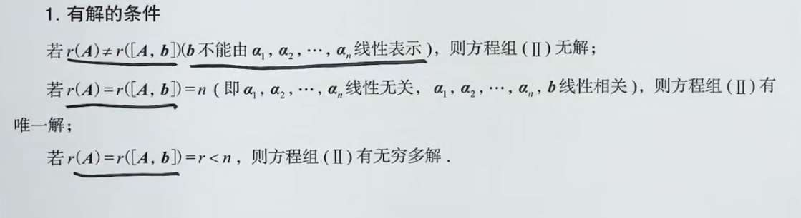

# 齐次线性方程组
- r=n，有唯一零解。此时把矩阵按列视角看，同维映射，映射到 0，只有一个向量能做到。（因为同维映射就是 1 比 1 对应）
- r<n，把高维映射到低维的 0，对应的有高维许多向量。n-r 个线性无关解是？ 举例，3 维映射到二维，有某条线全部映射为 0，所有的解，都可以看作“1 个（3-2 个）”线性无关解的组合（这里是伸缩）... 但 3 维到 1 维我很难想象

基础解系就是，第二种情况下的线性无关向量？
不仅仅是“几个线性无关向量”，而是**极大线性无关组**。刚才那个 3 维到 1 维的例子里，被映射为 0 的是一个平面。你在这个平面上随便找两个不共线（线性无关）的向量 $\xi_1$ 和 $\xi_2$，它们就是基础解系。它们构成了这个平面的“骨架”或“基”。数量必然是 $n-r$ 个。

通解是基础解析的线性组合

### 第一步：化阶梯型矩阵（找“规矩”和“自由人”）

**你在图里看到的：** 矩阵经过一系列加减乘除（初等行变换），变成了带有“阶梯”的样子。非零行有 3 行，所以秩 $r(A) = 3$。

**背后的空间意义：** 原本的矩阵方程看起来乱七八糟，初等行变换的本质是**“换一个更清晰的视角（坐标系）来看这个映射”**。

化成阶梯型后，情况彻底明朗了：

- **找主元（阶梯拐角处的元素）：** 图中的第 1、2、4 列（对应 $x_1, x_2, x_4$）是阶梯的支柱，它们叫**“约束变量”**（或者叫主变量）。它们是被规矩死死限制住的。
    
- **找自由变量（没有台阶的列）：** 图中被红框圈出来的第 3、5 列（对应 $x_3, x_5$），它们头上没有主元压着。它们就是**“自由变量”**。
    

**连接之前的理解：**

5 维空间，秩是 3（保留了 3 个维度的规矩）。$5 - 3 = 2$，说明有 2 个维度被“压扁”了，变成了自由的空间。**这 $n-r=2$ 个自由变量 $x_3, x_5$，就是用来描述那个被压扁的 2 维空间的坐标！** 因为它们自由，所以你可以随便给它们取值。

---

### 第二步：给自由变量赋值（搭建“骨架”）

**你在图里看到的：** * 图 1 中（老师手写），直接给 $x_3, x_5$ 分别赋值 $(1, 0)$ 和 $(0, 1)$。

- 图 2 中（讲义），稍微变了个花样，令 $x_3 = k_1$，$x_5 = 3k_2$（相当于取了 $(1,0)$ 和 $(0,3)$）。
    

**背后的空间意义：**

既然被压扁的解空间是一个 2 维的平面，我们需要找 2 根“骨架”（基础解系）把它撑起来。

怎么保证找出来的两根骨架是**线性无关**（不在一条直线上）的呢？

最简单粗暴、绝不翻车的方法，就是轮流让自由变量取 1 和 0。

- 第一次：让 $x_3=1, x_5=0$。算出第一个解 $\xi_1$。这代表了解空间里的“x 轴方向”。
    
- 第二次：让 $x_3=0, x_5=1$。算出第二个解 $\xi_2$。这代表了解空间里的“y 轴方向”。
    

_(注：图 2 讲义里故意令 $x_5 = 3k_2$，完全是为了**凑整数**，因为矩阵第三行有个 $3x_4 - x_5 = 0$，如果 $x_5$ 取 1，$x_4$ 就是 $1/3$。为了避免写分数，讲义取了 3。这只是计算技巧，本质还是为了得到两个不共线的向量。)_

---

### 第三步：回代求出所有变量（画出完整的骨架）

**你在图里看到的：** 把确定的 $x_3, x_5$ 的值，代回到阶梯型方程里，算出 $x_4, x_2, x_1$。最终写成了两个长长的列向量 $\xi_1$ 和 $\xi_2$。

**背后的空间意义：**

自由变量 $x_3, x_5$ 只是定下了“基调”，但一个完整的 5 维向量必须有 5 个分量。

“回代”的过程，就是**根据那 3 条没被破坏的规矩（非零行方程），把剩下的分量补齐**。

最终得到的 $\xi_1$ 和 $\xi_2$ 就是在这个 5 维空间中，确确实实指向那个被压扁的 2 维平面的两根标准基向量。

---

### 第四步：写出通解（血肉丰满）

**你在图里看到的：** 最后把解写成 $x = k_1\xi_1 + k_2\xi_2$。

**背后的空间意义：**

骨架搭好了。现在，任何一个想要映射为 0 的 5 维向量，都只能在这个由 $\xi_1$ 和 $\xi_2$ 撑起的 2 维平面里活动。

怎么表达这个平面里的所有点？就是把这两根骨架进行**任意的线性组合**（伸长、缩短、反向、相加）。$k_1, k_2$ 就是组合的比例系数。

### 总结打通：

你看，计算步骤里的每一步，都在完美执行我们之前的理论：

1. **化阶梯求秩** $\rightarrow$ 看看到底降了几维，确立自由度（$n-r$）。
    
2. **挑出自由变量** $\rightarrow$ 找到代表这几个自由维度的坐标轴。
    
3. **取 $(1,0)$ 和 $(0,1)$** $\rightarrow$ 强制提取出**线性无关**的基底向量（骨架）。
    
4. **加上常数 $k$ 组合** $\rightarrow$ 用骨架生成整个解空间（通解）。

## 好题

注意

检验线性无关的方法
# 非齐次方程组

秩不相同，说明根本不在一个空间，无法组合。
秩相同且都小于 n，说明降维
