# 习题

## 1
看 ABCD 谁能用 123 线性表示，
把 123ABCD 拼成横向大矩阵，最终秩与 123 相等的 ok

## 2
**A 选项：为什么错？（致命文字陷阱）**

“等价向量组”的定义是：两个向量组可以互相线性表示。

- **它能保证什么？** 它只能保证这两个向量组撑起的“空间（地盘）”是一样大的。
    
- **它不能保证什么？** 它**不能保证数量和线性无关**！
    
    _举个例子：_ 假设 $\xi_1, \xi_2, \xi_3$ 是基础解系（3 根骨架）。我现在搞一个新向量组 $\xi_1, \xi_2, \xi_3, \xi_1+\xi_2$。这 4 个向量跟原来那 3 个绝对是“等价”的（互相都能表示）。但是，它有 4 个向量，里面混进去了多余的平替，不再是线性无关的了，所以它**绝对不是**基础解系。
    

**C 选项：为什么对？（代数验证）**

我们来查验 C 选项 $\xi_1+\xi_2, \xi_2+\xi_3, \xi_3+\xi_1$ 是否符合那三条铁律：

1. **在解空间里吗？** 齐次方程解的线性组合依然是解。满足。
    
2. **数量对吗？** 刚好是 3 个。满足。
    
3. **线性无关吗？（核心考察点）**
    
    我们把它写成矩阵过渡的形式：
    
    $$[\xi_1+\xi_2, \xi_2+\xi_3, \xi_3+\xi_1] = [\xi_1, \xi_2, \xi_3] \begin{bmatrix} 1 & 0 & 1 \\ 1 & 1 & 0 \\ 0 & 1 & 1 \end{bmatrix}$$
    
    后面这个 $3 \times 3$ 的系数矩阵，我们算一下它的行列式：
    
    $$|P| = 1 \times (1-0) + 1 \times (1-0) = 2 \neq 0$$
    
    因为过渡矩阵满秩（行列式不为 0），说明这三个新向量**保留了原来的独立性**，依然是线性无关的！满足。

## 3
**第一步：非齐次 $\rightarrow$ 齐次（找骨架）**

非齐次方程 $Ax=b$ 的解有一个神仙性质：**任意两个解相减，就变成了齐次方程 $Ax=0$ 的解。**

题目给了 3 个解 $\xi_1, \xi_2, \xi_3$，我们立刻让它们互相减，造出齐次的解：

- 令 $\eta_1 = \xi_2 - \xi_1 = [1-(-9), -5-1, 13-2, 0-11]^T = [10, -6, 11, -11]^T$
    
- 令 $\eta_2 = \xi_3 - \xi_1 = [-7-(-9), -9-1, 24-2, 11-11]^T = [2, -10, 22, 0]^T$
    
    为了计算方便，我们把 $\eta_2$ 除以 2（因为齐次的解乘除一个常数依然是解），得到更清爽的 $\eta_2^* = [1, -5, 11, 0]^T$。
    

显然 $\eta_1$ 和 $\eta_2^*$ 不成比例，它们是 $Ax=0$ 的 **2 个线性无关的解**。

**第二步：维度侦探（确认骨架齐没齐）**

现在我们手里拿到了 2 根齐次的骨架。但这题有 4 个未知数（$n=4$），齐次方程到底需要几根骨架？

根据公式：需要的基础解系个数 $s = 4 - r(A)$。

我们需要去原方程里挖出矩阵 $A$ 的秩 $r(A)$！

回头看题目给的方程组，我们抽出系数矩阵 $A$ 明确知道的列：

$$A = \begin{bmatrix} 2 & a_2 & 3 & a_4 \\ 3 & b_2 & 2 & b_4 \\ 9 & 4 & 1 & c_4 \end{bmatrix}$$

只看第 1 列和第 3 列（对应 $x_1$ 和 $x_3$ 的系数），提取出一个 $2 \times 2$ 的子矩阵：

$$\begin{vmatrix} 2 & 3 \\ 3 & 2 \end{vmatrix} = 4 - 9 = -5 \neq 0$$

既然能找到一个不为 0 的 2 阶子式，说明**矩阵 $A$ 的秩 $r(A) \ge 2$**。

**第三步：逻辑闭环（一锤定音）**

- 因为 $r(A) \ge 2$，所以需要的骨架数 $s = 4 - r(A) \le 2$。
    
- 但我们在第一步已经实打实地找出了 2 根线性无关的骨架 $\eta_1, \eta_2^*$。
    
- 既要 $\le 2$，又已经有了 2 个，说明**解空间的维度就是 2**！我们找出的 $\eta_1, \eta_2^*$ 就是完整的基础解系！
    

**第四步：写出通解**

非齐次方程的通解公式 = 随便挑一个特解 + 齐次基础解系的线性组合。

我们挑最顺眼的 $\xi_2$ 当特解（你用 $\xi_1$ 或 $\xi_3$ 也完全可以），写出终极答案：

$$x = \begin{bmatrix} 1 \\ -5 \\ 13 \\ 0 \end{bmatrix} + k_1 \begin{bmatrix} 10 \\ -6 \\ 11 \\ -11 \end{bmatrix} + k_2 \begin{bmatrix} 1 \\ -5 \\ 11 \\ 0 \end{bmatrix} \quad (k_1, k_2 \text{ 为任意常数})$$

## 4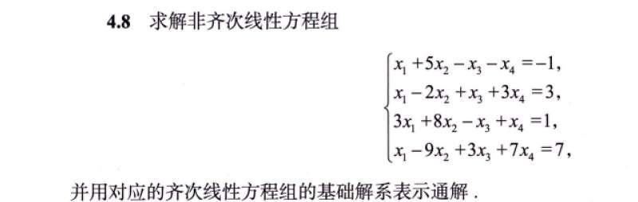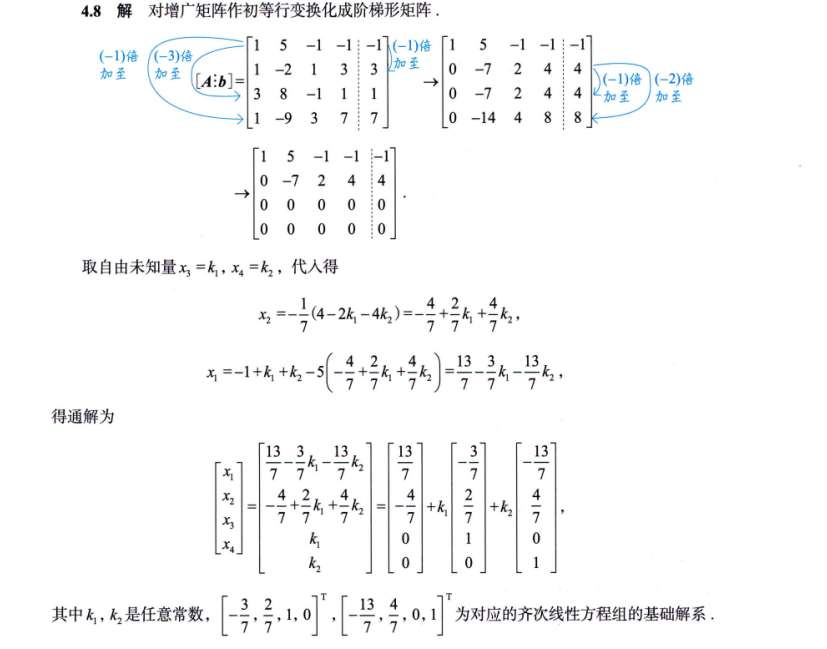
经过一顿加减，得到了一个阶梯型矩阵：

$$\begin{bmatrix} 1 & 5 & -1 & -1 & \vdots & -1 \\ 0 & -7 & 2 & 4 & \vdots & 4 \\ 0 & 0 & 0 & 0 & \vdots & 0 \\ 0 & 0 & 0 & 0 & \vdots & 0 \end{bmatrix}$$

- **非零行有 2 行**：说明秩 $r(A) = r(A|b) = 2$。因为相等，所以方程**必定有解**。
    
- **主元（阶梯拐角）在第 1、2 列**：所以 $x_1, x_2$ 是被约束的变量。
    
- **自由变量在第 3、4 列**：所以 $x_3, x_4$ 是自由变量（自由度为 $4 - 2 = 2$）。
    

### 第三步：见证奇迹的时刻 —— 自动分离！

这是最核心的一步！

答案令自由变量 $x_3 = k_1, x_4 = k_2$。然后**从下往上回代**。

你注意看答案算出的 $x_2$ 和 $x_1$ 的表达式：

- $x_2 = -\frac{4}{7} + \frac{2}{7}k_1 + \frac{4}{7}k_2$
    
- $x_1 = \frac{13}{7} - \frac{3}{7}k_1 - \frac{13}{7}k_2$
    

发现没有？每一个约束变量的表达式里，都自动分成了**两部分**：

1. **不带 $k$ 的纯常数**（比如 $\frac{13}{7}$, $-\frac{4}{7}$）
    
2. **带着自由变量 $k_1, k_2$ 的尾巴**
    

### 第四步：写成列向量，原形毕露

把 $x_1, x_2, x_3, x_4$ 整理成一个大列向量，然后把“常数部分”和“带 $k_1$ 的部分”、“带 $k_2$ 的部分”彻底拆开，就得到了图里最下方那个长长的式子：

$$\begin{bmatrix} x_1 \\ x_2 \\ x_3 \\ x_4 \end{bmatrix} = \underbrace{\begin{bmatrix} 13/7 \\ -4/7 \\ 0 \\ 0 \end{bmatrix}}_{\text{特解 } x^*} + k_1 \underbrace{\begin{bmatrix} -3/7 \\ 2/7 \\ 1 \\ 0 \end{bmatrix}}_{\text{基础解系 } \xi_1} + k_2 \underbrace{\begin{bmatrix} -13/7 \\ 4/7 \\ 0 \\ 1 \end{bmatrix}}_{\text{基础解系 } \xi_2}$$

**为什么说它是一石二鸟？**

- **那个不带 $k$ 的常数向量，就是你原本想要“试”出来的那个特解！** （你可以想象一下，如果令 $k_1=0, k_2=0$，后面的尾巴全没了，剩下的这个向量当然满足原方程，它就是一个特定的解）。
    
- **跟在 $k_1, k_2$ 后面的两个向量，就是齐次方程 $Ax=0$ 的基础解系！**（它们其实就是令 $x_3, x_4$ 分别取 $(1,0)$ 和 $(0,1)$ 时算出来的结果）。
## 5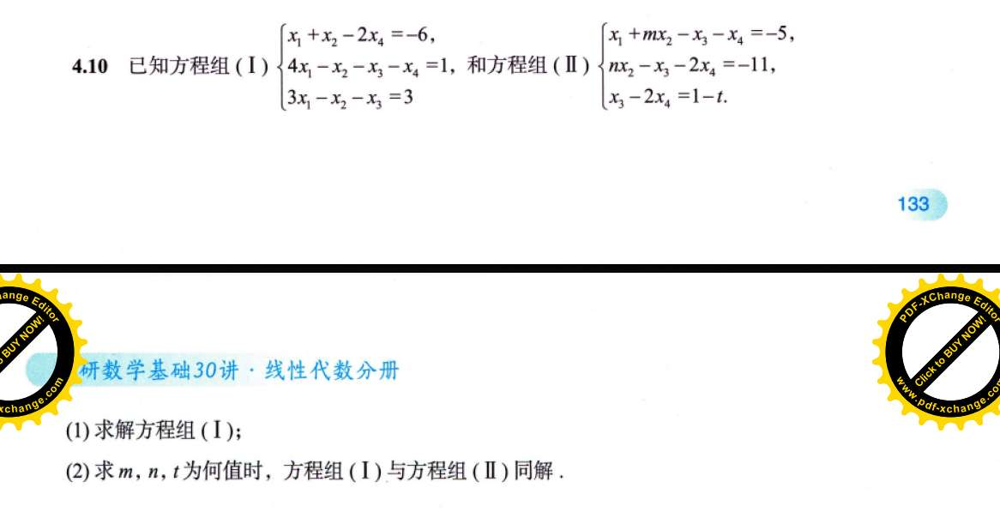

**初始增广矩阵 $[A | b]$：**

$$\begin{bmatrix} 1 & 1 & 0 & -2 & \vdots & -6 \\ 4 & -1 & -1 & -1 & \vdots & 1 \\ 3 & -1 & -1 & 0 & \vdots & 3 \end{bmatrix}$$

**步骤 1：利用第 1 行的 1，消去第 2、3 行的首元。**

$r_2 \leftarrow r_2 - 4r_1$

$r_3 \leftarrow r_3 - 3r_1$

得到：

$$\begin{bmatrix} 1 & 1 & 0 & -2 & \vdots & -6 \\ 0 & -5 & -1 & 7 & \vdots & 25 \\ 0 & -4 & -1 & 6 & \vdots & 21 \end{bmatrix}$$

_（注：通常很多同学在这里为了让第二行首元变 1，直接 $r_2 \div (-5)$，这就导致了 $-1/5, -7/5$ 这种噩梦分数的出现！）_

**步骤 2：利用行与行的加减凑出 1（无分数核心步骤）。**

观察第 2 行和第 3 行，发现 $-5$ 和 $-4$ 刚好相差 $-1$。

$r_2 \leftarrow r_2 - r_3$

得到：

$$\begin{bmatrix} 1 & 1 & 0 & -2 & \vdots & -6 \\ 0 & -1 & 0 & 1 & \vdots & 4 \\ 0 & -4 & -1 & 6 & \vdots & 21 \end{bmatrix}$$

此时，第 2 行顺利出现了漂亮的 $-1$ 且没有任何分数。为了标准，将 $r_2 \leftarrow -r_2$：

$$\begin{bmatrix} 1 & 1 & 0 & -2 & \vdots & -6 \\ 0 & 1 & 0 & -1 & \vdots & -4 \\ 0 & -4 & -1 & 6 & \vdots & 21 \end{bmatrix}$$

**步骤 3：向上向下消元，彻底阶梯化。**

利用第二行的 $1$，消去第一行和第三行的对应元素。

$r_1 \leftarrow r_1 - r_2$

$r_3 \leftarrow r_3 + 4r_2$

得到：

$$\begin{bmatrix} 1 & 0 & 0 & -1 & \vdots & -2 \\ 0 & 1 & 0 & -1 & \vdots & -4 \\ 0 & 0 & -1 & 2 & \vdots & 5 \end{bmatrix}$$

将 $r_3 \leftarrow -r_3$，即得到最简行阶梯形矩阵：

$$\begin{bmatrix} 1 & 0 & 0 & -1 & \vdots & -2 \\ 0 & 1 & 0 & -1 & \vdots & -4 \\ 0 & 0 & 1 & -2 & \vdots & -5 \end{bmatrix}$$

# 1000 题
## 1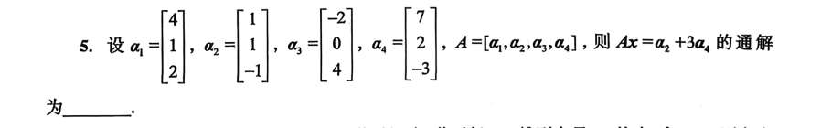
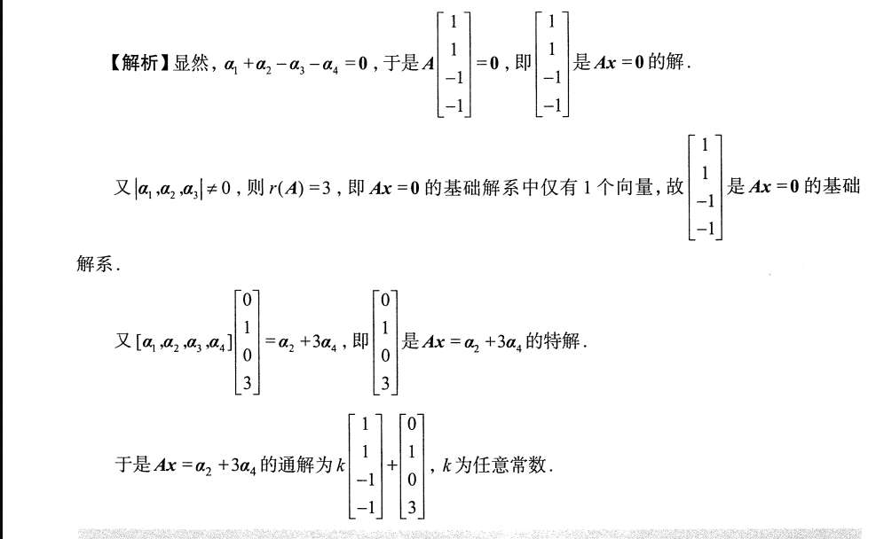
**1. 直接“观察”出特解：**

- 题目要求解的方程是 $Ax = \alpha_2 + 3\alpha_4$。
    
- 对照列向量线性组合的公式，令右侧对应的系数 $x_1=0, x_2=1, x_3=0, x_4=3$。
    
- 这严格满足等式，因此直接写出特解为 $[0, 1, 0, 3]^T$。
    

**2. 直接“观察”出齐次基础解系：**

- 对题目给出的四个具体列向量进行简单的加减运算。发现 $\alpha_1 + \alpha_2 = [5, 2, 1]^T$，而 $\alpha_3 + \alpha_4 = [5, 2, 1]^T$。
    
- 移项得到恒等式：$\alpha_1 + \alpha_2 - \alpha_3 - \alpha_4 = 0$。
    
- 对照齐次方程 $Ax = 0$ 的列组合形式 $x_1\alpha_1 + x_2\alpha_2 + x_3\alpha_3 + x_4\alpha_4 = 0$，提取系数得到解向量 $[1, 1, -1, -1]^T$。
    

**3. 利用子式证明解的完备性：**

- 虽然找到了一个齐次方程的解，但必须证明基础解系**只有**这 1 个向量。
    
- 计算前 3 个列向量构成的 3 阶行列式 $|\alpha_1, \alpha_2, \alpha_3| \neq 0$。
    
- 说明存在 3 阶非零子式，故 $r(A) \ge 3$。因矩阵共 3 行，故 $r(A) = 3$。
    
- 代入基础解系维度公式：$s = n - r(A) = 4 - 3 = 1$。
    
- 这严格证明了解空间维度为 1，我们刚才观察出的 $[1, 1, -1, -1]^T$ 构成了完整的基础解系。
## 2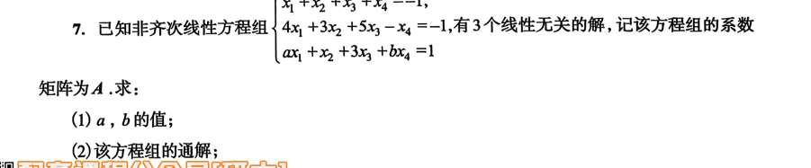
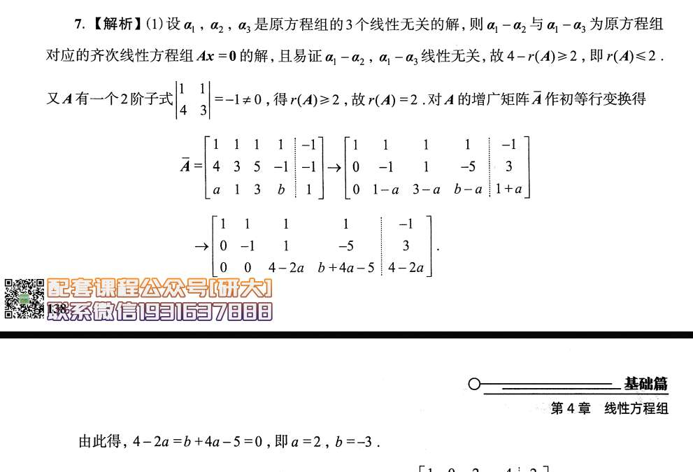必须先明确矩阵秩（Rank）的一个极其严谨的代数等价定义：

**矩阵 $A$ 的秩 $r(A)$，等于该矩阵中不等于零的最高阶子式的阶数。**

这个定义直接提供了一种**确定秩的边界**的代数工具：

- **寻找下界：** 只要你在矩阵中随便挑出一个 $k \times k$ 的子矩阵，算出它的行列式不为 0，那么就可以立刻下结论：$r(A) \ge k$。
    
- **寻找上界：** 如果矩阵是 $m \times n$ 的，那么秩永远不可能超过较小的那个维度，即 $r(A) \le \min(m, n)$。

**1. 求秩的上界（利用解的结构）：**

- **定理：** 非齐次方程组 $Ax=b$ 的任意两个解的差，必然是齐次方程组 $Ax=0$ 的解。
    
- 题目已知有 3 个线性无关的非齐次解 $\alpha_1, \alpha_2, \alpha_3$。
    
- 构造差值向量：$\eta_1 = \alpha_1 - \alpha_2$ 和 $\eta_2 = \alpha_1 - \alpha_3$。根据代数定理，这两个向量必定是 $Ax=0$ 的解，且线性无关。
    
- **维度推演：** 齐次方程组 $Ax=0$ 的基础解系至少包含 2 个向量。根据基础解系维度公式 $s = n - r(A)$，已知未知数个数 $n=4$，可得 $4 - r(A) \ge 2$，严格推导出 **$r(A) \le 2$**。
    

**2. 求秩的下界（利用非零子式）：**

- 在给定的矩阵 $A$ 中，直接取左上角的 $2 \times 2$ 子矩阵。
    
- 计算行列式：$\begin{vmatrix} 1 & 1 \\ 4 & 3 \end{vmatrix} = 3 - 4 = -1 \neq 0$。
    
- 根据刚才讲的定义，既然存在一个 2 阶非零子式，严格推导出 **$r(A) \ge 2$**。
    

**3. 结论：**

既要 $r(A) \le 2$ 又要 $r(A) \ge 2$，得出确切结论 **$r(A) = 2$**。有了秩的具体数值，后续对增广矩阵进行初等变换时，心里就有了明确的目标（最后必然有两行全为 0）。

## 3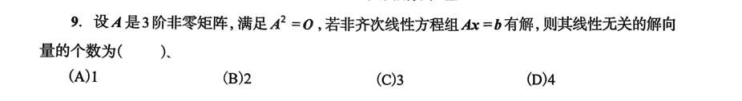
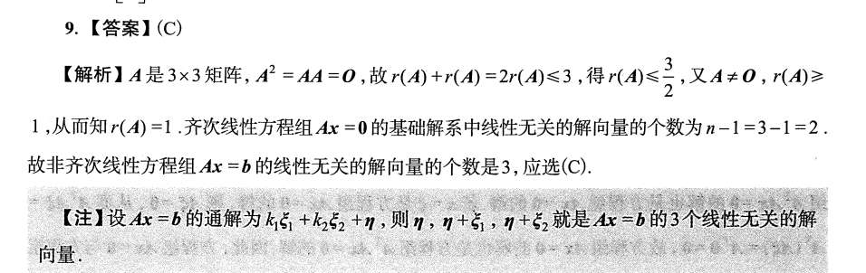
### 步骤一：利用 $A^2 = O$ 严格界定矩阵的秩 $r(A)$

解析的第一句话 $2r(A) \le 3$，直接使用了**西尔维斯特秩不等式**（或者叫矩阵乘积的秩不等式）。

**1. 引入代数定理：**

对于任意 $m \times n$ 矩阵 $A$ 和 $n \times s$ 矩阵 $B$，满足不等式：

$$r(A) + r(B) - n \le r(AB)$$

_(其中 $n$ 为左矩阵的列数或右矩阵的行数)_。

**2. 代入已知条件推演：**

题目已知 $A$ 是 $3 \times 3$ 矩阵，故 $n = 3$。

已知 $A^2 = AA = O$，因此 $r(A^2) = r(O) = 0$。

将 $A, A$ 分别代入上述不等式中的 $A, B$：

$$r(A) + r(A) - 3 \le r(AA)$$

$$2r(A) - 3 \le 0$$

$$r(A) \le \frac{3}{2}$$

由于矩阵的秩 $r(A)$ 必须是非负整数，严格推导出上界：**$r(A) \le 1$**。

**3. 确定下界：**

题目已知 $A$ 是“非零矩阵”（即 $A \neq O$），根据秩的定义，非零矩阵的秩至少为 1。

严格推导出下界：**$r(A) \ge 1$**。

**结论：** 由 $1 \le r(A) \le 1$，确切得出 **$r(A) = 1$**。

---

### 步骤二：利用秩确定基础解系的向量个数

**1. 引入维度公式：**

对于齐次线性方程组 $Ax = 0$，其基础解系中包含的线性无关的解向量个数 $s$，严格等于未知数个数减去系数矩阵的秩。

$$s = n - r(A)$$

**2. 代入推演：**

已知未知数个数 $n = 3$（因为 $A$ 是 3 阶方阵），且 $r(A) = 1$。

$$s = 3 - 1 = 2$$

这证明了齐次方程组 $Ax = 0$ 必定存在 **2 个**线性无关的解向量，记为 $\xi_1, \xi_2$。

---

### 步骤三：构造非齐次方程组的极大线性无关解

这是解析最下方的【注】所表达的核心。它不仅给出了结论，还实际构造出了这 3 个解向量。我们对其进行严格的线性无关性证明。

**1. 构造解向量：**

设 $\eta$ 为非齐次方程 $Ax=b$ 的一个特解（即满足 $A\eta = b$）。

根据非齐次解的结构定理，构造以下 3 个向量：

- $\alpha_1 = \eta$
    
- $\alpha_2 = \eta + \xi_1$
    
- $\alpha_3 = \eta + \xi_2$
    
    （易证这 3 个向量分别乘以 $A$ 的结果均为 $b$，故它们都是 $Ax=b$ 的解）。
    

**2. 证明它们线性无关：**

设有实数 $k_1, k_2, k_3$ 使得：

$$k_1\alpha_1 + k_2\alpha_2 + k_3\alpha_3 = 0$$

展开并重新组合：

$$k_1\eta + k_2(\eta + \xi_1) + k_3(\eta + \xi_2) = 0$$

$$(k_1 + k_2 + k_3)\eta + k_2\xi_1 + k_3\xi_2 = 0 \quad \text{--- (式1)}$$

对方程两边同时左乘矩阵 $A$：

$$A[(k_1 + k_2 + k_3)\eta + k_2\xi_1 + k_3\xi_2] = A0$$

$$(k_1 + k_2 + k_3)A\eta + k_2A\xi_1 + k_3A\xi_2 = 0$$

由于 $A\eta = b$，且 $\xi_1, \xi_2$ 是齐次解（$A\xi_1=0, A\xi_2=0$），代入得：

$$(k_1 + k_2 + k_3)b = 0$$

因为题目说明是“非齐次线性方程组”，严格隐含常数项 $b \neq 0$。因此：

$$k_1 + k_2 + k_3 = 0$$

将此条件代回 **(式 1)**，导致含 $\eta$ 的项被消去：

$$0\eta + k_2\xi_1 + k_3\xi_2 = 0$$

$$k_2\xi_1 + k_3\xi_2 = 0$$

由于步骤二已证明 $\xi_1, \xi_2$ 是基础解系，它们必然**线性无关**。因此：

$$k_2 = 0, \quad k_3 = 0$$

再结合 $k_1 + k_2 + k_3 = 0$，得出：

$$k_1 = 0$$

**结论：** 既然 $k_1 = k_2 = k_3 = 0$ 是唯一解，严格证明了构造出的 $\alpha_1, \alpha_2, \alpha_3$ 这 3 个解向量是**线性无关**的。

**拓展定理：** 在代数中，对于非齐次线性方程组 $Ax=b$，其线性无关的解向量的最大个数永远恒等于 **$n - r(A) + 1$**。在这道题中，即为 $3 - 1 + 1 = 3$。

## 4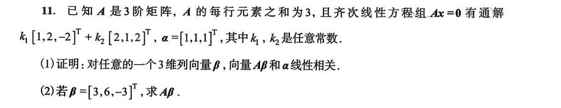
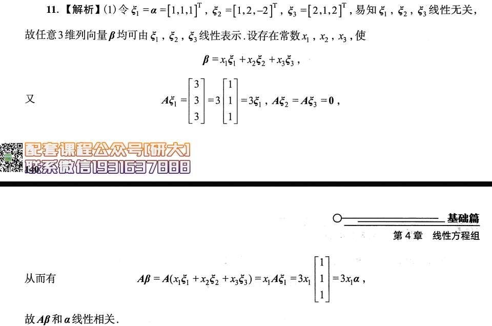**步骤 1：翻译“行元素之和”的隐藏条件**

题目已知“$A$ 的每行元素之和为 3”。

将其翻译为严格的矩阵乘法：若用 $A$ 乘以列向量 $[1, 1, 1]^T$，结果向量的第一行恰好是 $A$ 第一行元素之和，第二行是第二行之和，以此类推。

$$A \begin{bmatrix} 1 \\ 1 \\ 1 \end{bmatrix} = \begin{bmatrix} 3 \\ 3 \\ 3 \end{bmatrix} = 3 \begin{bmatrix} 1 \\ 1 \\ 1 \end{bmatrix}$$

令 $\alpha = [1, 1, 1]^T$，则得到关键的代数性质：**$A\alpha = 3\alpha$**。

**步骤 2：利用齐次方程收集“零效”向量**

题目已知 $Ax=0$ 的通解。直接提取其基础解系：

$\xi_2 = [1, 2, -2]^T, \quad \xi_3 = [2, 1, 2]^T$

这两个向量代入原方程必定成立，故得到性质：**$A\xi_2 = 0, \quad A\xi_3 = 0$**。

**步骤 3：验证基的完备性并表示任意向量**

现已集齐 3 个向量 $\alpha, \xi_2, \xi_3$。计算它们构成的行列式，确认其不为零（线性无关）。

既然在 3 维空间中找到了 3 个线性无关的向量，它们就构成了一组基。

因此，**任意**三维向量 $\beta$ 必然可以被这组基线性表出：

$$\beta = x_1\alpha + x_2\xi_2 + x_3\xi_3$$

**步骤 4：施加线性变换得出结论**

对等式两边同时左乘矩阵 $A$：

$$A\beta = A(x_1\alpha + x_2\xi_2 + x_3\xi_3)$$

利用矩阵乘法的线性分配律展开：

$$A\beta = x_1(A\alpha) + x_2(A\xi_2) + x_3(A\xi_3)$$

代入前两步已知的结果 ($A\alpha=3\alpha$ 且后两项为 0)：

$$A\beta = x_1(3\alpha) + 0 + 0 = 3x_1\alpha$$

因为 $x_1$ 是常数，故 $A\beta$ 是 $\alpha$ 的标量倍数，严格证明了两者线性相关。

---

### 三、解题思维模型总结（如何自己想到这种思路）

遇到抽象的矩阵变换和“任意向量”的证明题，你需要建立以下代数条件反射：

- **思维触发点 1：条件翻译。**
    
    看到“行和为常数 $k$”或“列和为常数 $k$”，必须立刻在草稿纸上写出它的矩阵乘法等价形式。
    
    - 每行元素之和为 $k$ $\iff A[1, 1, \dots, 1]^T = k[1, 1, \dots, 1]^T$。
        
    - 这为你无偿提供了一个**已知映射结果的向量**。
        
- **思维触发点 2：任意向量的基底化。**
    
    只要题目出现“对任意 $n$ 维向量 $\beta$ 证明某性质”或“求 $A\beta$”，绝对不要设 $\beta = [x, y, z]^T$ 去硬算未知矩阵 $A$。
    
    正确的代数操作是：**寻找 $n$ 个线性无关的向量构成基底**。
    
- **思维触发点 3：零空间的利用价值。**
    
    寻找基底时，优先去齐次方程 $Ax=0$ 的基础解系里“进货”。因为这些向量带入乘法后结果为 $0$，会使后续的多项式极大简化。

## 5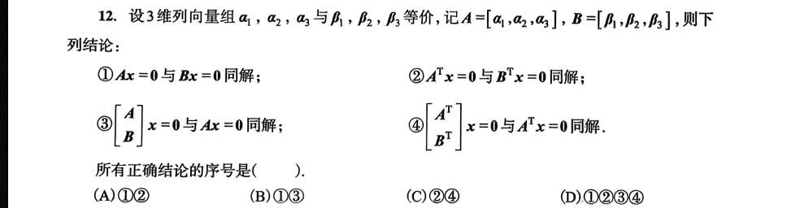
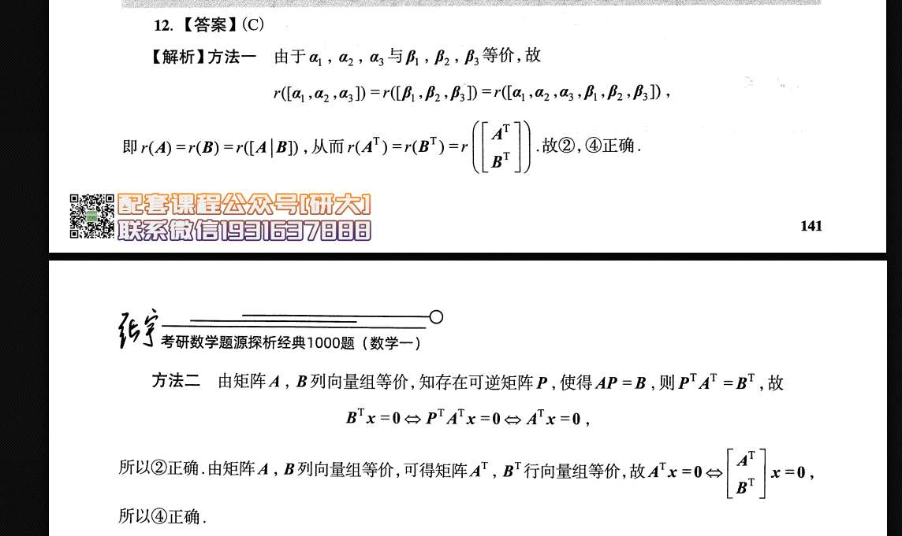

## 6
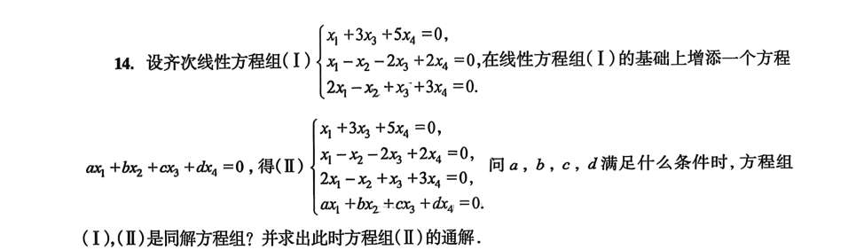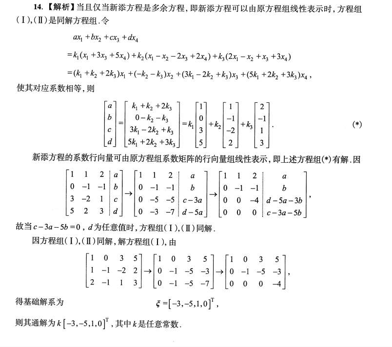

## 6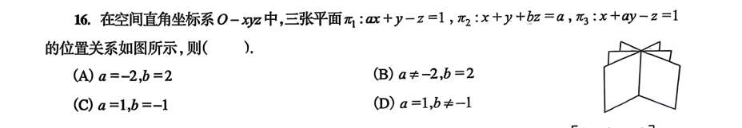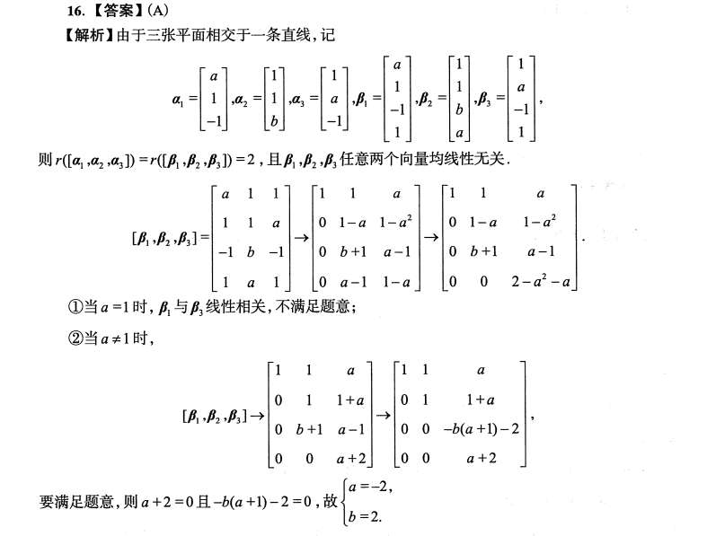1. **三面共线（交于一条直线）：**
    
- **代数翻译：** 该方程组有无穷多解，且解空间（直线）是一维的。
	
- **秩的约束：** 根据基础解系维数公式 $s = n - r(A)$，已知空间维度 $n=3$，解空间维度 $s=1$，严格推导出系数矩阵的秩 **$r(A) = 3 - 1 = 2$**。
	
- 同时，因为方程组必须“有解”（真实交于一线），根据克罗内克-卡佩利定理，增广矩阵的秩必须等于系数矩阵的秩，即 **$r(\bar{A}) = 2$**。
        
2. **三张平面互不重合：**
    
    - **代数翻译：** 没有任何两个平面的法向量及常数项是完全成比例的。
        
    - 解析中提到的“$\beta_1, \beta_2, \beta_3$ 任意两个向量均线性无关”，就是在代数上排除了“两平面平行或重合”的退化情况。
        

### 第二步：读懂解析中的构造矩阵

解析中提取了 $\beta_1, \beta_2, \beta_3$。仔细观察，这三个列向量实际上是三张平面方程的系数和常数项拼成的，也就是**增广矩阵 $\bar{A}$ 的行向量的转置**。

$$[\beta_1, \beta_2, \beta_3] = \bar{A}^T = \begin{bmatrix} a & 1 & 1 \\ 1 & 1 & a \\ -1 & b & -1 \\ 1 & a & 1 \end{bmatrix}$$

**核心逻辑：** 矩阵转置不改变秩。所以，要使原增广矩阵 $r(\bar{A}) = 2$，等价于求这个 $4 \times 3$ 的新矩阵 $r([\beta_1, \beta_2, \beta_3]) = 2$。

### 第三步：初等行变换与条件逼近

接下来就是对这个 $4 \times 3$ 矩阵进行初等行变换，目标是**将其化为阶梯型，并强迫第 3、第 4 行全部为 0（以保证秩恰好为 2）**。

**1. 初步消元（解析的第一步箭头）：**

将第 2 行换到第 1 行（为了用首元的 1 进行消元），然后通过加减操作把第 1 列下方的元素全部化为 0。

- 第 2 行变为了 $[0, 1-a, 1-a^2]$
    
- 第 4 行变为了 $[0, a-1, 1-a]$
    
- 解析在此处做了一个隐藏操作：将新的第 2 行加到第 4 行上，即 $[0, (a-1)+(1-a), (1-a)+(1-a^2)]$，从而得到第 4 行为 $[0, 0, 2-a-a^2]$。
    

**2. 排除 $a=1$ 的陷阱：**

- 如果 $a=1$，代入原平面方程会发现 $\pi_1: x+y-z=1$ 且 $\pi_3: x+y-z=1$。这意味着第一张和第三张平面**完全重合**了！
    
- 这违背了图中“三张独立平面”的几何事实。因此在代数上直接断定 $a \neq 1$。
    

**3. 最终化简与参数求解（解析的第二步箭头）：**

既然 $a \neq 1$，就可以大胆地用 $(1-a)$ 除以第 2 行，将其化简为 $[0, 1, 1+a]$。

此时矩阵变为：

$$\begin{bmatrix} 1 & 1 & a \\ 0 & 1 & 1+a \\ 0 & b+1 & a-1 \\ 0 & 0 & a+2 \end{bmatrix}$$

_(注：第 4 行的 $2-a-a^2 = -(a+2)(a-1)$，除以 $1-a$ 后即变为 $a+2$)_。

为了利用第 2 行的 $1$ 消去第 3 行首元，执行操作：第 3 行 $- (b+1) \times$ 第 2 行。

计算最后那个元素：$(a-1) - (b+1)(1+a) = a - 1 - (ab + a + b + 1) = -ab - b - 2 = -b(a+1) - 2$。

得到终极阶梯型矩阵：

$$\begin{bmatrix} 1 & 1 & a \\ 0 & 1 & 1+a \\ 0 & 0 & -b(a+1)-2 \\ 0 & 0 & a+2 \end{bmatrix}$$

**4. 锁定答案：**

为了保证这个矩阵的秩严格为 $2$，阶梯中不能有第三个非零行。因此，后两行的元素必须强制等于 $0$：

$$\begin{cases} a + 2 = 0 \\ -b(a+1) - 2 = 0 \end{cases}$$

解得：**$a = -2$**。将其代入第二个式子：$-b(-2+1) - 2 = 0 \implies b - 2 = 0 \implies$ **$b = 2$**