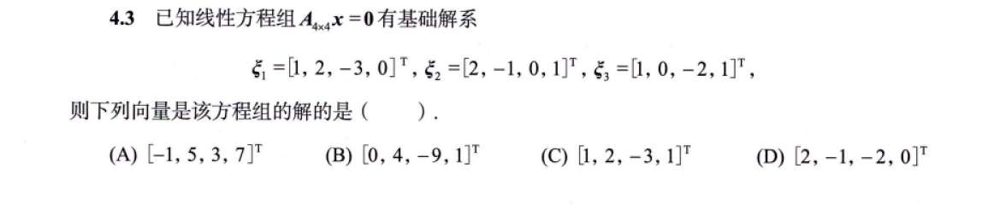
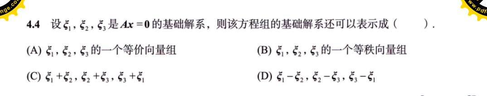
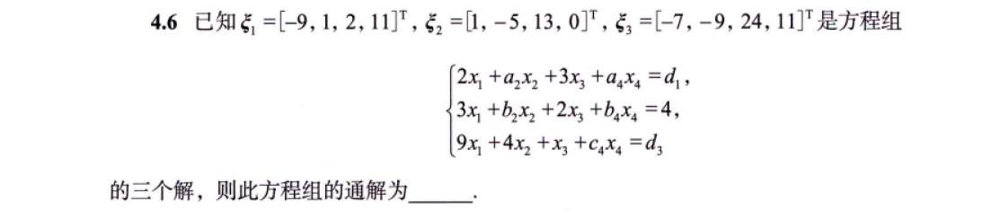

# 习题

## 1
看 ABCD 谁能用 123 线性表示，
把 123ABCD 拼成横向大矩阵，最终秩与 123 相等的 ok

## 2
**A 选项：为什么错？（致命文字陷阱）**

“等价向量组”的定义是：两个向量组可以互相线性表示。

- **它能保证什么？** 它只能保证这两个向量组撑起的“空间（地盘）”是一样大的。
    
- **它不能保证什么？** 它**不能保证数量和线性无关**！
    
    _举个例子：_ 假设 $\xi_1, \xi_2, \xi_3$ 是基础解系（3 根骨架）。我现在搞一个新向量组 $\xi_1, \xi_2, \xi_3, \xi_1+\xi_2$。这 4 个向量跟原来那 3 个绝对是“等价”的（互相都能表示）。但是，它有 4 个向量，里面混进去了多余的平替，不再是线性无关的了，所以它**绝对不是**基础解系。
    

**C 选项：为什么对？（代数验证）**

我们来查验 C 选项 $\xi_1+\xi_2, \xi_2+\xi_3, \xi_3+\xi_1$ 是否符合那三条铁律：

1. **在解空间里吗？** 齐次方程解的线性组合依然是解。满足。
    
2. **数量对吗？** 刚好是 3 个。满足。
    
3. **线性无关吗？（核心考察点）**
    
    我们把它写成矩阵过渡的形式：
    
    $$[\xi_1+\xi_2, \xi_2+\xi_3, \xi_3+\xi_1] = [\xi_1, \xi_2, \xi_3] \begin{bmatrix} 1 & 0 & 1 \\ 1 & 1 & 0 \\ 0 & 1 & 1 \end{bmatrix}$$
    
    后面这个 $3 \times 3$ 的系数矩阵，我们算一下它的行列式：
    
    $$|P| = 1 \times (1-0) + 1 \times (1-0) = 2 \neq 0$$
    
    因为过渡矩阵满秩（行列式不为 0），说明这三个新向量**保留了原来的独立性**，依然是线性无关的！满足。

## 3
**第一步：非齐次 $\rightarrow$ 齐次（找骨架）**

非齐次方程 $Ax=b$ 的解有一个神仙性质：**任意两个解相减，就变成了齐次方程 $Ax=0$ 的解。**

题目给了 3 个解 $\xi_1, \xi_2, \xi_3$，我们立刻让它们互相减，造出齐次的解：

- 令 $\eta_1 = \xi_2 - \xi_1 = [1-(-9), -5-1, 13-2, 0-11]^T = [10, -6, 11, -11]^T$
    
- 令 $\eta_2 = \xi_3 - \xi_1 = [-7-(-9), -9-1, 24-2, 11-11]^T = [2, -10, 22, 0]^T$
    
    为了计算方便，我们把 $\eta_2$ 除以 2（因为齐次的解乘除一个常数依然是解），得到更清爽的 $\eta_2^* = [1, -5, 11, 0]^T$。
    

显然 $\eta_1$ 和 $\eta_2^*$ 不成比例，它们是 $Ax=0$ 的 **2 个线性无关的解**。

**第二步：维度侦探（确认骨架齐没齐）**

现在我们手里拿到了 2 根齐次的骨架。但这题有 4 个未知数（$n=4$），齐次方程到底需要几根骨架？

根据公式：需要的基础解系个数 $s = 4 - r(A)$。

我们需要去原方程里挖出矩阵 $A$ 的秩 $r(A)$！

回头看题目给的方程组，我们抽出系数矩阵 $A$ 明确知道的列：

$$A = \begin{bmatrix} 2 & a_2 & 3 & a_4 \\ 3 & b_2 & 2 & b_4 \\ 9 & 4 & 1 & c_4 \end{bmatrix}$$

只看第 1 列和第 3 列（对应 $x_1$ 和 $x_3$ 的系数），提取出一个 $2 \times 2$ 的子矩阵：

$$\begin{vmatrix} 2 & 3 \\ 3 & 2 \end{vmatrix} = 4 - 9 = -5 \neq 0$$

既然能找到一个不为 0 的 2 阶子式，说明**矩阵 $A$ 的秩 $r(A) \ge 2$**。

**第三步：逻辑闭环（一锤定音）**

- 因为 $r(A) \ge 2$，所以需要的骨架数 $s = 4 - r(A) \le 2$。
    
- 但我们在第一步已经实打实地找出了 2 根线性无关的骨架 $\eta_1, \eta_2^*$。
    
- 既要 $\le 2$，又已经有了 2 个，说明**解空间的维度就是 2**！我们找出的 $\eta_1, \eta_2^*$ 就是完整的基础解系！
    

**第四步：写出通解**

非齐次方程的通解公式 = 随便挑一个特解 + 齐次基础解系的线性组合。

我们挑最顺眼的 $\xi_2$ 当特解（你用 $\xi_1$ 或 $\xi_3$ 也完全可以），写出终极答案：

$$x = \begin{bmatrix} 1 \\ -5 \\ 13 \\ 0 \end{bmatrix} + k_1 \begin{bmatrix} 10 \\ -6 \\ 11 \\ -11 \end{bmatrix} + k_2 \begin{bmatrix} 1 \\ -5 \\ 11 \\ 0 \end{bmatrix} \quad (k_1, k_2 \text{ 为任意常数})$$