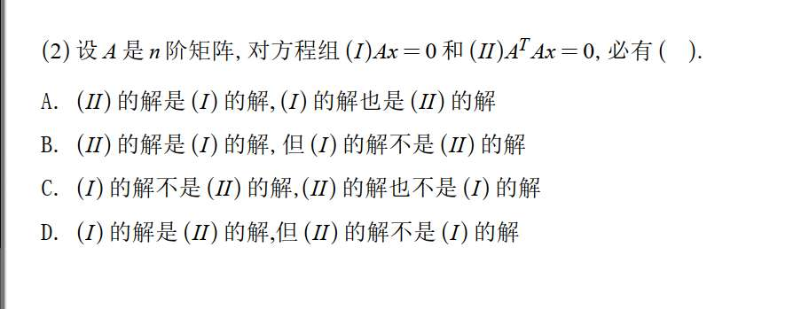
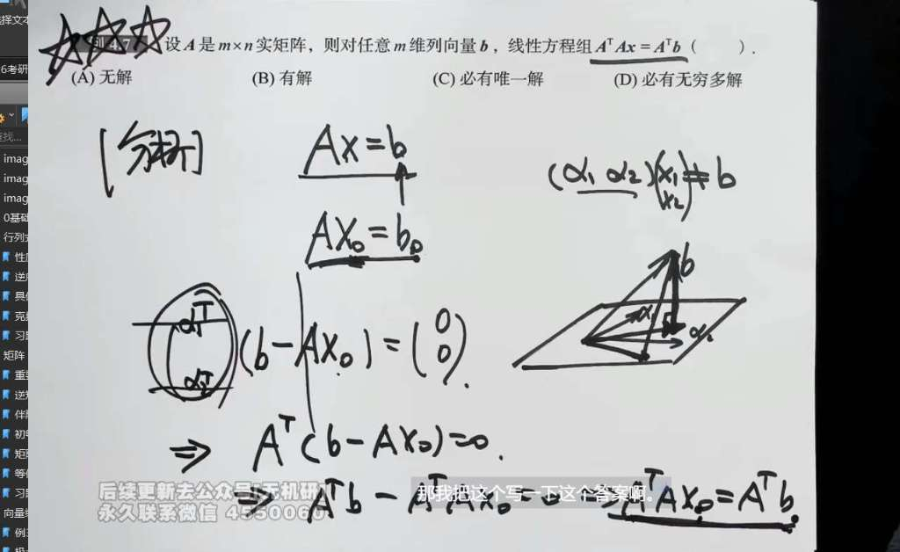

具体来说，它们都围绕着矩阵的**零空间（解空间）**和**列空间**展开。这个知识点不仅是线性代数的重难点，也是模式识别、机器学习中推导“最小二乘法”正规方程的绝对基石。

我们把核心结论先摆出来，再分别看这两道题：

对于任意实矩阵 $A$：

1. **$Ax = 0$ 与 $A^T A x = 0$ 是同解方程组。**
    
2. **它们的秩相等：$r(A) = r(A^T) = r(A^T A)$。**
    
3. **列空间相同：$A^T$ 的列空间等于 $A^T A$ 的列空间。**
    

---

### 先看图 2（理论基础）：$Ax=0$ 与 $A^T Ax=0$ 的关系

这道题直接考查了上述结论的第一条。我们可以简单推导一下：

- **从 (I) 推导到 (II)：**
    
    如果 $x$ 是 $(I)$ 的解，即 $Ax = 0$。我们在等式两边同时左乘 $A^T$，得到 $A^T Ax = A^T 0 = 0$。
    
    这说明 $(I)$ 的解必然是 $(II)$ 的解。
    
- **从 (II) 推导到 (I)（这是最巧妙的一步）：**
    
    如果 $x$ 是 $(II)$ 的解，即 $A^T Ax = 0$。我们在等式两边同时左乘 $x^T$，得到：
    
    $$x^T A^T Ax = 0$$
    
    根据矩阵乘法的结合律和转置性质，这可以写成：
    
    $$(Ax)^T (Ax) = 0$$
    
    由于 $Ax$ 是一个列向量，一个向量自己跟自己的内积（或者说长度的平方）等于 0，说明这个向量本身必定是零向量，即 $Ax = 0$。
    
    这说明 $(II)$ 的解也必然是 $(I)$ 的解。
    

**结论：** 两个方程组的解集完全一样，**(I) 的解是 (II) 的解，(I) 的解也是 (II) 的解**。图 2 应该选 **A**。

---

### 再看图 1（实际应用）：$A^T Ax = A^T b$ 的解的情况

图 1 中的等式 $A^T Ax = A^T b$ 在数据拟合中被称为**正规方程（Normal Equation）**。这道题考查的是上述的第三条结论。

**代数视角的解析：**

判断一个线性方程组 $Cx = d$ 是否有解，关键看向量 $d$ 是不是在矩阵 $C$ 的列空间里。

在这道题中，系数矩阵是 $A^T A$，等号右边是 $A^T b$。

1. 对于任意给定的向量 $b$，$A^T b$ 本质上是矩阵 $A^T$ 各列的线性组合，所以 $A^T b$ 必定属于 **$A^T$ 的列空间**。
    
2. 根据前面提到的核心知识点，$r(A^T) = r(A^T A)$，这意味着 **$A^T$ 的列空间和 $A^T A$ 的列空间是完全同一个空间**。
    
3. 既然 $A^T b$ 在 $A^T$ 的列空间里，那它自然也就踏踏实实地在 $A^T A$ 的列空间里。
    
    因此，这个方程**永远是相容的（有解）**。
    

**结合图 1 白板上画的几何视角：**

板书中的图画得非常清晰，展示了求最优解的投影过程。

在实际应用中，由于数据有误差，方程 $Ax = b$ 通常是无解的（因为 $b$ 不在 $A$ 的列空间（那个平行四边形平面）内）。

我们要找一个最优近似解 $x_0$，使得误差最小。做法就是把 $b$ 垂直投影到 $A$ 的平面上。

- 投影点是 $A x_0$。
    
- 误差向量是 $(b - A x_0)$。
    
- 因为是垂直投影，所以误差向量正交（垂直）于平面 $A$ 的所有列向量，这就意味着误差向量在 $A^T$ 的零空间里。
    
- 即：$A^T (b - A x_0) = 0$。
    
- 展开移项就是：$A^T A x_0 = A^T b$。
    
    因为垂线必定能作出来（投影点必存在），所以这个 $x_0$ 一定存在。
    

至于为什么不选“必有唯一解”或“必有无穷多解”？因为这取决于 $A$ 的列向量是否线性无关（即 $A$ 是否是列满秩）。如果 $A$ 列满秩，就是唯一解；如果 $A$ 有共线的列，就是无穷多解。但无论如何，它**至少有一个解**。

**结论：** 图 1 选 **(B) 有解**。

# 一些困惑
$r(A^T) = r(A^T A)$ 这个知识点是怎么推的，“误差向量正交（垂直）于平面 $A$ 的所有列向量，这就意味着误差向量在 $A^T$ 的零空间里。” 为什么？？逻辑链条是什么？ 以及这个式子到底有什么意义？尤其你说“模式识别、机器学习中推导“最小二乘法”正规方程”

### 1. 为什么 $r(A^T) = r(A^T A)$ ？

这个结论的推导核心在于：**证明这两个矩阵的零空间（解空间）完全相同。**

**逻辑链条如下：**

1. **目标：** 证明方程组 $Ax = 0$ 和 $A^T Ax = 0$ 是同解方程组。
    
2. **方向一 ($Ax=0 \implies A^T Ax=0$)：** 这个很简单，如果在 $Ax=0$ 两边左乘 $A^T$，得到 $A^T(Ax) = A^T(0) = 0$。所以 $Ax=0$ 的解一定是 $A^T Ax=0$ 的解。
    
3. **方向二 ($A^T Ax=0 \implies Ax=0$)：** 这是关键。如果 $A^T Ax = 0$，我们在左边乘上 $x^T$，得到 $x^T A^T A x = 0$。根据转置的性质，这可以写成 $(Ax)^T (Ax) = 0$。
    
4. **关键性质：** 一个向量 $v$ 与自身的内积 $v^T v$ 等于其长度的平方 $\|v\|^2$。如果 $\|Ax\|^2 = 0$，那么向量 $Ax$ 必须是零向量，即 $Ax = 0$。
    
5. **结论：** 既然两个矩阵的零空间相同，根据**秩-零度定理**（Rank-Nullity Theorem，即 $r + \text{dim}(N) = n$），它们的秩必然相等。又因为 $r(A) = r(A^T)$，所以 $r(A^T) = r(A^T A)$ 成立。
    

---

### 2. 误差向量与 $A^T$ 零空间的逻辑链条

你问：“误差向量垂直于 $A$ 的列空间 $\implies$ 误差向量在 $A^T$ 的零空间里”，为什么？

**我们要先理清什么是“零空间”的本质：**

矩阵 $M$ 的零空间是所有满足 $Mx = 0$ 的向量 $x$ 的集合。换句话说，**$x$ 必须与 $M$ 的每一行都垂直**。

**逻辑链条：**

1. **定义列空间：** 矩阵 $A$ 的列空间由它的列向量 $a_1, a_2, \dots, a_n$ 张成。
    
2. **定义垂直：** 如果误差向量 $e$ 垂直于 $A$ 的列空间，意味着 $e$ 与 $A$ 的**每一列**都垂直。
    
3. **数学表示：**
    
    - $a_1^T e = 0$
        
    - $a_2^T e = 0$
        
    - ...
        
    - $a_n^T e = 0$
        
4. **矩阵化：** 把这些等式叠起来，你会发现这正好就是：
    
    $$\begin{bmatrix} a_1^T \\ a_2^T \\ \vdots \\ a_n^T \end{bmatrix} e = \begin{bmatrix} 0 \\ 0 \\ \vdots \\ 0 \end{bmatrix}$$
    
5. **桥梁：** 注意左边这个矩阵——它就是 $A$ 的转置 $A^T$！所以上述式子就是 **$A^T e = 0$**。
    
6. **结论：** 根据零空间的定义，只要 $A^T e = 0$，那么 $e$ 就在 $A^T$ 的零空间里。
    

---

### 3. 这个式子到底有什么意义？（最小二乘法与机器学习）

在现实世界（机器学习、数据拟合）中，我们经常遇到 **$Ax = b$ 无解**的情况。

- **场景：** 你有 1000 个样本数据（方程数 $m$），但只有 10 个特征（未知数 $n$）。因为测量有误差，这 1000 个点几乎不可能完美地落在一条直线上。
    
- **数学困境：** 向量 $b$ 不在矩阵 $A$ 的列空间里。
    
- **解决思路：** 既然找不到完美的 $x$，我们就找一个“最接近”的 $\hat{x}$。
    
- **几何直觉：** 什么是“最接近”？就是从 $b$ 向 $A$ 的列空间（那个平面）作一条垂线。垂足 $A\hat{x}$ 就是我们要找的最优近似。此时，**误差向量 $e = b - A\hat{x}$ 必须垂直于平面**。
    

**于是，我们利用上面的逻辑链条：**

1. $e \perp A$ 的列空间 $\implies A^T e = 0$。
    
2. 代入 $e$ 的表达式：$A^T (b - A\hat{x}) = 0$。
    
3. 展开：$A^T b - A^T A \hat{x} = 0$。
    
4. 整理得到：**$A^T A \hat{x} = A^T b$**（这就是正规方程 Normal Equation）。
    

**在机器学习中：**

当你写线性回归代码调用 `model.fit(X, y)` 时，如果数据量不大，计算机底层可能就在求解这个 $\hat{w} = (X^T X)^{-1} X^T y$。这里 $(X^T X)^{-1}$ 之所以通常可逆，正是因为我们前面证过的 $r(X^T X) = r(X)$，只要特征是不相关的，它就能解出唯一的最优权重。