特征向量求法
关键在于
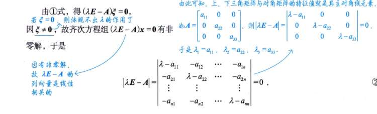
 由矩阵方程为 0衍生的性质，即行列式为 0
解出 lambda 后，
代回原方程，
求齐次方程解，解就是特征向量

# 性质
1. 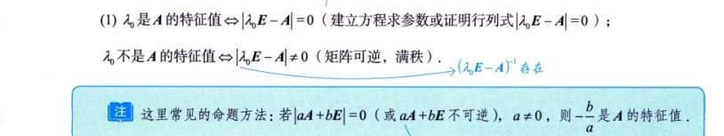
2. 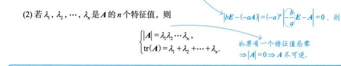
   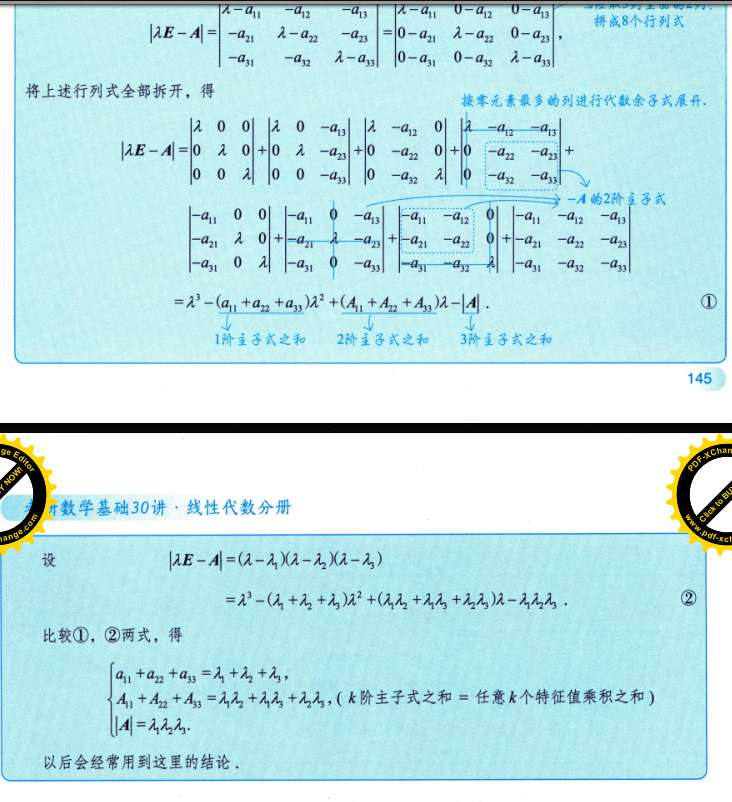
3. 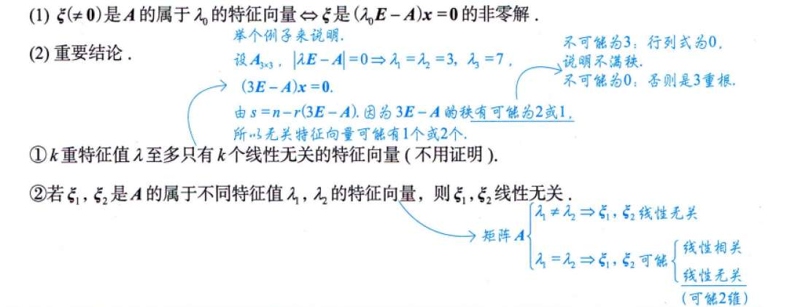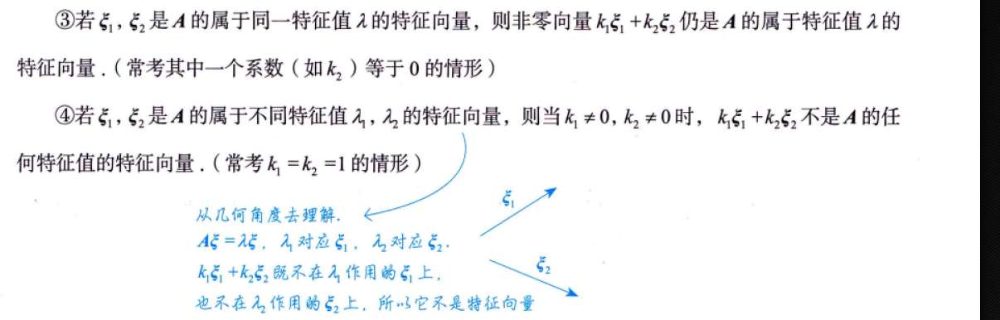
### 重根到底代表了什么？（几何层面）
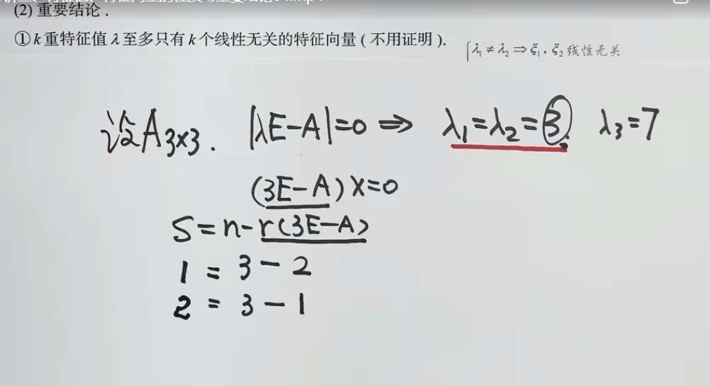
**特征值**的作用是给矩阵寻找“特殊方向”（特征向量）。在这些方向上，矩阵对向量的变换效果仅仅拉伸或压缩，不改变方向。

当你算出一个**单根**（比如 $\lambda_3 = 7$）时，它通常只对应一个“特殊方向”（也就是只能算出一个线性无关的特征向量）。

但是，当你算出一个**重根**（比如 $\lambda = 3$ 是 $2$ 重根）时，情况变得复杂了：**它“有潜力”对应多个独立的特殊方向，但它的潜力是有上限的。** 这个上限就是它的重数 $k$。

这就是图片中第一句话的核心性质：**$k$ 重特征值 $\lambda$ 至多只有 $k$ 个线性无关的特征向量。**

- 既然 $3$ 是 $2$ 重根，那么对应于 $\lambda=3$ 的特征向量，**最多**只能有 $2$ 个线性无关的。
    
- 它可能算出 $2$ 个，也可能只算出 $1$ 个，但**绝对不可能**算出 $3$ 个或更多。
    

为了找特征向量，我们需要把 $\lambda=3$ 代回去，解方程组 $(3E - A)X = 0$。

老师写的公式 $s = n - r(3E - A)$，其实就是线性代数里求**基础解系个数（自由未知量个数）**的通用公式：

- **$s$**：代表你能找到的**线性无关的特征向量的个数**。
    
- **$n$**：矩阵的维数（这里是 $3$ 维）。
    
- **$r$**：矩阵 $3E - A$ 的**秩（Rank）**。秩代表了方程组里真正有效的约束条件有多少个。
    

老师在下面列举了两种可能发生的情况：

- **情况一（约束太强）：** 假设你算出秩 $r = 2$。那么 $s = 3 - 2 = 1$。这意味着虽然 $3$ 是个 $2$ 重根，但它有点“名不副实”，只能对应 **$1$ 个**特征向量。
    
- **情况二（约束较弱）：** 假设你算出秩 $r = 1$。那么 $s = 3 - 1 = 2$。这说明这个 $2$ 重根非常“饱满”，完美地提供了 **$2$ 个**线性无关的特征向量。
    

**总结一下：**

数学上把这个重数 $k$（方程解的次数）叫作**代数重数**，把 $s$（能解出多少个特征向量）叫作**几何重数**。

这条性质其实就是在说一个铁律：**几何重数永远不可能超过代数重数 ($s \le k$)**

## 常见矩阵结论

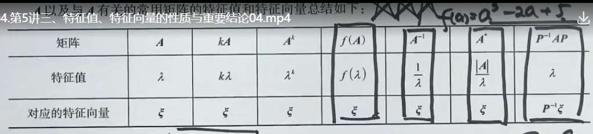

最后两个推导
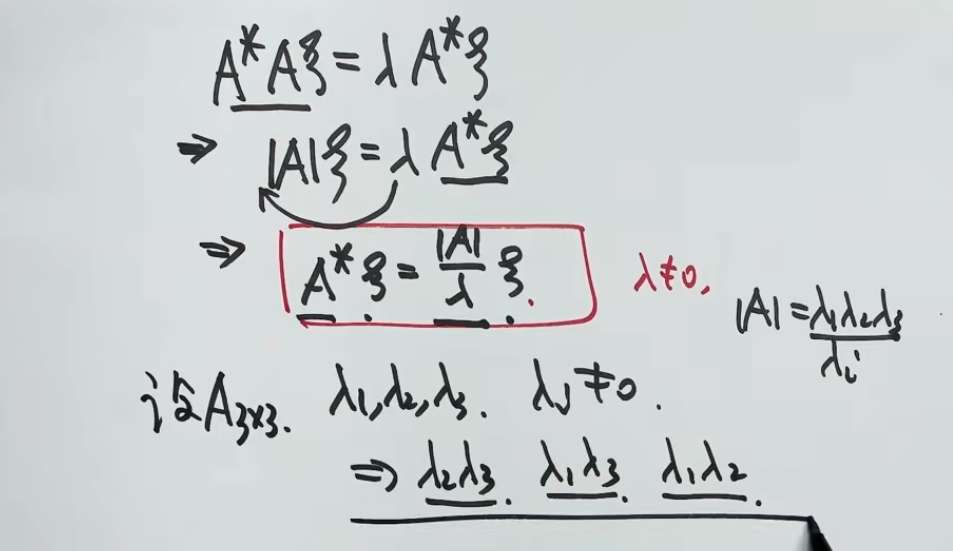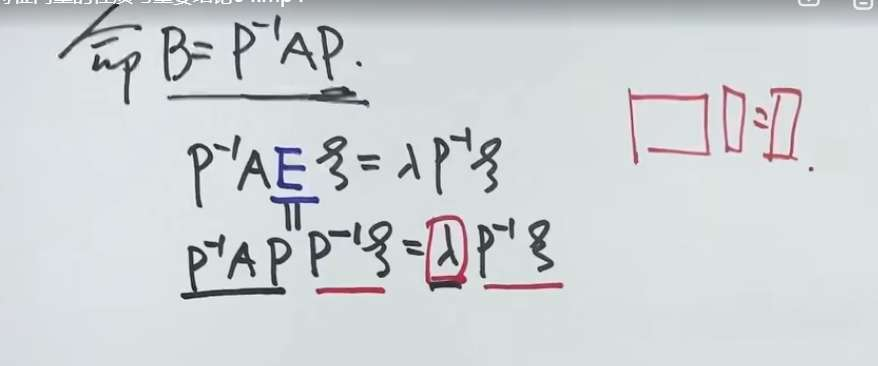

### 秩一矩阵性质
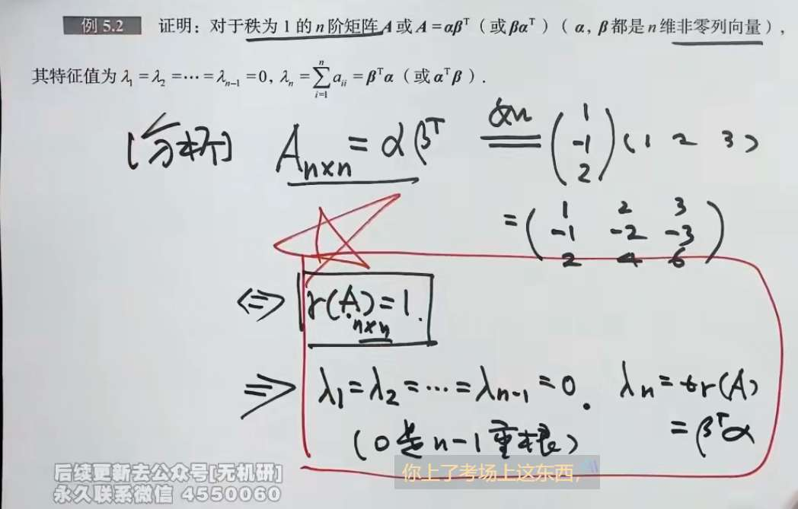

### 幂等矩阵
注意特征值“可能取值”和特征值的值之区别

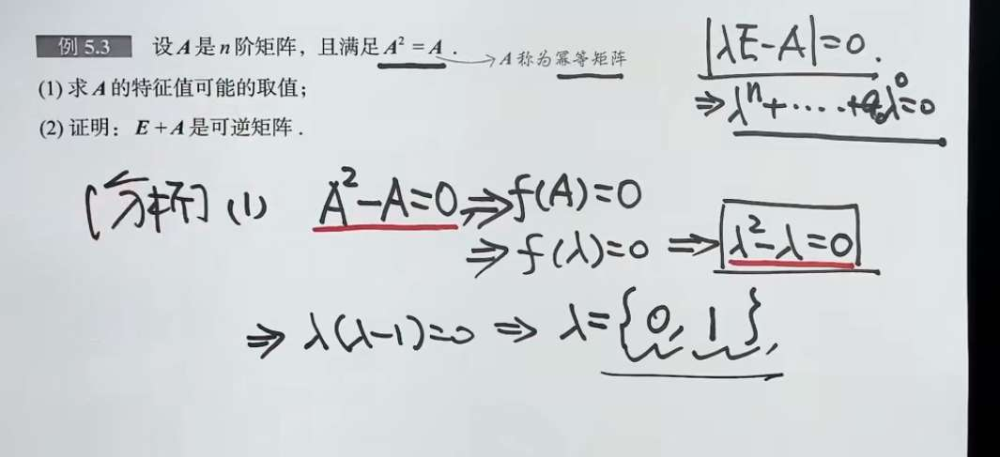

# 相似矩阵
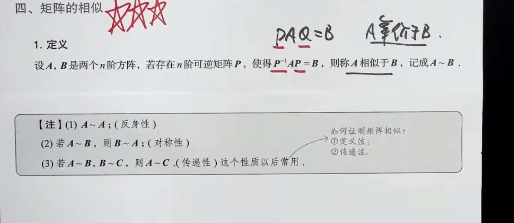

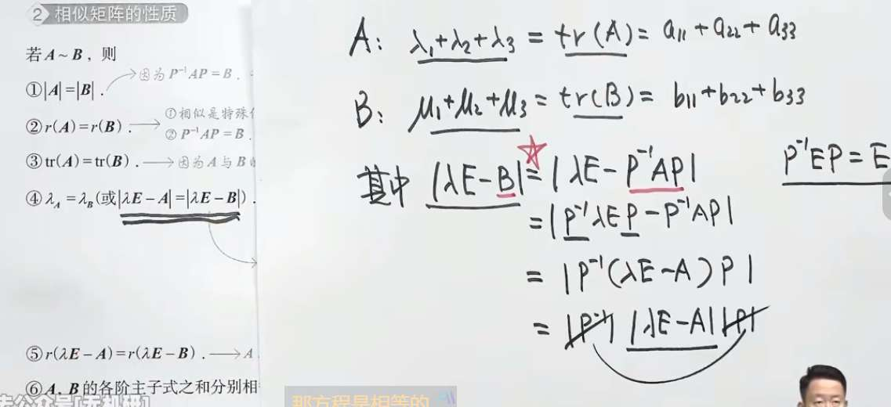

性质 5 的证明
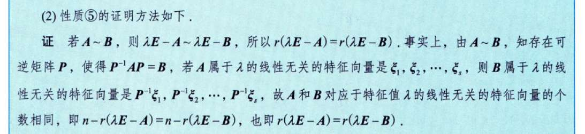
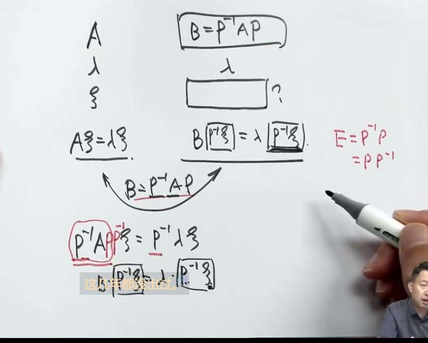

性质 6 的证明
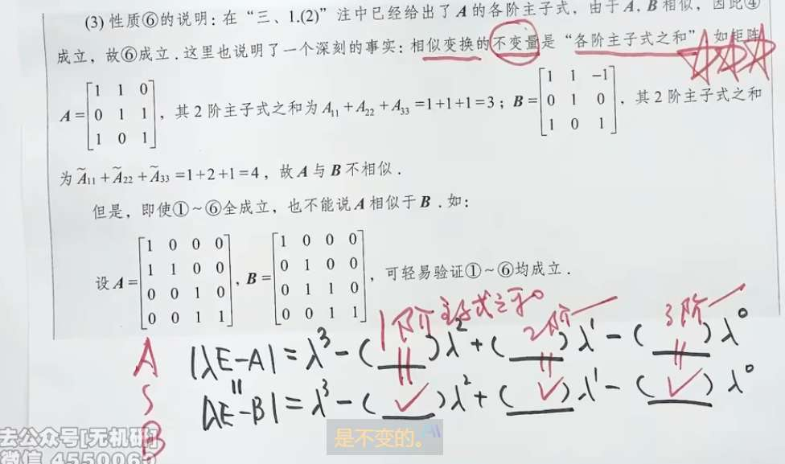