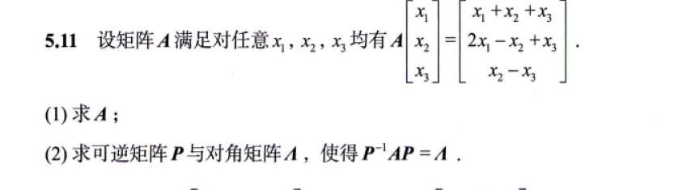
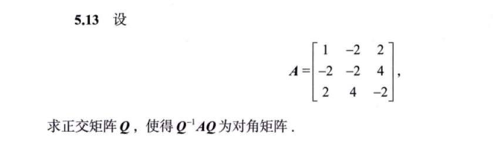
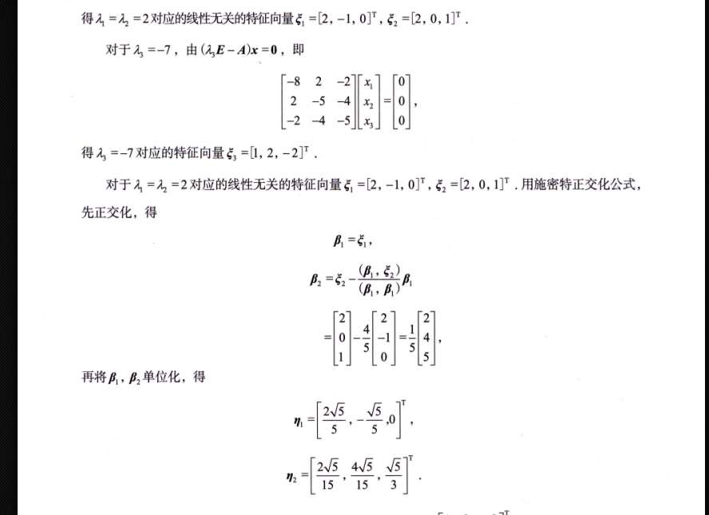
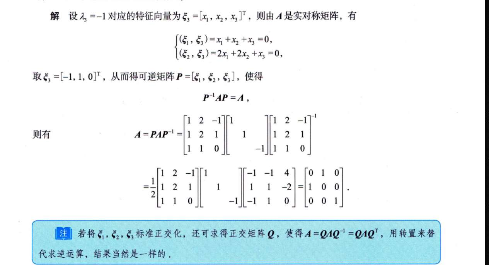
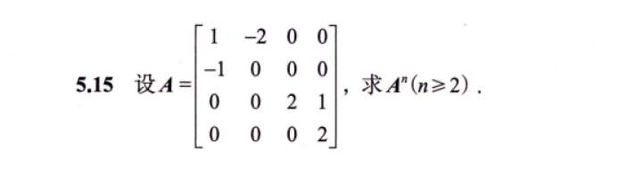
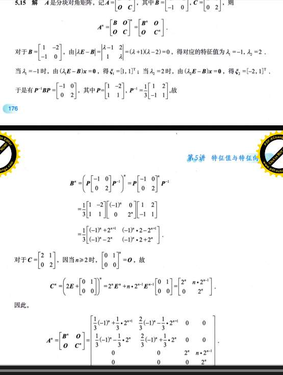

# 习题

## 1

1. 如果相似，它们必须：**特征值相同**、**迹（tr）相同**、**行列式（det）相同**。
2. **一个对角矩阵 $C$ 与另一个矩阵 $M$ 相似的充分必要条件是：$M$ 可以对角化。**‘判断重根 $\lambda=2$（2 重根）是否有足够的特征向量：
*   **检查 $A$**：
    计算 $2E - A = \begin{bmatrix} 0 & 0 & 0 \\ 0 & 0 & -1 \\ 0 & 0 & 1 \end{bmatrix}$。很明显，秩 $r(2E-A) = 1$。
    特征向量个数 $s = 3 - 1 = \mathbf{2}$。
    **结论**：重数 2，向量也给 2 个，**$A$ 能对角化**。所以 **$A \sim C$**。

*   **检查 $B$**：
    计算 $2E - B = \begin{bmatrix} 0 & -1 & 0 \\ 0 & 0 & 0 \\ 0 & 0 & 1 \end{bmatrix}$。第二列和第三列线性无关，秩 $r(2E-B) = 2$。
    特征向量个数 $s = 3 - 2 = \mathbf{1}$。
    **结论**：重数 2，向量只给 1 个，“亏损”了。**$B$ 不能对角化**。所以 **$B \nsim C$**。

**最终答案选 (B)。**’

## 2
第一问就没拐过弯，对任意都有,，那 A 自己就是那个过度矩阵啊

## 3
要正交化 

## 4
转置代替逆运算

## 5

你目前的思路是：算大矩阵的 $| \lambda E - A | = 0$，求出 4 个特征值，然后求出 4 个特征向量，拼成大矩阵 $P$，最后用 $A^n = P \Lambda^n P^{-1}$ 搞定。

**这个思路的死穴在于：这个大矩阵 $A$，根本就不能对角化！**

不信我们可以单独看看右下角那个 $2 \times 2$ 的小矩阵 $C = \begin{bmatrix} 2 & 1 \\ 0 & 2 \end{bmatrix}$（它决定了 $A$ 的后两个维度）。

1. **求特征值：** 它的特征值显然是 $\lambda = 2$ （2 重根）。
    
2. **求特征向量：** 带入 $(2E - C)x = 0$，得到 $\begin{bmatrix} 0 & -1 \\ 0 & 0 \end{bmatrix} \begin{bmatrix} x_1 \\ x_2 \end{bmatrix} = \begin{bmatrix} 0 \\ 0 \end{bmatrix}$。
    
    解得 $x_2 = 0$，$x_1$ 随便取。
    
3. **发现问题：** 秩是 1，未知数 2 个，基础解系只有 $2 - 1 = 1$ 个。
    
    也就是说，对于 2 重特征值，你**只能算出一个线性无关的特征向量** $(1, 0)^T$！
    

回忆一下我们之前讲过的铁律：**几何重数（1 个） < 代数重数（2 重根）**。凑不齐特征向量，矩阵就绝对无法对角化。既然右下角这部分坏掉了，整个 $4 \times 4$ 的大矩阵 $A$ 也就彻底失去了对角化的资格。你的大矩阵求法走到一半就会卡死，因为你根本拼不出一个可逆的 $4 \times 4$ 矩阵 $P$。

---

### 答案为什么要分块？（化繁为简）

因为 $A$ 是一个**分块对角矩阵**（左上角一坨，右下角一坨，其他全是 0）。

分块对角矩阵有一个极其爽的性质：它的 $n$ 次方，等于**各个小块各自的 $n$ 次方**。

$$A^n = \begin{bmatrix} B & O \\ O & C \end{bmatrix}^n = \begin{bmatrix} B^n & O \\ O & C^n \end{bmatrix}$$

与其去跟一个没法对角化的 $4 \times 4$ 巨兽搏斗，不如把它拆成两个 $2 \times 2$ 的小怪分别解决。

---

### 答案到底在干嘛？（两套不同的武功）

答案看起来长，是因为 $B$ 和 $C$ 这两个小怪的“体质”完全不同，必须用不同的方法对付。

#### 第一套武功：对付矩阵 $B$（常规对角化）

$$B = \begin{bmatrix} 1 & -2 \\ -1 & 0 \end{bmatrix}$$

算一下它的特征值，是 $\lambda_1 = -1, \lambda_2 = 2$。

**两个特征值不相等（单根）！** 这说明 $B$ 身体健康，完美支持对角化。

所以答案的前半部分，就是你最熟悉的常规操作：求特征向量 $\rightarrow$ 拼出 $P$ $\rightarrow$ 求 $P^{-1}$ $\rightarrow$ 利用 $B^n = P \Lambda^n P^{-1}$ 算出结果。这就是答案里那一大堆矩阵乘法的来源。

#### 第二套武功：对付矩阵 $C$（二项式展开法）

$$C = \begin{bmatrix} 2 & 1 \\ 0 & 2 \end{bmatrix}$$

前面说了，它不能对角化。遇到这种长得像 $\begin{bmatrix} a & 1 \\ 0 & a \end{bmatrix}$ 的矩阵（数学上叫若尔当块），求 $n$ 次方的标准套路是**拆分 + 二项式定理**。

答案把它拆成了两部分：**对角阵 + 纯位数矩阵**。

$$C = \begin{bmatrix} 2 & 0 \\ 0 & 2 \end{bmatrix} + \begin{bmatrix} 0 & 1 \\ 0 & 0 \end{bmatrix} = 2E + N$$

这步拆分极其精妙，因为那个矩阵 $N = \begin{bmatrix} 0 & 1 \\ 0 & 0 \end{bmatrix}$ 有一个魔法属性：**只要自己乘自己一次，就灰飞烟灭了**（$N^2 = 0$）。

用二项式定理展开 $(2E + N)^n$：

$$(2E + N)^n = C_n^0 (2E)^n + C_n^1 (2E)^{n-1}N + C_n^2 (2E)^{n-2}N^2 + \dots$$

因为 $N^2 = 0$，所以从第三项开始，后面的所有项全部变成了 0！无限长的多项式瞬间被秒杀，只剩下前两项：

$$= 2^n E + n \cdot 2^{n-1} N$$

$$= \begin{bmatrix} 2^n & 0 \\ 0 & 2^n \end{bmatrix} + \begin{bmatrix} 0 & n \cdot 2^{n-1} \\ 0 & 0 \end{bmatrix} = \begin{bmatrix} 2^n & n \cdot 2^{n-1} \\ 0 & 2^n \end{bmatrix}$$

看，根本不需要求什么特征向量，几步代数运算就把 $C^n$ 搞定了。
# 1000 题
