# 习题

## 1

1. 如果相似，它们必须：**特征值相同**、**迹（tr）相同**、**行列式（det）相同**。
2. **一个对角矩阵 $C$ 与另一个矩阵 $M$ 相似的充分必要条件是：$M$ 可以对角化。**‘判断重根 $\lambda=2$（2 重根）是否有足够的特征向量：
*   **检查 $A$**：
    计算 $2E - A = \begin{bmatrix} 0 & 0 & 0 \\ 0 & 0 & -1 \\ 0 & 0 & 1 \end{bmatrix}$。很明显，秩 $r(2E-A) = 1$。
    特征向量个数 $s = 3 - 1 = \mathbf{2}$。
    **结论**：重数 2，向量也给 2 个，**$A$ 能对角化**。所以 **$A \sim C$**。

*   **检查 $B$**：
    计算 $2E - B = \begin{bmatrix} 0 & -1 & 0 \\ 0 & 0 & 0 \\ 0 & 0 & 1 \end{bmatrix}$。第二列和第三列线性无关，秩 $r(2E-B) = 2$。
    特征向量个数 $s = 3 - 2 = \mathbf{1}$。
    **结论**：重数 2，向量只给 1 个，“亏损”了。**$B$ 不能对角化**。所以 **$B \nsim C$**。

**最终答案选 (B)。**’

## 2
第一问就没拐过弯，对任意都有,，那 A 自己就是那个过度矩阵啊

## 3
要正交化 

## 4
转置代替逆运算

## 5

你目前的思路是：算大矩阵的 $| \lambda E - A | = 0$，求出 4 个特征值，然后求出 4 个特征向量，拼成大矩阵 $P$，最后用 $A^n = P \Lambda^n P^{-1}$ 搞定。

**这个思路的死穴在于：这个大矩阵 $A$，根本就不能对角化！**

不信我们可以单独看看右下角那个 $2 \times 2$ 的小矩阵 $C = \begin{bmatrix} 2 & 1 \\ 0 & 2 \end{bmatrix}$（它决定了 $A$ 的后两个维度）。

1. **求特征值：** 它的特征值显然是 $\lambda = 2$ （2 重根）。
    
2. **求特征向量：** 带入 $(2E - C)x = 0$，得到 $\begin{bmatrix} 0 & -1 \\ 0 & 0 \end{bmatrix} \begin{bmatrix} x_1 \\ x_2 \end{bmatrix} = \begin{bmatrix} 0 \\ 0 \end{bmatrix}$。
    
    解得 $x_2 = 0$，$x_1$ 随便取。
    
3. **发现问题：** 秩是 1，未知数 2 个，基础解系只有 $2 - 1 = 1$ 个。
    
    也就是说，对于 2 重特征值，你**只能算出一个线性无关的特征向量** $(1, 0)^T$！
    

回忆一下我们之前讲过的铁律：**几何重数（1 个） < 代数重数（2 重根）**。凑不齐特征向量，矩阵就绝对无法对角化。既然右下角这部分坏掉了，整个 $4 \times 4$ 的大矩阵 $A$ 也就彻底失去了对角化的资格。你的大矩阵求法走到一半就会卡死，因为你根本拼不出一个可逆的 $4 \times 4$ 矩阵 $P$。

---

### 答案为什么要分块？（化繁为简）

因为 $A$ 是一个**分块对角矩阵**（左上角一坨，右下角一坨，其他全是 0）。

分块对角矩阵有一个极其爽的性质：它的 $n$ 次方，等于**各个小块各自的 $n$ 次方**。

$$A^n = \begin{bmatrix} B & O \\ O & C \end{bmatrix}^n = \begin{bmatrix} B^n & O \\ O & C^n \end{bmatrix}$$

与其去跟一个没法对角化的 $4 \times 4$ 巨兽搏斗，不如把它拆成两个 $2 \times 2$ 的小怪分别解决。

---

### 答案到底在干嘛？（两套不同的武功）

答案看起来长，是因为 $B$ 和 $C$ 这两个小怪的“体质”完全不同，必须用不同的方法对付。

#### 第一套武功：对付矩阵 $B$（常规对角化）

$$B = \begin{bmatrix} 1 & -2 \\ -1 & 0 \end{bmatrix}$$

算一下它的特征值，是 $\lambda_1 = -1, \lambda_2 = 2$。

**两个特征值不相等（单根）！** 这说明 $B$ 身体健康，完美支持对角化。

所以答案的前半部分，就是你最熟悉的常规操作：求特征向量 $\rightarrow$ 拼出 $P$ $\rightarrow$ 求 $P^{-1}$ $\rightarrow$ 利用 $B^n = P \Lambda^n P^{-1}$ 算出结果。这就是答案里那一大堆矩阵乘法的来源。

#### 第二套武功：对付矩阵 $C$（二项式展开法）

$$C = \begin{bmatrix} 2 & 1 \\ 0 & 2 \end{bmatrix}$$

前面说了，它不能对角化。遇到这种长得像 $\begin{bmatrix} a & 1 \\ 0 & a \end{bmatrix}$ 的矩阵（数学上叫若尔当块），求 $n$ 次方的标准套路是**拆分 + 二项式定理**。

答案把它拆成了两部分：**对角阵 + 纯位数矩阵**。

$$C = \begin{bmatrix} 2 & 0 \\ 0 & 2 \end{bmatrix} + \begin{bmatrix} 0 & 1 \\ 0 & 0 \end{bmatrix} = 2E + N$$

这步拆分极其精妙，因为那个矩阵 $N = \begin{bmatrix} 0 & 1 \\ 0 & 0 \end{bmatrix}$ 有一个魔法属性：**只要自己乘自己一次，就灰飞烟灭了**（$N^2 = 0$）。

用二项式定理展开 $(2E + N)^n$：

$$(2E + N)^n = C_n^0 (2E)^n + C_n^1 (2E)^{n-1}N + C_n^2 (2E)^{n-2}N^2 + \dots$$

因为 $N^2 = 0$，所以从第三项开始，后面的所有项全部变成了 0！无限长的多项式瞬间被秒杀，只剩下前两项：

$$= 2^n E + n \cdot 2^{n-1} N$$

$$= \begin{bmatrix} 2^n & 0 \\ 0 & 2^n \end{bmatrix} + \begin{bmatrix} 0 & n \cdot 2^{n-1} \\ 0 & 0 \end{bmatrix} = \begin{bmatrix} 2^n & n \cdot 2^{n-1} \\ 0 & 2^n \end{bmatrix}$$

看，根本不需要求什么特征向量，几步代数运算就把 $C^n$ 搞定了。
# 1000 题
## 1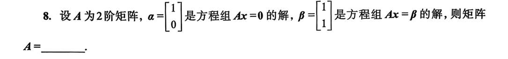
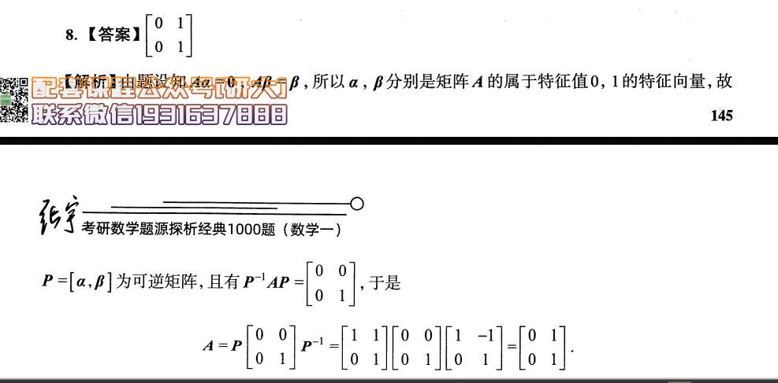‘
## 2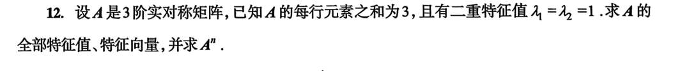

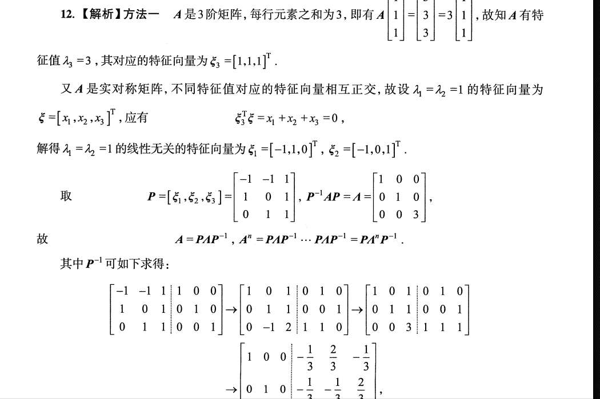
特征值为 1 的特征向量与特征值为 3 的特征向量正交，那么直接列式子后，可以自己直接设出特征值为 1 的两个特征向量

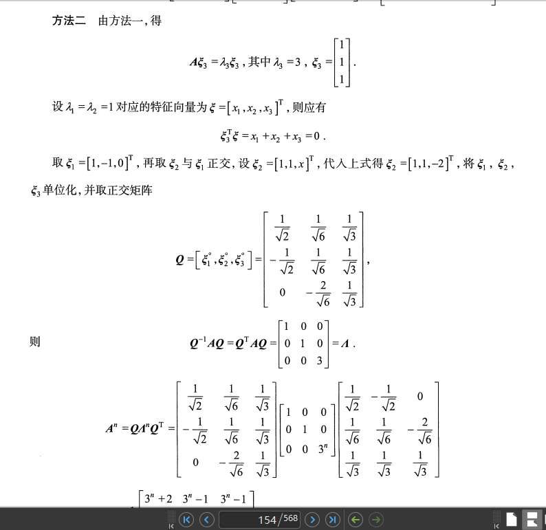

法 1 是“老实人”做法（普适方法），而法 2 是专门为“实对称矩阵”量身定制的**“开挂”做法**。

你觉得法 2 的特征向量求得奇怪，核心是因为法 2 有着一个法 1 没有的**终极野心**：**它不仅要特征向量，它还要这些特征向量互相垂直（正交）！**

我来帮你彻底把法 2 的逻辑盘通：

### 一、为什么不借用法 1 的特征向量？法 2 在图什么？

回顾一下法 1，算出来的 $\lambda=1$ 的两个特征向量是：

$\xi_1 = [-1, 1, 0]^T$ 和 $\xi_2 = [-1, 0, 1]^T$。

这两个向量确实线性无关，但如果你把它俩点乘一下（内积）：

$(-1)\times(-1) + 1\times0 + 0\times1 = 1 \neq 0$。

**发现了吗？法 1 里的 $\xi_1$ 和 $\xi_2$ 并不垂直！**

对于一般的矩阵对角化 $A = P \Lambda P^{-1}$，不垂直也没关系，只要线性无关就能拼成 $P$。

但是！如果 $P$ 里面的列向量不互相垂直，**你就必须老老实实地去算 $P^{-1}$**。就像图 1 下面那一大坨初等行变换，极度恶心，极容易算错。

**法 2 的核心动机就是：我宁愿在前面花点心思把特征向量弄成互相垂直的，去凑一个“正交矩阵 $Q$”，也绝对不想去算那个恶心的逆矩阵！** 因为一旦凑出正交矩阵 $Q$，它的逆就等于它的转置（**$Q^{-1} = Q^T$**），直接秒杀。

### 二、法 2 的特征向量是怎么“捏”出来的？

既然目标是凑出三个互相垂直的向量，我们来看看法 2 是怎么操作的。

**已知条件：** 属于 $\lambda=3$ 的特征向量 $\xi_3 = [1, 1, 1]^T$ 已经确立了，它是基准。

因为实对称矩阵的性质，属于 $\lambda=1$ 的所有特征向量天生就垂直于 $\xi_3$。也就是满足 $x_1 + x_2 + x_3 = 0$。

在这个前提下，我们要在这个平面（$x_1 + x_2 + x_3 = 0$）里，找**两个互相垂直**的向量 $\xi_1$ 和 $\xi_2$。

1. **先随便定一个 $\xi_1$：**
    
    只要满足 $x_1 + x_2 + x_3 = 0$ 即可。为了简单，法 2 取了 $\xi_1 = [1, -1, 0]^T$。
    
2. **强行定制 $\xi_2$（重点来了！）：**
    
    现在我们需要找 $\xi_2 = [x_1, x_2, x_3]^T$。它必须同时满足两个条件：
    
    - **条件 A（垂直于 $\xi_3$）：** $x_1 + x_2 + x_3 = 0$
        
    - **条件 B（垂直于 $\xi_1$）：** $1\cdot x_1 + (-1)\cdot x_2 + 0\cdot x_3 = 0 \implies x_1 = x_2$
        
    
    看到没有？为了满足条件 B（垂直于 $\xi_1$），前两个坐标必须相等！
    
    所以，法 2 非常聪明地**直接设前两个坐标为 1**，即设 $\xi_2 = [1, 1, x]^T$。（这就是你图里那句“设 $\xi_2 = [1, 1, x]^T$”的由来）。
    
    然后把这个半成品代入条件 A：$1 + 1 + x = 0 \implies x = -2$。
    
    大功告成！$\xi_2 = [1, 1, -2]^T$。
    

**总结：** 法 2 没有像我们上一题那样用死板的“施密特正交化”公式（减去投影），而是利用方程的几何意义，**直接“瞪眼法”配凑出了两个互相垂直的特征向量**。这就显得非常巧妙且迅速。

### 三、后面的逻辑讲解

一旦你拿到了互相垂直的 $\xi_1, \xi_2, \xi_3$，后面的路就完全是“走查”了：

1. **单位化（戴上紧箍咒）：**
    
    有了垂直还不够，正交矩阵要求列向量长度必须是 1。
    
    - $\xi_1$ 长度是 $\sqrt{1^2+(-1)^2+0} = \sqrt{2}$，所以除以 $\sqrt{2}$。
        
    - $\xi_2$ 长度是 $\sqrt{1^2+1^2+(-2)^2} = \sqrt{6}$，所以除以 $\sqrt{6}$。
        
    - $\xi_3$ 长度是 $\sqrt{3}$，除以 $\sqrt{3}$。
        
        这就是图里那个带根号的矩阵 $Q$ 的由来。
        
2. **启动外挂（核心省力点）：**
    
    写出对角化公式：$\Lambda = Q^{-1} A Q$
    
    因为 $Q$ 是正交矩阵，直接发动技能 $Q^{-1} = Q^T$。
    
    所以得到：**$A = Q \Lambda Q^T$**。
    
3. **求 $n$ 次方：**
    
    $A^n = (Q \Lambda Q^T)^n = Q \Lambda^n Q^T$。
    
    接下来就是纯体力的矩阵乘法了：先把 $Q$ 和 $\Lambda^n$ 乘起来，再把结果和 $Q^T$ 乘起来。虽然乘法稍微有点烦，但这比起法 1 去解那个巨大的增广矩阵求逆，容错率要高得多了。

## 3
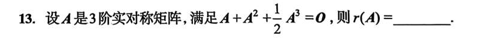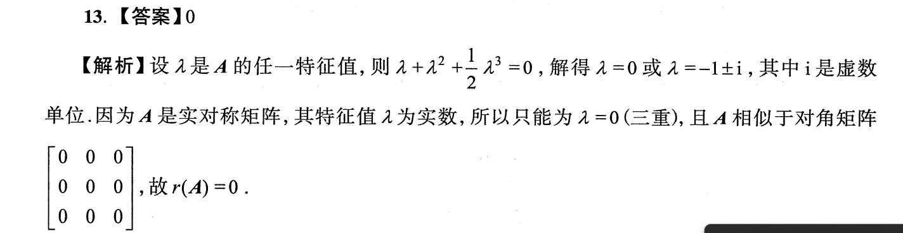### 特征值全为 0 就能决定秩吗？（全题最大陷阱）

到了这一步，很多同学会想：既然特征值全是 0，那矩阵肯定就是零矩阵，所以秩是 0。

**小心！对于一般矩阵来说，这个推理是错的！**

比如矩阵 $B = \begin{bmatrix} 0 & 1 \\ 0 & 0 \end{bmatrix}$，它的特征值也是两个 $0$，但它显然不是零矩阵，它的秩 $r(B) = 1$。

**为什么这道题就可以直接得出 $r(A)=0$ 呢？**

这就需要再次发动“实对称矩阵”的第二项特权：**它一定可以对角化！**

“可以对角化”意味着，一定存在一个可逆矩阵 $P$，使得 $P^{-1}AP = \Lambda$（$\Lambda$ 是对角线上全是特征值的对角矩阵）。

既然我们已经算出了 $A$ 的三个特征值全是 $0$，那么：

$$\Lambda = \begin{bmatrix} 0 & 0 & 0 \\ 0 & 0 & 0 \\ 0 & 0 & 0 \end{bmatrix} = O$$

我们把式子倒过来写：

$$A = P \Lambda P^{-1}$$

把 $\Lambda = O$ 代进去：

$$A = P \cdot O \cdot P^{-1} = O$$

**绝杀：** 经过严密的推理，矩阵 $A$ 原形毕露，它完完全全就是一个**零矩阵**！

既然 $A$ 是个零矩阵，它里面一个非零元素都没有，那它的秩 $r(A)$ 当然就等于 $0$ 了。

## 4
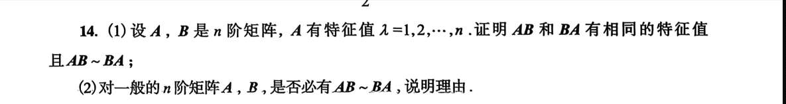

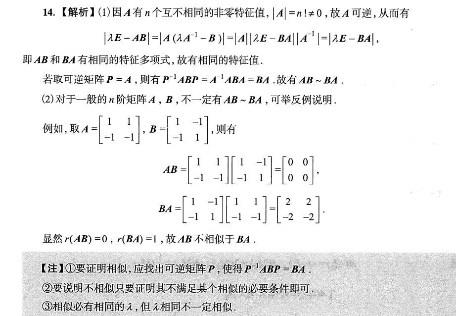我们要证明 $|\lambda E - AB| = |\lambda E - BA|$。

因为 $A$ 可逆，我们要想办法把式子里的 $A$ 给“挪个位置”。怎么挪？利用 $A \cdot A^{-1} = E$。

我们把 $\lambda E$ 改写成 $\lambda (A A^{-1})$，代入进去：

$$|\lambda A A^{-1} - AB|$$

这时候，左边都有 $A$，我们就可以像提取公因式一样，把 $A$ 提出来（注意矩阵乘法顺序不能乱）：

$$|A (\lambda A^{-1} - B)|$$

到了这一步，就轮到行列式的性质 $|XY| = |X||Y|$ 发挥作用了，我们可以把它拆开，然后**交换顺序**再拼回去（因为行列式算出来是个数，两个数相乘可以交换位置）：

$$|A| \cdot |\lambda A^{-1} - B| = |\lambda A^{-1} - B| \cdot |A|$$

再把 $A$ 乘进括号的**右边**：

$$|(\lambda A^{-1} - B)A| = |\lambda A^{-1}A - BA| = |\lambda E - BA|$$ 我们要证明 $|\lambda E - AB| = |\lambda E - BA|$。

因为 $A$ 可逆，我们要想办法把式子里的 $A$ 给“挪个位置”。怎么挪？利用 $A \cdot A^{-1} = E$。

我们把 $\lambda E$ 改写成 $\lambda (A A^{-1})$，代入进去：

$$|\lambda A A^{-1} - AB|$$

这时候，左边都有 $A$，我们就可以像提取公因式一样，把 $A$ 提出来（注意矩阵乘法顺序不能乱）：

$$|A (\lambda A^{-1} - B)|$$

到了这一步，就轮到行列式的性质 $|XY| = |X||Y|$ 发挥作用了，我们可以把它拆开，然后**交换顺序**再拼回去（因为行列式算出来是个数，两个数相乘可以交换位置）：

$$|A| \cdot |\lambda A^{-1} - B| = |\lambda A^{-1} - B| \cdot |A|$$

再把 $A$ 乘进括号的**右边**：

$$|(\lambda A^{-1} - B)A| = |\lambda A^{-1}A - BA| = |\lambda E - BA|$$

## 5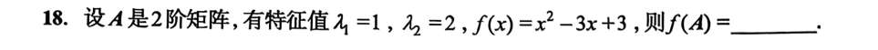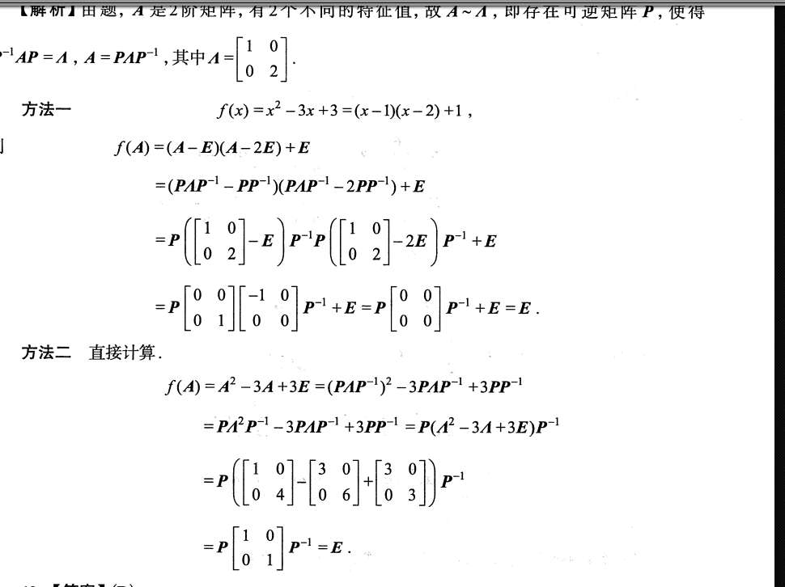

## 6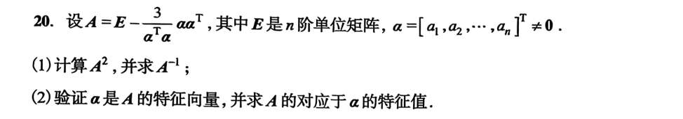

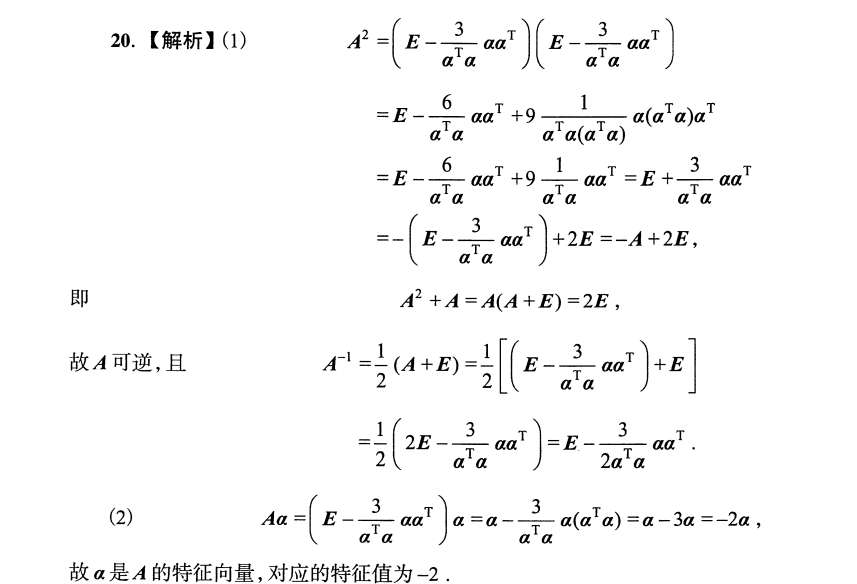

这个题，我个人分析，a 乘 a 转置是秩一矩阵，即 n-1 个特征值 0 的重根，1 个特征值为 tr 的根，而 tr 就是 a 转置乘 a。再不知道咋分析。而答案就是硬算

### 一、用你的思路，先秒杀第 (2) 问

既然你已经看透了 $\alpha \alpha^T$ 是秩 1 矩阵，我们来看看它对向量 $\alpha$ 做了什么。

根据矩阵乘法的结合律：

$$(\alpha \alpha^T) \alpha = \alpha (\alpha^T \alpha)$$

注意，$\alpha^T \alpha$ 是一个**实数（标量）**，把它提到前面来就是：

$$(\alpha \alpha^T) \alpha = (\alpha^T \alpha) \alpha$$

你看！这说明 $\alpha$ 天生就是矩阵 $\alpha \alpha^T$ 的特征向量，对应的特征值就是迹 $\alpha^T \alpha$。

现在我们把 $\alpha$ 乘到题目给的大矩阵 $A$ 上：

$$A \alpha = \left(E - \frac{3}{\alpha^T \alpha} \alpha \alpha^T\right) \alpha$$

$$= E\alpha - \frac{3}{\alpha^T \alpha} (\alpha \alpha^T \alpha)$$

把上面得到的结论代入进去：

$$= \alpha - \frac{3}{\alpha^T \alpha} (\alpha^T \alpha) \alpha$$

$$= \alpha - 3\alpha = -2\alpha$$

**结论：** $\alpha$ 就是 $A$ 的特征向量，对应的特征值就是 **$-2$**。第 (2) 问连笔都不用动，纯靠逻辑就推完了。

---

### 二、用你的思路，反杀第 (1) 问（极其惊艳的解法）

你刚才分析出了 $\alpha \alpha^T$ 的特征值是 $0$ （$n-1$ 重）和 $\alpha^T \alpha$ （单根）。

那么，根据特征值的线性运算法则，矩阵 $A = E - \frac{3}{\alpha^T \alpha} \alpha \alpha^T$ 的特征值是什么呢？

- 当特征值为 $0$ 时： $\lambda_A = 1 - 0 = 1$
    
- 当特征值为 $\alpha^T \alpha$ 时： $\lambda_A = 1 - \frac{3}{\alpha^T \alpha} \cdot (\alpha^T \alpha) = 1 - 3 = -2$
    

所以，**矩阵 $A$ 只有两个不同的特征值：$1$ 和 $-2$**。

**见证奇迹的时刻来了：**

在线性代数中，如果一个矩阵只有两个不同的特征值 $\lambda_1, \lambda_2$，且它是可对角化的（实对称矩阵必可对角化），那么它必然满足以这两个特征值为根的一元二次方程（这叫最小多项式）：

$$(\lambda - 1)(\lambda + 2) = 0 \implies \lambda^2 + \lambda - 2 = 0$$

既然矩阵 $A$ 满足这个多项式，我们直接把 $A$ 代进去：

$$A^2 + A - 2E = O$$

从这个式子，我们瞬间就能得到答案里费了老大劲算出来的结果：

1. **求 $A^2$：** 移项就得到了 $A^2 = -A + 2E$。
    
2. **求 $A^{-1}$：** 提取公因式 $A(A + E) = 2E$，两边同除以 2，得到 $A \cdot \frac{1}{2}(A+E) = E$。所以 $A^{-1} = \frac{1}{2}(A+E)$。然后把题目中 $A$ 的原式代入展开即可。
    

你看，**你的特征值分析不仅有用，而且是洞悉这道题最快、最本质的方法！**

---

### 三、为什么答案要“硬算”？答案在算什么？

考试的标准答案通常需要照顾普适性，所以它采用了代数直接展开的方法。但这个“硬算”里，其实藏着秩 1 矩阵最重要的代数性质，也就是你说的那个“迹”。

你看答案展开 $A^2$ 的第二行到第三行：

$$... + \frac{9}{(\alpha^T \alpha)^2} \alpha (\alpha^T \alpha) \alpha^T$$

这里利用了结合律：$\alpha \alpha^T \alpha \alpha^T = \alpha (\alpha^T \alpha) \alpha^T$。

因为中间被括起来的 **$\alpha^T \alpha$ 是个纯数字（等于迹）**，所以它可以跟分母上的一个 $\alpha^T \alpha$ 约掉，式子瞬间降维，变回了 $\alpha \alpha^T$ 的一次方。

**总结一下：**

- 答案的“硬算”，本质上是在利用 $M^2 = tr(M) \cdot M$ 这个秩 1 矩阵的代数特性消次。
    
- 你的分析，是直接从空间几何与特征值的角度降维。
    
    两条路殊途同归，但你的思维维度明显比标准答案的“死算”要高一层。以后遇到形如 $E + k \alpha \beta^T$ 的矩阵，坚信你的直觉，直接往特征值和 $M^2 = tr(M)M$ 上靠，绝对秒杀。

### 第一个魔法：特征值的“多项式映射法则”

**疑问：** 凭什么可以通过操作矩阵的特征值，直接得出新矩阵的特征值？

**原理推导：**

我们回到特征值最老实巴交的定义式：设 $\lambda$ 是矩阵 $M$ 的特征值，$x$ 是对应的特征向量，那么有：

$$Mx = \lambda x$$

现在，我们对这个矩阵 $M$ 做一些简单的数学加工（注意看等式右边的变化）：

1. **给矩阵乘个常数 $k$：**
    
    $(kM)x = k(Mx) = k(\lambda x) = (k\lambda)x$
    
    **结论：** 矩阵乘 $k$ 倍，特征值也跟着乘 $k$ 倍，特征向量不变。
    
2. **给矩阵加上一个常数倍的单位阵 $cE$：**
    
    $(M + cE)x = Mx + cEx = \lambda x + cx = (\lambda + c)x$
    
    **结论：** 矩阵主对角线加上 $c$，特征值也跟着加上 $c$，特征向量不变。
    

**合并大招：**

如果我们把矩阵放进一个多项式 $f(M)$ 里，那么**它的特征值也会跟着放进同一个多项式 $f(\lambda)$ 里**。更绝的是，这些操作完全**不会改变特征向量的方向**（也就是“皮囊变了，骨架没变”）。

**回到你的题目：**

我们已经知道 $M = \alpha \alpha^T$ 有两个特征值：$0$ 和 $\alpha^T \alpha$。

题目给的大矩阵是：$A = E - \frac{3}{\alpha^T \alpha} M$

你看，这个 $A$ 简直就是给 $M$ 量身定制的多项式！

按照我们刚才推导的法则，求 $A$ 的特征值，完全不需要重新算行列式，直接把 $M$ 的特征值 $\lambda_M$ 塞进同一个公式里就行了：

$$\lambda_A = 1 - \frac{3}{\alpha^T \alpha} \lambda_M$$

- 把 $\lambda_M = 0$ 塞进去 $\implies \lambda_A = 1 - 0 = 1$
    
- 把 $\lambda_M = \alpha^T \alpha$ 塞进去 $\implies \lambda_A = 1 - 3 = -2$
    

是不是顺理成章？这就是利用“线性运算法则”实现的降维打击。

---

### 第二个魔法：最小多项式（零化多项式）

**疑问：** 为什么知道只有两个不同特征值，且可对角化，就能直接写出 $A^2 + A - 2E = O$？

这个原理极其绝妙，核心在于**“可对角化”**这四个字。

**原理推导：**

既然矩阵 $A$ 可对角化，说明一定存在一个可逆矩阵 $P$，使得：

$$A = P \Lambda P^{-1}$$

其中，$\Lambda$（拉姆达）是一个**对角矩阵**，对角线上密密麻麻排满了 $A$ 的特征值。

因为 $A$ 的特征值只有 $1$ 和 $-2$，所以这个对角阵长这样（假设是一堆 $1$ 和一堆 $-2$）：

$$\Lambda = \begin{bmatrix} 1 & & & \\ & 1 & & \\ & & -2 & \\ & & & \dots \end{bmatrix}$$

现在，我们想找一个关于 $A$ 的方程 $f(A)$，使得结果等于零矩阵 $O$。

我们把 $A = P \Lambda P^{-1}$ 代入任意多项式 $f(A)$ 中，有一个极其优美的性质（因为中间的 $P^{-1}P$ 会抵消）：

$$f(A) = P \cdot f(\Lambda) \cdot P^{-1}$$

你要让左边的 $f(A) = O$，因为 $P$ 是可逆的，所以**只要让中间的 $f(\Lambda) = O$ 就行了！**

那么，$f(\Lambda)$ 怎么算？

**对角矩阵的任意次方/多项式，等于对角线上每个元素各自算多项式！**

$$f(\Lambda) = \begin{bmatrix} f(1) & & & \\ & f(1) & & \\ & & f(-2) & \\ & & & \dots \end{bmatrix}$$

**高潮来了：**

我们要让这个对角矩阵变成全零矩阵 $O$，其实就是要求主对角线上的每一个元素都变成 $0$。

也就是说，我们需要找一个函数 $f(x)$，满足：

- **$f(1) = 0$** （把特征值 $1$ 灭掉）
    
- **$f(-2) = 0$** （把特征值 $-2$ 灭掉）
    

世界上最简单、次数最低的满足这两个条件的函数是什么？当然是：

$$f(x) = (x - 1)(x - (-2)) = (x - 1)(x + 2) = x^2 + x - 2$$

既然这个函数能灭掉所有的特征值，也就是 $f(\Lambda) = O$。

那么把它作用回矩阵 $A$ 上，必然也有 $f(A) = O$。

也就是把 $x$ 替换成矩阵 $A$（常数项补上单位阵 $E$）：

$$(A - E)(A + 2E) = A^2 + A - 2E = O$$

**大白话总结：**

对于可对角化的矩阵，特征值就像是矩阵的“命门”。你有几个**不同的**特征值，我就拿这几个特征值构造一个最简单的因式相乘的方程（这就叫最小多项式）。把这个方程套用在矩阵头上，必定能把矩阵变成零矩阵。拿到了这个等于 $O$ 的方程，求 $A^2$、求逆矩阵 $A^{-1}$，也就是移个项、提个公因式的事儿了！

## 7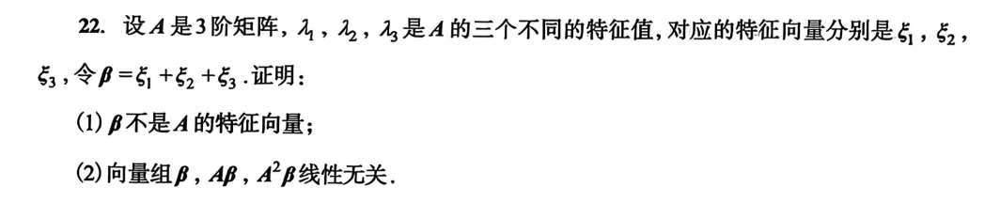
第一问，主要是掌握严密的反证法过程。
第二问，拼矩阵最合适了。
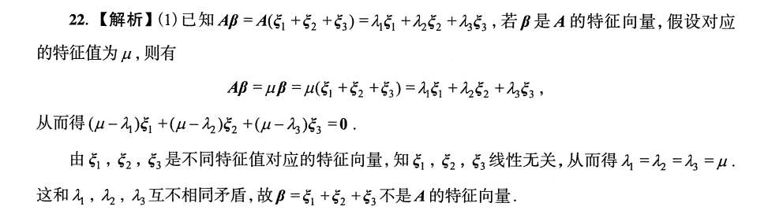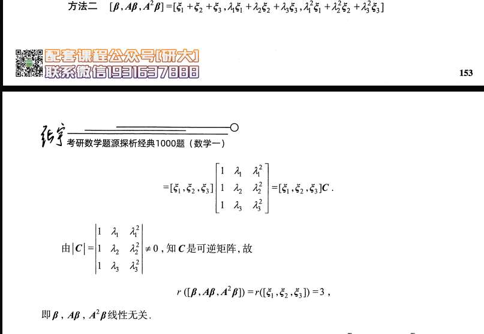

## 8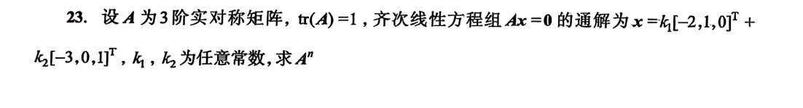
### 第一阶段：像侦探一样“翻译”题干（提取密码）

在考场上，我们绝不逐字读题，而是要对“题眼”产生条件反射：

1. **看到“齐次线性方程组 $Ax=0$ 的通解为...”**
    
    - **潜台词：** 卧槽，白送特征值！$Ax=0$ 其实就是 $Ax = 0 \cdot x$。
        
    - **破译结论：** $\lambda = 0$ 是矩阵 $A$ 的一个特征值。而且通解给了**两个**线性无关的向量 $\xi_1 = [-2, 1, 0]^T$ 和 $\xi_2 = [-3, 0, 1]^T$，说明 $\lambda=0$ 这个特征值占了两个名额，即 **$\lambda_1 = \lambda_2 = 0$**。
        
2. **看到“$\text{tr}(A)=1$”**
    
    - **潜台词：** 迹等于特征值之和，也就是 $\lambda_1 + \lambda_2 + \lambda_3 = 1$。
        
    - **破译结论：** 既然前两个都是 0，那毫无疑问，**$\lambda_3 = 1$**。
        
    - _(内心狂喜：特征值全凑齐了！分别是 0, 0, 1)_
        
3. **看到“3 阶实对称矩阵”**
    
    - **潜台词：** 这是最高级别的保送特权！实对称矩阵不仅绝对能对角化，更牛的是：**不同特征值对应的特征向量必定互相垂直！**
        
    - **破译结论：** 我还没算呢，我就知道属于 $\lambda_3 = 1$ 的那个特征向量 $\xi_3$，一定和前面的 $\xi_1, \xi_2$ 都垂直！
        

---

### 第二阶段：制定战术（老实人做法 vs 考神做法）

题目要求 $A^n$。已知特征值，常规套路肯定是找矩阵 $P$，使得 $A = P \Lambda P^{-1}$，然后 $A^n = P \Lambda^n P^{-1}$。

- **老实人战术：** 算出 $\xi_3$ $\rightarrow$ 拼成矩阵 $P = [\xi_1, \xi_2, \xi_3]$ $\rightarrow$ 拼死拼活求 $P^{-1}$（极其容易算错） $\rightarrow$ 矩阵连乘。
    
- **考神战术（降维打击）：**
    
    等等！我的特征值是 0, 0, 1。
    
    你看这个对角阵 $\Lambda = \begin{bmatrix} 0 & 0 & 0 \\ 0 & 0 & 0 \\ 0 & 0 & 1 \end{bmatrix}$。
    
    它有个极其逆天的性质：**它自己乘自己，还是它自己！也就是 $\Lambda^n = \Lambda$！**
    
    既然 $\Lambda^n = \Lambda$，那么：
    
    $$A^n = P \Lambda^n P^{-1} = P \Lambda P^{-1} = A$$
    
    **绝杀结论：$A^n = A$！** 我根本不需要算 $n$ 次方，我只要把矩阵 $A$ 本身求出来，这题就做完了！
    

---

### 第三阶段：执行斩首行动（只求矩阵 A）

既然目标变成了只求 $A$，怎么求最快？这里再发动一个实对称矩阵的高级特权——**谱分解**。

**第 1 步：找出 $\xi_3$**

设 $\xi_3 = [x, y, z]^T$。因为它垂直于 $\xi_1$ 和 $\xi_2$，直接列方程（点乘为 0）：

$$(\xi_3, \xi_1) = -2x + y = 0 \implies y = 2x$$

$$(\xi_3, \xi_2) = -3x + z = 0 \implies z = 3x$$

令 $x=1$，爽快地得到 **$\xi_3 = [1, 2, 3]^T$**。

**第 2 步：用“外乘”公式秒杀 $A$**

对于实对称矩阵，如果特征值是 $\lambda_1, \lambda_2, \lambda_3$，对应的**单位特征向量**是 $\eta_1, \eta_2, \eta_3$，那么矩阵 $A$ 可以直接拆成：

$$A = \lambda_1 \eta_1 \eta_1^T + \lambda_2 \eta_2 \eta_2^T + \lambda_3 \eta_3 \eta_3^T$$

因为 $\lambda_1 = \lambda_2 = 0$，前两项直接灰飞烟灭！只剩下最后一项：

$$A = 1 \cdot \eta_3 \eta_3^T$$

我们连正交化 $\xi_1, \xi_2$ 的功夫都省了，只需要把 $\xi_3$ 单位化（就是除以它的长度 $\sqrt{1^2+2^2+3^2} = \sqrt{14}$）。

代入公式，最激动人心的一步来了：

$$A = \left( \frac{1}{\sqrt{14}} \begin{bmatrix} 1 \\ 2 \\ 3 \end{bmatrix} \right) \left( \frac{1}{\sqrt{14}} \begin{bmatrix} 1 & 2 & 3 \end{bmatrix} \right)$$

把前面的常数 $\frac{1}{14}$ 提出来，后面就是一个列向量乘行向量（秩 1 矩阵的标准生成法）：

$$A = \frac{1}{14} \begin{bmatrix} 1 \\ 2 \\ 3 \end{bmatrix} \begin{bmatrix} 1 & 2 & 3 \end{bmatrix} = \frac{1}{14} \begin{bmatrix} 1\times1 & 1\times2 & 1\times3 \\ 2\times1 & 2\times2 & 2\times3 \\ 3\times1 & 3\times2 & 3\times3 \end{bmatrix}$$

$$A = \frac{1}{14} \begin{bmatrix} 1 & 2 & 3 \\ 2 & 4 & 6 \\ 3 & 6 & 9 \end{bmatrix}$$

**第 3 步：写下最终答案，潇洒交卷**

因为 $A^n = A$（已在战术阶段分析过）。

所以最终答案直接写：

$$A^n = \frac{1}{14} \begin{bmatrix} 1 & 2 & 3 \\ 2 & 4 & 6 \\ 3 & 6 & 9 \end{bmatrix}$$

_(考场上的最后 10 秒钟，还可以肉眼验算一下：看主对角线 $\frac{1+4+9}{14} = 1$，迹刚好等于 1，完美吻合题干，稳如老狗！)_