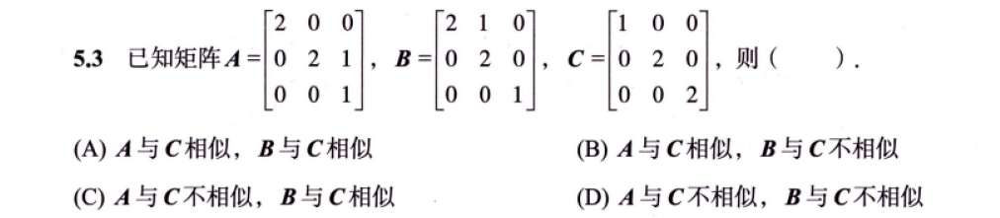

# 习题

## 1

1. 如果相似，它们必须：**特征值相同**、**迹（tr）相同**、**行列式（det）相同**。
2. **一个对角矩阵 $C$ 与另一个矩阵 $M$ 相似的充分必要条件是：$M$ 可以对角化。**‘判断重根 $\lambda=2$（2 重根）是否有足够的特征向量：
*   **检查 $A$**：
    计算 $2E - A = \begin{bmatrix} 0 & 0 & 0 \\ 0 & 0 & -1 \\ 0 & 0 & 1 \end{bmatrix}$。很明显，秩 $r(2E-A) = 1$。
    特征向量个数 $s = 3 - 1 = \mathbf{2}$。
    **结论**：重数 2，向量也给 2 个，**$A$ 能对角化**。所以 **$A \sim C$**。

*   **检查 $B$**：
    计算 $2E - B = \begin{bmatrix} 0 & -1 & 0 \\ 0 & 0 & 0 \\ 0 & 0 & 1 \end{bmatrix}$。第二列和第三列线性无关，秩 $r(2E-B) = 2$。
    特征向量个数 $s = 3 - 2 = \mathbf{1}$。
    **结论**：重数 2，向量只给 1 个，“亏损”了。**$B$ 不能对角化**。所以 **$B \nsim C$**。

**最终答案选 (B)。**’

