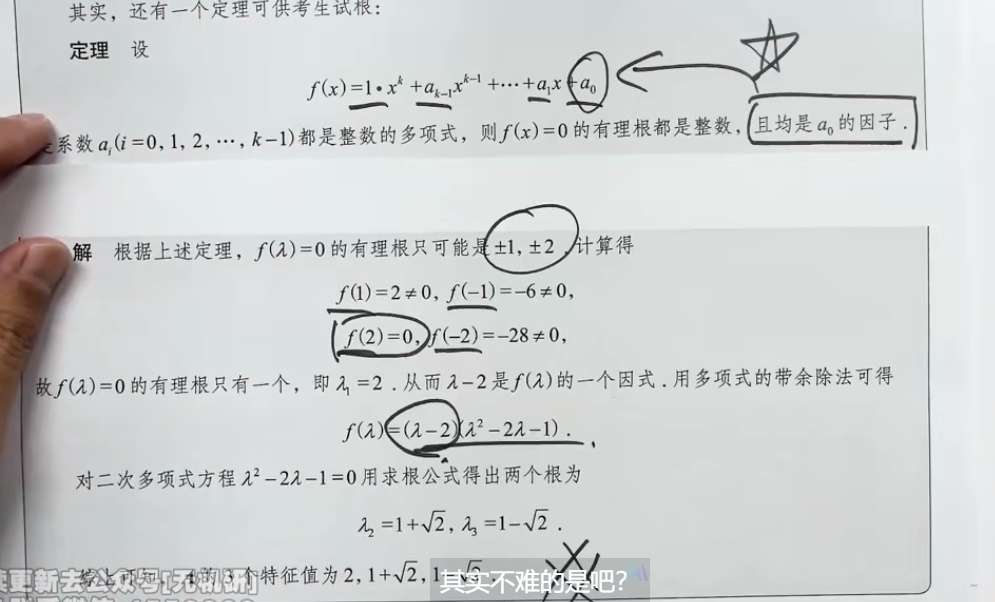
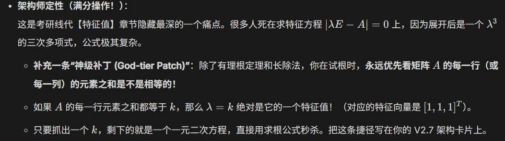

首先，+-1，0， 很容易自己试试

图片中提到的这个方法，在数学上被称为**有理根定理**（Rational Root Theorem），这里展示的是它的一种特殊情况（最高次项系数为 1，也叫首一多项式）。

这个“试根”的原理其实非常巧妙，我们可以通过简单的代数推导来揭开它的面纱。

### 核心原理推导

假设我们有一个多项式方程，且它的所有系数都是整数：

$$x^k + a_{k-1}x^{k-1} + \dots + a_1x + a_0 = 0$$

现在，假设这个方程有一个**有理数根**。任何有理数都可以写成最简分数的形式 $\frac{p}{q}$，其中 $p$ 和 $q$ 都是整数，并且**它们互质**（没有共同的约数）。

**第一步：代入方程**

把 $x = \frac{p}{q}$ 代入方程中：

$$\left(\frac{p}{q}\right)^k + a_{k-1}\left(\frac{p}{q}\right)^{k-1} + \dots + a_1\left(\frac{p}{q}\right) + a_0 = 0$$

**第二步：去分母**

为了消去分数，我们将等式两边同时乘以 $q^k$：

$$p^k + a_{k-1}p^{k-1}q + \dots + a_1pq^{k-1} + a_0q^k = 0$$

**第三步：提取公因式**

我们把上面等式中，包含 $p$ 的项留在左边，把不含 $p$ 的项（也就是最后一项）移到右边：

$$p^k + a_{k-1}p^{k-1}q + \dots + a_1pq^{k-1} = -a_0q^k$$

在等式左边，每一项都含有 $p$，所以我们可以把 $p$ 提出来：

$$p \cdot (p^{k-1} + a_{k-1}p^{k-2}q + \dots + a_1q^{k-1}) = -a_0q^k$$

**第四步：得出结论**

重点来了！观察上面的等式：

- 左边显然是 $p$ 的倍数（因为乘以了 $p$）。
    
- 那么等式的右边 $-a_0q^k$ 也必须是 $p$ 的倍数。
    

前面我们规定了 $p$ 和 $q$ 是互质的（它们没有共同的约数），所以 $p$ 不可能去整除 $q^k$。既然这样，**$p$ 就只能去整除 $a_0$ 了**。

这就证明了：**分子 $p$ 必须是常数项 $a_0$ 的因子（约数）。**

### 为什么图片里的根一定是整数？

同样的道理，如果我们把上面第二步的等式，把包含 $q$ 的项留在左边，把只含有 $p$ 的项（即第一项 $p^k$）移到右边，我们会发现：

**分母 $q$ 必须是最高次项系数的因子。**

- 在图片中的定理里，最高次项 $x^k$ 的系数是 **$1$**。
    
- 这意味着，分母 $q$ 必须是 $1$ 的因子。
    
- $1$ 的整数因子只有 $1$ 和 $-1$。
    

既然分母 $q$ 只能是 $\pm 1$，那么这个根 $x = \frac{p}{\pm 1} = \pm p$，**它必然是一个整数**。

### 总结图片中的解题过程

1. **锁定目标：** 题目中的多项式最高次项系数为 $1$，常数项 $a_0$（虽然图片没写出原方程，但从后面因式分解可以看出原方程的常数项应该是 $2$ 或者 $-2$）。
    
2. **找因子：** 根据定理，如果有理根存在，它只能是常数项的约数。常数项 $2$ 的约数只有 $\pm 1$ 和 $\pm 2$。
    
3. **试根：** 所以不需要漫无目的地瞎猜，只需要把 $1, -1, 2, -2$ 这四个数挨个代入原方程 $f(\lambda)$ 中去试。
    
4. **降次：** 一旦试出来 $f(2) = 0$，就说明找到了一个根 $\lambda = 2$。这意味着原多项式一定含有 $(\lambda - 2)$ 这个因式。接着用多项式除法（带余除法）把原方程除以 $(\lambda - 2)$，就可以把一个三次方程降维成一个二次方程，从而轻松解出剩下的根。