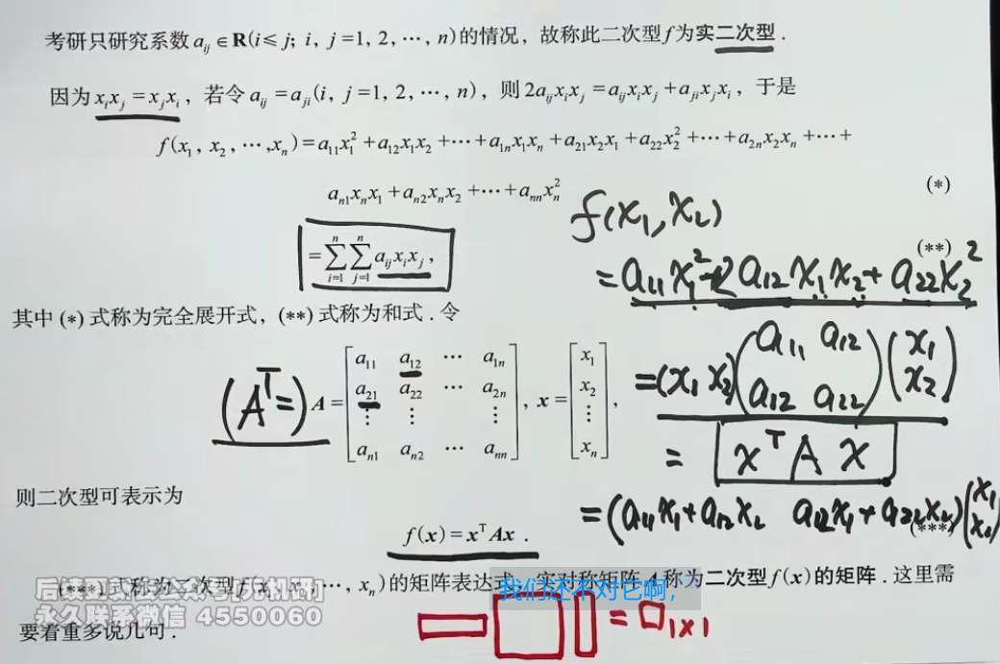
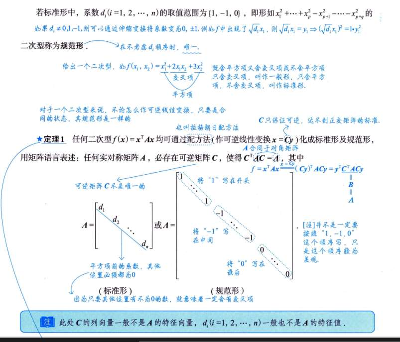

# 二次型基本概念

可推理出，二次型的矩阵不唯一。
但我们只要实对称矩阵的情况
# 合同矩阵
### 第一幕：为什么突然冒出“线性变换 $x = Cy$”？（动机）

结合我们上一回合讲的几何深意，二次型 $f(x) = x^T A x$ 描述的是一个几何图形（比如一个椭圆）。

- **现实困境：** 如果矩阵 $A$ 里面有交叉项（比如 $x_1 x_2$），这个椭圆在 $x$ 坐标系里就是**歪的**。歪的椭圆非常难研究，我们想把它**摆正**。
    
- **如何摆正？** 既然椭圆是歪的，那我们干脆**把坐标轴给转过去**，去迎合这个椭圆！
    
- **线性变换登场：** 在线性代数里，“换坐标系（旋转、拉伸坐标轴）”的数学操作，就叫做**可逆线性变换**，写成公式就是 **$x = Cy$**。
    
    - $x$ 是旧坐标（歪的视角）。
        
    - $y$ 是新坐标（正的视角）。
        
    - $C$ 就是连接新旧视角的“翻译官”（过渡矩阵）。
        

**总结：** 书上突然讲线性变换 $x = Cy$，不是为了炫技，而是为了**“换个视角看图形”**。这是化简二次型的唯一手段！

---

### 第二幕：为什么会出来 $C^T A C$？（代数桥梁）

既然我们决定要戴上 $C$ 这副新眼镜（新坐标系 $y$）来看原来的图形，那我们就必须把原来的方程 $f(x) = x^T A x$ 翻译成 $y$ 的语言。

这就是你图里中间那段穿脱衣服一样的代数推导：

1. 把 $x = Cy$ 代入原式： $f(x) = (Cy)^T A (Cy)$
    
2. 利用转置的穿脱原则 $(AB)^T = B^T A^T$，拆开前面的括号： $y^T C^T A C y$
    
3. 因为矩阵乘法有结合律，我们把中间那一坨紧紧抱在一起： $y^T (C^T A C) y$
    

此时，我们发现中间的 **$C^T A C$** 也是一个实对称矩阵。为了书写方便，我们给它起个新名字，叫 **$B$**。

于是，新坐标系下的方程变成了：**$g(y) = y^T B y$**

**总结：** $C^T A C$ 不是凭空捏造的，它是做坐标变换时，矩阵转置法则 $(Cy)^T$ 必然导致的一个代数副产物。

---

### 第三幕：为什么要发明“合同”这个词？（核心命名）

现在，我们手头有两个矩阵：

- **$A$：** 旧坐标系下，那个歪椭圆的“身份证”。
    
- **$B$：** 新坐标系下，同一个椭圆摆正后的“身份证”。
    

数学家需要定义一种关系，来表明**“矩阵 $A$ 和矩阵 $B$ 其实描述的是同一个几何图形，只是看的坐标系不同”**。

既然 $B$ 是由 $A$ 通过 $C^T A C$ 变过来的，数学家就给这种特殊的关系赋予了一个专属名词——**合同（Congruence）**。记作 $A \simeq B$。

正如你图片最下方那句高亮的话所说：**“A 表征的是形态，B 表征的也是形态，无非是同一个事物在不同参照系下的不同形态。”**

# 标准型规范型
标准型是二次型没有交叉项的情况

找一个普通的可逆矩阵 $C$，做变换 $x = Cy$。最后得到 $C^T A C = \Lambda$（对角阵）。
普通的可逆矩阵 $C$ 就像是对坐标系进行“整容”。你不仅可以旋转坐标轴，还可以**随意拉伸、压缩、甚至把坐标轴压扁倾斜（斜交）**。只要你能把那个歪的图形强行揉捏成一个正的（没有交叉项），怎么扯都行。
因为你对空间进行了暴力拉伸，所以最后化出来的对角阵 $\Lambda$ 上的数字，**根本不是原来的特征值**！它们只是一堆能反映图形是椭圆还是双曲线的数字而已。

- 不准用普通的 $C$，必须找一个极其高贵的**正交矩阵 $Q$**，做变换 $x = Qy$。
- **$Q^{-1} = Q^T$**，并且由此推导出了一个无敌等式：**$Q^T A Q = Q^{-1} A Q = \Lambda$**。
- 正交矩阵 $Q$ 代表的是**纯粹的刚体旋转**。它就像是“正骨”，绝对不允许拉伸或挤压坐标轴，只能把原本互相垂直的坐标系原封不动地旋转一个角度，刚好对准图形的长短轴。
- 那么最后算出来的那个对角阵 $\Lambda$，主对角线上的元素就不再是阿猫阿狗了，它们**必须是、且绝对是矩阵 $A$ 最纯正的特征值（$\lambda_1, \lambda_2 \dots$）！**

# 惯性定理
**“你们随便怎么拉伸、压缩坐标轴（乘不同的 $C$），算出来的系数大小确实会变。但是！系数的【正负号数量】是绝对不可能改变的！”**

- **$p$（正惯性指数）：** 就是化简后，系数为正数的个数。
    
- **$q$（负惯性指数）：** 就是化简后，系数为负数的个数。
    

**为什么这个发现这么牛？背后的几何深意是什么？**

因为系数的正负，决定了这个几何图形最底层的**拓扑结构（也就是骨架）**！

- **正号 ($+$)：** 代表图形在这个维度上是**向上弯曲**的（像一个开口向上的碗）。
    
- **负号 ($-$)：** 代表图形在这个维度上是**向下弯曲**的（像马鞍的边缘）。
    
- **零 ($0$)：** 代表图形在这个维度上是**平坦**的（没有弯曲，像个圆柱面）。
    

惯性定理的几何意义就是：**你可以用可逆线性变换把一个“小碗”拉伸成一个“大宽盘子”（改变系数值），但你绝对不可能通过拉伸，把一个“碗”变成一个“马鞍”！**

# 化简二次型为标准型

## 配方法
**第一步：先把 $x_1$ 关进“小黑屋”**

老师在第一行画了横线：$x_1^2 + 2x_1x_2 + 2x_1x_3$。这是原式中所有包含 $x_1$ 的项。

老师想找一个完全平方公式，把它们一口吞进去。

回想一下公式：$(a+b+c)^2 = a^2 + b^2 + c^2 + 2ab + 2ac + 2bc$

为了凑出 $2x_1x_2$ 和 $2x_1x_3$，我们可以强行构造一个 $(x_1 + x_2 + x_3)^2$。

但是，这个括号展开后，除了我们想要的项，还会多出一些“副产物”（$x_2^2 + x_3^2 + 2x_2x_3$）。

所以必须把副产物减掉：

$$x_1^2 + 2x_1x_2 + 2x_1x_3 = \mathbf{(x_1 + x_2 + x_3)^2} - x_2^2 - x_3^2 - 2x_2x_3$$

_目标达成：_ $x_1$ 已经被死死锁在加粗的括号里了，外面再也没有游离的 $x_1$ 了！

**第二步：收拾残局（处理 $x_2$ 和 $x_3$）**

把刚才减掉的“副产物”，跟原式剩下的那部分（$- x_2^2 - 2x_2x_3 - x_3^2$）合并。

副产物 + 剩下的 = $- 2x_2^2 - 4x_2x_3 - 2x_3^2$

老师提取了一个 $-2$，变成了：

$$-2(x_2^2 + 2x_2x_3 + x_3^2)$$

运气非常好，括号里刚好又是一个完美的完全平方：

$$-2(x_2 + x_3)^2$$

_目标达成：_ 所有的 $x_2$ 和 $x_3$ 也被锁进第二个括号了！

---

### 结局：配方之后的“华丽变身”

现在，原式被老师凑成了这个样子：

$$f = (x_1 + x_2 + x_3)^2 - 2(x_2 + x_3)^2$$

**这一步到底意味着什么？这就是见证奇迹的时刻！**

我们直接令括号里的东西等于**“新坐标系”**的变量：

- 令 $y_1 = x_1 + x_2 + x_3$
    
- 令 $y_2 = x_2 + x_3$
    
- 令 $y_3 = x_3$ （为了凑齐三维空间，强行加一个，哪怕它系数是 0）
    

把这些 $y$ 代回上面的式子，二次型瞬间变成了：

$$f = 1 \cdot y_1^2 - 2 \cdot y_2^2 + 0 \cdot y_3^2$$