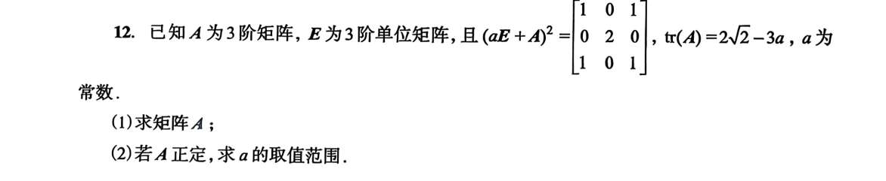
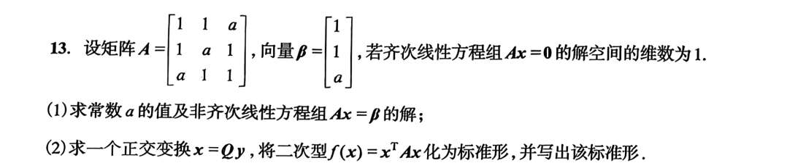
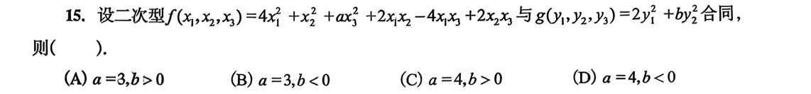
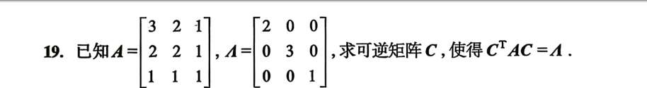

化标准型：
配方法，正交变换法（“最高贵的标准形”**（系数是矩阵的纯正特征值））

求规范型：
与上面两方法对应
用配方法化完后，看惯性系数都是啥；
算特征值后，看惯性系数都是啥

**补充**，
- 看惯性系数：
	矩阵 -->化为多项式-->配方法-->观察各项系数正负。
- 配方法：
  不能变量间相互纠缠

判断是否为合同矩阵
- 特征值正负是否相同/惯性系数是否相同

判断是否为正定矩阵
- 特征值正负是否相同/惯性系数是否相同
- 顺序主子式都大于 0
- 正定矩阵的对角线一定全为正；但对角线全为正的不一定是正定矩阵！
“顺序主子式全大于 0 $\iff$ 正定”，这个西尔维斯特判别法，是**实对称矩阵的绝对特权**！如果矩阵不对称，这个定理直接报废。
如果两个矩阵合同，那么“你对称，我也必须对称
若 $A$ 与正定矩阵合同，则 $A$ 为正定矩阵

求正惯性系数
- 用配方法化完后，看惯性系数都是啥
- 算特征值后，看惯性系数都是啥

合同与相似：

|**对比维度**|**相似 (A∼B)**|**合同 (A≃B)**|
|---|---|---|
|**代数公式**| $B = P^{-1} A P$ | $B = C^T A C$ |
|**几何对象**|动态的**线性变换**|静态的**二次型几何体**|
|**物理意义**|换个坐标系，看**同一个动作**|暴力拉伸坐标系，看**同一个形状**|
|**绝对不变量**|**特征值**一模一样|**特征值的正负号个数**一模一样|

拿到这种题，先偷偷算一下 $B^2$。如果发现 $B^2$ 等于 $k B$（这种巧合在考研里极其常见）

- 算 B 特征值， $(a + \mu)^2 \in {0, 2, 2}$，可算 A 特征值
- 发现 $B^2 = 2B$，$aE + A = \frac{1}{\sqrt{2}}B = \frac{\sqrt{2}}{2}B$

- 把 $B$ 的特征向量全求出来，拼成一个可逆矩阵 $P$。然后算出 $P^{-1}$，得到 $P^{-1}BP = \Lambda = \begin{bmatrix} 0 & 0 & 0 \\ 0 & 2 & 0 \\ 0 & 0 & 2 \end{bmatrix}$。
- 找一个对角阵 $\tilde{\Lambda}$，让它的平方等于 $\Lambda$，$\tilde{\Lambda} = \begin{bmatrix} 0 & 0 & 0 \\ 0 & \sqrt{2} & 0 \\ 0 & 0 & \sqrt{2} \end{bmatrix}$。
- $B = P\Lambda P^{-1}$，那么开完根号后，**$aE+A = P \tilde{\Lambda} P^{-1}$**。把 $P$、$\tilde{\Lambda}$、$P^{-1}$ 这三个 $3 \times 3$ 的大矩阵硬生生地乘在了一起，最后减去 $aE$，算出了 $A$。

- 我们要 r (A)=2，计算 A 的行列式=0，看 a 的几种情况中哪个能让 r (A)=2
- 已知 a，求出 A 的特征值，A 是对称矩阵，所以可求出线性无关且正交的特征向量，还要单位化

两个矩阵写出来
- g，有个特征值为 0，合同的两个矩阵，秩必须一模一样！，故而 f 的矩阵，行列式为 0

只要不限制 $C$ 是正交矩阵，合同变换 ($C^T A C$) 可以把矩阵变成任何一副鬼样子，只要正负号（惯性指数）不变就行
- $A$ 的主子式是 $\Delta_1=3, \Delta_2=2, \Delta_3=1$，全是正数，说明 $A$ 是个**正定矩阵**。
    
- $\Lambda$ 的对角线是 $2, 3, 1$，全是正数，说明 $\Lambda$ 也是个**正定矩阵**。
    

这就结了！既然大家都是正定矩阵，都是一个“完美的圆碗”，那它们之间**绝对合同**。这道题就是在考你：**如何用普通的“配方法”，强行把 $A$ 捏成 $\Lambda$ 的形状。**

**第一步：把 $A$ 还原成多项式，老老实实配方**

$$f = 3x_1^2 + 2x_2^2 + x_3^2 + 4x_1x_2 + 2x_1x_3 + 2x_2x_3$$

我们这次倒着配，拿 $x_3$ 当锚点（因为 $x_3$ 的系数是 1，最干净）：

$$f = (x_3^2 + 2x_1x_3 + 2x_2x_3) + 3x_1^2 + 2x_2^2 + 4x_1x_2$$

凑出第一个括号：

$$f = (x_1 + x_2 + x_3)^2 - (x_1^2 + x_2^2 + 2x_1x_2) + 3x_1^2 + 2x_2^2 + 4x_1x_2$$

合并剩下的垃圾：

$$f = (x_1 + x_2 + x_3)^2 + 2x_1^2 + x_2^2 + 2x_1x_2$$

处理剩下的 $2x_1^2 + x_2^2 + 2x_1x_2$，刚好又是一个完美的平方和：

$$f = (x_1 + x_2 + x_3)^2 + (x_1 + x_2)^2 + x_1^2$$

你看，我们用配方法，把它变成了极其干净的：

$$f = z_1^2 + z_2^2 + z_3^2$$

_(其中 $z_1 = x_1+x_2+x_3, \quad z_2 = x_1+x_2, \quad z_3 = x_1$)_

**第二步：强行拉伸，对标 $\Lambda$（点睛之笔）**

题目要的不是 $1, 1, 1$，而是 $\Lambda$ 里的 **$2, 3, 1$**。

也就是要凑成：$f = 2y_1^2 + 3y_2^2 + 1y_3^2$。

这还不容易吗？缺什么补什么！直接进行坐标缩放：

令 $z_3 = \sqrt{2} y_1$，那么 $z_3^2$ 就变成了 $2y_1^2$

令 $z_2 = \sqrt{3} y_2$，那么 $z_2^2$ 就变成了 $3y_2^2$

令 $z_1 = y_3$，那么 $z_1^2$ 就变成了 $y_3^2$

完美对标！我们把新旧坐标的关系连起来：

- $x_1 = z_3 = \sqrt{2}y_1$
    
- $x_1 + x_2 = z_2 = \sqrt{3}y_2 \implies x_2 = -\sqrt{2}y_1 + \sqrt{3}y_2$
    
- $x_1 + x_2 + x_3 = z_1 = y_3 \implies x_3 = -\sqrt{3}y_2 + y_3$
    

**第三步：提取矩阵 $C$**

把上面的方程组写成矩阵形式 $x = Cy$：

$$\begin{bmatrix} x_1 \\ x_2 \\ x_3 \end{bmatrix} = \begin{bmatrix} \sqrt{2} & 0 & 0 \\ -\sqrt{2} & \sqrt{3} & 0 \\ 0 & -\sqrt{3} & 1 \end{bmatrix} \begin{bmatrix} y_1 \\ y_2 \\ y_3 \end{bmatrix}$$

**这个提取出来的系数矩阵，就是题目梦寐以求的矩阵 $C$！** 解题结束

