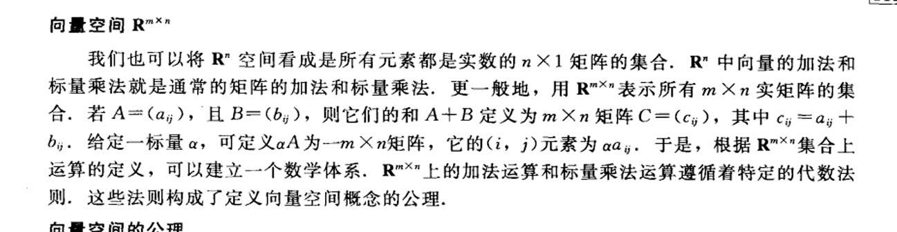
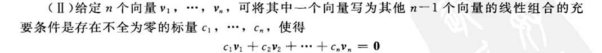

# 向量空间

R^n 我的理解，这个n 就是空间基向量span的 空间维度嘛？

m×n到底是啥意思？ 为什么扯到了矩阵？

向量空间的定义
向量空间实际是个集合，里面的元素是“向量”
巧的是，里面的元素进行加减运算后，总能在集合中找到运算结果的那个向量 
所以，这个向量空间一定是无限大的

不过我还有个困惑，就是这些分配律，我永远都是凭借直觉，认为是非常“想当然”的 感觉加法封闭和乘法封闭 就够了 不需要验证这些  
我的想法是不是有漏洞的  
包括我联想到， 线性变换定义下， 我们说 最开始 x = ai + jy 变换后 新x = a新i + 新j 我也觉得这是想当然的，也没有看到什么证明  
这合理吗？

识别向量空间的核心就是， 时刻想清楚定义域， 然后思考加法和乘法的结果是否仍在定义域里面 ， 这就够了。

## 子空间
额 感觉也很好理解 向量空间的子集中再找一个向量空间  他就叫子空间

## 张成
比如 我们选定两个向量 他们所有的线性组合  构成的集合 就是张成  记为span
哦！原来span的严谨性表述在这里！
span也是集合， 子空间也是集合， 所以我们完全可以说 向量空间V中的元素 其span为V的一个子空间 
按我的直觉理解，span相当于扩充向量 比如我们只选定俩个向量，但span这个集合却有无数个向量  如果把向量空间可视化 那就是一个子空间 比如二维平面是三维大空间的一个部分 
### 张集
选定V中的向量 构建span 若span 完全就是V 那么 刚才选定的向量就是张集

挺好，感觉这些概念都一环套一环，每一个都要精准理解概念才好。

## 线性无关
特点
- n个向量的V 若一个向量可以由其他n-1个向量线性组合 可以说这个向量是多余的 所以实际上， n-1个向量就可以张成V。 啊，不过事实是向量空间含有n个向量。所以
  含有“和张成是不一样的
- 这个特征我觉得和第一个说的一个事啊 

定义：c1v1+c2v2+...cnvn = 0
若所有标量必定为0 就可推出线性无关。
我觉得很好理解，也很巧妙。
突然觉得，定义是人为设计的，是如何想到严谨精妙的定义呢？

## 线性相关
与无关的定义对应  
其实就是能找到一个向量 能使得由其他向量线性组合得到
注意是找到一个向量，我觉得吧，不能是有一个向量。
为啥，因为只要有一个向量能由其他向量线性组合，这个向量就能和其他向量线性组合为其它向量？

不对
**“一个向量组是线性相关的”，它的意思仅仅是“这个队伍里，至少有一个‘滥竽充数’的家伙”。但不代表所有人都在“滥竽充数”。**