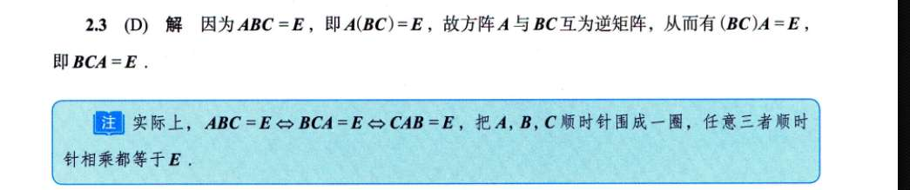
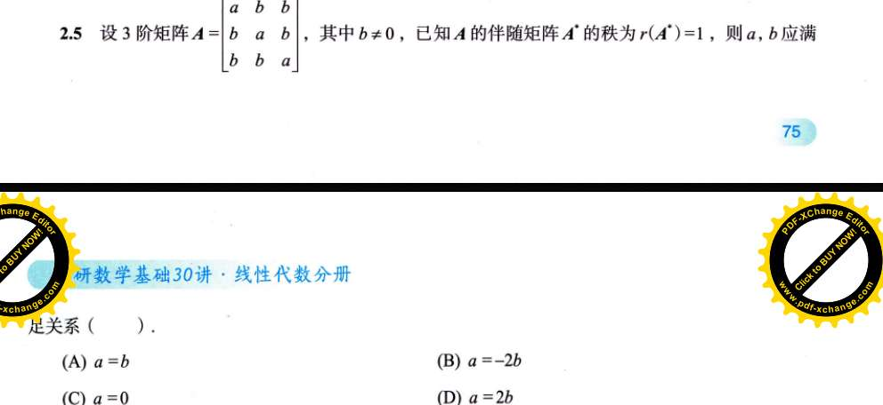
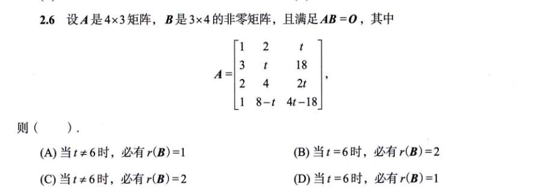
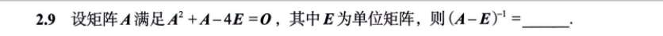
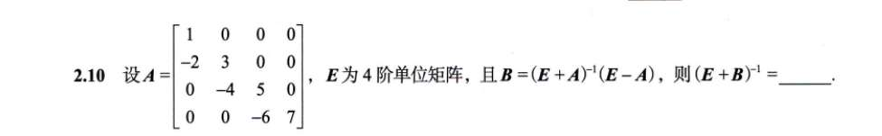
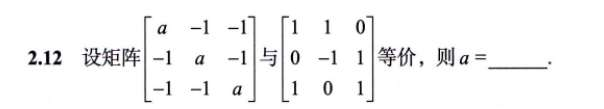
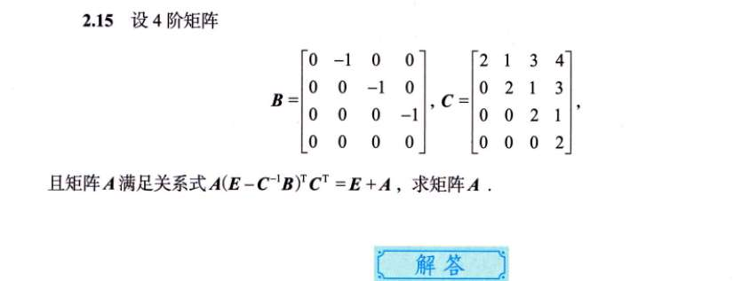
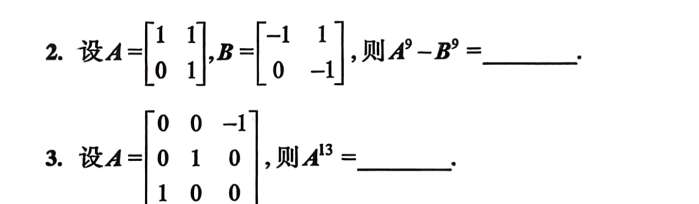
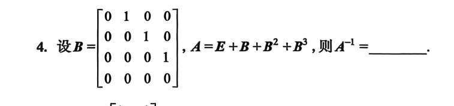

# 习题
## 3

## 5 化简
  

## 6

矩阵 $A = \begin{bmatrix} 1 & 2 & -1 \\ -2 & -4 & 2 \\ 3 & 6 & -3 \end{bmatrix}$

你从上往下扫一眼这三行：

- 第 1 行是：$[1, 2, -1]$
    
- 第 2 行是：$[-2, -4, 2]$
    
- 第 3 行是：$[3, 6, -3]$
    

发现了吗？第 2 行就是第 1 行乘以 **-2**；第 3 行就是第 1 行乘以 **3**。

整个矩阵，其实翻来覆去就只有**“一种基因”**。

**提取法：** 我们直接把最顺眼的那一行（通常是第一行，或者数字最简单的那一行）抽出来，作为我们的**“行模版”**，这就是你要找的 **$\beta^T$**。

所以：$\beta^T = [1, 2, -1]$

- 矩阵的第 1 行怎么来？ $\rightarrow$ 模版乘以 **1**。
    
- 矩阵的第 2 行怎么来？ $\rightarrow$ 模版乘以 **-2**。
    
- 矩阵的第 3 行怎么来？ $\rightarrow$ 模版乘以 **3**。
    

把这三个倍数竖起来装进一个列向量里，就得到了 $\alpha$：

$$\alpha = \begin{bmatrix} 1 \\ -2 \\ 3 \end{bmatrix}$$

拼在一起，大功告成：

$$A = \begin{bmatrix} 1 \\ -2 \\ 3 \end{bmatrix} [1, 2, -1]$$

## 9

写个 A-E 因子，剩下的强行凑

## 10 代数化简

## 12

**求秩是全场唯一一个你可以合法混用行和列的场景！**
    

（_复习一下我们的“红线”：只有在求逆矩阵、解方程组时，才绝对禁止碰列变换。_）

## 13 矩阵方程化简

你仔细观察一下题目给的矩阵 $A$：

- 主对角线上全是 **1**
    
- 主对角线紧挨着的下面一条斜线上全是 **2**
    
- 再往下的一条斜线上全是 **3**
    
- 最左下角是 **4**
    

这种“顺着斜线看，数字全都一样”的矩阵，在数学上有一个专属名字叫 **下三角托普利茨矩阵 (Toeplitz Matrix)**。

它有一个极其强大的隐藏属性：**它的逆矩阵，一定也是一个长着相同花纹的“下三角托普利茨矩阵”！**

也就是说，逆矩阵同样满足“顺着斜线数字全一样”的规律。

这意味着什么？意味着你**根本不需要求完整的 16 个数字**！你只需要把逆矩阵的**第一列**求出来，剩下的列只需要不断往右下方“平移复制”就可以了！

---

### 第二步：狙击第一列（极速口算）

既然只要第一列，那事情就简单了。

假设逆矩阵的第一列未知数是 $\begin{bmatrix} x_1 \\ x_2 \\ x_3 \\ x_4 \end{bmatrix}$。

根据矩阵乘法 $A \times A^{-1} = E$，矩阵 $A$ 乘以逆矩阵的第一列，必定等于单位阵 $E$ 的第一列 $\begin{bmatrix} 1 \\ 0 \\ 0 \\ 0 \end{bmatrix}$。

我们直接用 $A$ 的每一行，去和这四个未知数做“配方”（乘积求和）：

1. **看 $A$ 的第 1 行** $(1, 0, 0, 0)$：
    
    $1 \cdot x_1 = 1 \implies \mathbf{x_1 = 1}$
    
2. **看 $A$ 的第 2 行** $(2, 1, 0, 0)$：
    
    $2x_1 + 1x_2 = 0$
    
    把 $x_1=1$ 代入：$2 + x_2 = 0 \implies \mathbf{x_2 = -2}$
    
3. **看 $A$ 的第 3 行** $(3, 2, 1, 0)$：
    
    $3x_1 + 2x_2 + 1x_3 = 0$
    
    把前面算的代入：$3(1) + 2(-2) + x_3 = 0 \implies 3 - 4 + x_3 = 0 \implies \mathbf{x_3 = 1}$
    
4. **看 $A$ 的第 4 行** $(4, 3, 2, 1)$：
    
    $4x_1 + 3x_2 + 2x_3 + 1x_4 = 0$
    
    代入：$4(1) + 3(-2) + 2(1) + x_4 = 0 \implies 4 - 6 + 2 + x_4 = 0 \implies \mathbf{x_4 = 0}$
    

太爽了！全是最简单的加减法！我们瞬间拿到了逆矩阵的第一列：

$$\begin{bmatrix} \mathbf{1} \\ \mathbf{-2} \\ \mathbf{1} \\ \mathbf{0} \end{bmatrix}$$

---

### 第三步：见证奇迹的“复制粘贴”

根据我们刚才说的规律，现在拿着第一列，开始向右下方平移：

- 第 1 列是：$1, -2, 1, 0$
    
- 第 2 列往下移一格：$0, 1, -2, 1$
    
- 第 3 列再往下移一格：$0, 0, 1, -2$
    
- 第 4 列再往下移一格：$0, 0, 0, 1$
    

把它们拼起来，就是最终答案：

$$A^{-1} = \begin{bmatrix} 1 & 0 & 0 & 0 \\ -2 & 1 & 0 & 0 \\ 1 & -2 & 1 & 0 \\ 0 & 1 & -2 & 1 \end{bmatrix}$$

和图片上的标准答案严丝合缝！整个过程如果熟练的话，草稿纸上只写那四个简单方程，30 秒内就能出结果。

**总结一下：**

遇到下三角（或上三角），且沿着对角线数字都一样的矩阵，**绝对不要去用常规方法硬算全图**。直接利用 $AX=E$ 求出第一列（或第一行），然后愉快地平移复制就行了。

# 1000 题

2, 就自己写写平方，算算
3，就拿配方思想捣鼓

配方思想来看，这是移位矩阵！$$A = E + B + B^2 + B^3$$

觉得眼熟吗？回忆一下初中学过的多项式因式分解（等比数列求和）：

$$1 - x^4 = (1 - x)(1 + x + x^2 + x^3)$$

既然多项式可以这么玩，**矩阵完全可以照猫画虎**（因为 $E$ 和 $B$ 乘法是可交换的）！

我们把上面的公式翻译成矩阵语言：

$$E - B^4 = (E - B)(E + B + B^2 + B^3)$$

现在，见证奇迹的时刻到了：

1. 括号里那一长串 $(E + B + B^2 + B^3)$，不就是题目里的 **$A$** 吗！
    
2. 左边的 $B^4$，我们刚才扒过了，它是 **$O$**（零矩阵），所以 $E - B^4 = E - O = \mathbf{E}$。
    

把这两个结论代入公式：

$$E = (E - B) \cdot A$$