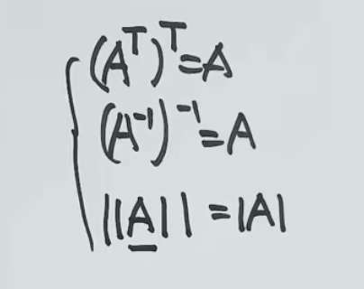
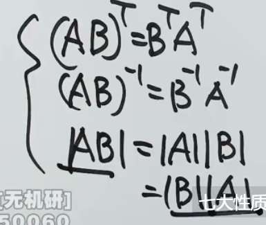
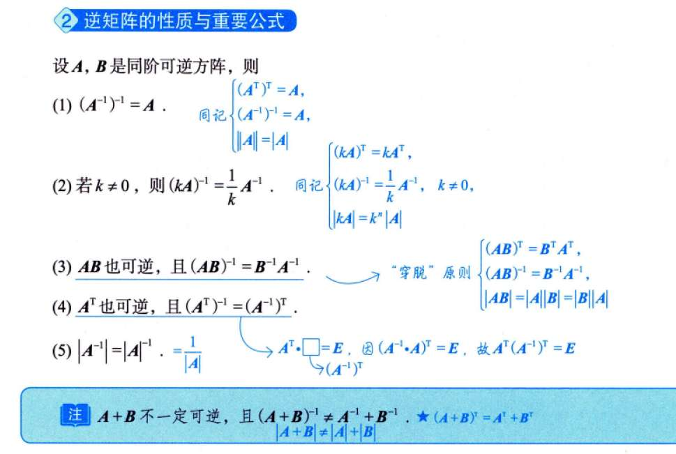
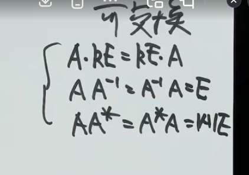

# 转置矩阵

$A^TA$ 衡量了 $A$ 中**各个列（特征）之间的相关性/相似度**。
$AA^T$ 衡量了 $A$ 中**各个行（样本或数据点）之间的相关性/相似度**。

性质  
- k 可以直接提出去
- 先加再转置等于转置后再加
- $(AB)^T=B^TA^T$

# 矩阵性质

- 秩 1 方阵 A(列矩阵乘行矩阵)，$A^n = {tr (A)}^{n-1}A$ 
	只要 $A$ 是一个秩为 1 的方阵，它一定可以分解为一个列向量 $\alpha$ 乘上一个行向量 $\beta^T$，即 $A = \alpha \beta^T$。
	当我们计算 $A^2$ 时：
	
	$$A^2 = (\alpha \beta^T)(\alpha \beta^T) = \alpha (\beta^T \alpha) \beta^T$$
	
	中间的 $\beta^T \alpha$ 是一个实数（内积），并且它恰好等于矩阵 $A$ 的迹（主对角线元素之和），即 $\beta^T \alpha = \text{tr}(A)$。
	
	所以 $A^2 = \text{tr}(A) \alpha \beta^T = \text{tr}(A)A$。以此类推，就能得到 $A^n = (\text{tr}(A))^{n-1}A$。

计算 A^n 一般先拆分。 

# 逆矩阵的性质

- KA 的逆，是 K 分之一 A^-1
- 如转置，AB 的逆，等于 B 逆乘 A 逆

# 伴随矩阵

## 可交换的矩阵
