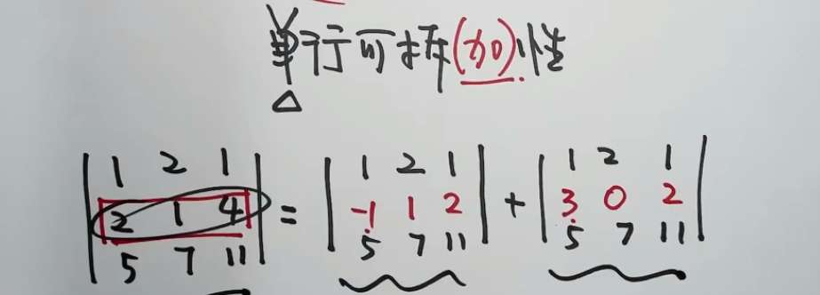
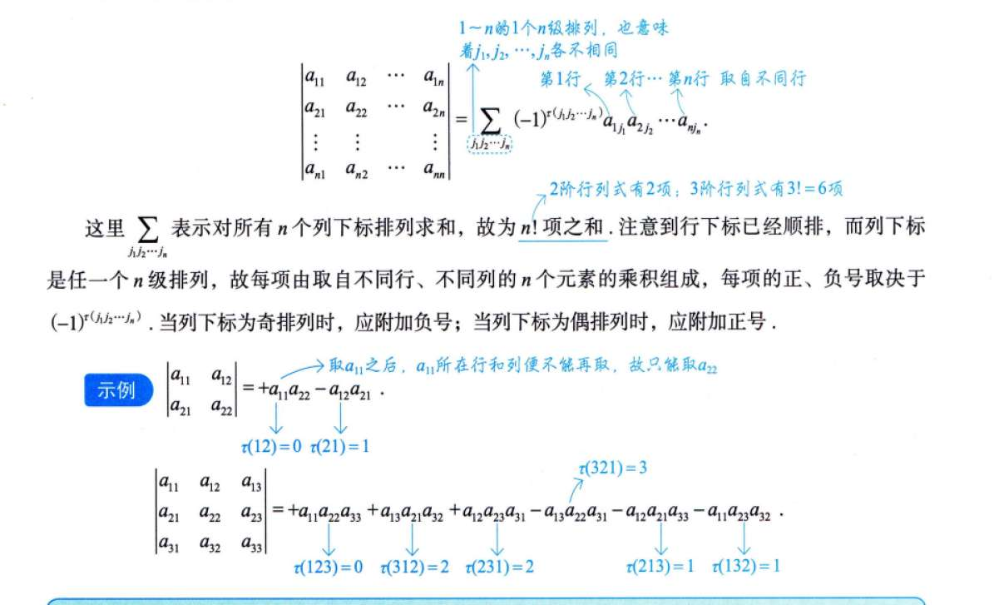
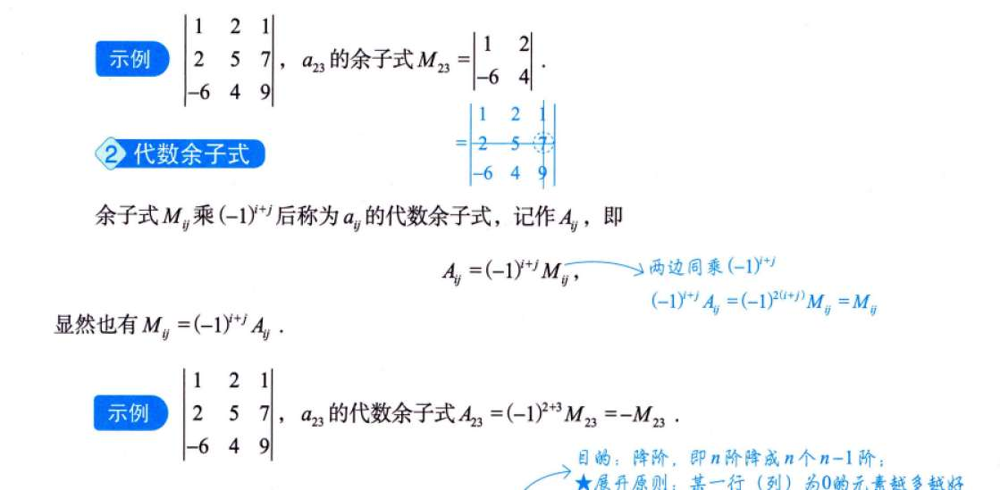
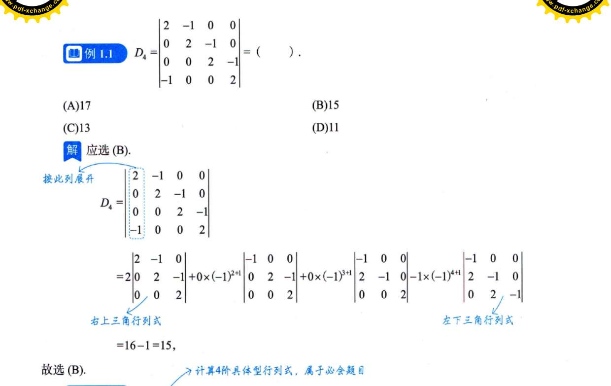
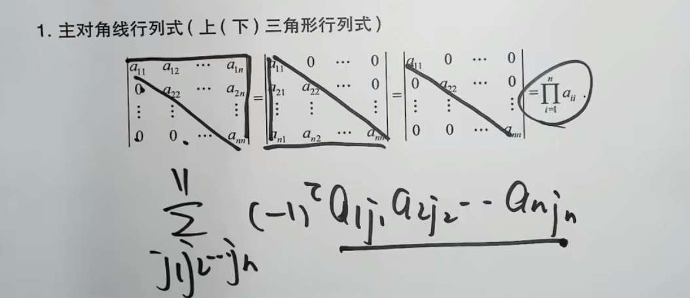
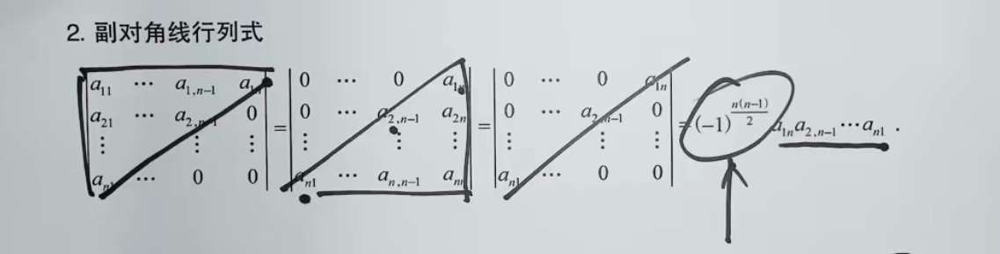

# 行列式性质

|AB|=|A||B|=|BA|

-  $|A|=|A^T|$ ，以此表示，行列等价。如何理解？
  从几何上看，把列向量 $(a, c)$ 变成 $(a, b)$，等同于把 $x$ 和 $y$ 坐标对调了
  沿着对角线 $y=x$ 做了一次镜面反射
- 行列式某行（列）元素全为 0，则行列式为 0。行的解释就是降维！
- 某行/列和公因子 k，可以提取公因子 k 到行列式外面。就比如长宽高，一个元素放大 n 倍，体积就能放大 n 倍
- 行列式可拆分为 n 个行列式和。仍然是盯着一行看。
  
- 行列式中两行（列）互换，行列式变号。因为方向变了。
- 两行（列）相等或成比例，行列式为 0
- 把某行（列）的 k 倍加到另一行，行列式不变。如何理解？平移方向是完全平行于底边 $\vec{v}_1$ 的，所以这个平行四边形的**垂直高度根本没有发生任何改变**！底边没变，高也没变，面积自然就不变
# 逆序数

# 余子式和代数余子式

展开：

# 重要的行列式

