f'' (0) 存在，能否说明 f' (0) 周围都存在导数？
# 中值定理
对 `[a,b]` 连续的函数：
- 有界与最值定理，函数连续那闭区间内一定有最大值最小值
- 介值定理，一定能找到介于二最值之间的数
- 平均值定理 
- 零点定理，若 $f (a)\cdot f (b)<0$ 则肯定有零点在 `[a,b]`

关于微分的：
- 费马定理：可导函数取极值的点导数为 0。使用极值定义+保号性证明（某点可导）
- 导数零点定理：条件是导数在区间内可导，端点导数异号时，有区间内某点导数为 0.我的理解是，和零点定理一样的。但书上的证明有趣啊，说端点导数异号，说明二者不是最值，但是连续函数在闭区间一定有最值，所以在区间里有其他最值，结合费马定理知其导数为 0。（闭区间区间可导，因为在说端点导数）
- 罗尔定理：闭区间连续，开区间可导，然后端点函数值相等 ---必有区间内某点导数为 0。这个条件怎么理解？闭区间连续保证有最值，开区间可导保证平滑，端点保证区间内的方向可导就行
- 拉格朗日中值定理：还是闭区间连续，开区间可导。罗尔歪过来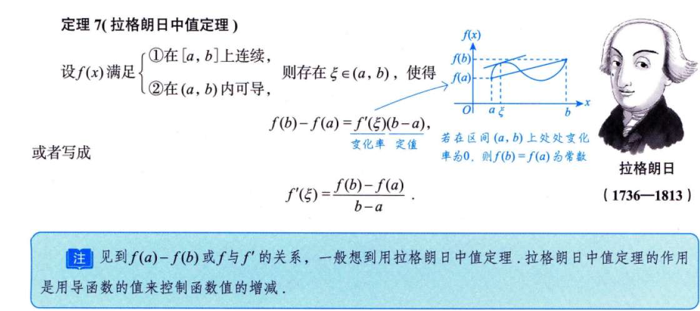
- 柯西不等式 ：还是闭区间连续，开区间可导。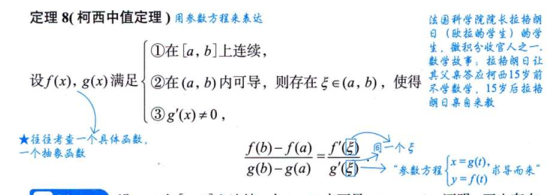

罗尔定理推论：

罗尔定理可证。
比如 f (x)=0 有 m 个根
那么 f' (x) 就有 m-1 个根，对每个小区间进行罗尔定理得到的。
所以导一次少一个根，

实系数奇次方程至少有一个实根；因为 x 区域正无穷和负无穷时结果是正无穷和负无穷

# 构造函数

$f' (a) f' (b)=1$ 
# 例题

## 6.5（构造函数--指数）

还是那个，单出现个 f'时，可构造含指数的函数，对，不一定是 e^x
主要就是这个积分，e 的... 这个积分

## 6.8（证有界）
关键在于，把“有界”翻译成不等式

有界，是证 |f (x)|<=k，那么我们要创建这个 f (x)，同时怎么用上 f' (x)
我们**没别的条件**了，
就用拉格朗日中值定理 1
或者还有个思路即，若证 f' (x)=0 是罗尔，若是不等式><则 lagelangr

## 6.10

这个，感觉就是没再多思考一步吧。f (x)/x，导数一次不行，再导数一次看一阶导的性质
## 6.14（给函数判断实根）

这个题，感觉还是有点试的感觉，先看出“1”，然后再试 0-1.#
## 6.16（给函数判断实根）

存在性纯试出来？
唯一性倒是技巧，罗尔定理推论，但还是没理解#

## 6.18（给函数判断实根）

又猜 0 和 1 的地方？

## 6.20

WTF
首先取绝对值，一个方法是使用记住的结论

一个方法是把那看作函数求单调性看

# 习题
## 6.1（常规求函数零点）

利用 lnx，在 x>0 的定义域增速不如 x（不管 x 前面系数多少吗） x<0 定义域增速大于 x 吗？#

## 6.3（巧妙地构造函数，利用题目条件）

没看出来，构造 F (x)=....  F (1) 就是题目条件

## 6.5（f(1) 出现的意义）

单一个 f (1) 有可能是构造后带值的，比如 F (1)=x^3f (x)=f (1)
## 6.7（构造函数） 

说实话，这个感觉真的很难还原，
嗯... 那就记个 $f' (x)/2x$ 构造 f（x）与 x 方的柯西中值吧
## 6.8（泰勒）
带绝对值的我是真没招。
不过本题吧，就是有二阶导不等式，尝试用泰勒，相加

# 1000 题

## 3，4（画图辅助）
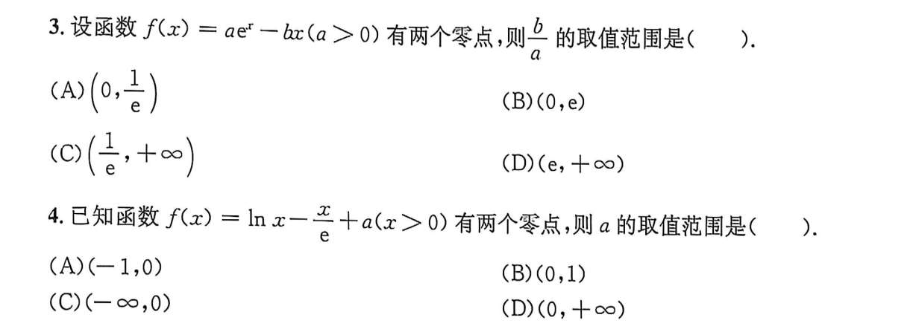
对于第三题，画图处理。仍然是关于极值的

## 5（关于 arcsinx 的知识点）
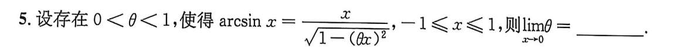这又是什么....
解完发现，单纯只是求极限啊，用了个泰勒

## 6,7,18（技巧性）
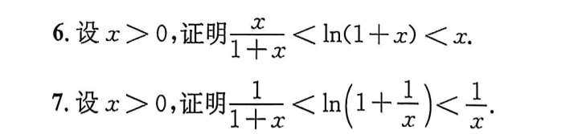
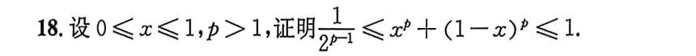

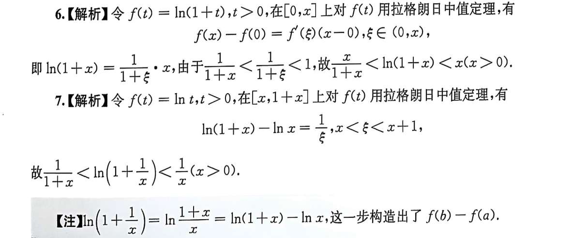

## 8（含绝对值）
这个绝对值是真的不会去啊
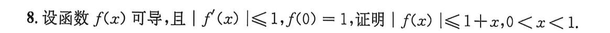
我发现了，主要还是 f (x) 式子列出来，是个等式（拉格朗日中值定理），然后再使用绝对值定理？
不过 x 在 0 到 1 有什么用呢#
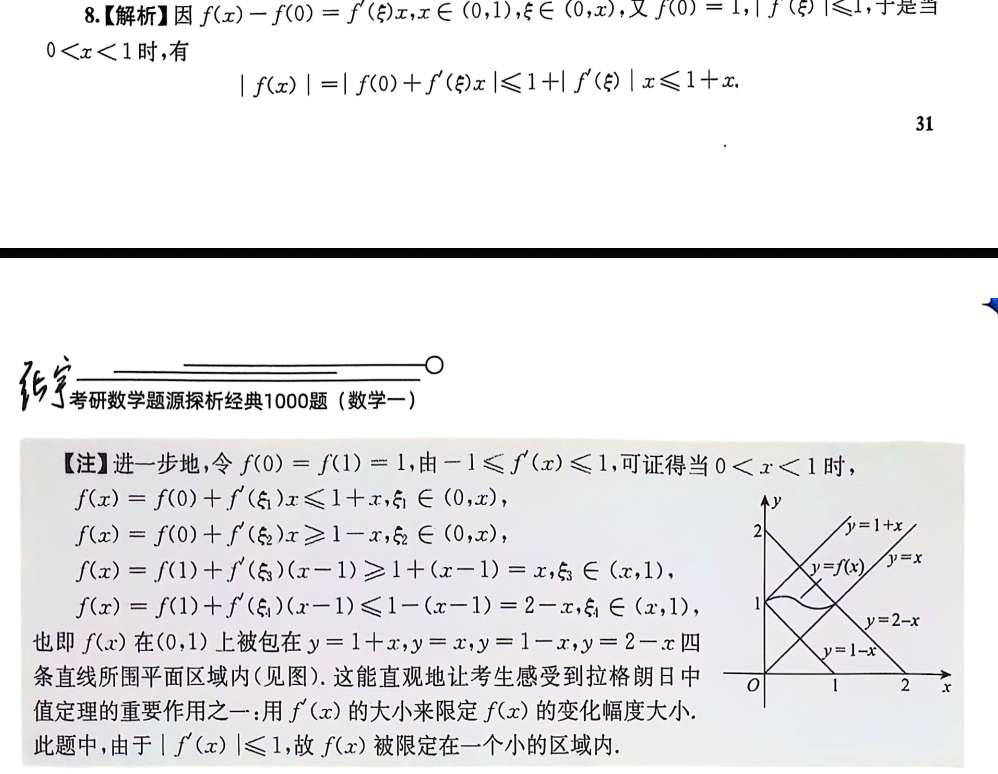
## 9（拉格朗日中值定理）
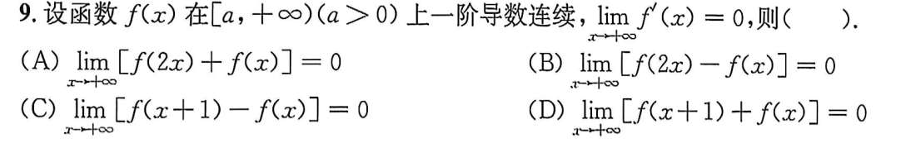
也是根本没思路呢
看完答案明白，像 C 是拉格朗日中值定理。其实这种 x+1   -  x 的形式，就应该要去想到。
其他选项，答案用了个例子去试，用 f(x)=根号 x

## 12（泰勒）
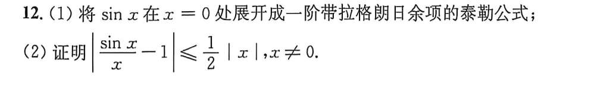
泰勒还是不熟啊
然后第二题就是把 sinx 换成第一问的泰勒展开，所以说泰勒不止求极限能用
## 13
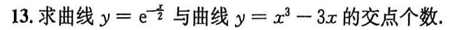
我发现我只会屁颠屁颠求俩次导
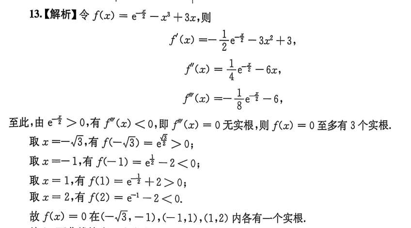

好吧，能说没思路时就多求导用罗尔定理推论然后试点吗？
这个试感觉纯粹乱试啊