# 1 导数定义法 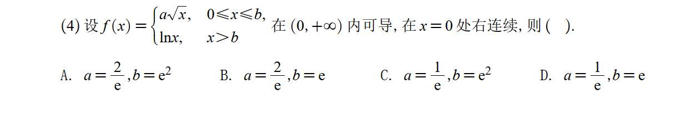

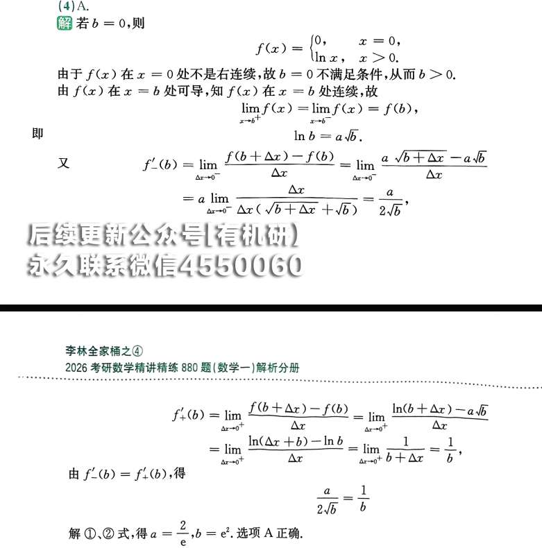

### 第一步：利用“连续性”列出第一个方程（无缝拼接）

既然在 $x=b$ 处连续，那么在 $x=b$ 处的左极限必须等于右极限，且等于该点的函数值。

- **看左边 ($x \to b^-$)：** 函数规则是 $f(x) = a\sqrt{x}$，代入得左极限为 $a\sqrt{b}$。
    
- **看右边 ($x \to b^+$)：** 函数规则是 $f(x) = \ln x$，代入得右极限为 $\ln b$。
    

让左右极限相等，得到**方程①**：

$$a\sqrt{b} = \ln b$$

### 第二步：利用“可导性”列出第二个方程（平滑过渡）

既然在 $x=b$ 处可导，那么在 $x=b$ 处的左导数必须等于右导数。我们要先分别对两段函数求导。

- **左侧求导 ($0 \le x < b$)：** $f(x) = a\sqrt{x} = ax^{\frac{1}{2}}$。对其求导得到 $f'(x) = a \cdot \frac{1}{2}x^{-\frac{1}{2}} = \frac{a}{2\sqrt{x}}$。
    
    代入 $x=b$，得到**左导数**为：$\frac{a}{2\sqrt{b}}$
    
- **右侧求导 ($x > b$)：** $f(x) = \ln x$。对其求导得到 $f'(x) = \frac{1}{x}$。
    
    代入 $x=b$，得到**右导数**为：$\frac{1}{b}$
    

让左右导数相等，得到**方程②**：

$$\frac{a}{2\sqrt{b}} = \frac{1}{b}$$

### 第三步：联立方程，求解未知数

现在我们有了一个简单的方程组：

1. $a\sqrt{b} = \ln b$
    
2. $\frac{a}{2\sqrt{b}} = \frac{1}{b}$
    

从方程②入手化简。因为 $x > 0$ 且存在 $\ln x$，所以 $b > 0$。将方程②两边同乘 $2\sqrt{b}$：

$$a = \frac{2\sqrt{b}}{b} = \frac{2}{\sqrt{b}}$$

把求出的 $a$ 代入方程①：

$$\left(\frac{2}{\sqrt{b}}\right) \cdot \sqrt{b} = \ln b$$

$$2 = \ln b$$

解得 $b$ 的值：

$$b = e^2$$

最后，把 $b = e^2$ 代回刚才求 $a$ 的式子：

$$a = \frac{2}{\sqrt{e^2}} = \frac{2}{e}$$

# 2     

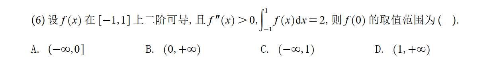

这道题考察的是高数中一个非常经典且高级的套路：**利用二阶导数的符号（凹凸性）进行切线放缩。**

**思维链条：**

1. **挖掘核心条件：** 题目给出 $f''(x) > 0$，你的第一反应应该是：这个函数是**严格凹的**（图像类似“U”型，开口向上）。
    
2. **凹函数的几何性质：** 凹函数有一个极其重要的几何性质——**曲线永远位于其任意一点的切线上方**。
    
3. **列出不等式：** 我们目标是找 $f(0)$ 的范围，那就在 $x=0$ 处写出切线方程。
    
    根据一阶泰勒公式（或者直接写切线方程），对任意 $x \neq 0$：
    
    $$f(x) > f(0) + f'(0)(x - 0)$$
    
    也就是：
    
    $$f(x) > f(0) + f'(0)x$$
    
4. **结合积分条件：** 题目已知区间 $[-1, 1]$ 的积分，那我们就把上面这个不等式两边同时在 $[-1, 1]$ 上做定积分：
    
    $$\int_{-1}^{1} f(x)\mathrm{d}x > \int_{-1}^{1} [f(0) + f'(0)x]\mathrm{d}x$$
    
    左边题目已知等于 2。
    
    右边分开积：
    
    - $\int_{-1}^{1} f(0)\mathrm{d}x = f(0) \times [1 - (-1)] = 2f(0)$
        
    - $\int_{-1}^{1} f'(0)x\mathrm{d}x$：因为 $x$ 是奇函数，在对称区间 $[-1, 1]$ 上的积分为 0。
        
    
    所以不等式变成了：
    
    $$2 > 2f(0)$$
    
    化简得到：$f(0) < 1$。选项里只有 C 符合这个上限。
# 3 拐点 
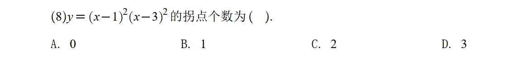

# 4 斜渐近线
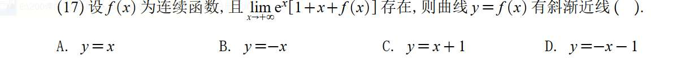

### 1. 回归本质：什么是斜渐近线？

不要去想 $a$ 和 $b$ 的计算公式。从几何直观上讲，一条曲线 $y=f(x)$ 有一条斜渐近线 $y=ax+b$，意思是：**当 $x$ 走到无穷远时，曲线和这条直线的垂直距离无限接近于 0。**（也就是答案解析里图 2-1 表达的意思）。

把这句话翻译成极限表达式，就是渐近线的**终极定义**：

$$\lim_{x \to \infty} [f(x) - (ax+b)] = 0$$

只要你能把极限式凑成上面这个长相，括号里那个 $ax+b$ 就是斜渐近线！根本不需要分开去求 $a$ 和 $b$。

### 2. 破解题目给的条件

题目给了一个很吓人的条件：$\lim_{x \to +\infty} e^x[1+x+f(x)]$ 存在（也就是等于一个常数 $C$）。

答案敏锐地抓住了这里的突破口：

- 我们知道，当 $x \to +\infty$ 时，外面的因子 **$e^x \to +\infty$**。
    
- 这是一个 **“无穷大 $\times$ 中括号 = 常数”** 的模型。
    
- 你想，一个无限大的数，必须要乘上一个无限小的数（趋于 0），它们两个“神仙打架”，最后的结果才可能是一个稳稳的常数。如果中括号里的极限不等于 0，那乘积直接就飞到无穷大去了，极限就不可能存在。
    

因此，数学上可以直接断定，中括号里的极限**必须为 0**：

$$\lim_{x \to +\infty} [1 + x + f(x)] = 0$$

### 3. 凑成定义的形式，完成秒杀

现在我们得到了 $\lim_{x \to +\infty} [1 + x + f(x)] = 0$。

为了看出渐近线，我们按照第一步的终极定义，把它改写成 **$f(x) - \text{直线方程}$** 的形式：

$$\lim_{x \to +\infty} [f(x) - (-x - 1)] = 0$$

看到了吗？这就是在宣告：“当 $x$ 趋于正无穷时，曲线 $f(x)$ 和直线 $y = -x - 1$ 之间的差距变成了 0！”

所以，根本不用算，$y = -x - 1$ 就是那条斜渐近线，直接选 D。

---

**💡 总结一下：**

如果你在考场上遇到求渐近线的题，如果函数是明明白白的具体式子（比如 $y = \frac{x^2}{x-1}$），你就老老实实用 $a$ 和 $b$ 的公式算。

但只要题目给的是**含有 $f(x)$ 的抽象极限式**，**100% 是在考你用 $\lim [f(x) - (ax+b)] = 0$ 这个定义去“凑”答案。

**

# 5
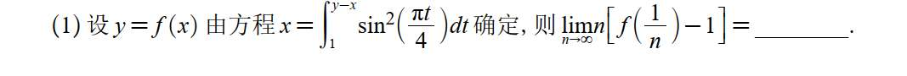

- **考点标签：【极限与导数】【 $\frac{0}{0}$ 型化导数定义】【变限积分求导】【隐函数求导】**
    
- **解析核心：** 第一眼看破 $n \to \infty$ 与 $f(1/n)$ 的组合是在考**导数定义**，即求 $f'(0)$。然后通过代入 $x=0$ 求出 $f(0)$ 验证定义。最后对原变限积分隐函数两边同时对 $x$ 求导解出 $y'$。
### 第一步：破译极限式（本质是考导数定义）

题目让你求的是：$\lim_{n \to \infty} n\left[f\left(\frac{1}{n}\right) - 1\right]$

看到这种 $n \to \infty$ 里面套着 $\frac{1}{n}$ 的极限，第一反应永远是**换元**！

我们令 $x = \frac{1}{n}$。当 $n \to \infty$ 时，$x \to 0$。

把 $n$ 换成 $x$，原极限就变成了：

$$\lim_{x \to 0} \frac{1}{x} [f(x) - 1] = \lim_{x \to 0} \frac{f(x) - 1}{x}$$

如果你对导数的定义式很敏感，此时你应该眼睛一亮！

导数定义式是：$f'(0) = \lim_{x \to 0} \frac{f(x) - f(0)}{x - 0}$。

对比一下我们的式子，如果 **$f(0) = 1$**，那么这个极限求的就是 **$f'(0)$** 的值！

_（心里盘算：这道题八成就是让我求导，只不过套了个极限的马甲。）_

---

### 第二步：验证 $f(0)$ 到底等不等于 1

为了证实我们第一步的猜想，我们需要在原方程中找一下 $x=0$ 时，$y$ 等于多少。

原方程：$x = \int_{1}^{y-x} \sin^2\left(\frac{\pi t}{4}\right) dt$

把 $x = 0$ 代入方程两边：

$$0 = \int_{1}^{y-0} \sin^2\left(\frac{\pi t}{4}\right) dt$$

$$0 = \int_{1}^{y} \sin^2\left(\frac{\pi t}{4}\right) dt$$

想一想，被积函数 $\sin^2\left(\frac{\pi t}{4}\right)$ 永远是大于等于 $0$ 的。一个非负函数，它的定积分结果竟然是 $0$，这说明什么？

这只能说明**积分的上限和下限必须相等**。

所以，必然有：**$y = 1$**。

也就是说，当 $x=0$ 时，$y=1$，即 **$f(0) = 1$**。

**至此，我们彻底拨开了迷雾：这道题根本不是什么复杂的数列极限，它就是一道披着羊皮的求导题！题目最终就是让你求 $f'(0)$ 等于多少。**

---

### 第三步：变限积分与隐函数求导

既然目标明确是求 $f'(0)$（也就是在 $x=0, y=1$ 处的导数 $y'$），那我们就对原方程两边同时对 $x$ 求导。

原方程：$x = \int_{1}^{y-x} \sin^2\left(\frac{\pi t}{4}\right) dt$

- **左边对 $x$ 求导：** $(x)' = 1$
    
- **右边对 $x$ 求导（核心难点）：** 这是一个变限积分求导，并且上限是 $y-x$ 的复合函数。我们要用到链式法则：先对上限求导，再乘以上限内部对 $x$ 的导数。
    
    - 积分号拔掉，把 $t$ 换成上限：$\sin^2\left[\frac{\pi (y-x)}{4}\right]$
        
    - 乘以上限 $(y-x)$ 对 $x$ 的导数：$(y' - 1)$
        

等式两边求导的结果是：

$$1 = \sin^2\left[\frac{\pi (y-x)}{4}\right] \cdot (y' - 1)$$

---

### 第四步：代入已知点，算出结果

我们已经知道，要求的点是 $x=0, y=1$。直接把这两个数代入我们刚求出的导数方程中：

$$1 = \sin^2\left[\frac{\pi (1-0)}{4}\right] \cdot (y'(0) - 1)$$

$$1 = \sin^2\left(\frac{\pi}{4}\right) \cdot (y'(0) - 1)$$

因为 $\sin\left(\frac{\pi}{4}\right) = \frac{\sqrt{2}}{2}$，所以它的平方是 $\frac{1}{2}$。

$$1 = \frac{1}{2} \cdot (y'(0) - 1)$$

两边同乘 2：

$$2 = y'(0) - 1$$

$$y'(0) = 3$$

# 6
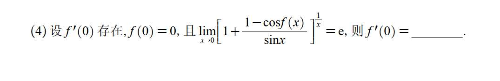

### 第一步：识别极限类型，使用 $1^\infty$ 绝招

观察题目中的极限：

当 $x \to 0$ 时，因为 $f(0)=0$ 且 $f'(0)$ 存在（说明 $f(x)$ 在 $0$ 处连续），所以 $f(x) \to 0$。

此时，$\cos f(x) \to \cos 0 = 1$。

底数部分括号里的分数：$\frac{1 - \cos f(x)}{\sin x} \to \frac{1-1}{0} \to 0$。

所以底数整体趋向于 $1+0=1$，而指数 $\frac{1}{x} \to \infty$。

这是一个标准的 **$1^\infty$ 型极限**。

处理 $1^\infty$ 型极限，最快的公式是：$\lim u^v = e^{\lim(u-1)v}$。

应用到这道题里：

$$u - 1 = \frac{1 - \cos f(x)}{\sin x}$$

$$v = \frac{1}{x}$$

题目说极限结果等于 $e$（即 $e^1$），这意味着原极限的指数部分等于 $1$：

$$\lim_{x \to 0} \left[ \frac{1 - \cos f(x)}{\sin x} \cdot \frac{1}{x} \right] = 1$$

整理一下，我们得到了解题的核心等式：

$$\lim_{x \to 0} \frac{1 - \cos f(x)}{x \sin x} = 1$$

### 第二步：等价无穷小替换

现在我们要处理上面这个新极限。面对三角函数，首选等价无穷小：

- **看分母：** 当 $x \to 0$ 时，$\sin x \sim x$，所以分母 $x \sin x \sim x \cdot x = x^2$。
    
- **看分子：** 因为当 $x \to 0$ 时 $f(x) \to 0$，我们利用 $1 - \cos \square \sim \frac{1}{2}\square^2$ 的结论，得到 $1 - \cos f(x) \sim \frac{1}{2}[f(x)]^2$。
    

把这些替换进去，核心等式就变成了：

$$\lim_{x \to 0} \frac{\frac{1}{2}[f(x)]^2}{x^2} = 1$$

提取常数 $\frac{1}{2}$，并把平方提出来：

$$\frac{1}{2} \lim_{x \to 0} \left[ \frac{f(x)}{x} \right]^2 = 1$$

### 第三步：呼唤导数定义

现在只剩下一个问题：$\lim_{x \to 0} \frac{f(x)}{x}$ 是什么？

题目给了一个条件：$f(0) = 0$。我们把它巧妙地塞进式子里：

$$\lim_{x \to 0} \frac{f(x)}{x} = \lim_{x \to 0} \frac{f(x) - 0}{x - 0} = \lim_{x \to 0} \frac{f(x) - f(0)}{x - 0}$$

这不就是 $f'(0)$ 的定义式吗！

所以，$\lim_{x \to 0} \frac{f(x)}{x} = f'(0)$。

把它代回我们刚才的等式里：

$$\frac{1}{2} [f'(0)]^2 = 1$$

### 结论求解

解这个方程：

$$[f'(0)]^2 = 2$$

$$f'(0) = \pm\sqrt{2}$$

# 7 求多阶导
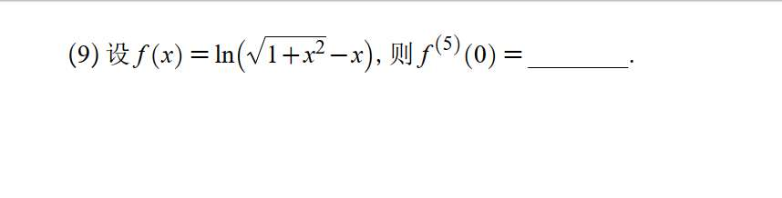
- **考点标签：【高阶导数】【泰勒（麦克劳林）公式系数对标】【先导后展法则】**
    
- **解析核心：** 求 $x=0$ 处的高阶导，核心武器是麦克劳林展开对标系数。对于对数或反三角函数，**绝不直接展开**，而是先求一次导化简，然后利用二项式公式展开一阶导数，再对标相应的系数阶乘。
求高阶导数在某一点（尤其是 $x=0$）的值，核心武器确实是**泰勒公式（麦克劳林公式）**。

莱布尼兹公式一般用来处理“两个函数乘积”的高阶导（比如 $x^2 e^x$）。而这道题，最完美的做法是“先求一阶导，再用泰勒展开拼凑系数”。

这是一个极其经典的考研/高数必考套路，我们一起来把这个记忆唤醒：

### 核心思维：泰勒公式系数法

任何一个在 $x=0$ 处无穷可导的函数，都可以展开为麦克劳林级数：

$$f(x) = f(0) + f'(0)x + \frac{f''(0)}{2!}x^2 + \dots + \frac{f^{(5)}(0)}{5!}x^5 + \dots$$

也就是说，**$f(x)$ 展开式中 $x^5$ 前面的系数，等于 $\frac{f^{(5)}(0)}{5!}$**。

如果我们能求出这个系数（假设为 $a_5$），那么 $f^{(5)}(0) = 5! \times a_5$。

但是，直接对 $\ln(\sqrt{1+x^2} - x)$ 展开太痛苦了。遇到带有根号的对数函数或反三角函数，**第一步永远是先求一次导！**

---

### 解题步骤

**第一步：先求一阶导（见证奇迹的时刻）**

$$f'(x) = \frac{1}{\sqrt{1+x^2} - x} \cdot \left( \sqrt{1+x^2} - x \right)'$$

$$= \frac{1}{\sqrt{1+x^2} - x} \cdot \left( \frac{x}{\sqrt{1+x^2}} - 1 \right)$$

$$= \frac{1}{\sqrt{1+x^2} - x} \cdot \left( \frac{x - \sqrt{1+x^2}}{\sqrt{1+x^2}} \right)$$

注意观察，分子刚好是分母的相反数！约分之后得到极其清爽的结果：

$$f'(x) = -\frac{1}{\sqrt{1+x^2}} = -(1+x^2)^{-\frac{1}{2}}$$

**第二步：对一阶导数进行泰勒展开**

现在我们需要展开 $-(1+x^2)^{-\frac{1}{2}}$。这里用到经典的**二项式展开公式**：

$$(1+u)^\alpha = 1 + \alpha u + \frac{\alpha(\alpha-1)}{2!}u^2 + \dots$$

在这里，我们令 $u = x^2$，$\alpha = -\frac{1}{2}$。

我们到底需要展开到哪一项呢？

因为原函数要求 $f^{(5)}(0)$，也就是找 $f(x)$ 里 $x^5$ 的系数；

那么求了一次导之后，**在 $f'(x)$ 里，我们只需要找 $x^4$ 的系数即可！**

开始代入二项式公式找 $u^2$（即 $x^4$）的项：

$$(1+x^2)^{-\frac{1}{2}} = 1 + \left(-\frac{1}{2}\right)x^2 + \frac{\left(-\frac{1}{2}\right)\left(-\frac{3}{2}\right)}{2!}(x^2)^2 + \dots$$

$$= 1 - \frac{1}{2}x^2 + \frac{3}{8}x^4 + \dots$$

所以，我们的一阶导数 $f'(x)$ 展开为：

$$f'(x) = -\left( 1 - \frac{1}{2}x^2 + \frac{3}{8}x^4 + \dots \right) = -1 + \frac{1}{2}x^2 - \frac{3}{8}x^4 + \dots$$

**第三步：对比系数，得出答案**

根据泰勒公式，$f'(x)$ 的一般展开式是：

$$f'(x) = f'(0) + f''(0)x + \frac{f'''(0)}{2!}x^2 + \frac{f^{(4)}(0)}{3!}x^3 + \frac{f^{(5)}(0)}{4!}x^4 + \dots$$

_(注意：因为 $f(x)$ 里的 $x^5$ 项是 $\frac{f^{(5)}(0)}{5!}x^5$，求导后就变成了 $\frac{f^{(5)}(0)}{4!}x^4$)_

我们将理论公式和我们算出来的展开式中 **$x^4$ 的系数**进行对标：

$$\frac{f^{(5)}(0)}{4!} = -\frac{3}{8}$$

最后一步，解出目标值：

$$f^{(5)}(0) = 4! \times \left(-\frac{3}{8}\right)$$

$$f^{(5)}(0) = 24 \times \left(-\frac{3}{8}\right) = -9$$

---

**最终答案是：$-9$**

### 💡 考场套路总结（加入你的错题本）：

1. **求某一点（特别是 $x=0$）的高阶导：** 首选泰勒（麦克劳林）公式对标系数。
    
2. **遇到 $\ln(\dots)$、$\arcsin x$、$\arctan x$ 求高阶导：** 绝对不要硬头皮求导两次以上。**求一阶导，化简成代数式，然后再泰勒展开**。
    
3. **注意系数阶乘的对应关系：** $f(x)$ 找 $x^n$ 对标的是 $\frac{1}{n!}$；如果降了一阶看 $f'(x)$，找 $x^{n-1}$ 对标的就是 $\frac{1}{(n-1)!}$。

# 8
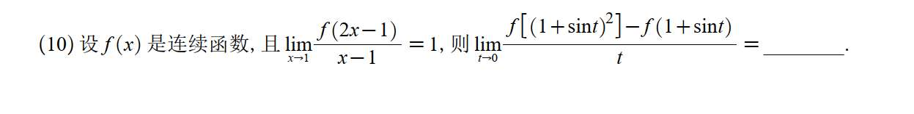

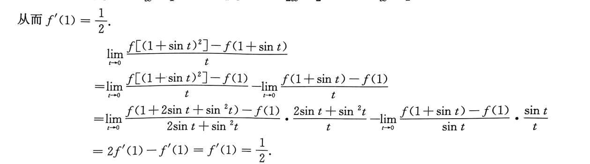

# 9 绝对值求导不存在情况
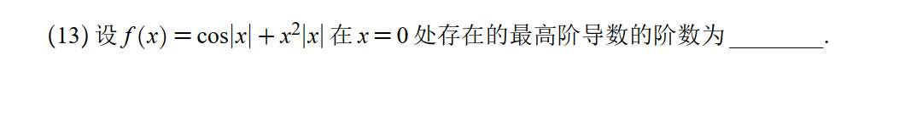
但**带有绝对值 $|x|$ 的函数是高数里的“刺客”**。绝对值在 $x=0$ 这个点往往会产生“尖角”。

求导的本质是看曲线够不够“平滑”。每求一次导，函数就会被“剥掉一层皮”，变得更粗糙一点。有些函数剥着剥着，在 $x=0$ 这个地方的左边和右边就接不上了（左导数 $\neq$ 右导数），那一阶的导数就**不存在**了。

这道题的思路就是：**揪出那个破坏平滑的“刺客”，然后一层一层扒皮（求导），看它在哪一阶断裂。**

我们分三步来秒杀它：

### 第一步：识破纸老虎（剔除无限可导的部分）

题目里的函数是 $f(x) = \cos|x| + x^2|x|$。

前面那个 $\cos|x|$ 其实是个纸老虎。因为余弦函数是偶函数，不论 $x$ 是正还是负，$\cos(-x) = \cos(x)$。

所以，**$\cos|x| = \cos x$**。

$\cos x$ 是个极其平滑的函数，求多少阶导数都存在。它绝对不会成为“导数不存在”的原因。

所以，我们完全不看它，**这道题的生死，全由后面那个 $g(x) = x^2|x|$ 决定。**

### 第二步：对 $g(x) = x^2|x|$ 逐阶求导（分段法）

遇到绝对值，最稳妥的办法就是**写成分段函数**，分别看 $x \ge 0$ 和 $x < 0$ 的情况。

$$g(x) = \begin{cases} x^3, & x \ge 0 \\ -x^3, & x < 0 \end{cases}$$

**1. 求一阶导数 $g'(x)$：**

分别对上下两段求导：

$$g'(x) = \begin{cases} 3x^2, & x > 0 \\ -3x^2, & x < 0 \end{cases}$$

在 $x=0$ 处，左导数 $\lim_{x\to 0^-}(-3x^2) = 0$，右导数 $\lim_{x\to 0^+}(3x^2) = 0$。

左右相等！所以 $g'(0) = 0$。**一阶导数存在。**

_(注：此时 $g'(x)$ 其实可以写成 $3x|x|$)_

**2. 求二阶导数 $g''(x)$：**

对刚才的一阶导继续求导：

$$g''(x) = \begin{cases} 6x, & x > 0 \\ -6x, & x < 0 \end{cases}$$

在 $x=0$ 处，左导数 $\lim_{x\to 0^-}(-6x) = 0$，右导数 $\lim_{x\to 0^+}(6x) = 0$。

左右依然相等！所以 $g''(0) = 0$。**二阶导数存在。**

_(注：此时 $g''(x)$ 其实可以写成 $6|x|$)_

**3. 求三阶导数 $g'''(x)$（见证断裂的时刻）：**

对二阶导数继续求导：

$$g'''(x) = \begin{cases} 6, & x > 0 \\ -6, & x < 0 \end{cases}$$

在 $x=0$ 处，左导数是 $-6$，右导数是 $6$。

**左导数 $\neq$ 右导数！**

所以，在 $x=0$ 处，$g'''(0)$ **不存在**！

### 结论

既然第三阶导数开始不存在了，那它能存在的“最高阶”自然就是 **2 阶**。

答案填：**2**。

# 10

第一个绝对值的，我分（-pai+2kpai，2kpai）， （2kpai，pai+2kpai） 两个区间分别用公式求导法，然后说 kpai 的时候不存在。但我只是看图说话。答案他把绝对值化为根号下平方，一步到位。为什么。第二个，ln 的绝对值，我们一般直接忽略，为什么
### 第 (I) 题：为什么要把 $|x|$ 化为 $\sqrt{x^2}$ 一步到位？

你的分段法完全正确。答案之所以用 $|u| = \sqrt{u^2}$ 这个技巧，**纯粹是为了把分段函数写成一个统一的解析式，显得“高级”且省事。**

我们可以用这个方法实际推导一遍，你就能看出它其实和你分段的结果是一模一样的：

令 $y = 2^{\sqrt{\sin^2 x}}$，运用复合函数求导法则（链式法则）：

$$y' = 2^{\sqrt{\sin^2 x}} \cdot \ln 2 \cdot \left( \sqrt{\sin^2 x} \right)'$$

$$y' = 2^{|\sin x|} \cdot \ln 2 \cdot \frac{1}{2\sqrt{\sin^2 x}} \cdot (2\sin x \cos x)$$

化简一下，把分母的根号写回绝对值：

$$y' = 2^{|\sin x|} \cdot \ln 2 \cdot \frac{\sin x \cos x}{|\sin x|}$$

**核心就在最后多出来的这个 $\frac{\sin x}{|\sin x|}$ 上！**

你在草稿纸上分析一下这个结构：

- 当 $\sin x > 0$ 时，$\frac{\sin x}{|\sin x|} = 1$，导数式就是 $2^{\sin x} \ln 2 \cos x$。
    
- 当 $\sin x < 0$ 时，$\frac{\sin x}{|\sin x|} = -1$，导数式就是 $-2^{-\sin x} \ln 2 \cos x$。
    
- 当 $\sin x = 0$（即 $x = k\pi$）时，分母为 $0$，式子无意义，说明在这个点**不可导**。
    

你看，这不就完美包含了你分段讨论的所有结果吗？

**总结：** 答案并不是比你聪明，只是用了一个代数技巧（引入一个“符号函数”结构 $\frac{u}{|u|}$）把两段甚至无数段的式子合并成了一行。实战中，用分段法思路最清晰，用 $\sqrt{u^2}$ 法书写最省时间，两者皆可。

---

### 第 (II) 题：求导时，为什么可以直接“忽略” $\ln$ 里面的绝对值？

这是一个高数里非常经典且常用的“合法偷懒”结论。我们之所以能忽略它，不是因为绝对值不重要，而是因为**无论里面是正还是负，求导后负号都会被“链式法则”抵消掉。**

我们可以用严谨的分段法来证明一下为什么 $(\ln|u|)' = \frac{u'}{u}$：

假设我们要对 $y = \ln|u(x)|$ 求导（前提是 $u(x) \neq 0$）。

**情况一：当 $u(x) > 0$ 时**

绝对值直接去掉，$y = \ln(u(x))$。

求导：

$$y' = \frac{1}{u(x)} \cdot u'(x) = \frac{u'(x)}{u(x)}$$

**情况二：当 $u(x) < 0$ 时**

去绝对值需要加负号，$y = \ln(-u(x))$。

运用链式法则求导：

$$y' = \frac{1}{-u(x)} \cdot (-u(x))'$$

$$y' = \frac{1}{-u(x)} \cdot (-u'(x))$$

负负得正：

$$y' = \frac{u'(x)}{u(x)}$$

看到了吗？**殊途同归！不管 $u(x)$ 的正负，最后导数的结果竟然长得一模一样，都是 $\frac{u'}{u}$。**

这就是为什么在微积分里，当你遇到 $\ln|\dots|$ 求导时，可以直接当绝对值不存在，直接套公式。

# 11
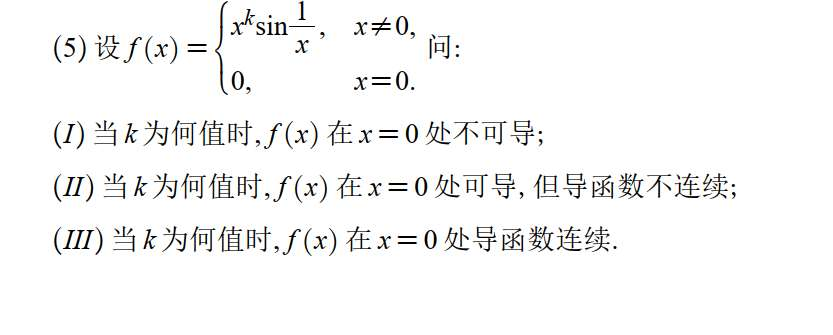

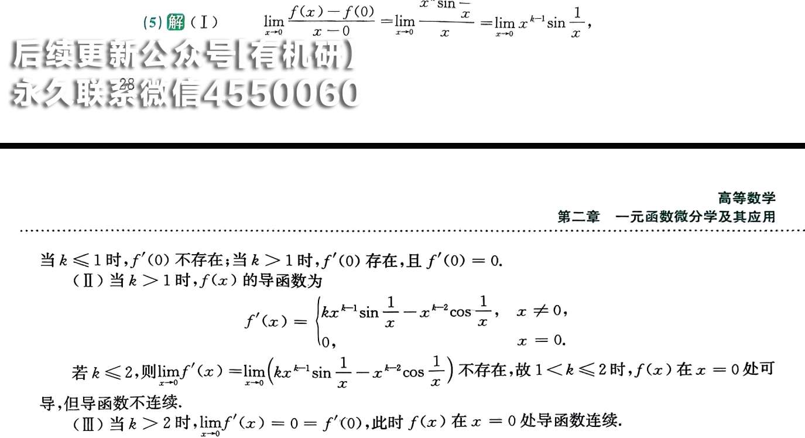

# 12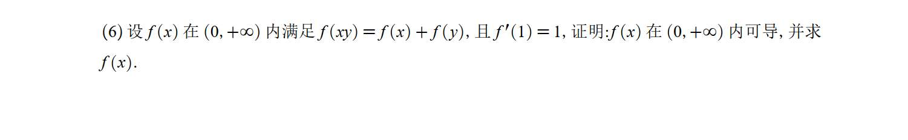

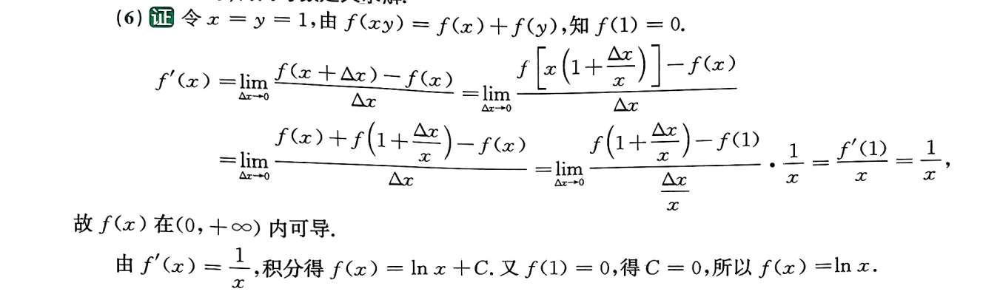

# 13 求多阶导
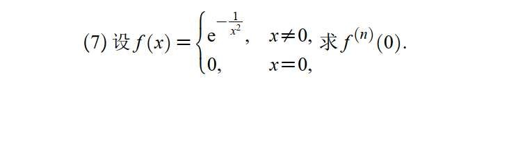

遇到这种分段函数，且在分界点处出现奇异结构（比如分母为 0）的题，求该点导数的**唯一合法途径，就是用导数的原始定义**

**第一步：求一阶导数 $f'(0)$**

利用导数定义：

$$f'(0) = \lim_{x \to 0} \frac{f(x) - f(0)}{x - 0} = \lim_{x \to 0} \frac{e^{-\frac{1}{x^2}} - 0}{x}$$

这是一个 $0 \cdot \infty$ 型极限，我们把它化为 $\frac{\infty}{\infty}$ 型，并作变量代换。

令 $t = \frac{1}{x}$，当 $x \to 0$ 时，$t \to \infty$（严格说是 $|t| \to +\infty$）。

原极限变为：

$$\lim_{t \to \infty} \frac{t}{e^{t^2}}$$

此时直接用一次洛必达法则（上下对 $t$ 求导）：

$$= \lim_{t \to \infty} \frac{1}{2t e^{t^2}} = 0$$

所以，**$f'(0) = 0$**。

**第二步：观察 $x \neq 0$ 时的导数规律**

当 $x \neq 0$ 时，直接用求导公式：

$f'(x) = e^{-\frac{1}{x^2}} \cdot \left(-\frac{1}{x^2}\right)' = \frac{2}{x^3} e^{-\frac{1}{x^2}}$

$f''(x) = \left( \frac{2}{x^3} \right)' e^{-\frac{1}{x^2}} + \frac{2}{x^3} \left( e^{-\frac{1}{x^2}} \right)' = \left( -\frac{6}{x^4} + \frac{4}{x^6} \right) e^{-\frac{1}{x^2}}$

可以发现一个规律：**不管求多少阶导，当 $x \neq 0$ 时，$f^{(n)}(x)$ 的形式永远是“一个关于 $\frac{1}{x}$ 的多项式 $\times e^{-\frac{1}{x^2}}$”。**

即：$f^{(n)}(x) = P_n\left(\frac{1}{x}\right) e^{-\frac{1}{x^2}}$ （其中 $P_n$ 是某个多项式）。

**第三步：求 $n$ 阶导数 $f^{(n)}(0)$**

根据导数定义，假设 $f^{(n-1)}(0) = 0$，我们要证 $f^{(n)}(0) = 0$：

$$f^{(n)}(0) = \lim_{x \to 0} \frac{f^{(n-1)}(x) - f^{(n-1)}(0)}{x - 0} = \lim_{x \to 0} \frac{P_{n-1}\left(\frac{1}{x}\right) e^{-\frac{1}{x^2}}}{x}$$

同样令 $t = \frac{1}{x}$：

$$= \lim_{t \to \infty} \frac{t \cdot P_{n-1}(t)}{e^{t^2}}$$

因为指数函数 $e^{t^2}$ 的增长速度远远“碾压”任何多项式 $t \cdot P_{n-1}(t)$，所以无论上面的多项式次数有多高，这个极限最终都必定趋向于 $0$（可以通过多次使用洛必达法则证明）。

所以，$f^{(n)}(0) = 0$。

# 14
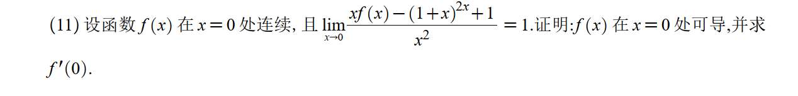
既然 f(x) 在 x=0 处连续，那么求f (0) 是直接把 f (x) 表达式写出来

# 不等式
# 15

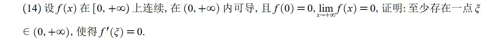

### 考点标签】

**【微分中值定理】【广义罗尔定理（无穷区间）】【闭区间最值定理与费马引理】**

### 【解析核心】

普通的罗尔定理要求闭区间两端点高度相同，即 $f(a)=f(b)$。但这道题的一端是具体的点 $f(0)=0$，另一端是无穷远处的极限 $\lim_{x\to+\infty}f(x)=0$。

**直观的几何画面是这样的：**

一条曲线从原点 $(0,0)$ 出发，向右无限延伸。因为它最终的极限是趋于 0 的（也就是最后无限贴近 x 轴）。你想想，它要满足这个条件，只有两种可能：

1. 它干脆就一直趴在 x 轴上，一步也没离开过（恒为 0）。
    
2. 它如果在中间“调皮”往上跑了，那为了最后能贴回 x 轴，它就必须得**掉头**往下走。这一“掉头”，必然会产生一个**山峰（极大值）**。在山峰处，切线是水平的，导数 $f'(\xi)=0$。往下降也是同理，会产生山谷。
    

把这个几何直觉翻译成严谨的数学语言，就是这道题的满分证明过程。

---

### 详细证明步骤（分类讨论法）

我们要分两种情况来讨论：

**第一种情况（最无聊的情况）：恒等于 0**

若在 $[0, +\infty)$ 上，$f(x) \equiv 0$。

那么对于任意的 $x \in (0, +\infty)$，都有 $f'(x) = 0$。任取一点作为 $\xi$ 即可，命题得证。

**第二种情况（核心情况）：不恒等于 0**

既然不恒等于 0，说明在 $(0, +\infty)$ 内至少存在一点 $x_0$，使得 $f(x_0) \neq 0$。

不妨假设 **$f(x_0) > 0$** （若小于 0，证明过程同理，找最小值即可）。

此时，我们要利用“极限定义”来找一个右边界，强行造出一个“闭区间”来套用定理：

因为 $\lim_{x\to+\infty} f(x) = 0$，根据极限的定义，对于给定的 $\epsilon = f(x_0) > 0$，必定存在一个足够大的数 $X > x_0$，使得当 $x > X$ 时，都有：

$$|f(x)| < f(x_0)$$

### 插入知识点：极限的严格定义公式（帮你解惑）

你问的极限定义公式是这样的：

对于 $\lim_{x\to+\infty} f(x) = A$，其严谨的“$\epsilon-X$ 语言”定义为：

**对于任意给定的正数 $\epsilon > 0$（不管它多小），总存在一个正数 $X > 0$，使得当 $x > X$ 时，恒有 $|f(x) - A| < \epsilon$。**

结合我们这道题，极限 $A = 0$。公式就变成了：

**对于任意 $\epsilon > 0$，存在 $X > 0$，当 $x > X$ 时，有 $|f(x)| < \epsilon$。**

用人话说就是：**只要你给我画一条高度为 $\epsilon$ 的水平警戒线，我总能在 x 轴上找到一个点 $X$，使得在 $X$ 之后，整条曲线都乖乖地趴在这条警戒线下面。**

特别地，在 $x = X$ 这个点，必然有 **$f(X) < f(x_0)$**。

现在，我们把目光锁定在闭区间 **$[0, X]$** 上：

1. 因为 $f(x)$ 在闭区间 $[0, X]$ 上连续，根据**闭区间最值定理**，$f(x)$ 在该区间上必然能取到最大值。
    
2. 我们来看看最大值可能在哪：
    
    - 在左端点：$f(0) = 0$
        
    - 在右端点：$f(X) < f(x_0)$
        
    - 在中间某点：$f(x_0) > 0$
        
        既然中间的点 $x_0$ 处的值比两个端点都要大，说明**最大值绝对不可能在端点取得**，必然在开区间 $(0, X)$ 内部的某一点取得。设这个最大值点为 $\xi$。
        

既然 $\xi$ 是开区间内的极值点，且 $f(x)$ 在 $\xi$ 处可导，根据**费马引理（极值点处导数为 0）**，必然有：

$$f'(\xi) = 0$$

又因为 $\xi \in (0, X)$，且 $(0, X) \subset (0, +\infty)$，所以 $\xi \in (0, +\infty)$。

证明完毕！

---

**💡 考场套路总结：**

以后只要在证明题里看到 **“区间包含 $+\infty$”** 且 **“无穷远处的极限等于端点值”**，脑子里立刻要弹出这套三连招：

1. **分情况**（恒为 0 / 不恒为 0）
    
2. **用极限保号性截断区间**（找一个足够大的 $X$，把无穷区间变成闭区间 $[0, X]$）
    
3. **用最值定理+费马引理**（说明最值在区间内部，导数为 0）

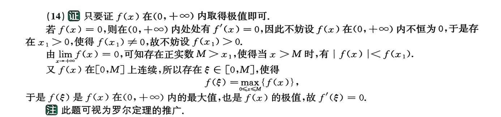

#  16
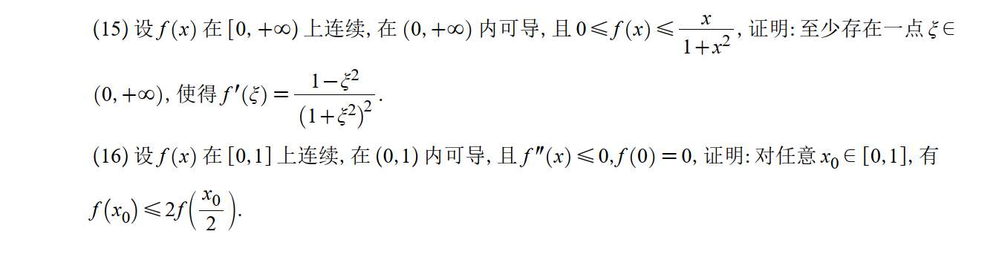

### 第 (15) 题：上一题的“威力加强版”

#### **【考点标签】**

**【微分中值定理】【原函数倒推法（凑微分构造辅助函数）】【广义罗尔定理】【夹逼定理】**

#### **【解析核心】**

这道题证明的结论是 $f'(\xi) = \frac{1-\xi^2}{(1+\xi^2)^2}$。

在考场上，看到等式右边这一大坨复杂的式子，第一反应必须是：**“它是谁的导数？”**

只要你能逆推出原函数，这道题就瞬间降维打击，变成我们刚才刚做过的那道“一头是 0，一头是趋于 0”的广义罗尔定理裸题了。

#### **【考场模拟与步骤】**

**第一步：逆推原函数（造桥）**

- **内心 OS：** 结论是 $f'(\xi) - \frac{1-\xi^2}{(1+\xi^2)^2} = 0$。我要构造一个大函数 $F(x)$，使得 $F'(x)$ 等于这个式子。
    
- **计算：** $\frac{1-x^2}{(1+x^2)^2}$ 怎么积分？观察分母是 $(1+x^2)^2$，分子有 $1-x^2$。如果你对除法求导法则 $\left(\frac{u}{v}\right)' = \frac{u'v - uv'}{v^2}$ 很熟练，你会在草稿纸上试着求一下 $\left(\frac{x}{1+x^2}\right)'$：
    
    $$\left(\frac{x}{1+x^2}\right)' = \frac{1 \cdot (1+x^2) - x \cdot 2x}{(1+x^2)^2} = \frac{1-x^2}{(1+x^2)^2}$$
    
    **（宾果！正好对上！）**
    
- **动作：** 立即构造辅助函数 **$F(x) = f(x) - \frac{x}{1+x^2}$**。我们的目标变成了证明存在 $\xi$，使得 $F'(\xi) = 0$。
    

**第二步：找端点（用夹逼定理收网）**

- **内心 OS：** 既然要证 $F'(\xi)=0$，那我就去看看 $F(x)$ 在区间的两头是不是相等的（凑罗尔定理）。
    
- **看左端点 $x=0$：** 题目已知 $0 \le f(x) \le \frac{x}{1+x^2}$。把 $x=0$ 代入：$0 \le f(0) \le 0$，所以 **$f(0) = 0$**。
    
    那么 $F(0) = f(0) - \frac{0}{1+0} = 0 - 0 = 0$。
    
- **看右端点 $x \to +\infty$：** 同样利用不等式 $0 \le f(x) \le \frac{x}{1+x^2}$。
    
    当 $x \to +\infty$ 时，右边的 $\frac{x}{1+x^2} \to 0$。根据**夹逼定理**，中间的极限必然也是 0，即 $\lim_{x\to+\infty}f(x) = 0$。
    
    那么 $\lim_{x\to+\infty}F(x) = \lim_{x\to+\infty} \left[ f(x) - \frac{x}{1+x^2} \right] = 0 - 0 = 0$。
    

**第三步：绝杀（广义罗尔定理）**

- 看！这不就是上一道题吗？$F(x)$ 从 $0$ 出发，最后又趋于 $0$。根据我们上一题总结的步骤，闭区间最值定理+费马引理，直接得出：至少存在一点 $\xi \in (0, +\infty)$，使得 $F'(\xi) = 0$。
    
- 即 $f'(\xi) - \frac{1-\xi^2}{(1+\xi^2)^2} = 0$，证明完毕！

### 第 (16) 题：经典的“切西瓜”模型

#### **【考点标签】**

**【微分中值定理】【拉格朗日中值定理（双拉模型）】【二阶导符号判定一阶导单调性】【凹凸性几何意义】**

#### **【解析核心】**

题目要证：$f(x_0) \le 2f\left(\frac{x_0}{2}\right)$。

我们把 2 除过去，变成：$\frac{f(x_0)}{2} \le f\left(\frac{x_0}{2}\right)$。

再把隐藏的 $f(0)=0$ 加上去：$\frac{f(x_0) + f(0)}{2} \le f\left(\frac{x_0}{2}\right)$。

**直觉建立：** 这是典型的“凹函数”定义式（向下弯曲，像个锅盖）。两点连线的中点高度 $\le$ 弧线上的中点高度。题目已知 $f''(x) \le 0$，确实是凹函数！如果在选择题里，画个图秒出。但在证明题里，只要看到 **$0$, $\frac{x_0}{2}$, $x_0$** 这三个等距的点，就必须条件反射使用“区间劈半 + 两次拉格朗日中值定理”。

#### **【考场模拟与步骤】**

**第一步：拆解不等式（构造拉格朗日的“壳”）**

- **内心 OS：** 证明 $f(x_0) \le 2f\left(\frac{x_0}{2}\right)$，我可以把它移项，拆成两半，凑出拉格朗日公式里 $f(b)-f(a)$ 的长相。
    
- **动作：** 将不等式改写为：
    
    $$f\left(\frac{x_0}{2}\right) - 0 \ge f(x_0) - f\left(\frac{x_0}{2}\right)$$
    
    因为 $f(0)=0$，左边其实就是 $f\left(\frac{x_0}{2}\right) - f(0)$。
    
    此时，完美地出现了两个区间：$[0, \frac{x_0}{2}]$ 和 $[\frac{x_0}{2}, x_0]$。
    

**第二步：疯狂使用拉格朗日**

- **在左区间 $[0, \frac{x_0}{2}]$ 上用拉氏：**
    
    存在 $\xi_1 \in (0, \frac{x_0}{2})$，使得 $f\left(\frac{x_0}{2}\right) - f(0) = f'(\xi_1) \cdot \left(\frac{x_0}{2} - 0\right) = f'(\xi_1) \cdot \frac{x_0}{2}$
    
- **在右区间 $[\frac{x_0}{2}, x_0]$ 上用拉氏：**
    
    存在 $\xi_2 \in (\frac{x_0}{2}, x_0)$，使得 $f(x_0) - f\left(\frac{x_0}{2}\right) = f'(\xi_2) \cdot \left(x_0 - \frac{x_0}{2}\right) = f'(\xi_2) \cdot \frac{x_0}{2}$
    

**第三步：利用二阶导比较大小（核心）**

- **内心 OS：** 我现在要证明左边 $\ge$ 右边，也就是要证明 $f'(\xi_1) \cdot \frac{x_0}{2} \ge f'(\xi_2) \cdot \frac{x_0}{2}$。由于 $\frac{x_0}{2} > 0$，约掉之后，我只需要证明 **$f'(\xi_1) \ge f'(\xi_2)$** 即可。
    
- **动作：** 观察 $\xi_1$ 和 $\xi_2$ 的位置。显然 $\xi_1 < \frac{x_0}{2} < \xi_2$，即 **$\xi_1 < \xi_2$**。
    
- 题目已知 $f''(x) \le 0$。一阶导数的导数小于等于 0，说明**一阶导数 $f'(x)$ 是单调递减的**！
    
- 既然 $f'(x)$ 递减，且 $\xi_1 < \xi_2$，那么自然就有 $f'(\xi_1) \ge f'(\xi_2)$。
    

**第四步：收尾**

- 因为 $f'(\xi_1) \ge f'(\xi_2)$，两边同乘 $\frac{x_0}{2}$，得到：
    
    $$f\left(\frac{x_0}{2}\right) - f(0) \ge f(x_0) - f\left(\frac{x_0}{2}\right)$$
    
- 移项整理：
    
    $$2f\left(\frac{x_0}{2}\right) \ge f(x_0) + f(0)$$
    
- 代入 $f(0)=0$，得出最终结论：$f(x_0) \le 2f\left(\frac{x_0}{2}\right)$。证明完毕！

**💡 实战总结：**

这两道题把中值定理最核心的两个招数亮出来了：

1. **只要等式长得奇怪，就在草稿纸上拼命凑原函数（逆向思维）。**
    
2. **只要遇到等距的三个点（比如 $a, \frac{a+b}{2}, b$），想都不用想，直接从中间一刀切开，左右各用一次拉格朗日，然后用单调性（二阶导）比大小！**

# 17

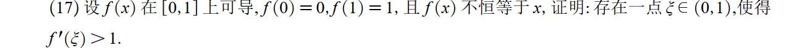

### 【考点标签】

**【微分中值定理】【拉格朗日中值定理（分段/局部应用）】【分类讨论】【几何直觉（平均速度与瞬时速度）】**

### 【解析核心】

这道题的核心是“平均速度与瞬时速度”的几何直觉。

- 想象你在高速上开车，从起点 $(0,0)$ 开到终点 $(1,1)$，总共花了 1 小时，开了 100 公里。你的**平均速度恰好是 100**（这就是你在整体上用拉格朗日算出来的那个 1）。
    
- 题目说“$f(x)$ 不恒等于 $x$”，翻译成开车就是：**你这一路上并没有一直开定速巡航（保持速度严格为 100）**。
    
- 既然你没有一直保持匀速，但最后却按时到达了终点，那说明什么？说明你路上肯定**有时开得比 100 慢，有时为了赶时间，必须踩油门开得比 100 快！**
    
- 这道题就是要你用数学语言，把那个“踩油门（导数大于 1）”的瞬间抓出来。怎么抓？去寻找你**偏离匀速直线（$y=x$）的那个点**，在偏离点的前后分段使用拉格朗日！
    

---

### 【考场模拟与步骤】

**第一步：撞墙与反思（识别无效路径）**

- **内心 OS：** 看到端点 $f(0)=0, f(1)=1$，我第一反应是在 $[0,1]$ 上用拉格朗日，得到 $f'(\eta) = 1$。但题目要的是 $>1$。
    
- **反思：** 整体用拉格朗日失效了，这说明“大于 1”的那个点被平均掉了。我必须把区间**切开**，在局部用拉格朗日。
    

**第二步：翻译闲置条件（寻找切入点）**

- **内心 OS：** 题目里还有个条件没用上：“$f(x)$ 不恒等于 $x$”。这句话在数学上怎么表达？
    
- **动作：** 既然不恒等于，那就**至少存在一个点 $x_0 \in (0,1)$，使得 $f(x_0) \neq x_0$**。
    
- 既然不相等，那无非就是两种情况：要么大于，要么小于。这就指明了下一步的方向：**分类讨论**。
    

**第三步：分段使用拉格朗日（绝杀）**

- **情况一：假如在这个点上，你超前了（即 $f(x_0) > x_0$）**
    
    - **内心 OS：** 时间才走到 $x_0$，我的路程 $f(x_0)$ 却比 $x_0$ 多，说明我前半段路开得很快啊！那我就在**前半段 $[0, x_0]$** 上用拉格朗日！
        
    - **动作：** 在 $[0, x_0]$ 上使用拉格朗日中值定理：
        
        存在 $\xi \in (0, x_0)$，使得 $f'(\xi) = \frac{f(x_0) - f(0)}{x_0 - 0} = \frac{f(x_0)}{x_0}$
        
    - 因为 $f(x_0) > x_0$，所以 $\frac{f(x_0)}{x_0} > 1$。
        
    - 即 **$f'(\xi) > 1$**。搞定！
        
- **情况二：假如在这个点上，你落后了（即 $f(x_0) < x_0$）**
    
    - **内心 OS：** 时间走到 $x_0$，我走的路程却不到 $x_0$，说明前半段我开慢了。既然前半段慢了，为了能准时到达终点 $f(1)=1$，我**后半段必须拼命赶路**！那我就在**后半段 $[x_0, 1]$** 上用拉格朗日！
        
    - **动作：** 在 $[x_0, 1]$ 上使用拉格朗日中值定理：
        
        存在 $\xi \in (x_0, 1)$，使得 $f'(\xi) = \frac{f(1) - f(x_0)}{1 - x_0} = \frac{1 - f(x_0)}{1 - x_0}$
        
    - 怎么证明这个式子大于 1 呢？
        
        因为我们假设了 $f(x_0) < x_0$，两边同时乘负号得到 $-f(x_0) > -x_0$，
        
        两边再同时加 1 得到：$1 - f(x_0) > 1 - x_0$。
        
        既然分子大于分母（且分母 $1-x_0 > 0$），那么 $\frac{1 - f(x_0)}{1 - x_0} > 1$。
        
    - 即 **$f'(\xi) > 1$**。再次搞定！
        

**第四步：收尾**

- 综合上述两种情况，无论哪种情况发生，都能在 $(0,1)$ 内找到一点 $\xi$，使得 $f'(\xi) > 1$。证明完毕。
    

---

**💡 举一反三（放进你的错题本）：**

1. 看到**区间整体的斜率 = 某个常数 $k$**，但题目让你证 **$f'(\xi) > k$ 或 $< k$**。
    
2. 只要题目给了“不恒等于那条割线”的条件。
    
3. 你的解题肌肉记忆必须是：**找到偏离点 $x_0$，分成左右两段区间，分别套用拉格朗日，必然有一段的导数大于 $k$，另一段小于 $k$！**

# 18
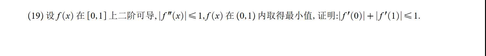

### 考点标签】

**【微分中值定理】【费马引理（内部极值点导数为 0）】【拉格朗日中值定理（应用于一阶导数）】【绝对值不等式放缩】**

### 【解析核心】

这道题有两个最核心的“题眼”：

1. **“在 $(0,1)$ 内取得最小值”**：这句话绝对不是废话，它是为了召唤**费马引理**。既然最小值在区间内部（而不是端点），且函数可导，那么这个最小值点处的导数必然为 0！这就凭空给我们变出了一个“导数等于 0 的中继点 $x_0$”。
    
2. **$|f''(x)| \le 1$ 与证明目标 $|f'(0)| + |f'(1)|$**：你要建立一阶导数和二阶导数之间的联系，最直接的桥梁是什么？是对**一阶导数 $f'(x)$** 借用拉格朗日中值定理！
    

有了那个“中继点 $x_0$”，我们只需一刀把区间 $[0,1]$ 劈成两半，左右各用一次拉格朗日，这题就破了。

---

### 【考场模拟与步骤】

**第一步：翻译“内部最小值”（召唤中继点）**

- **内心 OS：** 题目说在 $(0,1)$ 内取得最小值。设这个取得最小值的点为 $x_0$，那么显然 $x_0 \in (0,1)$。
    
- 既然 $x_0$ 是内部的极值点，且题目已知 $f(x)$ 二阶可导（当然也就一阶可导），根据**费马引理**，必然有：
    
    $$f'(x_0) = 0$$
    

**第二步：劈开区间，对 $f'(x)$ 疯狂使用拉格朗日**

- **内心 OS：** 我现在手里有 $f'(0)$、$f'(1)$，还有一个刚刚得到的 $f'(x_0)=0$。要联系 $f''(x)$，我必须把拉格朗日定理用在 $f'(x)$ 身上！
    
- **左半段 $[0, x_0]$：** 对 $f'(x)$ 使用拉格朗日中值定理。
    
    必定存在一点 $\xi_1 \in (0, x_0)$，使得：
    
    $$f'(x_0) - f'(0) = f''(\xi_1) \cdot (x_0 - 0)$$
    
    代入 $f'(x_0) = 0$，得到：
    
    $$-f'(0) = f''(\xi_1) \cdot x_0$$
    
- **右半段 $[x_0, 1]$：** 对 $f'(x)$ 使用拉格朗日中值定理。
    
    必定存在一点 $\xi_2 \in (x_0, 1)$，使得：
    
    $$f'(1) - f'(x_0) = f''(\xi_2) \cdot (1 - x_0)$$
    
    代入 $f'(x_0) = 0$，得到：
    
    $$f'(1) = f''(\xi_2) \cdot (1 - x_0)$$
    

**第三步：套上绝对值，暴力放缩（收网）**

- **内心 OS：** 题目要证的是 $|f'(0)| + |f'(1)| \le 1$。我就把刚才算出来的两个式子套上绝对值，然后利用条件 $|f''(x)| \le 1$ 进行放缩。
    
- 对左边套绝对值：
    
    $$|f'(0)| = |-f''(\xi_1) \cdot x_0| = |f''(\xi_1)| \cdot x_0$$
    
    因为已知 $|f''(x)| \le 1$，所以 $|f''(\xi_1)| \le 1$。又因为 $x_0 > 0$，所以：
    
    $$|f'(0)| \le 1 \cdot x_0 = x_0$$
    
- 对右边套绝对值：
    
    $$|f'(1)| = |f''(\xi_2) \cdot (1 - x_0)| = |f''(\xi_2)| \cdot (1 - x_0)$$
    
    同理，因为 $|f''(\xi_2)| \le 1$，且 $1 - x_0 > 0$，所以：
    
    $$|f'(1)| \le 1 \cdot (1 - x_0) = 1 - x_0$$
    

**第四步：相加见证奇迹**

将两个不等式直接相加：

$$|f'(0)| + |f'(1)| \le x_0 + (1 - x_0)$$

$$|f'(0)| + |f'(1)| \le 1$$

证明完毕！

---

**💡 实战总结（加入错题本）：**

1. 以后看到 **“在内部取得最值”**，立刻默写 **“存在 $x_0 \in (a,b)$，使得 $f'(x_0) = 0$”**。这往往是你劈开区间的分界点！
    
2. 很多同学做中值定理题，脑子里只有 $f(b)-f(a) = f'(\xi)(b-a)$。**一定要记住，拉格朗日定理不仅能用在原函数 $f(x)$ 上，它同样可以用在导函数 $f'(x)$ 上**，这是连接一阶导数和二阶导数最常用的桥梁！

# 19
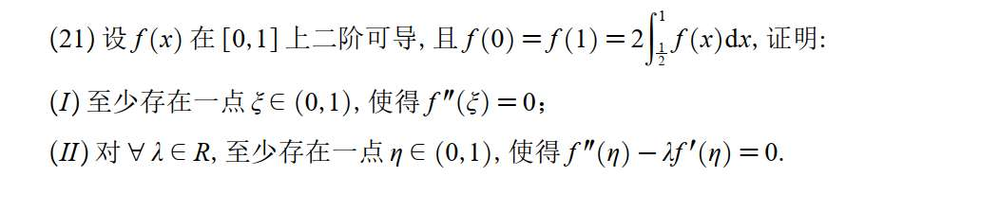

### 【考点标签】

**【积分中值定理】【多次使用罗尔定理】【微分方程思想构造辅助函数】**

### 【解析核心】

这道题分两问，其实就是两个连招：

1. **第一问的核心：** 想证明二阶导数 $f''(\xi) = 0$，根据罗尔定理，你必须在区间里找**两个**一阶导数为 0 的点（比如 $x_1$ 和 $x_2$）。想找两个一阶导数为 0 的点，你必须在原函数上找**三个**高度相等的点。题目给了 $f(0)=f(1)$，只有两个点，怎么办？**第三个点就藏在那个带有积分的条件里！** 用**积分中值定理**把它“逼”出来。
    
2. **第二问的核心：** 只要在证明结论里看到类似 $f''(\eta) - \lambda f'(\eta) = 0$ 这种带有系数的组合式，想都不要想，**直接套用指数辅助函数模板**！看到减号，辅助函数里必然带个 $e^{-\lambda x}$。把它和 $f'(x)$ 乘在一起求导，恰好就是题目要你证的式子。
    

---

### 【考场模拟与详细步骤】

#### (I) 证明存在 $\xi$，使得 $f''(\xi) = 0$

**第一步：利用积分条件，找出隐藏的第三个点**

- **内心 OS：** 题目已知 $f(0) = f(1) = 2\int_{1/2}^{1} f(x)\mathrm{d}x$。我令这个相等的值为 $A$。
    
    也就是说：$\int_{1/2}^{1} f(x)\mathrm{d}x = \frac{A}{2}$。
    
- 根据**积分中值定理**（一段区间上的积分，等于区间长度乘以区间内某一点的函数值）：
    
    在区间 $[1/2, 1]$ 上，这段区间的长度恰好是 $1 - 1/2 = 1/2$。
    
    所以，必定存在一点 $c \in (1/2, 1)$，使得：
    
    $$\int_{1/2}^{1} f(x)\mathrm{d}x = f(c) \cdot \left(1 - \frac{1}{2}\right) = \frac{1}{2}f(c)$$
    
- 把这个结果代回刚才的式子：
    
    $$\frac{1}{2}f(c) = \frac{A}{2} \implies f(c) = A$$
    
- **动作：** 绝杀！现在我们找齐了三个高度相等的点：$f(0) = f(c) = f(1) = A$，并且 $0 < 1/2 < c < 1$。
    

**第二步：连续使用两次罗尔定理**

- 在区间 $[0, c]$ 上，因为 $f(0) = f(c)$，根据罗尔定理，必定存在一点 $x_1 \in (0, c)$，使得 **$f'(x_1) = 0$**。
    
- 在区间 $[c, 1]$ 上，因为 $f(c) = f(1)$，根据罗尔定理，必定存在一点 $x_2 \in (c, 1)$，使得 **$f'(x_2) = 0$**。
    

**第三步：对一阶导数再用一次罗尔定理**

- 现在我们有了 $f'(x_1) = 0$ 和 $f'(x_2) = 0$。
    
- 在区间 $[x_1, x_2]$ 上对一阶导数 $f'(x)$ 使用罗尔定理，必定存在一点 $\xi \in (x_1, x_2)$，使得：
    
    **$f''(\xi) = 0$**
    
- 因为 $(x_1, x_2) \subset (0, 1)$，所以 $\xi \in (0, 1)$。第一问证明完毕！
    

---

#### (II) 证明存在 $\eta$，使得 $f''(\eta) - \lambda f'(\eta) = 0$

**第一步：构造神级辅助函数**

- **内心 OS：** 遇到 $f'' - \lambda f' = 0$，这是标准的乘积求导逆运算。
    
    我在草稿纸上试一下：如果我有个函数 $F(x) = e^{-\lambda x} \cdot f'(x)$，我对它求导会发生什么？
    
    $$F'(x) = (e^{-\lambda x})' \cdot f'(x) + e^{-\lambda x} \cdot f''(x)$$
    
    $$F'(x) = -\lambda e^{-\lambda x} f'(x) + e^{-\lambda x} f''(x)$$
    
    提出公因式 $e^{-\lambda x}$：
    
    $$F'(x) = e^{-\lambda x} \left[ f''(x) - \lambda f'(x) \right]$$
    
- **动作：** 完美对上了中括号里的内容！所以，我们直接令辅助函数 **$g(x) = e^{-\lambda x} f'(x)$**。
    

**第二步：白嫖第一问的结论，再用罗尔**

- **内心 OS：** 想让 $g'(\eta) = 0$，我就要找两个让 $g(x)$ 相等的点。第一问里，我不是刚好算出了 $x_1$ 和 $x_2$ 这两个能让 $f'$ 为 0 的点吗？直接白嫖过来用！
    
- 把 $x_1$ 代入：$g(x_1) = e^{-\lambda x_1} \cdot f'(x_1) = e^{-\lambda x_1} \cdot 0 = 0$
    
- 把 $x_2$ 代入：$g(x_2) = e^{-\lambda x_2} \cdot f'(x_2) = e^{-\lambda x_2} \cdot 0 = 0$
    
- 因为 $g(x_1) = g(x_2) = 0$，在区间 $[x_1, x_2]$ 上对 $g(x)$ 施展罗尔定理：
    
    必定存在一点 $\eta \in (x_1, x_2)$，使得 $g'(\eta) = 0$。
    

**第三步：收尾**

- 将 $g'(\eta) = 0$ 展开：
    
    $$e^{-\lambda \eta} \left[ f''(\eta) - \lambda f'(\eta) \right] = 0$$
    
- 因为指数函数 $e^{-\lambda \eta}$ 永远大于 0（不可能等于 0），那么能让乘积为 0 的，只能是中括号里的部分：
    
    **$f''(\eta) - \lambda f'(\eta) = 0$**
    
- 因为 $\eta \in (x_1, x_2) \subset (0, 1)$，第二问证明完毕！

# 20
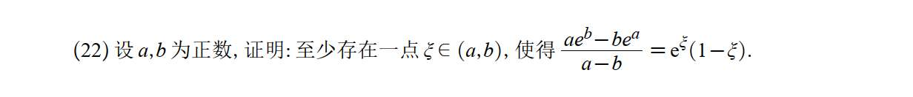

- **内心 OS：** 证明等式，左边是 $\frac{ae^b - be^a}{a - b}$，右边是 $e^\xi(1-\xi)$。
    
- **撞墙：** 如果我想用拉格朗日，原函数该设成什么？设 $F(x) = x e^b - b e^x$？不对啊，$b$ 是个常数，求导后根本凑不出右边那种纯 $\xi$ 的式子。
    
- **破局：** 等等，分子 $ae^b - be^a$ 是个“交叉项”。把 $a$ 和 $b$ 绑在一起太难受了。如果我**把分子除以 $ab$** 会怎样？
    
    $$\frac{ae^b - be^a}{ab} = \frac{e^b}{b} - \frac{e^a}{a}$$
    
- **狂喜：** 哇！这不就是完美的 $f(b) - f(a)$ 吗？其中 $f(x) = \frac{e^x}{x}$。
    

**第二步：平衡分母（召唤柯西）**

- **内心 OS：** 分数的基本性质，分子除以了 $ab$，分母也必须除以 $ab$。我来看看分母会变成什么样：
    
    $$\frac{a - b}{ab} = \frac{1}{b} - \frac{1}{a}$$
    
- **狂喜 $\times 2$：** 这不就是完美的 $g(b) - g(a)$ 吗？其中 $g(x) = \frac{1}{x}$（或者严格说是 $-\frac{1}{x}$，但正负号不影响，我们取 $g(x) = \frac{1}{x}$，下面就是 $\frac{1}{b} - \frac{1}{a}$）。
    
- **战术确认：** 分子是 $f(b)-f(a)$，分母是 $g(b)-g(a)$。这绝对是**柯西中值定理**的专属靶场！
    

**第三步：实操验证（见证奇迹）**

- **动作：** 令 $f(x) = \frac{e^x}{x}$， $g(x) = \frac{1}{x}$。这两个函数在 $[a,b]$ 上连续，在 $(a,b)$ 内可导（因为 $a,b$ 为正数，分母不为 0）。
    
- 根据柯西中值定理，至少存在一点 $\xi \in (a, b)$，使得：
    
    $$\frac{f(b) - f(a)}{g(b) - g(a)} = \frac{f'(\xi)}{g'(\xi)}$$
    
- 我们把等式左边复原一下，就是我们刚才化简的过程：
    
    $$\frac{f(b) - f(a)}{g(b) - g(a)} = \frac{\frac{e^b}{b} - \frac{e^a}{a}}{\frac{1}{b} - \frac{1}{a}} = \frac{\frac{ae^b - be^a}{ab}}{\frac{a - b}{ab}} = \frac{ae^b - be^a}{a - b}$$
    
    （完美对上了题目的左边！）
    

**第四步：求导收尾**

- **内心 OS：** 现在只要验证 $\frac{f'(\xi)}{g'(\xi)}$ 是不是等于题目的右边 $e^\xi(1-\xi)$ 就行了。
    
- 分别求导：
    
    $$f'(x) = \left(\frac{e^x}{x}\right)' = \frac{e^x \cdot x - e^x \cdot 1}{x^2} = \frac{e^x(x-1)}{x^2}$$
    
    $$g'(x) = \left(\frac{1}{x}\right)' = -\frac{1}{x^2}$$
    
- 两者相除并代入 $\xi$：
    
    $$\frac{f'(\xi)}{g'(\xi)} = \frac{\frac{e^\xi(\xi-1)}{\xi^2}}{-\frac{1}{\xi^2}} = -e^\xi(\xi-1) = e^\xi(1-\xi)$$
    
- **绝杀！** 等式左右两边完美闭环，证明完毕！
    

---

**💡 错题本终极口诀：**

以后在考场上，只要看到分式的一端出现 **$af(b) \pm bf(a)$**，别犹豫，**立刻同除以 $ab$**！

如果是 **$f(a)g(b) - f(b)g(a)$**，就**立刻同除以 $g(a)g(b)$ 或 $f(a)f(b)$**！

只要分离成功，原式必定化为 $\frac{F(b)-F(a)}{G(b)-G(a)}$，剩下的就是无脑默写柯西中值定理了。

# 21
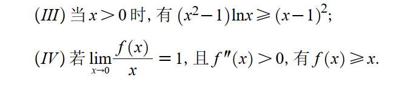

#### **【考场模拟与步骤】**

**第一步：拆解变形，构造神级辅助函数（你的思路落地）**

- **内心 OS：** 等式两边都有 $(x-1)$ 的影子。$(x^2-1) = (x-1)(x+1)$。我要把 $(x-1)$ 除过去！但 $x-1$ 有正有负，为了严谨，我分类讨论。
    
- **动作：** 无论怎么变形，核心比较的都是 $\ln x$ 和 $\frac{x-1}{x+1}$。所以，直接听你的，构造终极辅助函数：
    
    $$g(x) = \ln x - \frac{x-1}{x+1} \quad (x > 0)$$
    

**第二步：对新函数一击必杀（只求一次导）**

- **内心 OS：** 求导看看这个 $g(x)$ 是什么脾气。
    
    $$g'(x) = \frac{1}{x} - \frac{1\cdot(x+1) - (x-1)\cdot 1}{(x+1)^2} = \frac{1}{x} - \frac{2}{(x+1)^2}$$
    
    通分合并：
    
    $$g'(x) = \frac{(x+1)^2 - 2x}{x(x+1)^2} = \frac{x^2 + 1}{x(x+1)^2}$$
    
- **狂喜：** 因为 $x>0$，显然分子分母全是正的！所以 **$g'(x) > 0$ 恒成立，$g(x)$ 在 $(0, +\infty)$ 上是严格单调递增的！**
    

**第三步：分类讨论，完美收网**

- **寻找基准点：** 观察发现 $g(1) = \ln 1 - 0 = 0$。$x=1$ 就是分水岭。
    
- **情况 1：当 $x > 1$ 时**
    
    因为单调递增，$g(x) > g(1) = 0$。
    
    所以 $\ln x > \frac{x-1}{x+1}$。
    
    此时 $x-1 > 0, x+1 > 0$。我们在不等式两边同时乘以 $(x-1)(x+1)$，不等号方向**不变**：
    
    $$(x+1)(x-1)\ln x > (x-1)^2 \implies (x^2-1)\ln x > (x-1)^2$$
    
- **情况 2：当 $0 < x < 1$ 时**
    
    因为单调递增，$g(x) < g(1) = 0$。
    
    所以 $\ln x < \frac{x-1}{x+1}$。
    
    此时，先两边同乘 $(x+1)$（正数，方向不变）：$(x+1)\ln x < x-1$。
    
    再两边同乘 $(x-1)$。**注意：因为 $x-1 < 0$ 是负数，乘负数不等号要反向！**
    
    $$(x+1)(x-1)\ln x > (x-1)^2 \implies (x^2-1)\ln x > (x-1)^2$$
    
- **结论：** 无论 $x>1$ 还是 $0<x<1$，不等式都成立（$x=1$ 时两边等于 0，取等号）。证明完毕！你的思路不仅行得通，而且极度舒适。
    

---

### 第 (IV) 题：极限与二阶导的梦幻联动

#### **【考点标签】**

**【不等式证明】【极限翻译导数】【构造函数单调性法】 OR 【切线放缩不等式（凹凸性几何意义）】**

#### **【解析核心】**

这道题你构造 $F(x) = f(x) - x$ 完全正确，这是标准的代数证法。但我还要教你一招我们在前几句话刚总结过的“几何一秒绝杀法”。

题目的那串极限 $\lim_{x\to 0}\frac{f(x)}{x} = 1$ 其实是一句密语，它悄悄告诉了你两件事：$f(0)=0$ 和 $f'(0)=1$。一旦解开这句密语，这道题就成了透明的。

#### **【考场模拟与步骤】**

**第一步：破译极限密语**

- **内心 OS：** $\lim_{x\to 0}\frac{f(x)}{x} = 1$ 是什么意思？分母趋于 0，极限存在，说明分子也必须趋于 0。所以 $f(0) = 0$。
    
- 既然 $f(0)=0$，我把极限式子改写一下：
    
    $$\lim_{x\to 0}\frac{f(x) - f(0)}{x - 0} = 1$$
    
    这不就是导数的定义吗！所以 **$f'(0) = 1$**。
    

**第二步：代数法（你的构造函数法）**

- **内心 OS：** 要证 $f(x) \ge x$，即证 $f(x) - x \ge 0$。按我的直觉，令 $F(x) = f(x) - x$。
    
- 验证特殊点：$F(0) = f(0) - 0 = 0$。
    
- 求一阶导：$F'(x) = f'(x) - 1$。代入 $x=0$ 得 $F'(0) = f'(0) - 1 = 0$。
    
- 求二阶导：$F''(x) = f''(x)$。题目已知 $f''(x) > 0$，所以 **$F''(x) > 0$ 恒成立**。
    
- **收网：** 因为 $F''(x) > 0$，所以 $F'(x)$ 单调递增。
    
    - 当 $x > 0$ 时，$F'(x) > F'(0) = 0 \implies F(x)$ 递增 $\implies F(x) > F(0) = 0$。
        
    - 当 $x < 0$ 时，$F'(x) < F'(0) = 0 \implies F(x)$ 递减 $\implies F(x) > F(0) = 0$。（往左走下坡，说明原点是谷底）。
        
- 所以无论 $x$ 取何值，$F(x) \ge 0$ 恒成立，即 $f(x) \ge x$。思路极其严密！
    

**✨ 第三步：降维打击（几何切线放缩法，强烈推荐）**

- 回忆我们刚总结的“第一类：几何不等式”。只要看到 $f''(x) > 0$，就说明曲线是凹的（$\smile$），**曲线永远位于其任意一点的切线上方**。
    
- 我们来写出 $f(x)$ 在 $x=0$ 处的切线方程：
    
    $$y = f(0) + f'(0)(x - 0)$$
    
    代入我们第一步破译的密码（$f(0)=0, f'(0)=1$）：
    
    $$y = 0 + 1 \cdot x = x$$
    
- **绝杀：** 因为 $f''(x) > 0$，根据凹函数的几何性质，曲线 $f(x)$ 必然在切线 $y=x$ 的上方（或相切）。
    
    **直接得出：$f(x) \ge x$。两行字写完，满分！**

# 22
