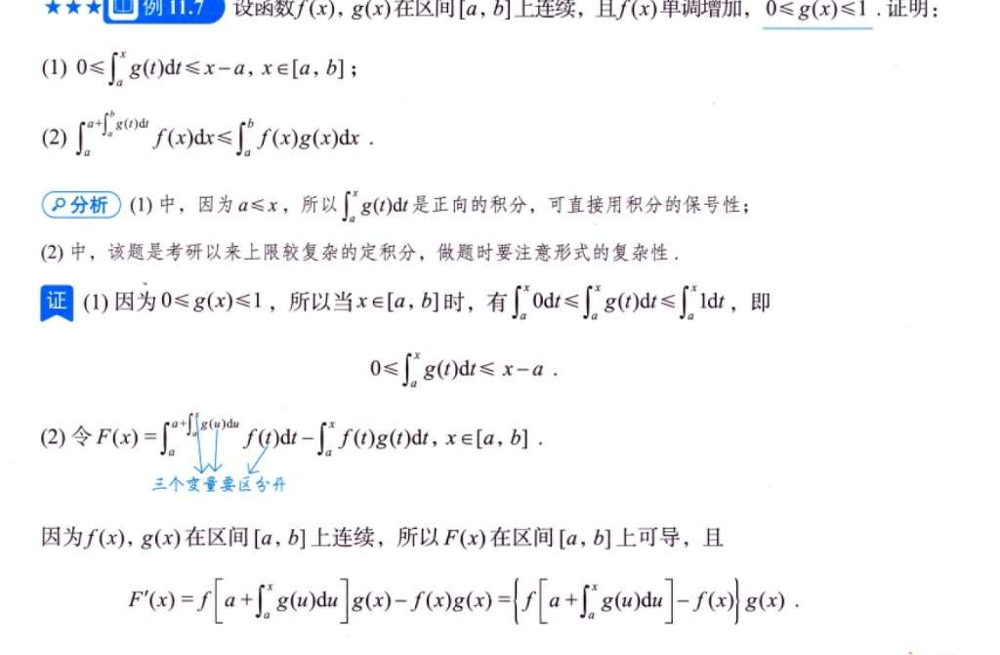

**证明带有定积分的不等式**，如果积分上下限是常数（比如 $a, b$），**第一反应就是把上限的常数改成变量 $x$，移项构造出 $F(x)$**。然后求导，利用题干条件（比如函数的单调性、正负性）判断 $F'(x)$ 的符号，往往就能迎刃而解。

**为什么这道题不能用“区间再现”？**

区间再现（如令 $t = a+b-x$）的核心前提是**对称性**。它需要积分区间是一个具体的对称区间（比如 $[0, \pi]$），或者被积函数具有某种特定的对称性质。

但这道题里，$a$ 和 $b$ 是**任意的正数**，$f(x)$ 仅仅是一个**单调增加**的连续函数，没有任何对称性可言。强行换元只会把式子变得更复杂，无法利用题目的条件。

---

### 破局密码：为什么答案要“构造函数”？

在考研和高等数学中，遇到这类题目有一个**铁律般的套路**：

> **核心特征：** 题目要你证明一个带有**任意上下限（$a, b$）**的积分不等式，且已知条件包含**函数的单调性或导数符号**。
> 
> **标准动作：变限积分构造函数法。** 把其中一个上限（通常是大一点的 $b$）替换成变量 $x$（或者 $t$），将证明“两个数的大小关系”转化为证明“一个函数的单调性”。

我们顺着这个思路，一步步把答案的“神仙操作”还原成普通人的逻辑。

### 第一步：把常量 $b$ 变成动点 $x$，构造辅助函数

我们要证：当 $b > a$ 时，$\int_a^b x f(x) dx \ge \frac{1}{2} \left[ b \int_0^b f(x) dx - a \int_0^a f(x) dx \right]$。

直接把所有的 $b$ 换成 $x$，并把不等式右边移到左边，我们就构造出了一个新的函数 $F(x)$：

$$F(x) = \int_a^x t f(t) dt - \frac{1}{2} \left[ x \int_0^x f(t) dt - a \int_0^a f(t) dt \right]$$

_(注：为了不跟积分上限的 $x$ 混淆，积分里面的变量统一改写成了 $t$)_

题目的目标变成了：**证明当 $x > a$ 时，$F(x) \ge 0$。**

### 第二步：找起点，求导数（单调性证明法的常规动作）

要证明一个函数在 $x > a$ 时大于等于 $0$，最标准的思路是：

1. 看看它在起点 $x = a$ 时等于几？
    
2. 证明它在 $x > a$ 时是**单调递增**的（即导数 $\ge 0$）。
    

**1. 验证起点：**

把 $x=a$ 代入：

$$F(a) = \int_a^a t f(t) dt - \frac{1}{2} \left[ a \int_0^a f(t) dt - a \int_0^a f(t) dt \right] = 0 - 0 = 0$$

起点完美等于 $0$！

**2. 对 $F(x)$ 求导（见证奇迹的时刻）：**

这实际上是在考变限积分求导和乘积求导法则：

$$F'(x) = x f(x) - \frac{1}{2} \left( 1 \cdot \int_0^x f(t) dt + x \cdot f(x) - 0 \right)$$

化简一下：

$$F'(x) = x f(x) - \frac{1}{2} \int_0^x f(t) dt - \frac{1}{2} x f(x) = \frac{1}{2} \left[ x f(x) - \int_0^x f(t) dt \right]$$

现在，我们的任务转化成了：**证明 $F'(x) \ge 0$。**

### 第三步：利用题设条件（最后的绝杀）

观察中括号里的式子：$x f(x) - \int_0^x f(t) dt$。

这个时候，终于轮到题目中那个一直没用上的条件出场了：**$f(x)$ 单调增加**。

怎么用单调性？这里有一个非常巧妙的代数变形技巧（记住这个操作，极其常用）：

常数 $x$ 乘以 $f(x)$，可以看作是对 $f(x)$ 这个常数积分 $x$ 次：

$$x f(x) = \int_0^x f(x) dt$$

把这个替换进去，两个积分就可以合并了：

$$x f(x) - \int_0^x f(t) dt = \int_0^x f(x) dt - \int_0^x f(t) dt = \int_0^x [f(x) - f(t)] dt$$

**开始推理：**

- 在积分区间 $[0, x]$ 内，积分变量 $t$ 总是满足 $t \le x$。
    
- 因为题目已知 $f$ 是**单调增加**的，既然 $t \le x$，必然有 $f(t) \le f(x)$。
    
- 所以，被积函数 $[f(x) - f(t)] \ge 0$ 永远成立。
    
- 对一个恒大于等于 $0$ 的函数求积分，结果肯定也大于等于 $0$！
    

由此得出核心结论：

$$F'(x) = \frac{1}{2} \int_0^x [f(x) - f(t)] dt \ge 0$$

### 第四步：收尾

既然 $F'(x) \ge 0$，说明 $F(x)$ 在 $[a, +\infty)$ 上是**单调增加**的。

因为 $b > a$，所以：

$$F(b) \ge F(a) = 0$$

把 $b$ 换回原式，不等式得证！