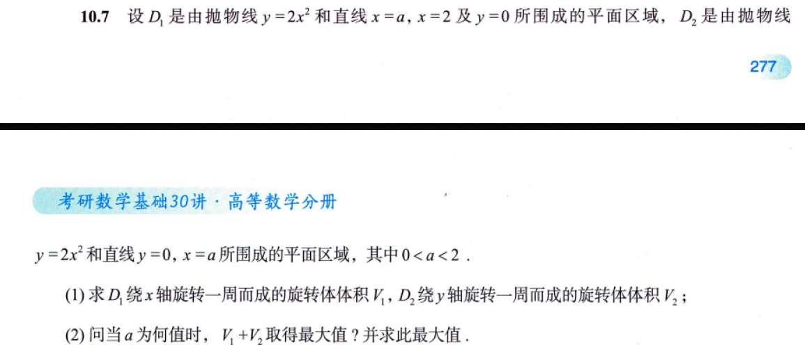
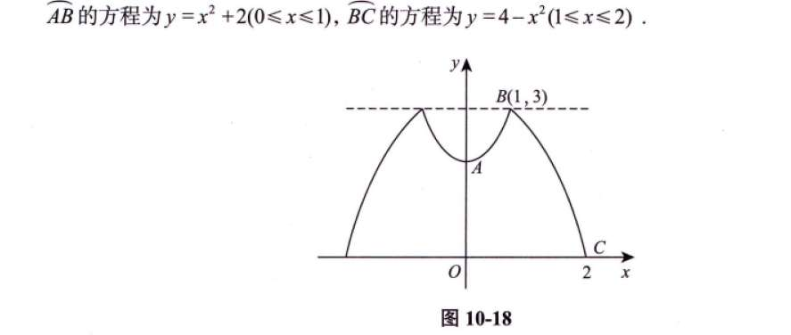
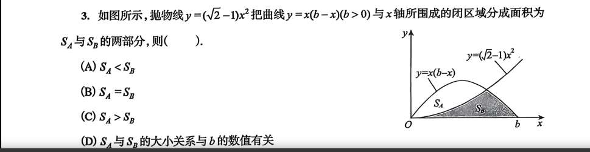
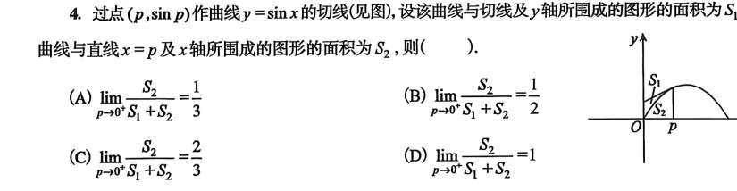
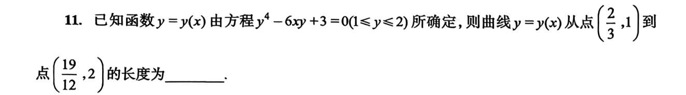

# 书籍+视频勘察

## 旋转算体积
绕x 轴的话，圆形积分。Πy 方是圆形
绕y 轴的话，展开成长方形，2Πx 为长
绕直线旋转
这个公式（公式 10-1）初看非常吓人，但它的本质其实就是我们熟悉的**微元法（盘片法/柱壳法）**。

我们可以把绕任意直线 $L_0: Ax + By + C = 0$ 旋转的体积问题，转化为绕一个“新的坐标轴”旋转的问题。推导过程主要分为三步：

---

### 1. 确定旋转半径 $r(x)$

旋转体体积的基本公式是 $V = \int \pi [r(u)]^2 du$。

对于曲线 $L$ 上的任意一点 $(x, f(x))$，它到旋转中心线 $Ax + By + C = 0$ 的**垂直距离**就是旋转半径 $r$。

根据**点到直线的距离公式**：

$$r(x) = \frac{|Ax + Bf(x) + C|}{\sqrt{A^2 + B^2}}$$

### 2. 确定微元的厚度 $du$

我们需要知道沿着旋转轴 $L_0$ 方向的“厚度”微元是多少。

设 $u$ 是直线 $L_0$ 上的坐标轴。我们可以通过投影的方式找到 $u$ 与 $x$ 的关系。

- 直线 $L_0$ 的方向向量为 $\vec{v} = (B, -A)$。
    
- 其单位方向向量为 $\vec{e} = \frac{(B, -A)}{\sqrt{A^2 + B^2}}$。
    
- 曲线上的点 $P(x, f(x))$ 在这条线上的投影位置 $u(x)$ 可以表示为向量 $(x, f(x))$ 与单位方向向量的内积：
    
    $$u(x) = (x, f(x)) \cdot \frac{(B, -A)}{\sqrt{A^2 + B^2}} = \frac{Bx - Af(x)}{\sqrt{A^2 + B^2}}$$
    

对 $u(x)$ 求导得到微元 $du$：

$$du = |u'(x)| dx = \frac{|B - Af'(x)|}{\sqrt{A^2 + B^2}} dx$$

为了和公式一致，我们可以写成 $\frac{|Af'(x) - B|}{\sqrt{A^2 + B^2}} dx$。

### 3. 组合积分式

将 $r(x)$ 和 $du$ 代入体积积分公式 $V = \int \pi r^2 du$：

$$V = \int_a^b \pi \left( \frac{Ax + Bf(x) + C}{\sqrt{A^2 + B^2}} \right)^2 \cdot \frac{|Af'(x) - B|}{\sqrt{A^2 + B^2}} \, dx$$

整理分母：

- 分母部分有 $(\sqrt{A^2 + B^2})^2 \cdot \sqrt{A^2 + B^2} = (A^2 + B^2)^{3/2}$。
    
- 将常数项提到积分符号外。
    

最终得到：

$$V = \frac{\pi}{(A^2 + B^2)^{3/2}} \int_a^b [Ax + Bf(x) + C]^2 |Af'(x) - B| \, dx$$

---

### 为什么公式里有一个绝对值 $|Af'(x) - B|$？

这保证了“厚度”始终为正。图中提到的条件“过 $L_0$ 的任一条垂线与 $L$ 至多有一个交点”，是为了确保在旋转过程中不会出现重叠或者中空的复杂情况（即 $u(x)$ 必须是单调的），这样我们才能直接使用简单的圆盘法累加。

### 快速验证：绕 $x$ 轴旋转

如果绕 $x$ 轴旋转，则直线方程为 $y=0$。

此时 $A=0, B=1, C=0$。代入公式：

$$V = \frac{\pi}{(0^2 + 1^2)^{3/2}} \int_a^b [0x + 1f(x) + 0]^2 |0f'(x) - 1| \, dx$$

$$V = \pi \int_a^b f^2(x) \cdot |-1| \, dx = \pi \int_a^b f^2(x) \, dx$$

这正是我们最基础的旋转体体积公式！

## 梯形质心

## 弧长

注意极坐标方程弧长的推导
- 径向长度变化 dr（沿半径​ 方向的分量）
- 角位移产生横向长度 r dθ（沿旋转方向的分量）
## 表面积
$S = \int 2\pi|y| \, ds$
$$S = \int_a^b 2\pi|y| \sqrt{1 + (y')^2} dx$$
$$S = \int_{\alpha}^{\beta} 2\pi|y(t)| \sqrt{(x_t')^2 + (y_t')^2} dt$$
极坐标 $(r, \theta)$ 转换成直角坐标 $(x, y)$ 的桥梁是：

- $x = r \cos\theta$
    
- $y = r \sin\theta$

或者如此理解：
想象在极坐标系里，有一段极其微小的曲线 $ds$。

我们可以把这个微小移动分解为两个方向的运动：

1. **径向（顺着半径走）：** 长度变化了一点点，也就是 **$dr$**。
    
2. **切向（绕着原点转）：** 角度转过了一点点 $d\theta$。在半径为 $r$ 的地方，转过 $d\theta$ 对应的圆弧长度是 **$r d\theta$**。
    

在微观尺度下，这两个运动方向近似垂直，构成了一个非常微小的直角三角形。

- 两条直角边分别是：$dr$ 和 $r d\theta$
    
- 斜边就是我们要找的弧长 $ds$
    

用勾股定理一算：

$$ds^2 = (dr)^2 + (r d\theta)^2$$

把 $(d\theta)^2$ 提出来开根号，结果依然是：

$$ds = \sqrt{(\frac{dr}{d\theta})^2 + r^2} d\theta = \sqrt{(r')^2 + r^2} d\theta$$
$$S = \int_{\alpha}^{\beta} 2\pi|r(\theta)\sin\theta| \sqrt{[r(\theta)]^2 + [r'(\theta)]^2} d\theta$$
# 例题

## 10.5（求体积时，注意实际范围）

## 10.6（换微元记得换函数）

## 10.7（求体积一般都多种方法）

第二问能用俩种方法

## 10.11（极坐标下的弧长）

# 习题
## 10.2

两种方法
上半圆周旋转体积减下半圆周旋转体积，积 x

或者积 y，算柱壳

## 10.7
又是两种算法算体积，再算一次

## 10.9
求绕 y=3 旋转的体积

# 1000 题

算出一个面积，另一个稍稍复杂，就算总面积去！

如果不用二重积分也可以！

？
